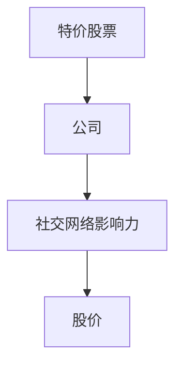

                 

# 特价股票与公司社会网络影响力的关联分析

> 关键词：特价股票，社会网络影响力，关联分析，股票市场，公司治理

> 摘要：本文通过分析特价股票与公司社会网络影响力之间的关联，探讨了公司在社交网络中的影响力如何影响股价，以及特价股票对公司的潜在影响。结合实际案例和数据分析，本文提出了如何通过社交网络影响力预测股价波动的方法，并为投资者和公司提供了有价值的建议。

---

# 第1章: 特价股票与公司社会网络影响力概述

## 1.1 特价股票的定义与特点

### 1.1.1 特价股票的定义
特价股票是指公司以低于面值的价格发行的股票。通常，这类股票的发行价低于其面值，目的是为了吸引更多的投资者或为公司提供更多的融资渠道。特价股票的发行通常与公司的财务状况或市场环境密切相关。

### 1.1.2 特价股票的特点
- **发行价格低**：特价股票的发行价格通常低于其面值，甚至可能接近零。
- **流通性较差**：由于特价股票的市场流动性较低，投资者在二级市场上的交易可能较为困难。
- **风险较高**：由于发行价格低，投资者可能面临较高的市场风险。
- **公司治理的影响**：特价股票的发行可能影响公司的股权结构和治理模式。

### 1.1.3 特价股票的分类
- **普通特价股票**：无特别权利，如优先股或普通股的特价发行。
- **员工激励特价股票**：公司以特价发行股票给员工，作为激励措施。
- **战略投资者特价股票**：公司以特价发行股票给战略投资者，以增强市场地位。

## 1.2 公司社会网络影响力的概念

### 1.2.1 社会网络影响力的定义
社会网络影响力是指公司在社交网络（如社交媒体、论坛、博客等）上的影响力，包括公司的品牌知名度、用户参与度、内容传播能力等。社会网络影响力通常通过粉丝数量、互动频率、内容传播速度等指标来衡量。

### 1.2.2 公司在社会网络中的角色
- **内容发布者**：公司通过社交网络发布产品信息、公司新闻等。
- **品牌形象塑造者**：通过社交网络塑造公司的品牌形象。
- **客户互动者**：通过社交网络与客户进行互动，收集反馈。

### 1.2.3 社会网络影响力的核心要素
- **粉丝数量**：公司在社交网络上的粉丝数量。
- **互动频率**：粉丝与公司内容的互动频率，如点赞、评论、分享。
- **内容传播速度**：公司内容的传播速度和范围。
- **口碑影响力**：公司通过社交网络带来的口碑效应。

## 1.3 特价股票与公司社会网络影响力的关系

### 1.3.1 特价股票对公司的潜在影响
- **市场关注度**：特价股票的发行可能会引起市场的广泛关注，从而影响公司的股价。
- **投资者情绪**：投资者对特价股票的态度可能影响公司的社会网络影响力。
- **品牌价值**：特价股票的发行可能会对公司品牌价值产生影响。

### 1.3.2 公司社会网络影响力对股价的反向作用
- **信息传播**：公司通过社交网络传播信息，影响投资者的决策。
- **舆论影响**：社交网络上的舆论可能直接影响公司的股价。
- **市场信心**：公司的社会网络影响力可能影响市场的信心，从而影响股价。

### 1.3.3 两者关联的理论基础
- **信息不对称理论**：社交网络上的信息传播可能减少信息不对称，影响股价。
- **社会网络理论**：公司通过社交网络建立的关系可能影响其市场表现。
- **投资者行为理论**：投资者在社交网络上的行为可能影响其投资决策。

## 1.4 本章小结
本章从特价股票和公司社会网络影响力的基本概念出发，分析了两者之间的关系，并探讨了它们对股价的潜在影响。

---

# 第2章: 特价股票与公司社会网络影响力的关联背景

## 2.1 特价股票的市场现状

### 2.1.1 特价股票的市场分布
- **市场分布**：特价股票在不同市场中的分布情况。
- **行业分布**：不同行业公司发行特价股票的情况。
- **地区分布**：不同地区市场中特价股票的发行情况。

### 2.1.2 特价股票的交易特点
- **交易量低**：特价股票的交易量通常较低。
- **波动性高**：特价股票的股价波动较大。
- **市场关注度低**：特价股票通常不受市场广泛关注。

### 2.1.3 特价股票的投资者行为分析
- **投资者类型**：特价股票的投资者通常包括散户和机构投资者。
- **投资动机**：投资者购买特价股票的动机包括低价吸引、长期投资等。
- **投资风险**：投资者购买特价股票面临较高的市场风险。

## 2.2 公司社会网络影响力的发展趋势

### 2.2.1 社会网络影响力的测量方法
- **粉丝数量**：通过粉丝数量衡量公司的社交网络影响力。
- **互动频率**：通过互动频率衡量公司的社交网络影响力。
- **内容传播速度**：通过内容传播速度衡量公司的社交网络影响力。

### 2.2.2 公司在社交媒体上的表现
- **内容发布频率**：公司通过社交媒体发布内容的频率。
- **内容质量**：公司发布内容的质量和吸引力。
- **用户参与度**：用户对公司内容的参与程度。

### 2.2.3 社会网络影响力对品牌价值的影响
- **品牌知名度**：社交网络影响力可以提高公司的品牌知名度。
- **品牌忠诚度**：社交网络影响力可以提高客户的品牌忠诚度。
- **品牌价值**：社交网络影响力可以提升公司的品牌价值。

## 2.3 特价股票与社会网络影响力关联的现实意义

### 2.3.1 企业融资的新渠道
- **社交网络融资**：公司可以通过社交网络吸引更多的投资者，增加融资渠道。
- **品牌价值提升**：通过社交网络提升品牌价值，从而降低融资成本。

### 2.3.2 投资者决策的新依据
- **社交网络信息**：投资者可以通过社交网络获取更多的公司信息，辅助投资决策。
- **舆论影响**：社交网络上的舆论可以影响投资者的决策。

### 2.3.3 公司治理的新模式
- **透明化管理**：通过社交网络实现公司治理的透明化，增强投资者信心。
- **互动式管理**：通过社交网络与投资者进行互动，增强公司治理能力。

## 2.4 本章小结
本章分析了特价股票和公司社会网络影响力在市场中的现状，并探讨了它们之间的关联对现实的意义。

---

# 第3章: 特价股票与公司社会网络影响力的核心概念与联系

## 3.1 特价股票的核心概念

### 3.1.1 特价股票的发行机制
- **发行方式**：特价股票的发行方式包括公开发行和私募发行。
- **发行价格**：特价股票的发行价格低于面值。
- **发行目的**：公司通过发行特价股票筹集资金或优化资本结构。

### 3.1.2 特价股票的市场表现
- **股价波动**：特价股票的股价波动较大。
- **市场关注度**：特价股票通常不受市场广泛关注。
- **投资者行为**：投资者对特价股票的态度可能影响股价。

### 3.1.3 特价股票的投资者结构
- **投资者类型**：包括散户和机构投资者。
- **投资动机**：包括低价吸引和长期投资。
- **投资风险**：包括市场风险和流动性风险。

## 3.2 公司社会网络影响力的核心概念

### 3.2.1 社会网络影响力的主要维度
- **粉丝数量**：公司在社交网络上的粉丝数量。
- **互动频率**：公司内容的互动频率。
- **内容传播速度**：公司内容的传播速度和范围。

### 3.2.2 社会网络影响力的关键指标
- **粉丝增长速度**：公司粉丝数量的增长速度。
- **互动率**：公司内容的互动率，包括点赞率、评论率、分享率。
- **内容传播范围**：公司内容的传播范围，包括覆盖的地理范围和用户群体。

### 3.2.3 社会网络影响力的影响范围
- **品牌知名度**：通过社交网络提升公司的品牌知名度。
- **客户忠诚度**：通过社交网络增强客户的忠诚度。
- **市场影响力**：通过社交网络扩大公司在市场中的影响力。

## 3.3 特价股票与公司社会网络影响力的关联模型

### 3.3.1 实体关系图

### 3.3.2 关联分析表格
| 特价股票属性 | 社会网络影响力属性 |
|-------------|------------------|
| 发行价格     | 粉丝数量         |
| 流通性       | 互动频率         |
| 投资者结构   | 内容传播速度      |

---

# 4 章节总结
通过以上分析，我们可以看到，特价股票与公司社会网络影响力之间存在密切的关联。公司通过社交网络影响力可以影响投资者的决策，从而影响股价。同时，特价股票的发行可能也会对公司品牌价值和市场地位产生影响。

