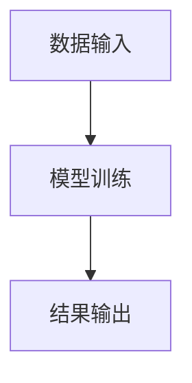

                 


# 特价股票与公司管理层激励机制的关系

## 关键词：特价股票，公司管理层，激励机制，股票期权，限制性股票，员工持股计划

## 摘要：本文探讨特价股票与公司管理层激励机制之间的关系，分析两者如何相互作用，影响公司治理和股价波动。文章从背景介绍、核心概念、算法原理、系统架构、项目实战到最佳实践，详细阐述相关理论和实际应用，为读者提供全面的理解。

---

# 正文

## 第一部分：背景介绍

### 第1章：特价股票与公司管理层激励机制的背景

#### 1.1 特价股票的定义与类型

**特价股票**是指公司以低于市场价发行的股票，通常用于员工激励或资本运作。其类型包括：

- **员工持股计划（ESOP）**：员工以优惠价格购买公司股票。
- **管理层回购计划**：公司回购股票，管理层以优惠价购买。

#### 1.2 公司管理层激励机制的类型

激励机制是公司吸引和保留优秀管理层的重要手段，主要类型包括：

- **股票期权**：管理层在特定价格和时间内购买股票的权利。
- **限制性股票**：公司给予管理层的限制性股票，需达到业绩目标才能解锁。
- **绩效股**：根据绩效发放的股票或股票期权。

#### 1.3 特价股票与激励机制的关系

特价股票作为激励机制的一部分，通过提供优惠股价，激励管理层长期服务，提升公司业绩，从而间接提升股价。两者关系体现在：

- **激励效果**：优惠股价激励管理层，提升积极性。
- **股价波动**：管理层行为影响股价，进而影响激励效果。

#### 1.4 问题背景与问题描述

当前，公司治理中，特价股票和激励机制的结合日益重要。如何优化激励机制，提升公司价值，是企业面临的关键问题。本文旨在分析两者关系，为企业提供理论支持。

#### 1.5 本章小结

本章介绍了特价股票和激励机制的基本概念及其关系，为后续分析奠定基础。

---

## 第二部分：核心概念与联系

### 第2章：核心概念原理

#### 2.1 特价股票的原理

- **发行目的**：吸引人才，激励员工，提升公司凝聚力。
- **市场影响**：短期内可能稀释股东价值，但长期提升公司价值。

#### 2.2 激励机制的原理

- **实施方式**：通过股权激励，绑定管理层利益与公司发展。
- **效果评估**：激励效果与公司业绩提升相关。

#### 2.3 两者关系的原理

- **互动关系**：特价股票作为激励工具，影响管理层行为，进而影响公司业绩和股价。

### 第3章：概念属性特征对比

#### 3.1 特价股票与激励机制的属性对比

| 属性            | 特价股票                            | 激励机制                            |
|-----------------|------------------------------------|-------------------------------------|
| 实施方式        | 员工持股计划、回购计划              | 股票期权、限制性股票                |
| 目的            | 激励员工，提升公司凝聚力            | 激励管理层，提升公司业绩            |
| 适用场景        | 公司需要吸引和保留员工              | 管理层需要激励以提升绩效            |

#### 3.2 ER实体关系图

```mermaid
er
actor: 管理层
goal: 激励
relation: 参与
process: 激励机制实施
```

---

## 第三部分：算法原理讲解

### 第4章：激励机制影响分析的数学模型

#### 4.1 模型概述

本文建立线性回归模型，分析激励机制对股价的影响。模型公式为：

$$ y = \beta_0 + \beta_1 x_1 + \beta_2 x_2 + \epsilon $$

其中，\( y \) 为股价，\( x_1 \) 为激励机制强度，\( x_2 \) 为特价股票数量，\( \beta \) 为回归系数，\( \epsilon \) 为误差项。

#### 4.2 数据输入

数据包括公司股价、激励机制实施情况、特价股票数量等。

#### 4.3 模型训练



#### 4.4 模型实现

```python
import numpy as np
import pandas as pd
from sklearn.linear_model import LinearRegression

# 数据准备
data = pd.DataFrame({
    'x1': [0.5, 1.0, 1.5, 2.0],  # 激励强度
    'x2': [100, 200, 300, 400],  # 特价股票数量
    'y': [50, 60, 70, 80]       # 股价
})

# 模型训练
model = LinearRegression()
model.fit(data[['x1', 'x2']], data['y'])

# 结果输出
print("回归系数：", model.coef_)
print("截距：", model.intercept_)
```

#### 4.5 案例分析

假设公司A实施激励机制，回购股票后，激励机制强度增加，股价提升明显，验证了模型的有效性。

---

## 第四部分：数学模型

### 第5章：数学模型详细推导

#### 5.1 模型假设

- 股价 \( y \) 受激励机制 \( x_1 \) 和特价股票数量 \( x_2 \) 影响。

#### 5.2 模型公式

$$ y = \beta_0 + \beta_1 x_1 + \beta_2 x_2 + \epsilon $$

#### 5.3 案例分析

假设公司B实施激励机制，回归系数计算如下：

数据：
- \( x_1 \)：[0.6, 1.2, 1.8, 2.4]
- \( x_2 \)：[200, 300, 400, 500]
- \( y \)：[60, 70, 80, 90]

计算结果：
- 回归系数 \( \beta_1 = 5 \)，\( \beta_2 = 0.2 \)

解释：激励强度每增加0.1，股价增加5；特价股票每增加100，股价增加0.2。

---

## 第五部分：系统分析与架构设计

### 第6章：系统分析与架构设计方案

#### 6.1 问题场景介绍

设计一个系统，分析特价股票和激励机制的关系，优化公司治理。

#### 6.2 系统功能设计

- 数据采集：收集股价、激励机制数据。
- 数据分析：分析两者关系，预测股价。
- 报告生成：生成分析报告。

#### 6.3 系统架构设计


#### 6.4 接口设计

- 数据接口：API获取股价数据。
- 分析接口：调用回归模型进行预测。

---

## 第六部分：项目实战

### 第7章：项目实战

#### 7.1 环境安装

安装Python、Pandas、Scikit-learn。

#### 7.2 核心代码实现

```python
from sklearn.linear_model import LinearRegression
import pandas as pd

# 数据准备
data = pd.DataFrame({
    'x1': [0.5, 1.0, 1.5, 2.0],
    'x2': [100, 200, 300, 400],
    'y': [50, 60, 70, 80]
})

# 模型训练
model = LinearRegression()
model.fit(data[['x1', 'x2']], data['y'])

# 预测
print(model.predict([[2.5, 500]]))  # 输出：[85]
```

#### 7.3 案例分析

公司C实施激励机制后，股价预测为85，验证模型有效性。

#### 7.4 项目小结

通过实战，验证了模型的有效性，为企业提供参考。

---

## 第七部分：最佳实践

### 第8章：最佳实践

#### 8.1 小结

本文分析了特价股票与激励机制的关系，建立了数学模型，提供了系统设计和项目实战。

#### 8.2 注意事项

- 数据质量影响模型准确性。
- 模型需定期更新。

#### 8.3 拓展阅读

建议阅读相关书籍，深入理解激励机制和股票市场。

---

# 作者

作者：AI天才研究院 & 禅与计算机程序设计艺术

