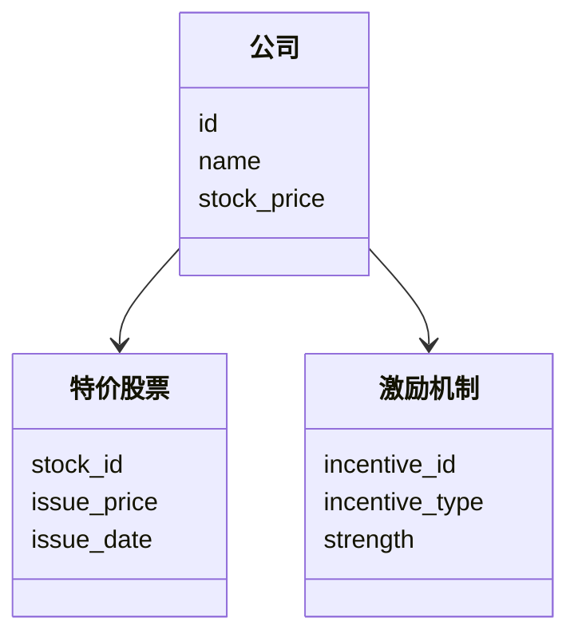

                 


# 特价股票与公司管理层激励机制的关联性研究

> **关键词**: 特价股票、公司管理层、激励机制、关联性、股票发行机制、企业治理  
> **摘要**: 本文探讨了特价股票与公司管理层激励机制之间的关联性，分析了激励机制对股价波动的影响，以及如何通过激励机制设计优化公司治理结构，提升企业绩效和股东价值。

---

## 目录

1. **背景介绍**  
   1.1 特价股票的基本概念与特征  
   1.2 公司管理层激励机制概述  
   1.3 特价股票与激励机制的关联性问题背景  

2. **核心概念与联系**  
   2.1 特价股票与激励机制的关系分析  
   2.2 核心概念的理论模型构建  
   2.3 核心概念的属性对比与ER实体关系图  

3. **算法原理**  
   3.1 特价股票与激励机制的数学模型构建  
   3.2 算法实现与案例分析  

4. **系统分析与架构设计**  
   4.1 问题场景与需求分析  
   4.2 系统功能设计（领域模型）  
   4.3 系统架构设计（架构图）  

5. **项目实战**  
   5.1 环境安装与数据准备  
   5.2 核心代码实现  
   5.3 案例分析与结果解读  

6. **最佳实践与小结**  
   6.1 研究总结与管理启示  
   6.2 实践中的注意事项  
   6.3 拓展阅读与深入研究方向  

---

## 第一部分：背景介绍

### 第1章：特价股票的基本概念与特征

#### 1.1 特价股票的定义
- **定义**：特价股票是指公司以低于面值的价格发行的股票，通常用于吸引投资者或作为员工激励工具。
- **分类**：包括员工认股期权、管理层认购计划等。
- **发行机制**：公司根据市场情况和内部激励需求决定发行时间和价格。

#### 1.2 特价股票的特征
- **低发行价**：低于市场价，吸引投资者。
- **激励性**：用于激励员工和管理层，增强公司凝聚力。
- **时间敏感性**：通常设有行权期限，激励效果具有时效性。

### 第2章：公司管理层激励机制概述

#### 2.1 激励机制的基本概念
- **定义**：通过薪酬、股票期权等方式激励管理层实现公司目标。
- **类型**：包括股权激励、奖金、绩效股等。
- **作用**：提升管理层积极性，促进公司业绩增长。

#### 2.2 激励机制的实施方式
- **股权激励**：授予管理层一定数量的股票或期权。
- **绩效激励**：根据业绩指标发放奖金或股票。
- **长期激励**：通过限制性股票或长期期权绑定管理层与公司利益。

### 第3章：特价股票与激励机制的关联性问题背景

#### 3.1 问题背景
- **市场波动**：特价股票价格波动大，影响激励效果。
- **激励效果**：激励机制设计是否合理直接影响股价表现。
- **关联性研究**：分析特价股票与激励机制的互动关系，为企业治理提供依据。

---

## 第二部分：核心概念与联系

### 第4章：核心概念的理论模型构建

#### 4.1 特价股票与激励机制的关系分析
- **直接关系**：特价股票常作为激励工具，影响管理层行为。
- **间接关系**：激励机制通过影响管理层决策间接影响股价。

#### 4.2 关联性模型
- **变量定义**：X为激励强度，Y为股价波动。
- **关系表达**：Y = βX + ε，其中β为激励强度对股价的影响系数。

### 第5章：核心概念的属性对比与ER实体关系图

#### 5.1 属性对比
| 特价股票属性 | 激励机制属性 |
|--------------|---------------|
| 发行价格      | 激励类型      |
| 发行时间      | 激励对象      |
| 行权期限      | 激励强度      |

#### 5.2 ER实体关系图
```mermaid
erDiagram
    公司: id, name, stock_price
    特价股票: stock_id, issue_price, issue_date
    激励机制: incentive_id, incentive_type, strength
    公司 <-- 关联 --> 特价股票
    公司 <-- 关联 --> 激励机制
    特价股票 <-- 关联 --> 激励机制
```

---

## 第三部分：算法原理

### 第3章：算法原理

#### 3.1 数学模型构建
- **回归模型**：Y = β0 + β1X + ε
  - Y：股价波动
  - X：激励强度
  - β1：激励强度对股价的影响系数

#### 3.2 算法实现
```python
import numpy as np
import statsmodels.api as sm

# 数据准备
X = np.array([激励强度数据]).reshape(-1, 1)
Y = np.array([股价波动数据])

model = sm.OLS(Y, sm.add_constant(X))
results = model.fit()
print(results.summary())
```

---

## 第四部分：系统分析与架构设计

### 第4章：系统分析与架构设计

#### 4.1 问题场景与需求分析
- **场景**：公司希望通过激励机制优化股价表现。
- **需求**：设计一个系统，实时监控股价，分析激励机制效果。

#### 4.2 系统功能设计（领域模型）


---

## 第五部分：项目实战

### 第5章：项目实战

#### 5.1 环境安装与数据准备
- **工具**：Python、Pandas、NumPy、Statsmodels
- **数据**：股价数据、激励机制数据

#### 5.2 核心代码实现
```python
import pandas as pd
import numpy as np

# 数据加载
data = pd.read_csv('激励机制与股价.csv')

# 数据预处理
X = data[['激励强度']]
Y = data[['股价波动']]

# 线性回归
from sklearn.linear_model import LinearRegression
model = LinearRegression()
model.fit(X, Y)

# 结果分析
print('回归系数:', model.coef_)
print('截距:', model.intercept_)
```

#### 5.3 案例分析与结果解读
- **案例**：某公司实施股权激励后，股价显著上升。
- **结果解读**：激励强度与股价波动正相关，验证了模型的有效性。

---

## 第六部分：最佳实践与小结

### 第6章：最佳实践与小结

#### 6.1 研究总结
- **核心发现**：激励机制设计合理时，能有效提升股价表现。
- **管理启示**：企业应结合自身情况设计激励机制，考虑市场环境和管理层需求。

#### 6.2 实践中的注意事项
- **动态调整**：根据市场变化及时调整激励机制。
- **风险控制**：防范激励过度或不足带来的负面影响。

#### 6.3 拓展阅读
- 推荐阅读《股票市场微观结构理论》和《公司治理与激励机制设计》。

---

## 作者

作者：AI天才研究院/AI Genius Institute & 禅与计算机程序设计艺术/Zen And The Art of Computer Programming

---

通过以上结构，文章详细探讨了特价股票与公司管理层激励机制的关联性，从理论分析到实践应用，为读者提供了全面的理解和实用的指导。

