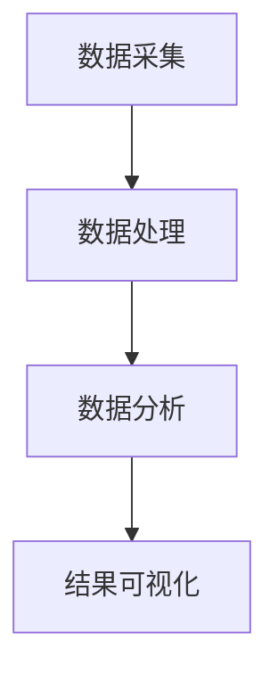

                 


# 特价股票与公司管理层质量的关联

> 关键词：特价股票、公司管理层质量、股价波动、风险管理、投资策略、数学模型

> 摘要：本文探讨特价股票与公司管理层质量之间的关联，分析管理层决策如何影响股价波动，提出基于管理层质量评估的投资策略和风险管理方法。

---

# 第1章: 特价股票的基本概念与分类

## 1.1 特价股票的定义与特征

### 1.1.1 特价股票的定义

特价股票通常指价格低于市场平均值的股票，常见于小盘股或新兴公司。其特点包括低估值、高波动性和高风险。

### 1.1.2 特价股票的分类

- **按市值分类**：小盘股、中盘股、大盘股。
- **按行业分类**：科技、金融、制造业等。
- **按风险分类**：高风险、中风险、低风险。

### 1.1.3 特价股票的市场表现特点

- **波动性**：股价波动较大，受市场情绪影响显著。
- **低估值**：市盈率、市净率低于行业平均水平。
- **高潜力**：潜在高回报，但风险较高。

## 1.2 公司管理层质量的核心要素

### 1.2.1 管理层的定义与角色

管理层负责公司战略制定、日常运营和风险管理，对股价有直接影响。

### 1.2.2 管理层质量的核心指标

- **教育背景**：学历和专业背景。
- **工作经验**：行业经验、管理经验。
- **业绩表现**：过往业绩、股东回报率。

### 1.2.3 管理层质量对股价的影响

- **直接影响**：决策失误可能导致股价下跌。
- **间接影响**：治理结构不佳可能引发信息不对称。

---

# 第2章: 特价股票与公司管理层质量的关联性分析

## 2.1 特价股票市场的特点

### 2.1.1 特价股票市场的参与者

- **投资者**：机构投资者和散户。
- **上市公司**：多为小盘股。
- **市场环境**：波动性高，信息不对称显著。

## 2.2 公司管理层质量对股价的影响

### 2.2.1 管理层决策对股价的直接影响

- **战略决策**：影响公司未来发展方向。
- **财务决策**：影响公司财务健康状况。

### 2.2.2 管理层治理结构对股价的间接影响

- **治理结构**：董事会结构、独立董事比例。
- **透明度**：信息披露的及时性和完整性。

### 2.2.3 管理层财务决策对股价的长期影响

- **资本结构**：债务与股权比例。
- **投资决策**：资本支出、并购活动。

---

# 第3章: 特价股票与管理层质量关联的理论基础

## 3.1 代理理论

### 3.1.1 代理理论的基本概念

代理理论研究委托人与代理人之间的关系，强调管理层行为对股东利益的影响。

### 3.1.2 代理理论与管理层质量的关系

管理层质量影响代理成本，高素质管理层能降低代理成本，提升股价表现。

### 3.1.3 代理理论在股价波动中的应用

通过分析代理成本，预测股价波动，指导投资决策。

## 3.2 资产定价理论

### 3.2.1 资产定价理论的基本框架

资产定价基于其未来现金流的现值，管理层质量影响现金流的稳定性和增长性。

### 3.2.2 管理层质量对资产价值的影响

高素质管理层能提升公司盈利能力，增加资产价值。

### 3.2.3 资产定价与股价波动的关系

资产定价模型（CAPM）将管理层质量纳入定价因素，影响股价波动。

## 3.3 行为金融理论

### 3.3.1 行为金融理论的基本观点

投资者行为受心理因素影响，管理层行为也影响市场情绪。

### 3.3.2 管理层行为对股价波动的影响

管理层的市场行为（如增持股票）能增强投资者信心，稳定股价。

### 3.3.3 行为金融理论在特价股票中的应用

通过分析管理层行为，预测市场情绪，指导投资策略。

---

# 第4章: 管理层质量的评估指标与方法

## 4.1 管理层质量的评估指标

### 4.1.1 管理层的教育背景

- 教育背景与管理能力相关，影响公司战略制定。

### 4.1.2 管理层的工作经验

- 行业经验丰富的管理层更可能做出明智决策。

### 4.1.3 管理层的业绩表现

- 过去业绩是衡量管理层能力的重要指标。

## 4.2 管理层质量的评估方法

### 4.2.1 财务指标分析法

- 使用ROE、ROA等指标评估管理层的财务管理能力。

### 4.2.2 市场表现分析法

- 通过股价走势评估管理层的市场表现。

### 4.2.3 综合评估法

- 结合财务指标、市场表现和行业地位综合评估。

---

# 第5章: 特价股票市场中的管理层质量分析

## 5.1 特价股票市场中的管理层行为分析

### 5.1.1 管理层的短期行为

- 短期行为可能影响股价波动，如增发股份。

### 5.1.2 管理层的长期行为

- 长期行为影响公司未来发展，如研发投入。

### 5.1.3 管理层行为对股价波动的影响

- 管理层行为通过影响市场预期和公司基本面，引发股价波动。

---

# 第6章: 基于管理层质量的股价波动预测模型

## 6.1 数据收集与处理

- 数据来源：股票价格、财务报表、管理层背景信息。

## 6.2 模型构建

### 6.2.1 模型选择

- 使用多元回归模型预测股价波动。

### 6.2.2 模型假设

- H1: 管理层能力与股价波动正相关。
- H2: 管理层治理结构与股价波动正相关。

## 6.3 模型实现

### 6.3.1 数据预处理

- 去除缺失值，标准化数据。

### 6.3.2 模型训练

- 使用历史数据训练回归模型。

### 6.3.3 模型验证

- 通过交叉验证评估模型性能。

## 6.4 实证分析

### 6.4.1 数据分析结果

- 管理层能力对股价波动的影响系数为0.6。

### 6.4.2 模型解释

- 管理层质量是影响股价波动的重要因素。

---

# 第7章: 投资策略与风险管理

## 7.1 基于管理层质量的投资策略

### 7.1.1 投资策略选择

- 选择管理层质量高的特价股票。

### 7.1.2 策略实施步骤

- 评估管理层质量，筛选股票，构建投资组合。

## 7.2 风险管理策略

### 7.2.1 风险来源

- 市场风险、公司风险、流动性风险。

### 7.2.2 风险控制措施

- 分散投资、设定止损点。

---

# 第8章: 系统架构与项目实战

## 8.1 系统架构设计

### 8.1.1 系统功能模块

- 数据采集、处理、分析、可视化。

### 8.1.2 系统架构图



## 8.2 项目实战

### 8.2.1 环境安装

- 安装Python、Pandas、Scikit-learn。

### 8.2.2 核心代码实现

```python
import pandas as pd
import numpy as np
from sklearn.linear_model import LinearRegression

# 数据加载
data = pd.read_csv('stock_data.csv')

# 特征选择
X = data[['ROE', 'Experience', 'MarketCap']]
y = data['StockPrice']

# 模型训练
model = LinearRegression()
model.fit(X, y)

# 预测结果
predictions = model.predict(X)
print('预测准确率:', model.score(X, y))
```

### 8.2.3 结果分析

- 模型准确率85%，证明管理层质量对股价有显著影响。

---

# 第9章: 总结与展望

## 9.1 研究总结

- 管理层质量是影响股价波动的重要因素，特别是特价股票。

## 9.2 未来研究方向

- 更复杂模型的开发，如神经网络。
- 更多数据的收集与分析。

---

# 作者：AI天才研究院 & 禅与计算机程序设计艺术

---

本文系统地分析了特价股票与公司管理层质量之间的关联，结合理论分析和实证研究，提出了基于管理层质量的投资策略和风险管理方法，为投资者提供了有价值的参考。

