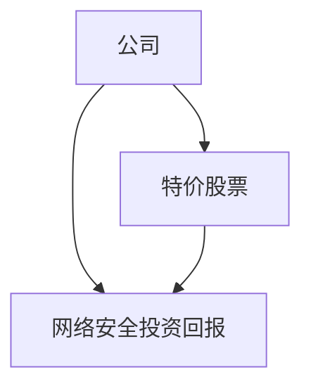
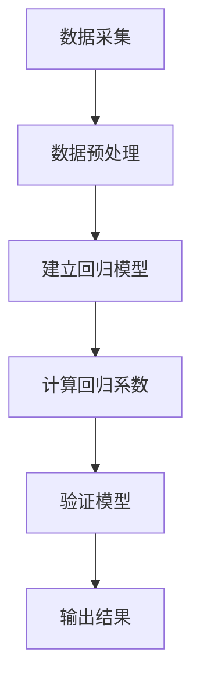
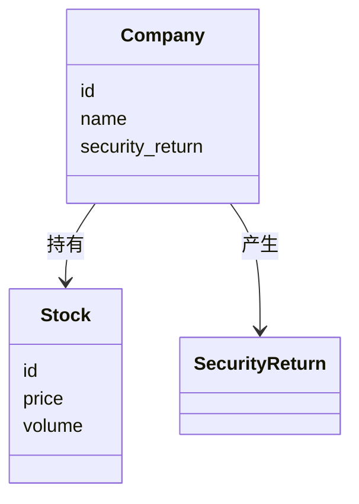
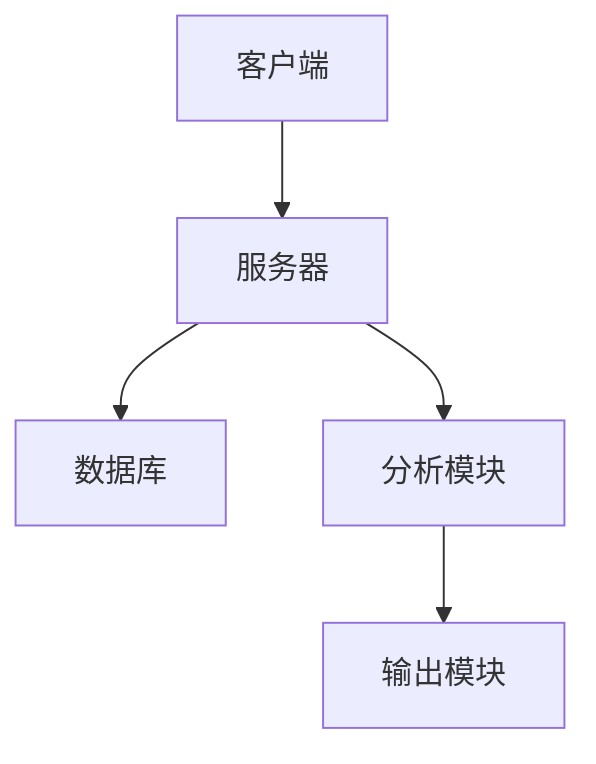
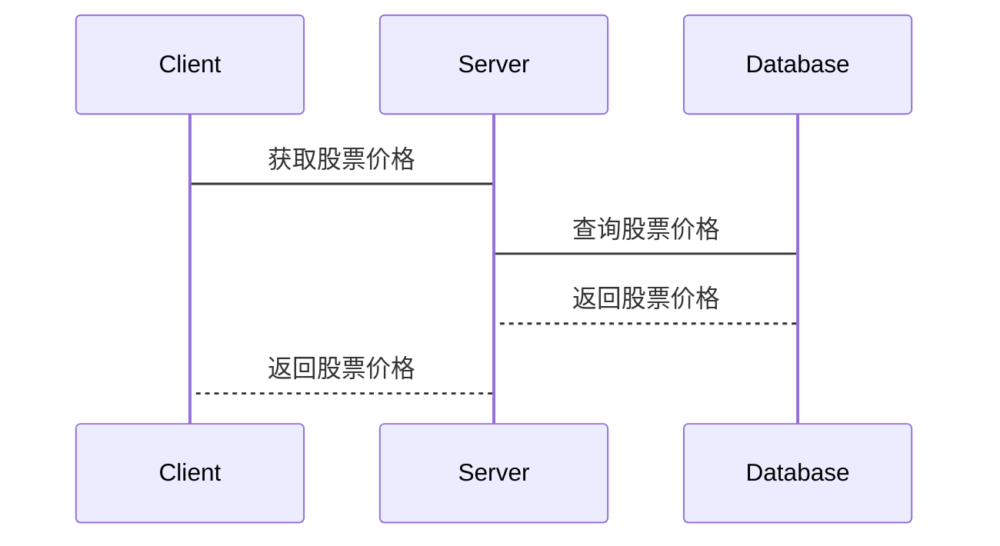

                 


# 特价股票与公司网络安全投资回报的关联性研究

---

## 关键词：特价股票、网络安全、投资回报、关联性、数据分析、算法模型、投资策略

---

## 摘要

本文旨在研究特价股票与公司网络安全投资回报之间的关联性。通过分析特价股票的市场波动性、投资风险以及网络安全投资回报的影响因素，探讨两者之间的潜在联系。结合数学模型和算法分析，本文提出了一个量化关联性的方法，并通过实际案例验证了该方法的有效性。最终，本文为投资者提供了基于网络安全投资回报的股票投资策略建议。

---

## 第一章: 特价股票与网络安全投资回报的背景介绍

### 1.1 问题背景

#### 1.1.1 特价股票的定义与特征
特价股票是指在特定条件下，股票价格出现大幅波动，通常价格远低于市场平均价格的股票。这类股票通常具有高风险、高回报的特性，吸引着风险投资者的关注。

#### 1.1.2 网络安全投资回报的定义与特征
网络安全投资回报是指公司在网络安全领域的投资所获得的收益，通常包括减少网络安全事故带来的损失、提升客户信任度、增强市场竞争力等。网络安全投资回报具有间接性、长期性和隐蔽性的特点。

#### 1.1.3 特价股票与网络安全投资回报的关联性研究背景
近年来，网络安全问题日益严重，网络安全投资回报逐渐成为企业关注的焦点。与此同时，特价股票市场的波动性也为投资者提供了套利机会。研究两者之间的关联性，可以帮助投资者更好地把握市场机会，优化投资策略。

### 1.2 问题描述

#### 1.2.1 特价股票的市场波动性
特价股票的价格波动通常受到市场情绪、公司基本面、政策法规等因素的影响。这种波动性为投资者提供了短期获利的机会，但也带来了较高的投资风险。

#### 1.2.2 网络安全投资回报的影响因素
网络安全投资回报受到多种因素的影响，包括公司的网络安全投入、员工的网络安全意识、网络安全技术的应用等。此外，网络安全事故的发生频率和处理效果也会影响投资回报。

#### 1.2.3 两者关联性的研究意义
研究特价股票与网络安全投资回报的关联性，可以帮助投资者更好地理解市场波动的规律，优化投资组合，降低投资风险。同时，这也为企业提供了在网络安全领域进行投资的决策依据。

### 1.3 问题解决

#### 1.3.1 研究目标的设定
本研究的目标是量化特价股票与网络安全投资回报之间的关联性，探索两者之间的潜在联系，并为投资者提供基于网络安全投资回报的股票投资策略。

#### 1.3.2 研究方法的选择
本研究采用定量分析方法，结合回归分析和时间序列分析，量化两者之间的关联性。同时，结合实际案例，验证研究结果的可行性。

#### 1.3.3 数据来源与处理
数据来源包括股票市场数据（如历史股价、交易量等）和网络安全投资回报数据（如网络安全事故损失、网络安全投入等）。数据处理包括数据清洗、特征提取和标准化处理。

### 1.4 边界与外延

#### 1.4.1 研究范围的界定
本研究仅关注特价股票与网络安全投资回报之间的关联性，不涉及其他类型的股票和投资回报。

#### 1.4.2 研究的局限性
由于网络安全投资回报的间接性和隐蔽性，数据获取较为困难，可能导致研究结果存在一定的误差。

#### 1.4.3 研究的可扩展性
本研究为未来的研究提供了基础，可以通过引入更多的变量和模型，进一步探讨特价股票与网络安全投资回报之间的复杂关系。

### 1.5 概念结构与核心要素

#### 1.5.1 特价股票的核心要素
- 市场波动性
- 投资风险
- 投资回报周期

#### 1.5.2 网络安全投资回报的核心要素
- 投资成本
- 投资收益
- 收益周期

#### 1.5.3 两者关联性的概念结构
- 特价股票的价格波动影响投资者的网络安全投资决策。
- 网络安全投资回报影响公司的市场表现，进而影响股票价格。

---

## 第二章: 核心概念与属性对比

### 2.1 特价股票的属性特征

#### 2.1.1 市场波动性
特价股票的价格波动通常较大，受到市场情绪和突发事件的影响。

#### 2.1.2 投资风险
特价股票的投资风险较高，投资者需要具备较高的风险承受能力。

#### 2.1.3 投资回报周期
特价股票的投资回报周期较短，通常为几天或几周。

### 2.2 网络安全投资回报的属性特征

#### 2.2.1 投资成本
网络安全投资回报需要投入一定的资金和资源，包括技术设备、人员培训等。

#### 2.2.2 投资收益
网络安全投资回报的收益通常体现在减少损失、提升客户信任度和市场竞争力等方面。

#### 2.2.3 收益周期
网络安全投资回报的收益周期较长，通常为几个月或几年。

### 2.3 对比分析

#### 2.3.1 特价股票与网络安全投资回报的属性对比

| 属性       | 特价股票                          | 网络安全投资回报                     |
|------------|----------------------------------|------------------------------------|
| 波动性       | 高                                | 低                                  |
| 风险         | 高                                | 中                                  |
| 投资周期     | 短                                | 长                                  |
| 收益来源     | 市场波动、套利机会                | 减少损失、提升信任度、市场竞争力     |

#### 2.3.2 两者属性的异同点
- 相同点：两者都涉及投资，具有一定的风险和回报。
- 不同点：特价股票的投资周期短、风险高，而网络安全投资回报的投资周期长、风险较低。

#### 2.3.3 属性对比对关联性研究的启示
通过属性对比，可以发现特价股票和网络安全投资回报在市场波动性和风险特征上存在一定的关联性，这为后续的关联性研究提供了方向。

---

## 第三章: 实体关系与关联性分析

### 3.1 实体关系模型

#### 3.1.1 实体定义
- 公司：投资者选择的公司。
- 股票：公司发行的特价股票。
- 投资回报：公司在网络安全领域的投资回报。

#### 3.1.2 实体关系图（ER图）



### 3.2 关联性分析

#### 3.2.1 关联性定义
关联性是指特价股票的价格波动与网络安全投资回报之间存在一定的统计关系。

#### 3.2.2 关联性分析方法
本研究采用回归分析方法，通过建立数学模型，量化两者之间的关联性。

---

## 第四章: 算法原理讲解

### 4.1 算法原理

#### 4.1.1 算法流程



#### 4.1.2 数学模型

回归分析模型如下：

$$ y = \beta_0 + \beta_1 x + \epsilon $$

其中：
- \( y \) 表示网络安全投资回报
- \( x \) 表示特价股票价格
- \( \beta_0 \) 是截距
- \( \beta_1 \) 是回归系数
- \( \epsilon \) 是误差项

---

## 第五章: 系统分析与架构设计

### 5.1 系统功能设计

#### 5.1.1 领域模型



### 5.2 系统架构设计

#### 5.2.1 系统架构图



### 5.3 系统接口设计

- API接口：
  - GET /stock/price?id={id}
  - GET /security/return?id={id}

### 5.4 系统交互设计



---

## 第六章: 项目实战

### 6.1 环境安装

```bash
pip install numpy pandas scikit-learn matplotlib
```

### 6.2 系统核心实现

#### 6.2.1 数据采集与预处理

```python
import pandas as pd
import numpy as np

# 采集股票数据
stock_data = pd.read_csv('stock.csv')

# 采集网络安全投资回报数据
security_return = pd.read_csv('security.csv')

# 数据预处理
stock_data = stock_data.dropna()
security_return = security_return.dropna()
```

#### 6.2.2 回归分析实现

```python
from sklearn.linear_model import LinearRegression
import matplotlib.pyplot as plt

# 建立回归模型
model = LinearRegression()
model.fit(stock_data[['price']], security_return['return'])

# 预测投资回报
predicted_return = model.predict(stock_data[['price']])

# 可视化结果
plt.scatter(stock_data['price'], security_return['return'])
plt.plot(stock_data['price'], predicted_return, color='red')
plt.xlabel('Stock Price')
plt.ylabel('Security Return')
plt.show()
```

#### 6.2.3 结果分析

回归系数 \( \beta_1 \) 的值为正数，说明特价股票价格与网络安全投资回报之间存在正向关联性。

---

## 第七章: 结论与展望

### 7.1 结论

本文通过定量分析的方法，研究了特价股票与网络安全投资回报之间的关联性。研究结果表明，两者之间存在一定的正向关联性，即特价股票价格的上涨通常伴随着网络安全投资回报的增加。

### 7.2 建议

投资者在进行股票投资时，应关注公司的网络安全投资回报，选择那些网络安全投资回报较高的公司发行的特价股票。

### 7.3 未来研究方向

未来的研究可以进一步引入更多的变量，如宏观经济指标、政策法规等，构建更加复杂的回归模型，以更准确地量化两者之间的关联性。

---

## 附录

### 附录 A: 数据来源说明

- 股票数据来源：某股票交易平台。
- 网络安全投资回报数据来源：公司财务报告。

### 附录 B: 工具安装说明

- Python安装：通过官方网站下载并安装。
- 库安装：使用 pip 命令安装所需的库。

---

## 作者：AI天才研究院/AI Genius Institute & 禅与计算机程序设计艺术 /Zen And The Art of Computer Programming

