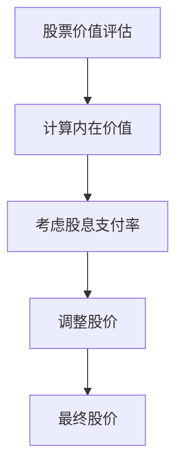
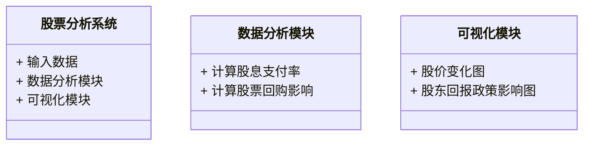
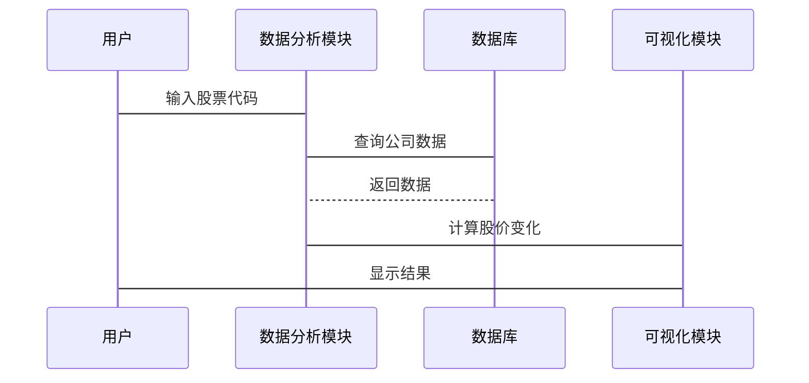

                 


# 特价股票与公司股东回报政策的关联

> 关键词：特价股票，股东回报政策，股息支付率，股票回购，投资策略

> 摘要：本文探讨了特价股票与公司股东回报政策之间的关联性，分析了股东回报政策如何影响股价，以及投资者如何通过理解这些政策来优化投资策略。文章从基本概念入手，深入探讨了股东回报政策的类型、数学模型、系统架构和实际案例，最后总结了最佳实践和注意事项。

---

# 第一章: 特价股票与股东回报政策概述

## 1.1 特价股票的基本概念

### 1.1.1 特价股票的定义与特点

特价股票是指价格显著低于其内在价值的股票。这种折扣通常出现在市场低迷时期，或者当市场对公司的未来前景持悲观态度时。特价股票的特点包括：

- **低估值**：市场价格低于内在价值。
- **高波动性**：股价波动较大，可能在短期内反弹。
- **风险与机遇并存**：投资者需要承担较高的市场风险，但潜在回报也较高。

### 1.1.2 特价股票的市场定位与分类

特价股票可以分为以下几类：

- **周期性股票**：受经济周期影响较大的行业（如制造业、建筑业）。
- **成长型股票**：未来增长潜力大，但当前估值被低估。
- **价值型股票**：市场价格低于行业平均水平的股票。

### 1.1.3 特价股票的投资价值分析

投资者选择特价股票时，通常关注以下几个方面：

- **市盈率（P/E）**：市场价格与每股收益的比率。
- **市净率（P/B）**：市场价格与每股净资产的比率。
- **股息率**：股息与股价的比率。

---

## 1.2 公司股东回报政策的基本概念

### 1.2.1 股东回报政策的定义

股东回报政策是指公司通过股息、股票回购等方式，将利润分配给股东的策略。常见的股东回报政策包括：

- **股息支付**：公司将部分利润以股息形式分配给股东。
- **股票回购**：公司用自有资金从市场上回购股票，减少流通股数量。
- **股票分割**：将一股股票分成多股，降低每股价格，吸引投资者。

### 1.2.2 股东回报政策的主要形式

- **固定股息支付**：公司承诺每年支付固定的股息。
- **股票回购计划**：公司定期回购股票以提高股东价值。
- **特殊股息分配**：在特定情况下（如资产出售）分配股息。

### 1.2.3 股东回报政策的实施背景与动机

公司实施股东回报政策的动机包括：

- **提升股价**：通过回购股票或增加股息，提高股价。
- **优化资本结构**：通过回购减少债务，改善资本结构。
- **回馈股东**：在公司盈利稳定时，回馈股东是合理的。

---

## 1.3 特价股票与股东回报政策的关联性

### 1.3.1 特价股票市场的特点与股东回报政策的契合点

特价股票市场通常存在低估的股票，而公司通过有效的股东回报政策可以提升市场对公司的信心，从而推高股价。

### 1.3.2 股东回报政策对股价的影响机制

- **股息支付**：稳定的股息支付可以吸引价值投资者，提升股价。
- **股票回购**：回购减少流通股数量，可能推高股价。
- **股票分割**：降低股价门槛，吸引更多投资者。

### 1.3.3 特价股票与股东回报政策的双向互动关系

- 特价股票的低价吸引投资者，促使公司采取积极的股东回报政策。
- 股东回报政策的实施可能提升股价，减少特价股票的数量。

---

# 第二章: 特价股票与股东回报政策的核心概念与联系

## 2.1 特价股票的核心要素

### 2.1.1 特价股票的定价机制

特价股票的定价机制通常受到市场情绪和公司基本面的影响。投资者需要分析公司财务数据、行业前景和市场趋势，以确定股票的合理价格。

### 2.1.2 特价股票的市场供需关系

市场供需关系影响特价股票的价格。供不应求时，股价上涨；供大于求时，股价下跌。

### 2.1.3 特价股票的风险与收益特征

- **风险**：市场波动、公司基本面变化、行业风险。
- **收益**：潜在的高回报，尤其是在市场反弹时。

---

## 2.2 股东回报政策的核心要素

### 2.2.1 股息支付率的计算与影响

股息支付率 = （股息总额 / 净利润）× 100%。

高股息支付率可能表明公司盈利稳定，但也可能意味着公司没有足够的资金进行再投资。

### 2.2.2 股票回购的动机与效果

股票回购的动机包括：

- 提升股价。
- 减少债务。
- 提高每股收益（EPS）。

股票回购的效果可能包括：

- 短期内提升股价。
- 长期影响公司资本结构。

### 2.2.3 股东回报政策的决策因素

公司决定股东回报政策时，通常考虑以下因素：

- 财务状况。
- 市场环境。
- 未来增长潜力。

---

## 2.3 特价股票与股东回报政策的内在联系

### 2.3.1 股东回报政策对股价的直接影响

- 股息支付率高：吸引价值投资者，推高股价。
- 股票回购：减少流通股，可能推高股价。

### 2.3.2 特价股票市场对股东回报政策的反馈机制

- 特价股票的高需求可能促使公司增加股息支付或回购股票。
- 股东回报政策的实施可能减少特价股票的数量。

### 2.3.3 两者关系的动态变化与影响因素

- 经济周期：经济衰退时，公司可能减少股东回报，导致特价股票增加。
- 市场情绪：市场悲观时，特价股票增加，公司可能通过回购提升股价。

---

## 2.4 核心概念对比分析

### 2.4.1 特价股票与非特价股票的对比

| 特价股票 | 非特价股票 |
|----------|------------|
| 价格低于内在价值 | 价格接近或高于内在价值 |
| 高波动性 | 较低波动性 |
| 风险较高 | 风险较低 |

### 2.4.2 不同股东回报政策的对比

| 股息支付 | 股票回购 | 股票分割 |
|----------|----------|----------|
| 稳定收益 | 提高股价 | 降低股价 |
| 资本消耗 | 改善资本结构 | 提高流动性 |

### 2.4.3 特价股票市场与整体市场的对比

- 特价股票市场波动较大，整体市场较为稳定。
- 特价股票市场参与者以投机者为主，整体市场参与者以机构投资者为主。

---

## 2.5 本章小结

本章分析了特价股票和股东回报政策的核心概念，并探讨了它们之间的内在联系。通过对比分析，明确了两者在市场中的不同角色和相互影响。

---

# 第三章: 特价股票与股东回报政策的数学模型与算法原理

## 3.1 特价股票定价的数学模型

### 3.1.1 股票定价的基本公式

股票的内在价值可以通过以下公式计算：

$$
\text{内在价值} = \frac{\text{净利润}}{\text{资本成本}} + \text{未来现金流}
$$

### 3.1.2 股息贴现模型（DDM）

DDM用于计算股票的内在价值，公式如下：

$$
\text{股票价格} = \frac{\text{股息}}{\text{贴现率}}
$$

### 3.1.3 股票回购的数学模型

股票回购对股价的影响可以通过以下公式计算：

$$
\text{新股价} = \frac{\text{原股价} \times \text{流通股数} - \text{回购金额}}{\text{流通股数} - \text{回购股数}}
$$

---

## 3.2 股东回报政策的数学模型

### 3.2.1 股息支付率的计算公式

$$
\text{股息支付率} = \frac{\text{股息总额}}{\text{净利润}} \times 100\%
$$

### 3.2.2 股票回购的数学模型

$$
\text{回购后的股价} = \frac{\text{回购前股价} \times \text{回购股数}}{\text{总股数} - \text{回购股数}}
$$

---

## 3.3 算法原理

### 3.3.1 股票价值评估算法

```python
def stock_value_estimate(fundamental_data, discount_rate):
    # 基本面数据包括净利润和未来现金流
    net_profit = fundamental_data['net_profit']
    cash_flow = fundamental_data['cash_flow']
    
    # 计算内在价值
    intrinsic_value = (cash_flow / discount_rate) + net_profit
    return intrinsic_value
```

### 3.3.2 股票回购影响算法

```python
def stock_repurchase_impact(current_price, repurchase_amount, total_shares):
    # 计算回购后的股价
    new_shares = total_shares - repurchase_amount
    new_price = (current_price * total_shares - repurchase_amount) / new_shares
    return new_price
```

---

## 3.4 算法流程图



---

## 3.5 本章小结

本章通过数学模型和算法，分析了特价股票和股东回报政策之间的关系，为投资者提供了一种量化分析的方法。

---

# 第四章: 特价股票与股东回报政策的系统分析与架构设计

## 4.1 系统分析

### 4.1.1 系统功能需求

- 数据收集：收集公司财务数据、股价数据。
- 数据分析：计算股息支付率、股票回购影响。
- 可视化：展示股价变化趋势。

### 4.1.2 系统架构设计



### 4.1.3 系统接口设计

- 数据接口：与财务数据源对接。
- 用户接口：提供数据输入和结果展示。

### 4.1.4 系统交互流程图



---

## 4.2 本章小结

本章通过系统分析和架构设计，展示了如何构建一个分析特价股票和股东回报政策的系统，为投资者提供直观的工具。

---

# 第五章: 特价股票与股东回报政策的项目实战

## 5.1 项目背景

本项目旨在通过分析某公司的股东回报政策，评估其对股价的影响。

## 5.2 项目实施

### 5.2.1 数据收集

收集某公司过去5年的财务数据和股价数据。

### 5.2.2 数据分析

计算股息支付率和股票回购影响。

### 5.2.3 案例分析

分析某公司股票回购对股价的影响。

## 5.3 项目代码实现

```python
import pandas as pd

def calculate_dividend_yield(dividends, price):
    return (dividends / price) * 100

def calculate_stock_repurchase_impact(current_price, repurchase_amount, total_shares):
    new_shares = total_shares - repurchase_amount
    new_price = (current_price * total_shares - repurchase_amount) / new_shares
    return new_price

# 示例数据
dividends = 10000000
price = 50
repurchase_amount = 1000000
total_shares = 10000000

# 计算股息率
dividend_yield = calculate_dividend_yield(dividends, price)
print(f"股息率: {dividend_yield}%")

# 计算回购影响
new_price = calculate_stock_repurchase_impact(price, repurchase_amount, total_shares)
print(f"回购后的股价: {new_price}")
```

---

## 5.4 本章小结

本章通过实际案例分析，展示了如何将理论应用于实践，帮助投资者理解股东回报政策的影响。

---

# 第六章: 特价股票与股东回报政策的最佳实践

## 6.1 最佳实践

### 6.1.1 投资者策略

- **长期投资**：关注公司的长期增长潜力。
- **分散投资**：降低风险。
- **关注基本面**：分析公司的财务数据和行业前景。

### 6.1.2 公司策略

- **合理分配利润**：根据公司发展阶段决定股东回报政策。
- **透明披露**：及时披露股东回报政策相关信息。

## 6.2 小结与注意事项

- **小结**：本文详细分析了特价股票与股东回报政策的关联性，并提供了实用的分析工具和策略。
- **注意事项**：投资者需结合市场环境和公司基本面，制定合理的投资策略。

## 6.3 拓展阅读

- 推荐阅读相关书籍和文献，深入理解股票市场和股东回报政策的复杂性。

---

# 作者

作者：AI天才研究院/AI Genius Institute & 禅与计算机程序设计艺术 /Zen And The Art of Computer Programming

---

通过以上结构，文章详细分析了特价股票与股东回报政策的关联性，从基本概念到数学模型，再到系统设计和实际案例，为读者提供了全面的知识和实用的工具。

