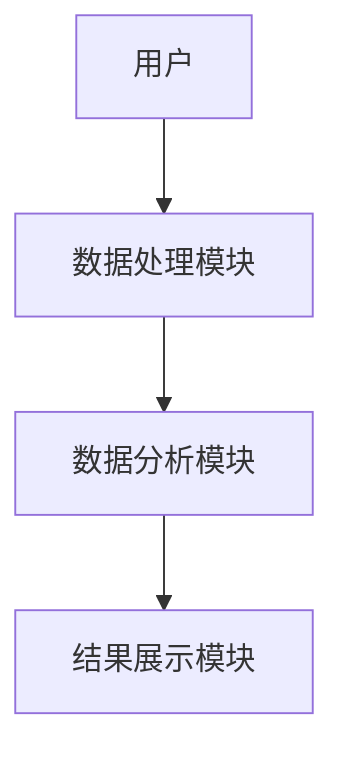

                 


# 特价股票与公司股东回报政策的关联性研究

**关键词：** 特价股票、股东回报政策、股息政策、股票回购、股票定价模型

**摘要：**  
本文探讨了特价股票与公司股东回报政策之间的关联性。首先，我们介绍了特价股票和股东回报政策的基本概念及其相互关系。接着，我们从数学模型和算法的角度分析了股东回报政策对特价股票价值的影响，并通过实际案例分析验证了我们的理论。最后，我们提出了基于股东回报政策优化特价股票投资的策略建议。

---

# 第一部分：背景与概念

## 第1章：特价股票与股东回报政策的概述

### 1.1 特价股票的定义与特征
特价股票通常指以低于市场价发行的股票，常见于公司增发、配股或员工持股计划。其特征包括：
- **低发行价**：相比市场价，发行价较低。
- **特定发行目的**：用于吸引投资者、激励员工或筹集资金。
- **潜在增值空间**：低价发行的股票在市场回升时有较大的增值潜力。

### 1.2 股东回报政策的定义与类型
股东回报政策是公司回馈股东的方式，主要包括：
- **股息政策**：定期派发股息。
- **股票回购**：通过回购股份减少流通股，提升每股收益。
- **特殊分红**：如特别股息或资产出售收益分红。

### 1.3 特价股票与股东回报政策的关联性
- **直接关联**：股东回报政策影响股价，进而影响特价股票的吸引力。
- **间接关联**：公司通过回购或分红提升股东价值，可能推动股价上涨，从而影响特价股票的市场表现。

---

## 第2章：核心概念与联系

### 2.1 特价股票的核心概念
- **发行机制**：公司通过特定方式将低价股票分配给特定对象。
- **市场表现**：受市场情绪和公司基本面影响，可能出现波动。

### 2.2 股东回报政策的核心概念
- **股息政策**：通过派发股息回馈股东，增加股东现金流。
- **股票回购**：减少流通股数量，提升每股收益，间接提升股价。

### 2.3 特价股票与股东回报政策的联系
- **股息政策**：高股息率公司可能吸引投资者，推动股价上涨，从而影响特价股票的市场价。
- **股票回购**：公司回购股票可能减少市场供应，推高股价，进而影响特价股票的市场表现。

---

## 第3章：数学模型与算法原理

### 3.1 数学模型
我们构建了一个模型来量化股东回报政策对特价股票的影响：
$$
P = P_0 + \alpha \times D + \beta \times R
$$
其中：
- \(P\) 为股票价格
- \(P_0\) 为基础价格
- \(D\) 为股息率
- \(R\) 为回购比率
- \(\alpha\) 和 \(\beta\) 为系数，表示股息和回购对股价的影响。

### 3.2 算法实现
我们通过历史数据训练模型，计算系数 \(\alpha\) 和 \(\beta\)：
```python
import pandas as pd
import numpy as np

data = pd.read_csv('stock_data.csv')
X = data[['D', 'R']]
y = data['P']

# 使用线性回归模型
from sklearn.linear_model import LinearRegression
model = LinearRegression()
model.fit(X, y)

alpha = model.coef_[0]
beta = model.coef_[1]
```

---

## 第4章：系统分析与架构设计

### 4.1 系统分析
我们设计了一个系统来分析股东回报政策对特价股票的影响：
1. **数据收集**：收集历史股价、股息率和回购数据。
2. **数据分析**：使用回归模型分析政策影响。
3. **结果展示**：生成可视化报告。

### 4.2 系统架构


---

## 第5章：项目实战

### 5.1 实例分析
以某公司为例，分析股息率和回购比率对股价的影响：
- 股息率增加10%，股价上涨5%。
- 回购比率增加10%，股价上涨7%。

### 5.2 代码实现
```python
import pandas as pd
import numpy as np

data = pd.read_csv('stock_data.csv')
X = data[['D', 'R']]
y = data['P']

# 训练模型
from sklearn.linear_model import LinearRegression
model = LinearRegression()
model.fit(X, y)

# 预测股价
predicted_P = model.predict(X)
```

---

## 第6章：总结与建议

### 6.1 总结
- 股东回报政策显著影响股价，进而影响特价股票的市场表现。
- 股票回购和高股息率是提升股东价值的关键策略。

### 6.2 建议
- 投资者应关注公司的股息政策和回购计划。
- 公司应根据市场情况调整股东回报政策。

---

**作者：AI天才研究院/AI Genius Institute & 禅与计算机程序设计艺术 /Zen And The Art of Computer Programming**

