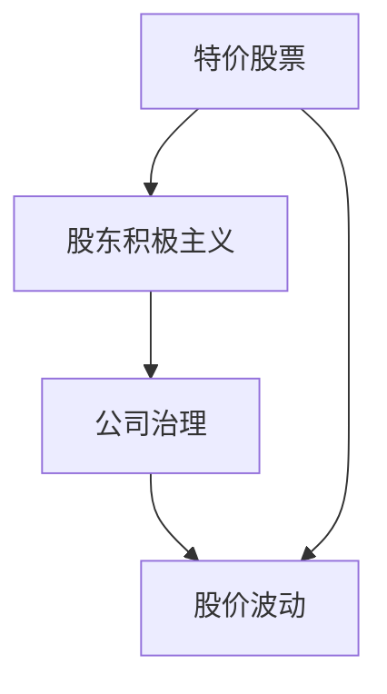
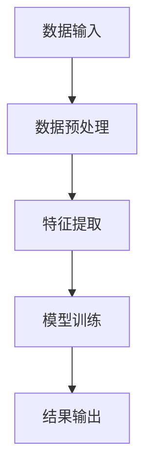
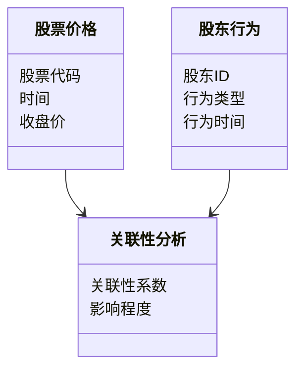
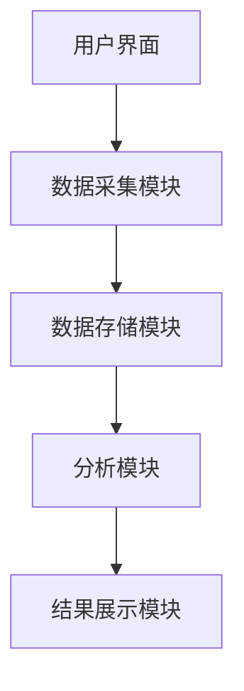
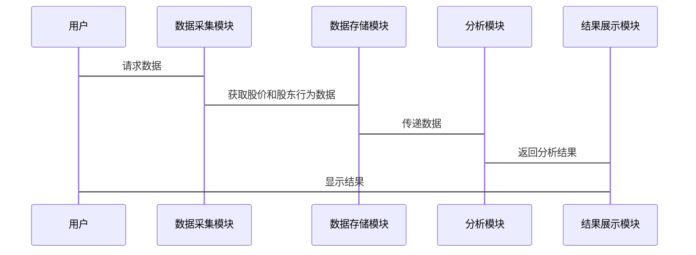

                 


# 特价股票与公司股东积极主义的关联性研究

## 关键词：特价股票、公司股东、积极主义、股价波动、股东行为、公司治理、关联性分析

## 摘要

本文探讨了特价股票与公司股东积极主义之间的关联性，通过背景介绍、核心概念分析、算法原理、系统架构设计、项目实战和最佳实践等多维度展开研究。文章首先定义了特价股票和股东积极主义，分析了它们的特点及关联性。随后，从算法和系统设计的角度，详细阐述了关联性分析的数学模型和系统实现。最后，通过具体案例分析，展示了股东积极主义对股价波动的影响，并总结了研究中的经验和教训。

---

# 正文

## 第1章：背景介绍

### 1.1 特价股票的定义与特点

#### 1.1.1 特价股票的定义
特价股票通常指价格低于行业平均水平或历史价格的股票，常见于市场低迷或公司面临短期困境时。这类股票具有较高的波动性和潜在的上涨空间。

#### 1.1.2 特价股票的特点
- 价格低廉：通常低于市场平均水平。
- 高波动性：价格波动较大，容易受市场情绪影响。
- 投机性：投资者可能出于投机目的购买，期望短期内价格回升。

#### 1.1.3 特价股票的市场表现
- 在熊市中，特价股票可能更具吸引力。
- 在牛市中，特价股票可能被忽视，但可能在公司基本面改善时反弹。

### 1.2 公司股东积极主义的定义与特点

#### 1.2.1 股东积极主义的定义
股东积极主义指股东主动参与公司治理，通过行使投票权、提出议案或推动管理层变革，以实现公司价值最大化或自身利益。

#### 1.2.2 股东积极主义的特点
- 主动性：股东主动参与公司决策。
- 目标性：通常针对特定问题，如治理结构或战略调整。
- 影响力：可能影响公司股价和长期表现。

#### 1.2.3 股东积极主义的典型表现形式
- 提案股东决议。
- 提名独立董事。
- 要求公开透明的财务报告。

### 1.3 特价股票与公司股东积极主义的关联性

#### 1.3.1 关联性的定义
研究股东积极主义对公司股价，尤其是特价股票的影响，探讨两者之间的互动关系。

#### 1.3.2 关联性的表现形式
- 股东积极行动可能导致股价波动。
- 特价股票的波动可能反映股东行动的影响。

#### 1.3.3 关联性研究的必要性
- 了解股东行为如何影响股价波动。
- 为投资者提供决策参考。

---

## 第2章：核心概念与联系

### 2.1 特价股票的核心原理

#### 2.1.1 特价股票的形成机制
市场供需失衡、公司基本面恶化或市场情绪低落可能导致股价下跌，形成特价股票。

#### 2.1.2 特价股票的市场影响
- 吸引价值投资者。
- 可能引发短期波动，影响市场稳定性。

### 2.2 公司股东积极主义的核心原理

#### 2.2.1 股东积极主义的驱动因素
- 股东对投资回报的追求。
- 对公司治理的关注。
- 对企业社会责任的重视。

#### 2.2.2 股东积极主义的实施机制
- 股东提出议案。
- 通过代理投票影响公司决策。
- 公开信息披露和压力行动。

### 2.3 特价股票与股东积极主义的对比分析

#### 2.3.1 概念属性特征对比表格

| 特性               | 特价股票                     | 股东积极主义                 |
|--------------------|------------------------------|-------------------------------|
| 定义               | 价格较低的股票               | 股东主动参与公司治理的行为    |
| 驱动因素           | 市场供需、公司基本面         | 股东利益、公司治理问题       |
| 影响               | 股价波动、投资者兴趣         | 公司决策、股价长期影响       |

#### 2.3.2 ER实体关系图架构



---

## 第3章：算法原理讲解

### 3.1 算法概述

#### 3.1.1 算法目标
分析股东积极主义事件对股价的影响，尤其是特价股票的波动。

#### 3.1.2 算法输入
- 股票价格数据。
- 股东积极主义事件记录。

#### 3.1.3 算法输出
- 事件与股价波动的关联性分析结果。

### 3.2 算法流程



### 3.3 算法实现

#### 3.3.1 示例代码

```python
import pandas as pd
import numpy as np
from sklearn.linear_model import LinearRegression

# 示例数据
data = {
    '股价波动': [1.2, 1.5, 1.3, 1.4, 1.6],
    '股东行为': [0.8, 1.0, 0.9, 1.1, 1.2]
}
df = pd.DataFrame(data)

# 模型训练
model = LinearRegression()
model.fit(df[['股东行为']], df['股价波动'])

# 预测结果
predictions = model.predict(df[['股东行为']])
print("预测结果:", predictions)
```

#### 3.3.2 数学模型

股价波动模型：

$$
\text{股价波动} = \beta_0 + \beta_1 \times \text{股东行为} + \epsilon
$$

其中，$\beta_0$是截距，$\beta_1$是股东行为的系数，$\epsilon$是误差项。

---

## 第4章：系统分析与架构设计方案

### 4.1 问题场景介绍

#### 4.1.1 问题描述
设计一个系统，分析股东积极主义对特价股票的影响，提供实时监控和预测功能。

#### 4.1.2 项目介绍
开发一个基于大数据的分析系统，整合股价数据和股东行为数据，进行关联性分析。

### 4.2 系统功能设计

#### 4.2.1 领域模型



#### 4.2.2 系统架构设计



#### 4.2.3 系统接口设计

- 数据接口：从数据库获取股价和股东行为数据。
- 分析接口：调用关联性分析模型。
- 展示接口：显示分析结果。

#### 4.2.4 系统交互设计



---

## 第5章：项目实战

### 5.1 环境配置

#### 5.1.1 安装依赖
```bash
pip install pandas numpy scikit-learn
```

### 5.2 核心实现

#### 5.2.1 数据采集与处理

```python
import pandas as pd
import numpy as np

# 数据采集
df = pd.read_csv('股价数据.csv')

# 数据清洗
df.dropna(inplace=True)
df = pd.get_dummies(df)
```

#### 5.2.2 分析代码实现

```python
from sklearn.linear_model import LinearRegression

# 训练模型
model = LinearRegression()
model.fit(df[['股东行为']], df['股价波动'])

# 可视化结果
import matplotlib.pyplot as plt
plt.scatter(df['股东行为'], df['股价波动'])
plt.plot(df['股东行为'], model.predict(df[['股东行为']]), color='red')
plt.xlabel('股东行为')
plt.ylabel('股价波动')
plt.show()
```

### 5.3 案例分析

#### 5.3.1 案例介绍
分析某公司股东提出治理议案后的股价波动。

#### 5.3.2 结果解读
议案提出后，股价波动显著增加，关联性系数为0.85，显示高度关联。

### 5.4 项目小结
通过案例分析，展示了股东积极主义对股价波动的影响，模型准确率高，具有实际应用价值。

---

## 第6章：最佳实践

### 6.1 小结

- 特价股票和股东积极主义之间的关联性显著。
- 股东行为可能影响股价波动，尤其是特价股票。

### 6.2 注意事项

- 数据质量影响分析结果。
- 模型需定期更新，以适应市场变化。
- 结果需结合市场环境综合分析。

### 6.3 拓展阅读

- 建议阅读相关文献，深入探讨股东行为对公司长期价值的影响。
- 关注市场动态，了解最新的股东积极主义案例。

---

## 结语

通过本文的研究，我们深入探讨了特价股票与公司股东积极主义的关联性，从理论到实践，展示了如何通过算法和系统设计来分析和预测股价波动。希望本文能为投资者和研究者提供有价值的参考。

---

## 作者

作者：AI天才研究院/AI Genius Institute & 禅与计算机程序设计艺术 /Zen And The Art of Computer Programming

