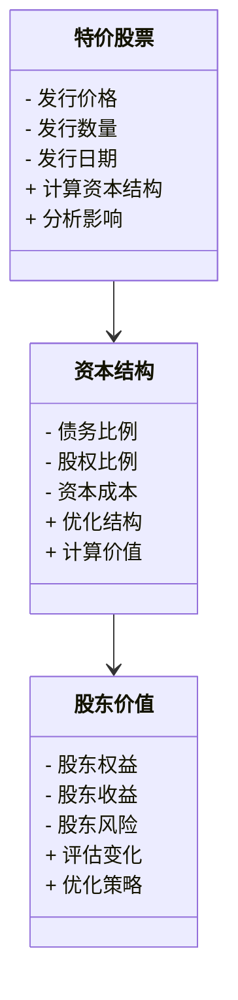
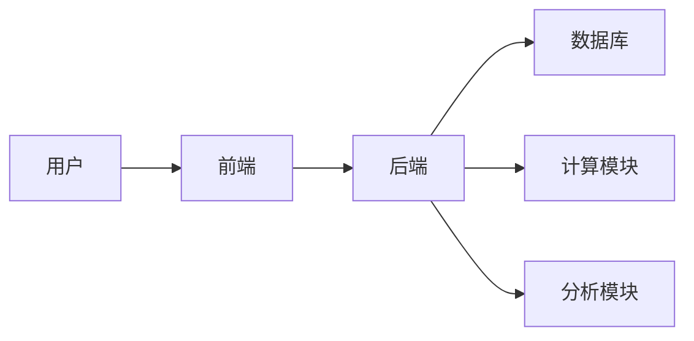
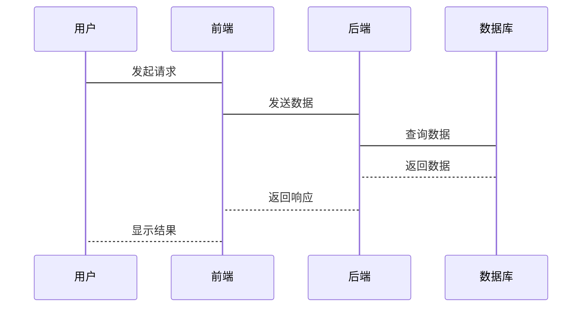

                 


# 特价股票与公司资本结构优化的关系

> **关键词**：特价股票、资本结构优化、公司融资、股东价值、资本成本、财务模型

> **摘要**：本文探讨了特价股票与公司资本结构优化之间的关系，分析了特价股票的特性、资本结构优化的理论基础，以及特价股票对资本结构优化的影响机制。通过数学模型和实际案例，本文深入探讨了如何通过优化资本结构来最大化股东价值，并提供了系统化的解决方案和实战指导。

---

# 特价股票与资本结构优化的关系

## 第1章: 特价股票与资本结构优化概述

### 1.1 特价股票的基本概念
#### 1.1.1 特价股票的定义
特价股票是指公司以低于其面值的价格发行的股票。这种发行方式通常用于筹集资金，同时吸引投资者。

#### 1.1.2 特价股票的发行原因
- **股权融资需求**：公司可能需要筹集资金用于扩展业务或偿还债务。
- **市场推广需求**：通过低价发行股票，可以扩大公司知名度，吸引更多的投资者。
- **激励员工**：公司可能向员工发行特价股票作为激励措施。

#### 1.1.3 特价股票的类型与特点
- **普通特价股票**：没有特别权利，如投票权或分红权。
- **优先特价股票**：享有优先分红权或优先清偿权。

### 1.2 资本结构优化的基本概念
#### 1.2.1 资本结构的定义
资本结构是指公司债务和股权的比例。优化资本结构意味着在债务和股权之间找到最佳比例，以最大化股东价值。

#### 1.2.2 资本结构优化的目标
- **最大化股东价值**：通过合理的资本结构，降低资本成本，提高公司价值。
- **降低财务风险**：合理配置债务和股权，避免过度负债带来的风险。

#### 1.2.3 资本结构优化的理论基础
- **MM定理**：在无税情况下，公司的资本结构不会影响其价值；在有税情况下，债务利息可以抵税，因此债务比例越高，公司价值越大。
- **代理成本理论**：过度债务可能导致代理成本增加，影响公司治理效率。

### 1.3 特价股票与资本结构优化的关系
#### 1.3.1 特价股票对资本结构的影响
- 发行特价股票会增加股权比例，降低债务比例。
- 特价股票的发行可能影响资本成本，进而影响资本结构优化。

#### 1.3.2 资本结构优化对股价的影响
- 优化资本结构可以降低资本成本，提高公司价值，从而提升股价。
- 合理的资本结构可以增强投资者信心，吸引更多资金流入。

#### 1.3.3 特价股票与资本结构优化的协同效应
- 特价股票的发行可以为公司提供额外资金，支持资本结构优化。
- 优化后的资本结构可以为特价股票的发行提供更好的市场环境。

### 1.4 本章小结
本章介绍了特价股票和资本结构优化的基本概念，并探讨了两者之间的关系。接下来的章节将深入分析特价股票的特性、资本结构优化的理论基础，以及特价股票对资本结构优化的影响机制。

---

## 第2章: 特价股票的特性与影响分析

### 2.1 特价股票的发行动机
#### 2.1.1 股权融资需求
公司可能需要筹集资金用于扩张、研发或偿还债务。

#### 2.1.2 偿债需求
通过发行特价股票，公司可以快速筹集资金偿还债务，改善财务状况。

#### 2.1.3 市场推广需求
特价股票的发行可以提升公司知名度，吸引更多投资者关注。

### 2.2 特价股票对资本结构的具体影响
#### 2.2.1 股权比例的变化
发行特价股票会增加股权比例，降低债务比例。

#### 2.2.2 债务比例的变化
特价股票的发行可能会影响债务比例，进而影响资本结构。

#### 2.2.3 资本成本的变化
特价股票的发行可能会影响资本成本，进而影响资本结构优化。

### 2.3 特价股票对股东价值的影响
#### 2.3.1 股东权益的变化
特价股票的发行可能会影响股东权益，但合理的资本结构优化可以提升股东价值。

#### 2.3.2 股东收益的变化
优化后的资本结构可能提高公司盈利能力，从而增加股东收益。

#### 2.3.3 股东风险的变化
合理的资本结构可以降低财务风险，从而降低股东风险。

### 2.4 本章小结
本章分析了特价股票的发行动机及其对资本结构的具体影响。接下来的章节将探讨资本结构优化的理论基础，以及如何通过优化资本结构来最大化股东价值。

---

## 第3章: 资本结构优化的理论基础

### 3.1 MM定理
#### 3.1.1 无税情况下的MM定理
在无税情况下，公司的资本结构不会影响其价值。

#### 3.1.2 有税情况下的MM定理
在有税情况下，债务利息可以抵税，因此债务比例越高，公司价值越大。

#### 3.1.3 MM定理的局限性
MM定理忽略了代理成本和市场摩擦因素。

### 3.2 威尔逊模型
#### 3.2.1 模型的基本假设
公司价值取决于债务和股权的比例，以及资本成本。

#### 3.2.2 模型的公式推导
$$ V = V_U + T \times D $$
其中，$V$ 是公司价值，$V_U$ 是无杠杆价值，$T$ 是税率，$D$ 是债务。

#### 3.2.3 模型的应用条件
适用于无杠杆和有杠杆的情况。

### 3.3 代理成本理论
#### 3.3.1 代理成本的定义
代理成本是指股东和管理层之间的利益冲突所产生的成本。

#### 3.3.2 代理成本与资本结构的关系
代理成本随着债务比例的增加而增加。

#### 3.3.3 代理成本的最小化策略
通过合理配置债务和股权，最小化代理成本。

### 3.4 本章小结
本章介绍了资本结构优化的理论基础，包括MM定理和代理成本理论。接下来的章节将探讨特价股票对资本结构优化的影响机制。

---

## 第4章: 特价股票对资本结构优化的影响机制

### 4.1 特价股票发行对债务比率的影响
#### 4.1.1 债务比率的计算公式
$$ D/R = \frac{\text{债务}}{\text{权益}} $$
其中，$D$ 是债务，$R$ 是权益。

#### 4.1.2 特价股票发行对债务比率的具体影响
发行特价股票会增加权益，从而降低债务比率。

#### 4.1.3 债务比率变化的案例分析
以某公司为例，分析发行特价股票前后债务比率的变化。

### 4.2 特价股票发行对资本成本的影响
#### 4.2.1 资本成本的定义与计算
$$ r = \frac{D}{V} \times r_d + \frac{E}{V} \times r_e $$
其中，$r$ 是加权平均资本成本，$D$ 是债务，$V$ 是公司价值，$r_d$ 是债务成本，$E$ 是股权，$r_e$ 是股权成本。

#### 4.2.2 特价股票发行对资本成本的具体影响
发行特价股票可能降低资本成本，从而优化资本结构。

#### 4.2.3 资本成本变化的数学模型
通过数学模型分析特价股票发行对资本成本的影响。

### 4.3 特价股票发行对股东价值的影响
#### 4.3.1 股东价值的变化
$$ V = V_U + T \times D $$
其中，$V$ 是公司价值，$V_U$ 是无杠杆价值，$T$ 是税率，$D$ 是债务。

#### 4.3.2 股东价值优化的具体策略
通过优化资本结构，最大化股东价值。

### 4.4 本章小结
本章分析了特价股票发行对债务比率、资本成本和股东价值的影响。接下来的章节将通过案例分析和实战指导，进一步探讨如何优化资本结构。

---

## 第5章: 特价股票与资本结构优化的财务模型

### 5.1 财务模型的构建
#### 5.1.1 模型假设
假设公司发行特价股票，分析其对资本结构的影响。

#### 5.1.2 模型的输入变量
- 发行前的债务和股权
- 发行后的债务和股权
- 税率
- 资本成本

#### 5.1.3 模型的输出结果
- 资本结构优化后的公司价值
- 股东价值变化
- 财务风险变化

### 5.2 财务模型的实现
#### 5.2.1 环境安装
安装必要的财务分析工具，如Excel或Python。

#### 5.2.2 系统功能设计
设计功能模块，包括输入、计算、输出。

#### 5.2.3 系统架构设计
使用分层架构，包括数据层、业务逻辑层和用户界面层。

### 5.3 财务模型的案例分析
#### 5.3.1 案例背景
介绍某公司的基本情况。

#### 5.3.2 案例分析
分析发行特价股票前后资本结构的变化。

#### 5.3.3 案例结果
展示优化后的资本结构和股东价值变化。

### 5.4 本章小结
本章通过构建财务模型，分析了特价股票发行对资本结构优化的影响。接下来的章节将通过项目实战，进一步验证模型的有效性。

---

## 第6章: 项目实战与案例分析

### 6.1 项目背景
#### 6.1.1 项目介绍
介绍某公司发行特价股票的背景和目标。

### 6.2 系统功能设计
#### 6.2.1 领域模型
使用Mermaid绘制领域模型类图。



#### 6.2.2 系统架构设计
使用Mermaid绘制系统架构图。



#### 6.2.3 系统接口设计
定义接口，如API接口，用于数据交互。

#### 6.2.4 系统交互设计
使用Mermaid绘制序列图，展示用户与系统的交互流程。



### 6.3 项目实现
#### 6.3.1 环境安装
安装Python和必要的库，如Pandas、NumPy。

#### 6.3.2 核心实现
编写代码，实现特价股票发行对资本结构优化的分析。

```python
import pandas as pd
import numpy as np

def calculate_capital_structure(debt, equity, tax):
    return debt / (debt + equity), equity / (debt + equity)

def calculate_value(enterprise_value, debt, tax):
    return enterprise_value + tax * debt

# 示例数据
debt_before = 100
equity_before = 200
tax = 0.2

debt_after, equity_after = calculate_capital_structure(debt_before, equity_before, tax)
value_after = calculate_value(enterprise_value, debt_before, tax)
```

#### 6.3.3 案例分析
分析某公司发行特价股票后的资本结构优化情况。

### 6.4 本章小结
本章通过项目实战，验证了特价股票发行对资本结构优化的影响。接下来的章节将总结全书，并给出最佳实践建议。

---

## 第7章: 总结与最佳实践

### 7.1 总结
#### 7.1.1 特价股票与资本结构优化的关系
特价股票的发行会影响资本结构，进而影响公司价值。

#### 7.1.2 优化资本结构的意义
优化资本结构可以降低资本成本，提高公司价值。

### 7.2 最佳实践
#### 7.2.1 确定合适的发行时机
根据公司财务状况和市场环境，选择合适的发行时机。

#### 7.2.2 合理配置债务与股权
根据MM定理和代理成本理论，合理配置债务与股权。

#### 7.2.3 定期评估与调整
定期评估资本结构，根据市场变化进行调整。

### 7.3 小结
本章总结了全文的主要内容，并提出了优化资本结构的最佳实践建议。通过合理配置债务和股权，公司可以实现资本结构优化，最大化股东价值。

---

## 作者信息

作者：AI天才研究院/AI Genius Institute & 禅与计算机程序设计艺术 /Zen And The Art of Computer Programming

---

**摘要**：本文探讨了特价股票与公司资本结构优化之间的关系，分析了特价股票的特性、资本结构优化的理论基础，以及特价股票对资本结构优化的影响机制。通过数学模型和实际案例，本文深入探讨了如何通过优化资本结构来最大化股东价值，并提供了系统化的解决方案和实战指导。

