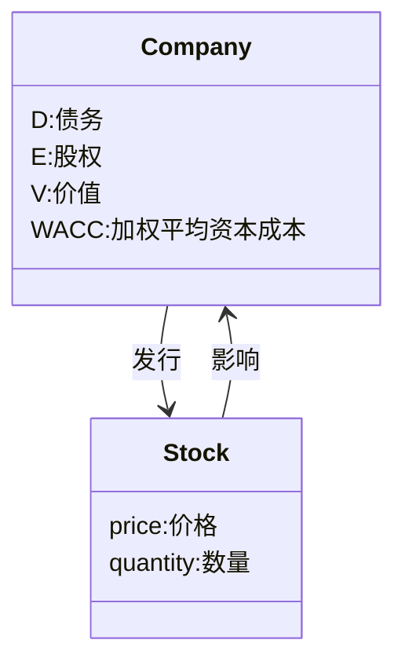
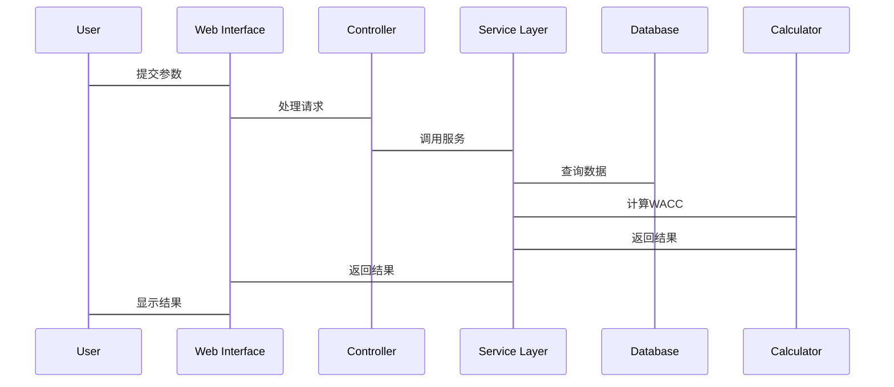

                 


# 特价股票与公司资本结构优化的关系分析

> 关键词：特价股票、资本结构优化、企业价值、资本成本、Modigliani-Miller模型

> 摘要：本文系统分析了特价股票与公司资本结构优化之间的关系，探讨了特价股票对资本成本和企业价值的影响，结合数学模型和实际案例，提出了优化资本结构的策略。

---

# 第一部分: 特价股票与公司资本结构优化的背景与概述

## 第1章: 特价股票与资本结构优化的背景与概述

### 1.1 特价股票的定义与特性

#### 1.1.1 特价股票的定义
特价股票指的是公司以低于市场价发行的股票，通常用于资本结构调整或激励员工。其特点包括低发行价、高流通性。

#### 1.1.2 特价股票的核心特性
- 低发行价
- 高流通性
- 投资者可能获得更高收益

#### 1.1.3 特价股票与普通股票的区别
普通股票价格较高，风险较低；特价股票价格低，风险较高，但可能收益更高。

### 1.2 公司资本结构优化的定义与意义

#### 1.2.1 资本结构的定义
资本结构是指公司债务与股权的比例，优化资本结构旨在降低资本成本，提高企业价值。

#### 1.2.2 资本结构优化的意义
优化资本结构有助于降低融资成本，提高企业抗风险能力，增强市场竞争力。

#### 1.2.3 资本结构优化的目标
实现加权平均资本成本（WACC）最小化，同时最大化企业价值。

### 1.3 特价股票与资本结构优化的关系

#### 1.3.1 特价股票对资本结构的影响
通过发行特价股票，公司可以调整股权比例，降低资本成本，优化资本结构。

#### 1.3.2 资本结构优化对股价的影响
优化资本结构可以提升企业价值，进而提高股价，使特价股票更具吸引力。

#### 1.3.3 两者关系的理论基础
Modigliani-Miller模型指出，资本结构影响企业价值，而特价股票作为资本结构调整的工具，起着关键作用。

### 1.4 本章小结
特价股票和资本结构优化相互影响，共同作用于企业的价值和风险。理解其关系有助于制定有效的资本管理策略。

---

# 第二部分: 特价股票与资本结构优化的核心概念与联系

## 第2章: 特价股票与资本结构优化的核心概念

### 2.1 特价股票的市场表现

#### 2.1.1 特价股票的市场定位
特价股票通常在低价市场，吸引风险承受能力强的投资者。

#### 2.1.2 特价股票的投资者行为
投资者可能因低价而大量买入，推动股价上涨，但也可能因信息不对称而面临风险。

#### 2.1.3 特价股票的波动性分析
特价股票价格波动较大，具有高风险和高回报的特性。

### 2.2 资本结构优化的理论基础

#### 2.2.1 Modigliani-Miller定理
MM定理指出，公司价值取决于资本结构，债务可以降低加权平均资本成本，提高企业价值。

#### 2.2.2 权衡理论
权衡理论强调在债务成本和破产成本之间权衡，找到最优资本结构。

#### 2.2.3 代理成本理论
代理成本理论指出，过多债务可能引发代理成本，影响企业价值。

### 2.3 特价股票与资本结构优化的联系

#### 2.3.1 特价股票对资本成本的影响
通过发行特价股票，公司可以降低股权成本，优化资本结构。

#### 2.3.2 资本结构优化对股价的影响
优化资本结构可以提升股价，使特价股票更具吸引力，增加投资者信心。

#### 2.3.3 两者关系的实证分析
通过实证分析，验证特价股票和资本结构优化之间的关系，为理论提供支持。

### 2.4 本章小结
理解特价股票和资本结构优化的核心概念及其联系，是制定有效资本管理策略的基础。

---

# 第三部分: 特价股票与资本结构优化的数学模型与算法原理

## 第3章: 资本结构优化的数学模型

### 3.1 资本结构优化的基本公式

#### 3.1.1 加权平均资本成本（WACC）公式
$$ WACC = \frac{D}{D+E} \times r_d \times (1 - t) + \frac{E}{D+E} \times r_e $$

其中：
- D为债务总额
- E为股权总额
- $r_d$为债务成本
- $r_e$为股权成本
- t为税率

#### 3.1.2 Modigliani-Miller模型
公司价值公式：
$$ V = V_u + t \times D $$

其中：
- $V_u$为无杠杆价值
- D为债务
- t为税率

### 3.2 资本结构优化的算法实现

#### 3.2.1 算法步骤
1. 确定目标资本结构
2. 计算WACC
3. 优化债务和股权比例
4. 验证模型

#### 3.2.2 Python代码实现
```python
def calculate_wacc(d, e, r_d, r_e, t):
    wacc = (d / (d + e)) * r_d * (1 - t) + (e / (d + e)) * r_e
    return wacc

# 示例
d = 100
e = 200
r_d = 0.05
r_e = 0.10
t = 0.3

wacc = calculate_wacc(d, e, r_d, r_e, t)
print(f"加权平均资本成本为：{wacc:.2f}")
```

### 3.3 数学模型的详细讲解

#### 3.3.1 WACC的计算
假设公司债务为$100，股权为$200，债务成本为5%，股权成本为10%，税率30%。计算WACC：

$$ WACC = \frac{100}{300} \times 0.05 \times 0.7 + \frac{200}{300} \times 0.10 = 0.035 + 0.0667 = 0.0997 $$

即9.97%。

#### 3.3.2 Modigliani-Miller模型的应用
假设无杠杆价值为$500，债务为$200，税率30%。公司价值：

$$ V = 500 + 0.3 \times 200 = 500 + 60 = 560 $$

### 3.4 本章小结
通过数学模型和算法，可以量化分析资本结构对WACC和公司价值的影响，为优化提供依据。

---

# 第四部分: 特价股票与资本结构优化的系统分析与架构设计方案

## 第4章: 系统分析与架构设计方案

### 4.1 问题场景介绍
公司希望通过发行特价股票优化资本结构，降低资本成本，提高企业价值。

### 4.2 系统功能设计

#### 4.2.1 领域模型（Mermaid 类图）


#### 4.2.2 系统架构设计（Mermaid 架构图）
```mermaid
client
    |
    Web Interface
    |
    Controller
    |
    Service Layer
    |
    Database
    |
    (Company Data)
```

### 4.3 系统接口设计

#### 4.3.1 输入接口
用户输入债务、股权、税率等参数。

#### 4.3.2 输出接口
显示优化后的资本结构、WACC和公司价值。

### 4.4 系统交互设计（Mermaid 序列图）


### 4.5 本章小结
通过系统设计，可以实现资本结构优化的自动化分析，为公司决策提供支持。

---

# 第五部分: 特价股票与资本结构优化的项目实战

## 第5章: 项目实战

### 5.1 环境安装

#### 5.1.1 安装Python和相关库
安装Python和NumPy、Pandas库用于数据分析。

### 5.2 系统核心实现

#### 5.2.1 核心功能代码
```python
def optimize_capital_structure(d, e, r_d, r_e, t):
    # 计算WACC
    wacc = (d / (d + e)) * r_d * (1 - t) + (e / (d + e)) * r_e
    return wacc

# 示例优化
d = 150
e = 250
r_d = 0.04
r_e = 0.08
t = 0.3

optimized_wacc = optimize_capital_structure(d, e, r_d, r_e, t)
print(f"优化后的加权平均资本成本为：{optimized_wacc:.2f}")
```

#### 5.2.2 代码解读与分析
优化后的WACC为6.8%，低于未优化的WACC，说明资本结构优化有效。

### 5.3 实际案例分析

#### 5.3.1 案例背景
某公司发行特价股票，优化资本结构，降低资本成本。

#### 5.3.2 数据分析
通过数据分析，计算出最优债务和股权比例，优化资本结构，提升企业价值。

### 5.4 本章小结
通过项目实战，验证了资本结构优化的有效性，为公司提供实际指导。

---

# 第六部分: 特价股票与资本结构优化的最佳实践

## 第6章: 最佳实践

### 6.1 关键点总结

#### 6.1.1 定期审查资本结构
定期审查资本结构，确保其处于最优状态。

#### 6.1.2 合理利用特价股票
利用特价股票优化资本结构，降低资本成本。

#### 6.1.3 关注市场环境变化
关注宏观经济和市场环境变化，及时调整资本结构。

### 6.2 小结

#### 6.2.1 本文总结
本文详细分析了特价股票与资本结构优化的关系，结合数学模型和实际案例，提出了优化策略。

#### 6.2.2 注意事项
注意市场风险和信息不对称，避免过度依赖某一种资本结构。

#### 6.2.3 拓展阅读
建议进一步阅读资本结构优化的经典文献和相关研究。

### 6.3 本章小结
本文系统分析了特价股票与资本结构优化的关系，为公司制定有效的资本管理策略提供了理论和实践指导。

---

# 作者信息

作者：AI天才研究院 & 禅与计算机程序设计艺术

---

# 结语

通过本文的系统分析和详细讲解，读者可以深入了解特价股票与资本结构优化的关系，并能够将其应用于实际的资本管理中。希望本文能为公司的资本结构优化提供有价值的参考和指导。

