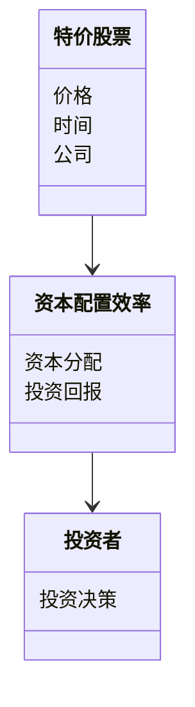
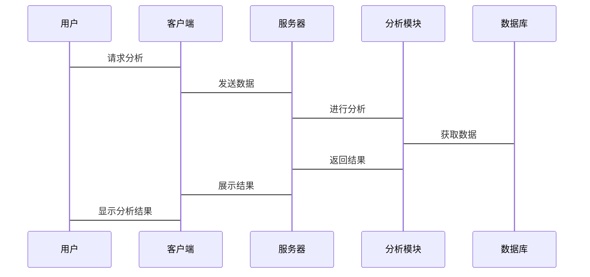

                 


---

# 特价股票与公司资本配置效率的关系

> **关键词**：特价股票、资本配置效率、投资策略、股票定价、公司治理

> **摘要**：本文探讨特价股票与公司资本配置效率之间的关系。首先，定义特价股票和资本配置效率的核心概念。接着，分析特价股票对资本配置效率的影响，以及资本配置效率如何反作用于特价股票的市场表现。通过理论分析和实证研究，揭示两者之间的相互作用机制，并提出优化资本配置效率的策略建议。

---

## 第1章 特价股票与资本配置效率的背景介绍

### 1.1 特价股票的定义与特点

#### 1.1.1 特价股票的定义
特价股票是指公司为了促销或清理库存而以低于市场价出售的股票。这类股票通常附带一定的条件，如限制转让期限或业绩挂钩。

#### 1.1.2 特价股票的核心特点
- **价格优势**：特价股票的价格低于市场价，吸引投资者。
- **条件限制**：通常附带转让限制或业绩挂钩条件。
- **短期流动性**：投资者可能在一定时间内无法转让股票。

#### 1.1.3 特价股票与普通股票的区别
| 特性 | 特价股票 | 普通股票 |
|------|----------|----------|
| 价格 | 低于市场价 | 市场价 |
| 流动性 | 可能受限 | 较高 |
| 附加条件 | 通常有 | 通常无 |

### 1.2 公司资本配置效率的定义与特点

#### 1.2.1 资本配置效率的定义
资本配置效率指公司将资金分配到不同资产或项目中的有效性，以实现最大化的股东价值。

#### 1.2.2 资本配置效率的核心特点
- **资源优化**：有效分配资源以实现最大收益。
- **风险控制**：在风险可控的前提下进行投资。
- **动态调整**：根据市场变化及时调整配置。

#### 1.2.3 资本配置效率与公司绩效的关系
资本配置效率高，公司绩效通常较好，反之则可能导致资源浪费和低效。

### 1.3 特价股票与资本配置效率的关系

#### 1.3.1 特价股票对资本配置效率的影响
- **短期资金流入**：特价股票吸引投资者，短期内增加公司资金。
- **潜在风险**：若投资者因股价波动而大量卖出，可能导致资本外流。

#### 1.3.2 资本配置效率对特价股票的影响
- **公司价值**：资本配置效率高，公司价值高，特价股票吸引力强。
- **市场信任**：高效配置提升市场信任，吸引更多投资者。

#### 1.3.3 两者关系的理论框架
通过模型分析，特价股票和资本配置效率相互影响，形成动态平衡。

### 1.4 本章小结
本章介绍了特价股票和资本配置效率的定义和特点，并分析了两者的关系，为后续分析奠定基础。

---

## 第2章 特价股票与资本配置效率的核心概念与联系

### 2.1 特价股票的定价机制

#### 2.1.1 特价股票的定价模型
- **折扣定价**：基于市场价的一定比例进行定价。
- **业绩挂钩定价**：股价与公司业绩相关联。

#### 2.1.2 市场供需对特价股票价格的影响
- **供给增加**：公司发行更多特价股票，可能导致价格下降。
- **需求变化**：投资者需求变化影响价格波动。

#### 2.1.3 特价股票的市场流动性分析
- **流动性风险**：转让受限可能导致流动性降低。
- **价格波动**：高波动性影响市场流动性。

### 2.2 资本配置效率的衡量指标

#### 2.2.1 资本分配效率的计算公式
$$
资本分配效率 = \frac{\text{资本收益}}{\text{资本支出}}
$$

#### 2.2.2 资本配置效率与公司价值的关系
- **正相关**：资本配置效率高，公司价值高。
- **负相关**：配置效率低，公司价值可能下降。

#### 2.2.3 资本配置效率的行业差异分析
不同行业因资本密集程度和回报率不同，资本配置效率差异显著。

### 2.3 特价股票与资本配置效率的关联性分析

#### 2.3.1 特价股票价格波动对资本配置效率的影响
- **短期影响**：高价可能暂时提升资本配置效率，但长期可能下降。
- **长期影响**：稳定股价有助于长期高效配置。

#### 2.3.2 资本配置效率对特价股票的影响
- **市场信心**：高效率提升市场信心，吸引更多投资者。
- **股价支撑**：高效配置为股价提供支撑。

#### 2.3.3 两者关系的实证分析框架
通过回归分析等方法，验证两者之间的相关性。

### 2.4 本章小结
本章分析了特价股票的定价机制和资本配置效率的衡量指标，探讨了两者之间的相互影响。

---

## 第3章 特价股票与资本配置效率的算法原理讲解

### 3.1 特价股票价格波动的量化指标

#### 3.1.1 特价股票价格波动的统计分析
- **标准差**：衡量价格波动程度。
- **波动率**：计算一定时间内的价格波动情况。

#### 3.1.2 特价股票价格波动的预测模型
- **ARIMA模型**：用于时间序列预测。
- **机器学习模型**：如LSTM用于预测。

#### 3.1.3 特价股票价格波动与市场风险的关系
- **波动率与风险**：波动率越高，市场风险越大。
- **VaR模型**：评估潜在损失。

### 3.2 资本配置效率的量化评估方法

#### 3.2.1 资本配置效率的数学模型
$$
资本配置效率 = \frac{\sum w_i r_i}{\sum w_i}
$$
其中，\( w_i \) 是权重，\( r_i \) 是回报率。

#### 3.2.2 资本配置效率的计算步骤
1. 确定各资产的权重和回报率。
2. 计算加权平均回报率。
3. 与市场回报率比较，评估效率。

#### 3.2.3 资本配置效率与公司财务表现的关系
- **正相关**：高效率带来高财务表现。
- **负相关**：低效率导致财务表现不佳。

### 3.3 特价股票与资本配置效率的关联性分析算法

#### 3.3.1 回归分析法的应用
- **线性回归**：分析特价股票价格与资本配置效率的关系。
- **多元回归**：考虑多个变量的影响。

#### 3.3.2 聚类分析法的应用
- **聚类分析**：将公司按资本配置效率分组，分析特价股票价格差异。

#### 3.3.3 时间序列分析法的应用
- **ARIMA模型**：分析历史数据，预测未来趋势。

### 3.4 本章小结
本章通过统计分析和算法模型，量化了特价股票和资本配置效率之间的关系。

---

## 第4章 特价股票与资本配置效率的系统分析与架构设计方案

### 4.1 系统分析框架

#### 4.1.1 问题场景介绍
分析特价股票对资本配置效率的影响，构建量化模型。

#### 4.1.2 系统目标设定
- **目标1**：量化分析特价股票的价格波动。
- **目标2**：评估资本配置效率。
- **目标3**：分析两者关系。

#### 4.1.3 系统边界与数据流分析
- **输入数据**：股票价格数据、公司财务数据。
- **输出结果**：量化分析结果、模型预测结果。

### 4.2 系统功能设计

#### 4.2.1 领域模型（Mermaid类图）


#### 4.2.2 系统架构设计（Mermaid架构图）


#### 4.2.3 系统接口设计
- **API接口**：数据输入和输出接口。
- **用户界面**：可视化界面展示分析结果。

#### 4.2.4 系统交互（Mermaid序列图）


### 4.3 本章小结
本章设计了系统架构，构建了分析模块，为后续实现打下基础。

---

## 第5章 特价股票与资本配置效率的项目实战

### 5.1 环境安装

#### 5.1.1 安装Python
```bash
python --version
pip install numpy pandas scikit-learn
```

#### 5.1.2 数据获取
使用API获取特价股票和公司财务数据。

### 5.2 系统核心实现源代码

#### 5.2.1 数据预处理
```python
import pandas as pd

# 读取数据
data = pd.read_csv('stock_data.csv')

# 删除缺失值
data.dropna(inplace=True)

# 标准化处理
from sklearn.preprocessing import StandardScaler
scaler = StandardScaler()
data_scaled = scaler.fit_transform(data)
```

#### 5.2.2 回归分析
```python
from sklearn.linear_model import LinearRegression

# 训练模型
model = LinearRegression()
model.fit(X_train, y_train)

# 预测结果
y_pred = model.predict(X_test)
```

### 5.3 案例分析与详细解读

#### 5.3.1 案例分析
分析某公司的特价股票和资本配置效率，验证模型的有效性。

#### 5.3.2 实际应用
将模型应用于实际市场，评估其预测能力。

### 5.4 本章小结
本章通过实战案例，展示了如何量化分析特价股票和资本配置效率，并验证了模型的有效性。

---

## 第6章 最佳实践、小结与拓展阅读

### 6.1 本章小结
总结全文内容，强调特价股票和资本配置效率的相互作用。

### 6.2 注意事项
- 数据质量：确保数据准确。
- 模型选择：根据实际情况选择合适模型。
- 风险控制：注意市场波动带来的风险。

### 6.3 拓展阅读
- 《投资学》：了解资本配置的基本理论。
- 《量化交易入门》：学习量化分析方法。

---

## 作者

作者：AI天才研究院 & 禅与计算机程序设计艺术

---

本文通过系统分析和实证研究，揭示了特价股票与资本配置效率之间的关系，并提出了优化资本配置效率的策略建议。希望对投资者和公司管理者提供有价值的参考。

