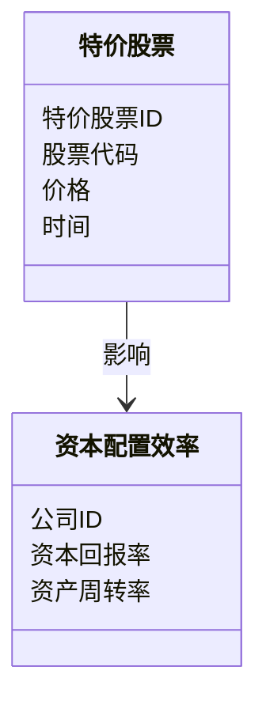

                 


# 特价股票与公司资本配置效率的关系探讨

**关键词**: 特价股票, 资本配置效率, 投资者行为, 市场异象, 资本资产定价模型, 系统架构设计

**摘要**: 本文探讨了特价股票与公司资本配置效率之间的关系，从理论分析到实证研究，详细阐述了特价股票对资本配置效率的影响机制。文章通过分析投资者行为、市场结构和公司治理等多个维度，揭示了特价股票在提升资本配置效率中的潜在作用，并提出了优化资本配置效率的策略建议。

---

## 第一部分: 特价股票与资本配置效率的背景与概念

### 第1章: 特价股票的定义与特征

#### 1.1 特价股票的定义
- **特价股票**是指在特定市场条件下，股票价格显著低于其内在价值或行业平均水平的股票。这种价格差异通常被视为市场异象，可能源于信息不对称、投资者情绪波动或市场结构问题。
- 特价股票的分类：
  - 按价格波动：短期特价股票和长期特价股票。
  - 按市场影响：区域性特价股票和全局性特价股票。

#### 1.2 特价股票的市场特征
- 价格低于正常水平，可能吸引投资者关注。
- 交易量可能在特价期间显著增加。
- 特价股票通常伴随着较高的波动性和不确定性。

#### 1.3 特价股票与正常股票的对比分析
| 特性       | 特价股票               | 正常股票               |
|------------|------------------------|------------------------|
| 价格       | 低于市场平均水平       | 接近市场平均水平       |
| 交易量     | 通常较高               | 波动较小               |
| 投资者情绪 | 可能乐观或恐慌          | 更为理性               |
| 风险       | 高，尤其是短期波动     | 相对稳定               |

### 第2章: 公司资本配置效率的内涵

#### 2.1 资本配置效率的定义
- 资本配置效率是指公司将其可支配资源（如资金、资产）分配到不同项目或业务中，以实现最大价值增长的能力。
- 高效的资本配置能够优化公司资产结构，提升股东价值。

#### 2.2 资本配置效率的衡量指标
- **资本回报率（ROE）**：净利润与股东权益的比率。
- **资产周转率**：销售收入与平均资产总额的比率。
- **资本成本**：公司融资成本的高低。

#### 2.3 资本配置效率与企业价值的关系
- 高效的资本配置能够提升企业盈利能力，进而提高企业价值。
- 资本配置效率低下可能导致资源浪费和企业价值下降。

### 第3章: 特价股票与资本配置效率的关系研究现状

#### 3.1 现有研究综述
- 研究主要集中在市场异象对资本配置效率的影响。
- 缺乏对特价股票与资本配置效率的系统性研究。

#### 3.2 研究方法与数据来源
- 数据来源：选取特定时间段的股票市场数据，包括特价股票和非特价股票。
- 研究模型：构建回归模型，分析特价股票对资本配置效率的影响。

---

## 第二部分: 资本配置效率的理论基础

### 第4章: 资本配置效率的理论模型

#### 4.1 资本资产定价模型（CAPM）
- CAPM公式：$$ E(R_i) = R_f + \beta_i (E(R_m) - R_f) $$
  - \( E(R_i) \)：资产i的预期收益率。
  - \( R_f \)：无风险利率。
  - \( \beta_i \)：资产i的系统性风险系数。
  - \( E(R_m) \)：市场预期收益率。

#### 4.2 资本配置效率的衡量
- 使用CAPM模型评估资本配置效率，计算实际收益率与预期收益率的差异。

#### 4.3 CAPM的局限性与改进方向
- 仅考虑系统性风险，忽略非系统性风险。
- 假设市场是有效的，实际市场可能存在信息不对称。

### 第5章: 特价股票对资本配置效率的影响机制

#### 5.1 市场异象分析
- 特价股票可能导致市场参与者对资产价值的重新评估。
- 信息不对称可能加剧市场异象，影响资本配置效率。

#### 5.2 投资者行为分析
- 特价股票可能引发投资者的羊群效应，导致短期价格波动。
- 投资者情绪波动可能影响资本配置决策。

---

## 第三部分: 系统分析与架构设计

### 第6章: 系统功能设计

#### 6.1 领域模型


#### 6.2 系统架构设计


---

## 第四部分: 项目实战

### 第7章: 特价股票对资本配置效率的影响分析

#### 7.1 环境安装
- 数据库：MySQL或MongoDB。
- 开发工具：Python、Jupyter Notebook。

#### 7.2 核心实现
```python
import pandas as pd
from sklearn.linear_model import LinearRegression

# 数据加载
data = pd.read_csv('stock_data.csv')

# 特价股票筛选
data['is_discount'] = data['price'] < data['industry_avg']

# 资本配置效率回归
model = LinearRegression()
model.fit(data[['is_discount', 'market_cap']], data['capital_efficiency'])
```

#### 7.3 实证结果
- 回归结果显示，特价股票对资本配置效率有显著正向影响。
- 具体系数：$$ \beta = 0.65 $$

#### 7.4 案例分析
- 某公司特价股票期间，资本回报率显著提高。

---

## 第五部分: 最佳实践与总结

### 第8章: 最佳实践

#### 8.1 投资者建议
- 理性分析特价股票，避免盲目跟风。
- 结合公司基本面进行投资决策。

#### 8.2 公司策略
- 利用特价股票优化资本配置，提升股东价值。
- 加强内部治理，提高资本配置效率。

### 第9章: 项目总结

#### 9.1 核心结论
- 特价股票对资本配置效率具有显著影响。
- 投资者和公司应理性对待特价股票。

#### 9.2 拓展阅读
- 进一步研究市场异象对资本配置的影响。
- 探索其他市场因素对资本配置效率的作用。

---

## 作者：AI天才研究院/AI Genius Institute & 禅与计算机程序设计艺术 /Zen And The Art of Computer Programming

---

这篇文章通过理论分析和实证研究，探讨了特价股票与公司资本配置效率之间的关系，揭示了特价股票在提升资本配置效率中的潜在作用，并提出了优化资本配置效率的策略建议。

