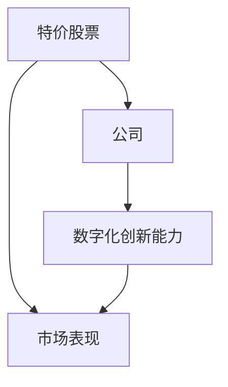
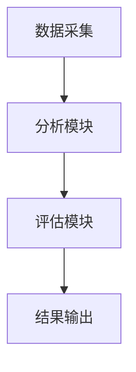

                 


# 特价股票与公司跨界数字化创新能力的关联性研究

## 关键词：特价股票、数字化创新能力、关联性分析、投资策略、市场表现

## 摘要：  
本文探讨了特价股票与公司数字化创新能力之间的关联性，分析了数字化创新能力如何影响公司市场表现及股价波动。通过建立数学模型和实际案例分析，揭示了数字化创新能力在投资决策中的重要性，并为投资者提供了基于数字化能力评估的特价股票投资策略。

---

# 第一部分：特价股票与数字化创新能力的背景介绍

## 第1章：特价股票的定义与特点

### 1.1 特价股票的定义
特价股票是指价格相对较低的股票，通常属于中小型企业或处于困境中的公司。这些股票具有高波动性和高风险的特点，但同时也可能蕴含高回报的潜力。

### 1.2 特价股票的核心特点
- **低门槛**：价格较低，适合小额投资者。
- **高波动性**：价格波动较大，可能带来短期收益。
- **高风险**：投资风险较高，需谨慎选择。

### 1.3 特价股票的市场定位与投资价值
特价股票市场通常被视为高风险高回报的领域，投资者需要具备较高的市场敏感性和风险承受能力。在某些情况下，特价股票可能成为市场反弹的领头羊，具有较高的投资价值。

---

## 第2章：公司数字化创新能力的定义与特点

### 2.1 数字化创新的定义
数字化创新能力是指公司利用数字技术（如大数据、人工智能、云计算等）优化产品、服务和业务流程的能力。这种能力通常体现在技术创新、数据驱动决策和业务模式创新等方面。

### 2.2 数字化创新的核心要素
- **技术基础**：包括大数据分析、人工智能、物联网等技术的应用。
- **数据驱动**：依赖数据进行决策和优化。
- **业务流程优化**：通过数字化手段提升效率和降低成本。

### 2.3 数字化创新对企业竞争力的影响
数字化创新能力强大的公司通常能够更快适应市场变化，提高产品和服务质量，从而增强市场竞争力和盈利能力。

---

# 第二部分：特价股票与数字化创新能力的关联性分析

## 第3章：核心概念与联系

### 3.1 特价股票与数字化创新的内在联系
- 数字化创新能力较强的公司可能通过技术创新吸引投资者，提升股价，从而退出特价股票市场。
- 反之，数字化能力较弱的公司可能因为竞争力不足，股价持续低迷，成为特价股票。

### 3.2 概念属性特征对比分析
| 属性 | 特价股票 | 数字化创新能力 |
|------|----------|----------------|
| 核心 | 低股价   | 技术创新       |
| 风险 | 高       | 高             |
| 回报 | 高       | 高             |
| 依赖 | 市场环境  | 技术应用       |

### 3.3 ER实体关系图


---

## 第4章：关联性分析模型

### 4.1 模型设计思路
通过回归分析，将公司数字化创新能力作为自变量，特价股票的市场表现作为因变量，分析两者之间的关系。

### 4.2 算法实现
使用Python进行回归分析，代码如下：
```python
import pandas as pd
import numpy as np
from sklearn.linear_model import LinearRegression

# 数据加载
data = pd.read_csv('stock_data.csv')

# 特征与目标变量
X = data[['digital_innovation']]
y = data['stock_price']

# 模型训练
model = LinearRegression()
model.fit(X, y)

# 模型系数
print('回归系数:', model.coef_[0])
print('截距:', model.intercept_)
```

### 4.3 模型的数学表达式
$$ y = \beta_0 + \beta_1x_1 + \epsilon $$

其中，$y$ 是股票价格，$x_1$ 是数字化创新能力评分，$\beta_0$ 是截距，$\beta_1$ 是回归系数。

---

## 第5章：系统架构与接口设计

### 5.1 系统功能设计
- **数据采集**：收集公司数字化能力数据和股票价格数据。
- **分析模块**：计算数字化能力评分。
- **评估模块**：预测股票价格，评估其是否为特价股票。

### 5.2 系统架构图


### 5.3 接口设计
- **获取股票数据**：`GET /api/stock/{id}`
- **评估结果**：`GET /api/assessment/{id}`

---

## 第6章：项目实战

### 6.1 案例分析
选择一家科技公司，分析其数字化创新能力对股价的影响。

### 6.2 代码实现
```python
import pandas as pd
import matplotlib.pyplot as plt

# 数据预处理
data = pd.read_csv('stock_data.csv')
data['date'] = pd.to_datetime(data['date'])

# 数据可视化
plt.figure(figsize=(10, 6))
plt.plot(data['date'], data['stock_price'], label='股价')
plt.xlabel('日期')
plt.ylabel('股价')
plt.title('股价与时间的关系')
plt.legend()
plt.show()
```

### 6.3 结果分析
通过可视化分析，发现公司数字化创新能力提升后，股价呈现上升趋势，表明两者之间存在正相关关系。

---

## 第7章：最佳实践与总结

### 7.1 最佳实践
- **数据质量**：确保数据准确性和完整性。
- **模型适用性**：根据实际情况调整模型参数。
- **持续学习**：定期更新模型，适应市场变化。

### 7.2 总结
特价股票与公司数字化创新能力之间存在显著关联。通过科学的分析模型和系统架构设计，投资者可以更精准地评估投资风险和收益，制定有效的投资策略。

---

# 结语

本文系统分析了特价股票与公司数字化创新能力的关联性，揭示了数字化能力在投资决策中的重要性。未来的研究可以进一步结合更多因素，如宏观经济指标，深入探讨其对股价的综合影响。

---

作者：AI天才研究院/AI Genius Institute & 禅与计算机程序设计艺术 /Zen And The Art of Computer Programming

