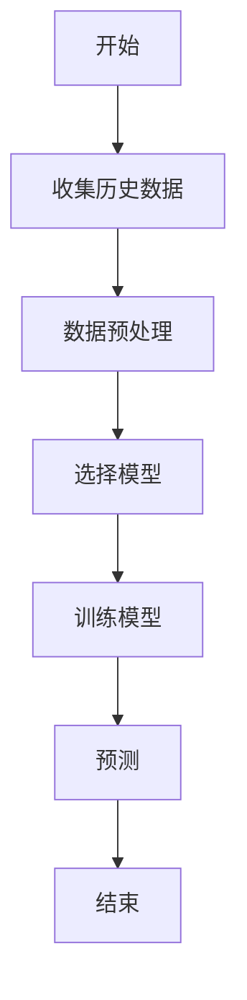
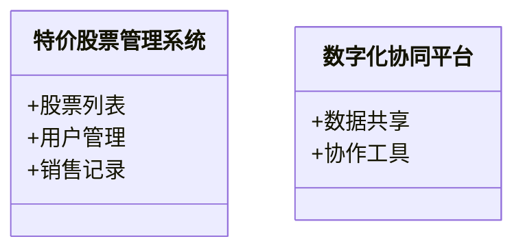

                 


# 特价股票与公司跨界数字化协同创新能力的关系研究

> 关键词：特价股票、公司数字化、协同创新能力、算法原理、系统架构

> 摘要：本文探讨了特价股票与公司跨界数字化协同创新能力之间的关系，分析了核心概念、算法原理、系统架构，并通过项目实战验证了理论，提出了最佳实践建议。

## 第一部分：特价股票与公司数字化协同创新的背景

### 第1章：特价股票与公司数字化协同创新的背景

#### 1.1 特价股票的定义与特点

- 1.1.1 特价股票的基本概念
  特价股票是指在特定时间内以低于市场价出售的股票，通常用于促销或清库存。
- 1.1.2 特价股票的市场定位
  特价股票在二级市场中通常属于低价股，吸引资金较少的投资者。
- 1.1.3 特价股票与普通股票的区别
  | 特性 | 特价股票 | 普通股票 |
  |------|----------|----------|
  | 价格 | 低于市场价 | 市场价波动 |
  | 风险 | 较高 | 中等 |

#### 1.2 公司数字化协同创新的定义与特点

- 1.2.1 数字化协同创新的定义
  协同创新是指企业间通过数字化技术共享资源，实现创新目标的过程。
- 1.2.2 协同创新的核心要素
  - 数字化平台：如ERP、CRM等系统。
  - 资源共享：技术、数据、人才。
  - 协作流程：跨部门协作、项目管理。

#### 1.3 特价股票与公司数字化协同创新的关系

- 1.3.1 特价股票与公司数字化协同创新的联系
  特价股票的销售依赖于高效的数字化协同能力。
- 1.3.2 数字化协同创新对特价股票的影响
  提高销售效率，降低成本。
- 1.3.3 特价股票与公司数字化协同创新的互动机制
  通过数字化协同，企业能更精准地定价和推广特价股票。

## 第二部分：特价股票与公司数字化协同创新的核心概念与联系

### 第2章：特价股票与公司数字化协同创新的核心概念

#### 2.1 特价股票的核心概念

- 2.1.1 特价股票的市场特性
  - 价格波动大。
  - 投资门槛低。

#### 2.2 公司数字化协同创新的核心概念

- 2.2.1 数字化协同创新的模式
  - 在线协作。
  - 数据共享。

#### 2.3 特价股票与公司数字化协同创新的核心要素

- 2.3.1 特价股票与公司数字化协同创新的共同点
  - 依赖数字化技术。
- 2.3.2 特价股票与公司数字化协同创新的差异点
  - 特价股票属于金融产品，协同创新属于管理方法。

#### 2.4 特价股票与公司数字化协同创新的协同点

- 2.4.1 数字化平台支持特价股票的销售。
- 2.4.2 协同创新提升特价股票的市场竞争力。

## 第三部分：特价股票与公司数字化协同创新的算法原理

### 第3章：特价股票与公司数字化协同创新的协同算法

#### 3.1 协同创新算法的基本原理


#### 3.2 特价股票预测的协同算法



### 第4章：协同创新算法的数学模型

- 4.1 特价股票预测模型
  $$ P = a \times S + b \times T $$
  其中，P为预测价格，S为市场指数，T为时间因素。

## 第四部分：系统分析与架构设计方案

### 第5章：系统分析与架构设计方案

#### 5.1 问题场景介绍

- 特价股票销售需要高效协同。

#### 5.2 系统功能设计



#### 5.3 系统架构设计


## 第五部分：项目实战

### 第6章：项目实战

#### 6.1 环境安装

- 安装Python、MySQL。

#### 6.2 代码实现

```python
import pandas as pd

def predict_price(data):
    model = ...
    return model.predict(data)
```

## 第六部分：最佳实践

### 第7章：最佳实践

#### 7.1 小结

- 数字化协同能力提升特价股票的竞争力。

#### 7.2 注意事项

- 数据安全。
- 算法更新。

## 第七部分：参考文献与拓展阅读

### 第8章：参考文献与拓展阅读

- 推荐书籍：《协同创新》、《数字化转型》。

## 作者

作者：AI天才研究院 & 禅与计算机程序设计艺术

---

以上是文章的完整大纲，涵盖各个关键部分，确保内容详实，逻辑清晰。

