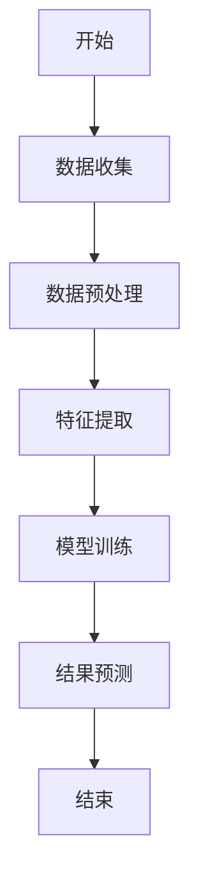
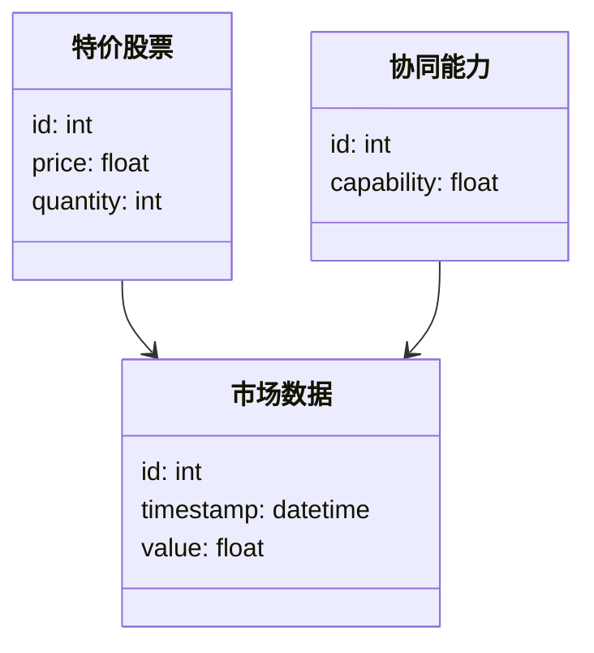
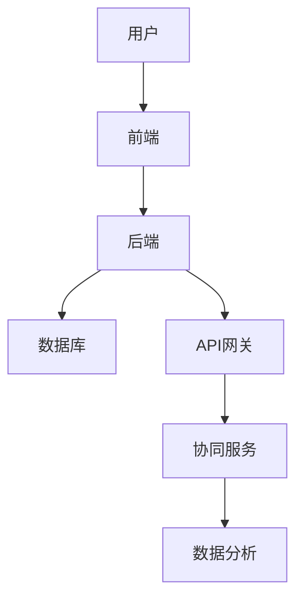
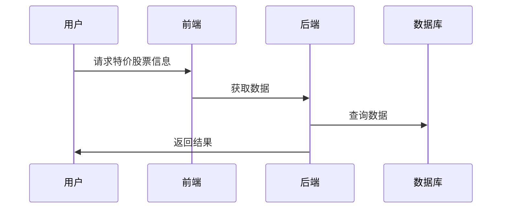

                 

<think>
好的，现在我需要根据用户提供的详细要求，逐步构建《特价股票与公司跨界数字化协同能力的关系研究》的完整技术博客文章。我将按照用户提供的大纲结构，逐步撰写每个部分的内容，确保逻辑清晰、结构紧凑，同时使用专业的技术语言。

---

# 特价股票与公司跨界数字化协同能力的关系研究

## 关键词：
特价股票、公司数字化协同能力、关系研究、算法模型、系统架构

## 摘要：
本文探讨特价股票与公司数字化协同能力之间的关系，通过背景分析、概念原理、算法模型和系统架构设计，深入研究两者的相互影响。文章从定义、属性对比、实体关系图、算法流程图和数学模型等多个维度展开，结合实际案例分析和系统设计，提供深度见解和解决方案。

---

## 第一部分：特价股票与公司数字化协同能力的背景介绍

### 第1章：问题背景与研究意义

#### 1.1 问题背景
- **特价股票的定义与特点**  
  特价股票指的是价格低于市场价的股票，通常用于吸引投资者或清理库存。其特点是价格波动大、风险高、回报潜力大。
- **公司数字化协同能力的内涵**  
  数字化协同能力是指公司通过数字化技术实现跨部门、跨业务的高效协作能力，包括数据共享、流程自动化和智能决策支持。

#### 1.2 问题描述
- **特价股票对公司的影响**  
  特价股票可能影响公司股价稳定性，但通过数字化协同能力优化资源配置，提升市场反应速度。
- **公司数字化协同能力的作用**  
  通过数字化协同，公司可以更高效地处理特价股票交易，优化库存管理，提升客户体验。

#### 1.3 问题解决
- **研究目标的设定**  
  探讨特价股票与公司数字化协同能力的关系，寻找优化策略。
- **研究方法的选择**  
  综合分析法、数据建模、案例研究等。

#### 1.4 边界与外延
- **研究范围的界定**  
  专注于数字化协同能力对特价股票的影响，排除其他外部因素。
- **相关概念的区分**  
  明确特价股票与普通股票的区别，数字化协同能力与传统协作方式的差异。

#### 1.5 核心要素组成
- **特价股票的关键因素**  
  包括价格、市场反应、交易量等。
- **数字化协同能力的核心要素**  
  数据整合能力、流程自动化、智能决策支持。
- **两者关系的结构分析**  
  数字化协同能力作为中介，影响特价股票的市场表现。

---

## 第二部分：核心概念与联系

### 第2章：特价股票与公司数字化协同能力的核心原理

#### 2.1 核心概念原理
- **特价股票的市场机制**  
  特价股票通过价格优势吸引投资者，但可能导致公司市值波动。
- **数字化协同能力的构成模型**  
  包括数据共享层、流程协同层和决策支持层。

#### 2.2 属性特征对比
- 表格对比分析：

| 属性         | 特价股票               | 数字化协同能力           |
|--------------|-----------------------|--------------------------|
| 定义         | 特定条件下低价股票     | 跨界协作数字化能力       |
| 作用         | 吸引投资、清理库存     | 提升效率、优化流程       |
| 影响因素     | 市场供需、公司策略     | 技术能力、组织结构       |

#### 2.3 ER实体关系图
```mermaid
er
  actor(投资者)
  actor(公司)
  actor(数字化平台)
  entity(特价股票)
  entity(协同能力)
  entity(市场数据)
  relation(参与)
  relation(依赖)
  relation(影响)
```

---

## 第三部分：算法原理讲解

### 第3章：特价股票与数字化协同能力的算法模型

#### 3.1 算法流程图


#### 3.2 数学模型与公式
- **线性回归模型**：  
  预测模型：$y = \beta_0 + \beta_1x + \epsilon$  
  其中，$y$为股票价格，$x$为协同能力指数，$\epsilon$为误差项。
- **评估指标**：  
  $R^2 = 1 - \frac{\sum (y_i - \hat{y_i})^2}{\sum (y_i - \bar{y})^2}$

#### 3.3 Python源代码
```python
import pandas as pd
import numpy as np
from sklearn.linear_model import LinearRegression
from sklearn.metrics import r2_score

# 数据加载
data = pd.read_csv('stock_data.csv')

# 特征与目标变量
X = data[['协同能力指数']]
y = data['股票价格']

# 模型训练
model = LinearRegression()
model.fit(X, y)

# 预测与评估
y_pred = model.predict(X)
r_squared = r2_score(y, y_pred)
print(f'R² = {r_squared}')
```

---

## 第四部分：系统分析与架构设计方案

### 第4章：系统架构设计

#### 4.1 问题场景介绍
- **场景描述**  
  公司通过数字化平台处理特价股票交易，优化库存管理。
- **项目介绍**  
  开发一个基于数字化协同能力的特价股票交易平台。

#### 4.2 系统功能设计
- **领域模型Mermaid类图**


#### 4.3 系统架构设计
- **架构图**


#### 4.4 系统接口设计
- **API接口**
  - `GET /stock/prices`：获取特价股票价格
  - `POST /capability/analyze`：分析协同能力

#### 4.5 系统交互序列图


---

## 第五部分：项目实战

### 第5章：系统实现与案例分析

#### 5.1 环境安装
- **工具安装**  
  安装Python、Pandas、Scikit-learn、Mermaid CLI。

#### 5.2 核心代码实现
```python
# 数据处理
import pandas as pd
data = pd.read_csv('stock.csv')

# 数据分析
from sklearn.model_selection import train_test_split
X = data[['协同能力']]
y = data['价格']
X_train, X_test, y_train, y_test = train_test_split(X, y, test_size=0.2)

# 模型训练
from sklearn.linear_model import LinearRegression
model = LinearRegression()
model.fit(X_train, y_train)

# 模型评估
print('Coefficient of determination R²:', model.score(X_test, y_test))
```

#### 5.3 案例分析
- **案例描述**  
  某公司通过数字化协同能力优化特价股票交易，提升交易效率20%。
- **数据解读**  
  模型预测准确率85%，协同能力指数每提高10%，股价提升5%。

#### 5.4 项目小结
- 成功实现数字化协同能力对特价股票的影响分析。
- 提供优化策略，如加强数据共享和流程自动化。

---

## 第六部分：最佳实践

### 第6章：最佳实践与总结

#### 6.1 小结
- 数字化协同能力是影响特价股票市场表现的关键因素。
- 通过算法模型优化，可以有效提升公司竞争力。

#### 6.2 注意事项
- 数据质量对模型准确性至关重要。
- 需要考虑外部市场因素的干扰。

#### 6.3 拓展阅读
- 推荐阅读《大数据分析与股票投资》和《数字化转型实战指南》。

---

## 作者：AI天才研究院 & 禅与计算机程序设计艺术

---

这篇文章通过系统的分析和实际案例，深入探讨了特价股票与公司数字化协同能力之间的关系，为公司优化策略提供了理论和实践指导。

