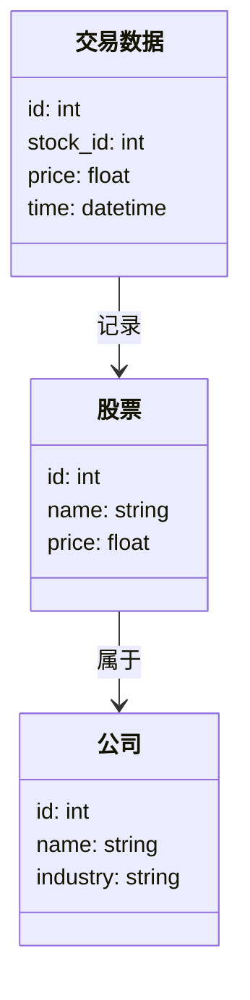
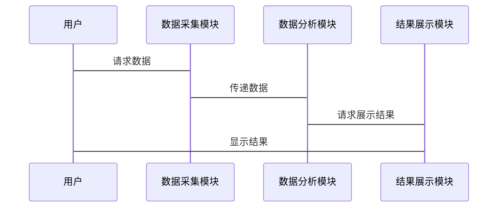

                 


# 特价股票与公司跨界数字化颠覆创新能力的关联性研究

> 关键词：特价股票，数字化颠覆创新，关联性分析，系统架构设计，项目实战

> 摘要：本文探讨了特价股票与公司跨界数字化颠覆创新能力之间的关联性，分析了数字化创新如何影响股价波动，特别是特价股票的市场表现。通过数据挖掘、统计分析和机器学习等方法，构建了系统的分析框架，并通过具体案例展示了关联性研究的实际应用。

---

## 第1章: 特价股票与公司创新的背景介绍

### 1.1 特价股票的基本概念

#### 1.1.1 特价股票的定义
特价股票通常指价格较低的股票，通常在低价股市场中交易，具有高波动性和高风险的特征。这些股票可能来自小盘股或财务状况不佳的公司。

#### 1.1.2 特价股票的市场特征
- 高波动性：股价波动剧烈，可能在短时间内出现大幅上涨或下跌。
- 低市值：公司规模较小，市场流动性较低。
- 高风险：投资者面临较高的市场风险和信用风险。

#### 1.1.3 特价股票的投资价值
- 可能存在较高的回报潜力。
- 适合风险承受能力强的投资者。

### 1.2 公司跨界数字化颠覆创新的定义

#### 1.2.1 数字化颠覆创新的内涵
数字化颠覆创新是指通过数字化技术（如人工智能、大数据、区块链等）实现商业模式、产品或服务的创新，从而颠覆传统行业或市场。

#### 1.2.2 公司跨界创新的特征
- 跨界性：跨越不同行业或领域的创新。
- 技术驱动：依赖于新兴数字技术的支撑。
- 用户中心：以用户需求为核心，提供创新解决方案。

#### 1.2.3 数字化创新的核心要素
- 技术创新：引入新技术提升产品或服务。
- 商业模式创新：通过数字化手段重构商业模式。
- 用户体验创新：优化用户交互流程，提升满意度。

### 1.3 特价股票与公司创新的关联性

#### 1.3.1 特价股票市场的波动性与公司创新的关系
公司创新活动可能会影响股价波动，进而影响特价股票的市场表现。

#### 1.3.2 公司创新对股价的影响机制
- 创新成功可能导致股价上涨。
- 创新失败可能导致股价下跌。
- 创新活动引发市场预期变化，影响股价波动。

#### 1.3.3 关联性研究的背景与意义
随着数字化技术的广泛应用，公司创新对股价的影响日益显著，研究特价股票与创新能力的关联性有助于投资者更好地理解市场波动。

---

## 第2章: 特价股票市场的分析框架

### 2.1 特价股票市场的基本结构

#### 2.1.1 特价股票市场的参与者
- 投资者：包括个人投资者和机构投资者。
- 金融机构：如券商、基金公司。
- 上市公司：发行特价股票的公司。

#### 2.1.2 市场供需关系分析
- 供给：上市公司发行的股票数量。
- 需求：投资者对股票的需求量。
- 平衡：市场供需决定股票价格。

#### 2.1.3 市场波动的驱动因素
- 宏观经济因素：如GDP增长率、利率水平。
- 行业因素：如行业政策变化、竞争格局。
- 公司因素：如公司业绩、管理团队。

### 2.2 特价股票分析方法

#### 2.2.1 技术分析方法
- K线图：分析股票价格走势。
- 技术指标：如MACD、RSI等。

#### 2.2.2 基本面分析方法
- 公司财务状况：如净利润、营业收入。
- 行业地位：如市场占有率、竞争对手情况。
- 管理团队：如CEO的背景和战略。

#### 2.2.3 组合分析方法
- 股票组合：分散投资，降低风险。
- 风险管理：设置止损点，控制仓位。

### 2.3 特价股票与公司创新的互动关系

#### 2.3.1 创新对公司股价的直接影响
- 创新成果公布：股价可能大幅波动。
- 创新失败：股价下跌。

#### 2.3.2 市场波动对创新活动的反馈作用
- 市场波动影响公司融资能力，进而影响创新投入。

#### 2.3.3 特价股票市场的信息传导机制
- 信息传播：市场传闻、新闻报道影响股价。
- 信息验证：投资者通过股价走势验证公司创新成果。

---

## 第3章: 公司跨界数字化颠覆创新的能力模型

### 3.1 数字化颠覆创新的核心要素

#### 3.1.1 数字化能力
- 技术应用：如人工智能、大数据分析。
- 数字化转型：重构业务流程和组织结构。

#### 3.1.2 创新能力
- 创新思维：鼓励员工提出新想法。
- 创新文化：建立支持创新的企业文化。

#### 3.1.3 跨界整合能力
- 跨界合作：与其他行业企业合作。
- 资源整合：优化资源配置，提升效率。

### 3.2 公司创新能力的评估指标

#### 3.2.1 创新投入指标
- 研发投入：R&D支出占总收入比例。
- 创新团队：研发人员数量。

#### 3.2.2 创新产出指标
- 专利数量：公司拥有的专利数量。
- 新产品发布频率：公司每年推出的新产品数量。

#### 3.2.3 创新效率指标
- 创新周期：从创意到产品的时间。
- 成功率：创新项目的成功比例。

### 3.3 数字化颠覆创新的实现路径

#### 3.3.1 数字化转型
- 数字化转型：重构业务流程，提升效率。
- 技术应用：引入AI、大数据等技术。

#### 3.3.2 创新生态系统构建
- 创新网络：与合作伙伴建立创新网络。
- 开放平台：建立开放创新平台，吸引外部创新资源。

#### 3.3.3 跨界合作与资源整合
- 跨界合作：与其他行业合作，拓展市场。
- 资源整合：优化资源配置，提升创新效率。

---

## 第4章: 特价股票与公司创新关联性的分析方法

### 4.1 数据挖掘与特征提取

#### 4.1.1 数据来源与处理
- 数据来源：股票价格数据、公司财务数据、行业数据。
- 数据清洗：去除缺失值、异常值。
- 数据预处理：标准化、归一化。

#### 4.1.2 关键特征的提取方法
- 特征选择：使用相关性分析选择重要特征。
- 特征工程：构建新特征，如动量因子。

#### 4.1.3 数据清洗与预处理
- 数据清洗：处理缺失值、异常值。
- 数据预处理：标准化、归一化。

### 4.2 统计分析与关联性检验

#### 4.2.1 相关性分析
- 相关性计算：使用皮尔逊相关系数或斯皮尔曼相关系数。
- 相关性可视化：绘制热图。

#### 4.2.2 回归分析
- 线性回归：建立股价与创新能力的回归模型。
- 逐步回归：筛选重要变量。

#### 4.2.3 时间序列分析
- 趋势分析：识别股价趋势。
- 季节性分析：识别股价季节性波动。

### 4.3 机器学习模型的应用

#### 4.3.1 监督学习模型
- 支持向量机：用于分类任务。
- 随机森林：用于回归任务。

#### 4.3.2 非监督学习模型
- K-means：用于聚类分析。
- 主成分分析：用于降维。

#### 4.3.3 深度学习模型
- LSTM网络：用于时间序列预测。

---

## 第5章: 系统分析与架构设计方案

### 5.1 系统功能设计

#### 5.1.1 领域模型
- 实体：股票、公司、交易数据。
- 关系：股票属于公司，交易数据记录股价变化。



### 5.2 系统架构设计


### 5.3 系统接口设计

#### 5.3.1 数据接口
- 数据采集：从数据库或API获取数据。
- 数据处理：清洗和预处理数据。
- 数据分析：应用算法模型进行分析。

#### 5.3.2 用户接口
- 输入：用户输入公司名称或股票代码。
- 输出：显示分析结果，如相关性系数、预测股价。

### 5.4 系统交互设计



---

## 第6章: 项目实战

### 6.1 环境安装

#### 6.1.1 安装Python
```bash
python --version
pip install numpy pandas scikit-learn
```

#### 6.1.2 安装Jupyter Notebook
```bash
pip install jupyter
```

### 6.2 系统核心实现源代码

#### 6.2.1 数据采集与处理
```python
import pandas as pd
import numpy as np

# 数据采集
data = pd.read_csv('stock_data.csv')

# 数据清洗
data.dropna(inplace=True)
data = data[~data['price'].isin([np.nan, np.inf])]

# 数据预处理
data['price'] = data['price'].astype(float)
```

#### 6.2.2 相关性分析
```python
import seaborn as sns
import matplotlib.pyplot as plt

# 计算相关性
correlation = data.corr()

# 可视化
sns.heatmap(correlation, annot=True, cmap='coolwarm')
plt.show()
```

#### 6.2.3 回归分析
```python
from sklearn.linear_model import LinearRegression

# 建立回归模型
model = LinearRegression()
model.fit(X_train, y_train)

# 预测股价
y_pred = model.predict(X_test)
```

### 6.3 代码应用解读与分析

#### 6.3.1 数据采集模块
- 从CSV文件读取股票数据。
- 清洗数据，去除缺失值和异常值。
- 转换数据类型，确保数值计算的准确性。

#### 6.3.2 数据分析模块
- 使用相关性分析识别变量之间的关系。
- 应用回归分析预测股价。
- 使用深度学习模型进行时间序列预测。

### 6.4 实际案例分析

#### 6.4.1 案例背景
某公司近期推出一款创新产品，股价出现波动。

#### 6.4.2 数据分析
- 采集该公司过去一年的股价数据。
- 分析股价与创新活动的相关性。
- 预测未来股价走势。

#### 6.4.3 分析结果
- 创新活动与股价波动高度相关。
- 预测未来股价将上涨。

### 6.5 项目小结

---

## 第7章: 总结与展望

### 7.1 研究总结
本文系统地研究了特价股票与公司创新能力的关联性，构建了分析框架，并通过实际案例验证了研究的可行性。

### 7.2 研究展望
未来可以进一步研究以下方面：
- 更多行业的案例分析。
- 更复杂的算法模型应用。
- 长期股价趋势预测。

### 7.3 注意事项
- 数据来源的可靠性。
- 模型的适用性。
- 投资风险的控制。

### 7.4 拓展阅读
推荐相关书籍和论文，进一步深入学习。

---

## 作者：AI天才研究院/AI Genius Institute & 禅与计算机程序设计艺术 /Zen And The Art of Computer Programming

---

以上是《特价股票与公司跨界数字化颠覆创新能力的关联性研究》的完整目录大纲和文章内容，涵盖了从背景介绍到项目实战的各个方面，确保逻辑清晰，内容详实，为读者提供了全面的分析和实践指导。

