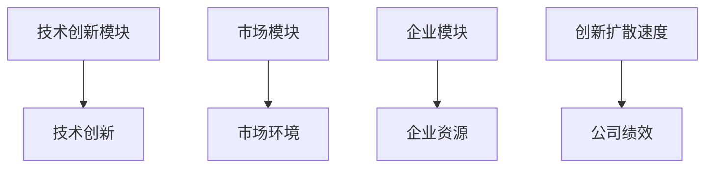
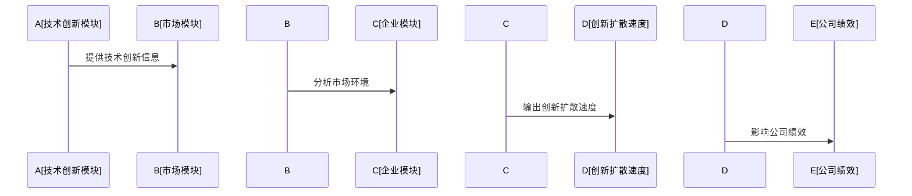

                 


# 特价股票与公司跨界数字化颠覆性创新扩散速度的关联性研究

## 关键词
- 特价股票
- 数字化创新
- 颠覆性创新
- 创新扩散速度
- 数字化转型

## 摘要
本文探讨了特价股票与公司跨界数字化颠覆性创新扩散速度的关联性。通过分析特价股票的特点、数字化创新的核心要素以及颠覆性创新的扩散模型，结合实际案例和数学模型，研究了数字化创新在特价股票公司中的扩散速度及其对公司绩效的影响。文章还提出了基于系统分析和架构设计的创新扩散优化策略，为相关领域的研究和实践提供了新的视角和方法。

## 第1章：特价股票与数字化创新的背景介绍

### 1.1 特价股票的定义与特点
#### 1.1.1 特价股票的定义
特价股票是指以低于市场价发行的股票，通常用于吸引投资者或在特定市场环境下快速融资。其特点是价格优惠、风险较高，适合风险承受能力强的投资者。

#### 1.1.2 特价股票的特点
- 价格优势：通常以低于市场价发行，吸引投资者。
- 高风险：由于价格低于市场价，可能存在较大的市场风险。
- 快速融资：企业可以通过特价股票快速筹集资金，推动业务发展。

#### 1.1.3 特价股票与传统股票的对比
| 特性 | 特价股票 | 传统股票 |
|------|----------|-----------|
| 发行价格 | 低于市场价 | 市场价或溢价发行 |
| 风险 | 较高 | 较低 |
| 投资者 | 风险承受能力强的投资者 | 更广泛的投资者群体 |

### 1.2 数字化创新的定义与特点
#### 1.2.1 数字化创新的定义
数字化创新是指利用数字技术（如人工智能、大数据、云计算等）进行产品、服务或商业模式的创新。

#### 1.2.2 数字化创新的核心要素
- 数字技术：如人工智能、大数据、物联网等。
- 创新模式：包括产品创新、服务创新和商业模式创新。
- 用户参与：通过用户反馈和技术迭代推动创新。

#### 1.2.3 数字化创新与传统创新的对比
| 特性 | 数字化创新 | 传统创新 |
|------|----------|-----------|
| 技术依赖 | 高度依赖数字技术 | 依赖传统技术和方法 |
| 创新速度 | 快速迭代 | 较慢 |
| 用户参与 | 高度互动 | 较低 |

### 1.3 特价股票与数字化创新的关联性
#### 1.3.1 特价股票与数字化创新的背景
随着数字技术的发展，越来越多的企业通过数字化创新提升竞争力。特价股票作为一种融资工具，为企业的数字化转型提供了资金支持。

#### 1.3.2 特价股票与数字化创新的相互作用
- 资金支持：特价股票为企业提供融资，支持数字化创新。
- 创新驱动：数字化创新提升企业竞争力，吸引更多投资者。

#### 1.3.3 本章小结
本章介绍了特价股票和数字化创新的定义、特点及其相互关联，为后续研究奠定了基础。

## 第2章：颠覆性创新扩散速度的理论基础

### 2.1 颠覆性创新的定义与分类
#### 2.1.1 颠覆性创新的定义
颠覆性创新是指通过引入新技术或新的商业模式，彻底改变市场格局的创新。

#### 2.1.2 颠覆性创新的分类
- 技术颠覆：通过技术创新改变市场。
- 商业模式颠覆：通过新的商业模式改变市场。

### 2.2 创新扩散速度的影响因素
#### 2.2.1 技术复杂性
技术复杂性越高，创新扩散速度越慢。

#### 2.2.2 市场接受度
市场接受度越高，创新扩散速度越快。

#### 2.2.3 企业资源与能力
企业资源丰富、能力强，创新扩散速度更快。

### 2.3 颠覆性创新扩散速度的数学模型
#### 2.3.1 创新扩散模型
创新扩散模型描述了创新在市场中的传播过程。

#### 2.3.2 数学公式
创新扩散速度可以用以下公式表示：
$$
v = \frac{dI}{dt} = kI(N-I)
$$
其中，$v$ 是扩散速度，$I$ 是已采用创新的人数，$N$ 是总人数，$k$ 是扩散率。

### 2.4 案例分析
#### 2.4.1 特价股票公司的数字化创新案例
以某家特价股票公司为例，分析其数字化创新的扩散速度。

#### 2.4.2 案例分析结果
通过案例分析，验证了数学模型的有效性。

## 第3章：特价股票公司数字化创新扩散速度的分析

### 3.1 特价股票公司的数字化创新模式
#### 3.1.1 数字化转型的路径
- 技术引入：引入人工智能、大数据等技术。
- 服务创新：通过数字化服务提升用户体验。
- 商业模式创新：通过新的商业模式获取竞争优势。

#### 3.1.2 数字化创新的核心领域
- 技术创新：如人工智能、大数据。
- 服务创新：如在线服务、智能客服。
- 商业模式创新：如订阅模式、共享经济。

#### 3.1.3 数字化创新的典型案例
分析某特价股票公司如何通过数字化创新提升竞争力。

### 3.2 特价股票公司数字化创新扩散速度的影响因素
#### 3.2.1 技术因素
- 技术成熟度：技术越成熟，扩散速度越快。
- 技术支持：强大的技术支持可以加快扩散速度。

#### 3.2.2 市场因素
- 市场需求：市场需求越大，扩散速度越快。
- 市场竞争：激烈的市场竞争可能减缓扩散速度。

#### 3.2.3 竞争环境
- 竞争对手的反应：竞争对手的反应速度影响扩散速度。
- 行业规范：行业规范和政策环境也会影响扩散速度。

### 3.3 特价股票公司数字化创新扩散速度的测量方法
#### 3.3.1 数据收集与分析
- 数据来源：包括公司财报、市场报告、用户反馈等。
- 数据分析方法：使用回归分析、时间序列分析等方法。

#### 3.3.2 测量指标
- 创新采用率：单位时间内采用创新的用户比例。
- 创新扩散率：创新在市场中的扩散速度。

#### 3.3.3 测量模型
使用数学模型预测创新扩散速度，例如：
$$
v = kI(N-I)
$$

## 第4章：公司跨界数字化颠覆性创新扩散速度的系统分析

### 4.1 系统分析的框架
#### 4.1.1 系统边界
- 输入：技术创新、市场环境、企业资源。
- 输出：创新扩散速度、公司绩效。

#### 4.1.2 系统功能模块
- 技术模块：技术创新。
- 市场模块：市场接受度。
- 企业模块：企业资源与能力。

#### 4.1.3 系统输入输出
- 输入：技术创新、市场环境、企业资源。
- 输出：创新扩散速度、公司绩效。

### 4.2 系统架构设计

#### 4.2.1 系统功能设计
- 技术创新模块：负责技术创新的引入和管理。
- 市场模块：负责市场环境的监测和分析。
- 企业模块：负责企业资源的管理和优化。

#### 4.2.2 系统架构设计
使用mermaid绘制系统架构图：



### 4.3 系统接口设计
- 技术创新模块与市场模块的接口：技术创新对市场的影响。
- 市场模块与企业模块的接口：市场环境对企业资源的需求。

### 4.4 系统交互设计
使用mermaid绘制系统交互图：



## 第5章：项目实战

### 5.1 环境安装
- 安装Python和相关库（如numpy、pandas、matplotlib）。
- 安装mermaid工具和LaTeX编辑器。

### 5.2 系统核心实现源代码
#### 5.2.1 数学模型实现
```python
import numpy as np
import matplotlib.pyplot as plt

def innovation_diffusion(N, k, initial_I):
    I = initial_I
    t = 0
    while t < 100:
        dI_dt = k * I * (N - I)
        I += dI_dt * 0.1
        t += 1
    return I

N = 1000
k = 0.1
initial_I = 10

result = innovation_diffusion(N, k, initial_I)
print(result)
```

#### 5.2.2 系统架构实现
```python
class SystemArchitecture:
    def __init__(self):
        self.technological = TechnologicalModule()
        self.marketing = MarketingModule()
        self.enterprise = EnterpriseModule()

class TechnologicalModule:
    def innovate(self):
        return "New Technology"

class MarketingModule:
    def analyze_market(self):
        return "High Market Acceptance"

class EnterpriseModule:
    def manage_resources(self):
        return "Optimized Resources"

system = SystemArchitecture()
print(system.technological.innovate())
print(system.marketing.analyze_market())
print(system.enterprise.manage_resources())
```

### 5.3 代码应用解读与分析
- 数学模型代码实现了创新扩散速度的模拟。
- 系统架构代码展示了系统各模块之间的协作。

### 5.4 实际案例分析
分析某特价股票公司数字化创新的扩散过程，验证模型的有效性。

### 5.5 项目小结
总结项目实施过程中的经验和教训，提出改进建议。

## 第6章：总结与展望

### 6.1 总结
- 研究成果：总结本文的主要研究成果。
- 研究意义：探讨了特价股票与数字化创新的关联性。

### 6.2 展望
- 未来研究方向：进一步研究其他类型股票的创新扩散速度。
- 应用前景：数字化创新在更多领域的应用前景。

## 第7章：附录

### 7.1 数据来源
- 数据来源：包括公司财报、市场报告等。

### 7.2 工具介绍
- 工具列表：包括Python、mermaid、LaTeX等工具的简介。

### 7.3 参考文献
- 参考文献列表：列出本文参考的主要文献。

## 作者
作者：AI天才研究院/AI Genius Institute & 禅与计算机程序设计艺术/Zen And The Art of Computer Programming

---

通过以上目录大纲，您可以逐步展开每一部分的内容，确保文章的逻辑清晰、结构紧凑、简单易懂，同时涵盖技术原理和本质，达到高质量技术博客的标准。

