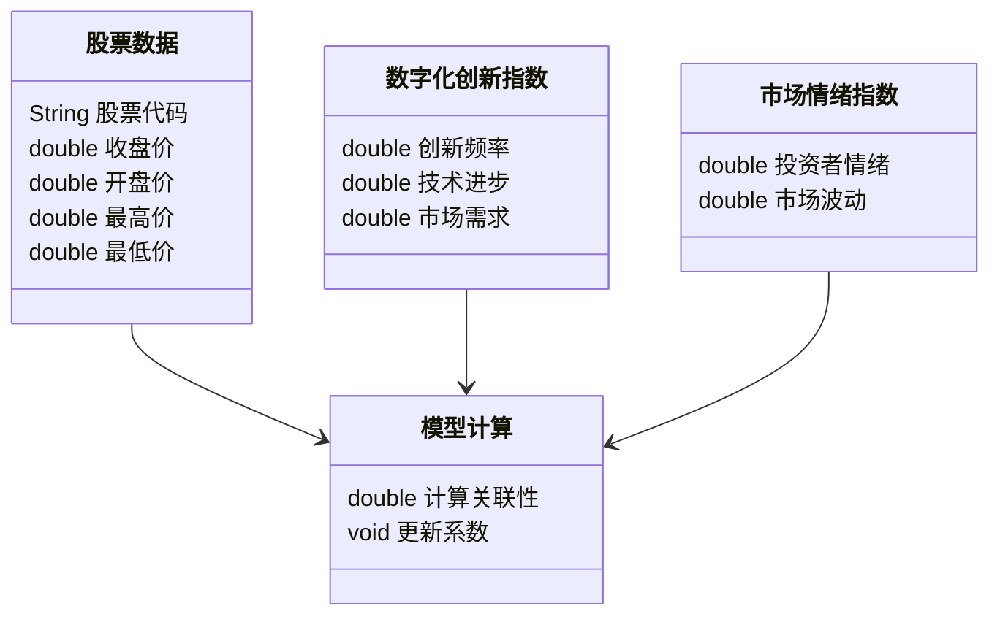
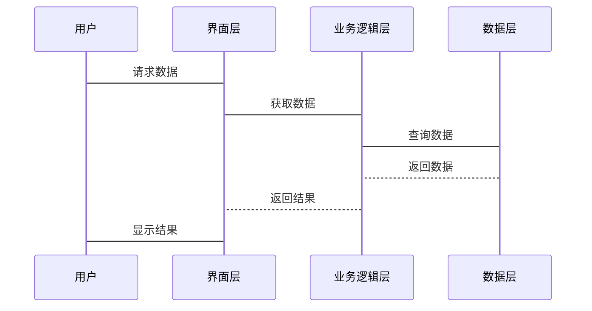

                 


# 特价股票与公司跨界数字化颠覆性创新频率的关联性研究

## 关键词：
- 特价股票
- 数字化转型
- 颠覆性创新
- 市场波动
- 技术分析

## 摘要：
本文深入探讨了特价股票与公司数字化转型之间的关联性，分析了数字化创新频率对股票市场的影响。通过数学建模和系统设计，提出了一个量化分析框架，帮助投资者更好地理解市场动态，捕捉投资机会。

---

# 第1章 特价股票与公司数字化转型概述

## 1.1 特价股票的基本概念

### 1.1.1 特价股票的定义与分类
特价股票是指在特定市场条件下，价格远低于正常水平的股票。通常分为周期性特价股票和事件驱动型特价股票。

### 1.1.2 特价股票的市场特征
包括高波动性、低估值和高风险。

### 1.1.3 特价股票与普通股票的区别
主要体现在价格波动、市场流动性等方面。

## 1.2 公司数字化转型的定义与特点

### 1.2.1 数字化转型的定义
指企业利用数字技术改造业务模式、流程和决策方式。

### 1.2.2 数字化转型的核心特征
包括数据驱动、智能化和平台化。

### 1.2.3 数字化转型与传统商业模式的区别
体现在技术应用、业务流程和客户体验等方面。

## 1.3 特价股票与公司数字化转型的关联性

### 1.3.1 特价股票的市场波动性
分析市场波动对股票价格的影响。

### 1.3.2 数字化转型对企业价值的影响
探讨数字化转型如何提升企业价值。

### 1.3.3 特价股票与公司数字化转型的潜在联系
研究数字化转型如何影响股票价格波动。

---

# 第2章 特价股票分析基础

## 2.1 特价股票的定价机制

### 2.1.1 市场供需关系
分析市场供需如何影响股票价格。

### 2.1.2 公司基本面分析
包括财务状况、盈利能力等。

### 2.1.3 技术分析与趋势预测
使用技术指标预测股票价格走势。

## 2.2 特价股票的市场行为分析

### 2.2.1 投资者行为模式
分析投资者行为对股价的影响。

### 2.2.2 市场情绪对股票价格的影响
探讨市场情绪如何影响股票价格。

### 2.2.3 市场波动与投资机会
寻找市场波动中的投资机会。

## 2.3 特价股票的风险与收益分析

### 2.3.1 投资风险的分类
包括市场风险、流动性风险等。

### 2.3.2 特价股票的收益来源
分析短期收益与长期收益的来源。

### 2.3.3 风险管理策略
提出有效的风险管理方法。

---

# 第3章 公司跨界数字化创新的特征

## 3.1 数字化创新的定义与分类

### 3.1.1 数字化创新的定义
指利用数字技术进行产品或服务创新。

### 3.1.2 数字化创新的类型
包括技术创新、模式创新和流程创新。

### 3.1.3 数字化创新的核心要素
涉及数据、技术、人才和组织文化。

## 3.2 公司数字化创新的驱动因素

### 3.2.1 技术进步
分析技术进步如何推动创新。

### 3.2.2 市场需求变化
探讨市场需求变化对企业创新的影响。

### 3.2.3 竞争压力
分析竞争压力如何驱动创新。

## 3.3 数字化创新对商业模式的影响

### 3.3.1 新型商业模式的形成
包括订阅制、共享经济等。

### 3.3.2 传统商业模式的转变
分析传统模式向数字化模式转型的过程。

### 3.3.3 数字化创新与企业竞争力
探讨创新如何提升企业竞争力。

---

# 第4章 颠覆性创新频率的分析

## 4.1 颠覆性创新的定义与特征

### 4.1.1 颠覆性创新的定义
指彻底改变行业规则的创新。

### 4.1.2 颠覆性创新的核心特征
包括破坏性、不可预测性和高风险。

### 4.1.3 颠覆性创新与渐进式创新的区别
分析两者的区别及其影响。

## 4.2 颠覆性创新的频率分析

### 4.2.1 颠覆性创新的周期性
探讨创新周期的规律。

### 4.2.2 颠覆性创新的触发因素
分析技术、市场和政策等因素的影响。

### 4.2.3 颠覆性创新的预测模型
提出预测模型和方法。

## 4.3 颠覆性创新频率与公司价值的关系

### 4.3.1 颠覆性创新对企业价值的影响
分析创新频率与企业价值的关系。

### 4.3.2 颠覆性创新对股价波动的影响
探讨创新频率如何影响股价波动。

### 4.3.3 颠覆性创新的市场反应
分析市场对颠覆性创新的反应机制。

---

# 第5章 特价股票与公司数字化创新频率的关联性模型

## 5.1 关联性模型的建立

### 5.1.1 模型构建思路
从市场数据和公司行为中提取相关变量。

### 5.1.2 模型假设
明确模型的假设条件。

### 5.1.3 模型框架
设计模型的输入、输出和处理流程。

## 5.2 数学模型与公式

### 5.2.1 关联性指标的定义
$$ S = \alpha \cdot D + \beta \cdot T + \gamma \cdot V $$

其中：
- $S$ 为股票价格
- $D$ 为数字化创新指数
- $T$ 为市场情绪指数
- $V$ 为公司价值指数
- $\alpha$, $\beta$, $\gamma$ 为系数

### 5.2.2 模型的验证与优化
通过历史数据验证模型的有效性，并进行参数调整。

## 5.3 关联性分析的案例

### 5.3.1 案例背景介绍
选择特定公司进行分析。

### 5.3.2 数据收集与处理
收集公司数字化创新数据和股价数据。

### 5.3.3 数据分析与结果解读
使用模型分析数据，得出结论。

---

# 第6章 系统分析与架构设计

## 6.1 系统功能设计

### 6.1.1 领域模型设计
使用类图展示系统各模块之间的关系。



### 6.1.2 系统架构设计
采用分层架构，包括数据层、业务逻辑层和用户界面层。

```mermaid
architecturalDiagram

    界面层 --> 业务逻辑层
    业务逻辑层 --> 数据层
    数据层 --> 第三方数据源
```

### 6.1.3 接口设计
定义接口规范，确保模块间的通信。

### 6.1.4 系统交互设计
使用序列图展示用户与系统之间的交互流程。



---

# 第7章 项目实战

## 7.1 环境安装与配置

### 7.1.1 安装Python
安装Python 3.8及以上版本。

### 7.1.2 安装依赖库
使用 pip 安装 numpy、pandas、scikit-learn 等库。

## 7.2 核心代码实现

### 7.2.1 数据预处理
```python
import pandas as pd

# 读取股票数据
stock_data = pd.read_csv('stock.csv')

# 读取数字化创新数据
innovation_data = pd.read_csv('innovation.csv')

# 合并数据
merged_data = pd.merge(stock_data, innovation_data, on='日期')
```

### 7.2.2 模型训练
```python
from sklearn.linear_model import LinearRegression

model = LinearRegression()
model.fit(merged_data[['创新频率', '市场情绪']], merged_data['股价'])
```

### 7.2.3 模型预测
```python
# 预测股价
predicted_price = model.predict(new_data[['创新频率', '市场情绪']])
```

## 7.3 实际案例分析

### 7.3.1 数据来源与处理
选择特定公司数据进行分析。

### 7.3.2 模型应用
使用模型预测股票价格走势。

### 7.3.3 结果解读
分析预测结果，总结经验教训。

## 7.4 项目小结
总结项目成果，提出改进建议。

---

# 第8章 最佳实践与总结

## 8.1 最佳实践

### 8.1.1 数据质量管理
确保数据的准确性和完整性。

### 8.1.2 模型优化
定期更新模型，提高预测准确性。

### 8.1.3 风险管理
制定有效的风险管理策略，降低投资风险。

## 8.2 小结

### 8.2.1 核心发现
总结研究的主要发现。

### 8.2.2 研究局限性
分析研究的不足之处。

### 8.2.3 未来研究方向
提出未来的研究方向和建议。

---

# 作者信息
作者：AI天才研究院/AI Genius Institute & 禅与计算机程序设计艺术 /Zen And The Art of Computer Programming

