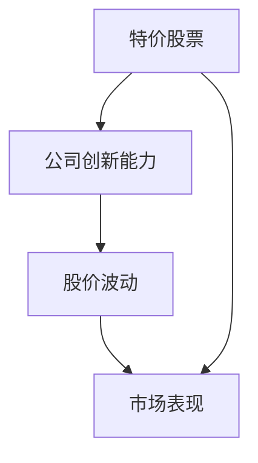
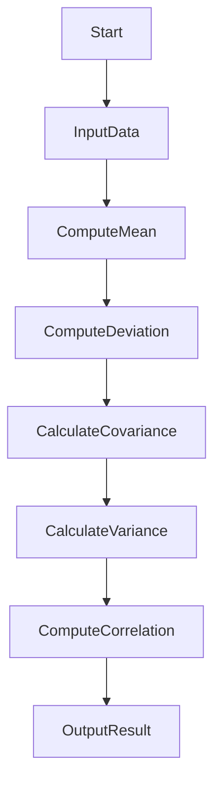
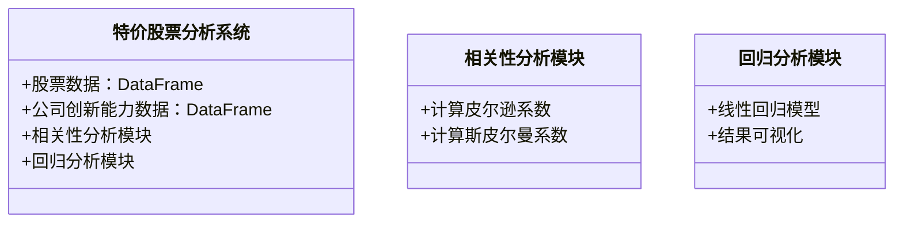
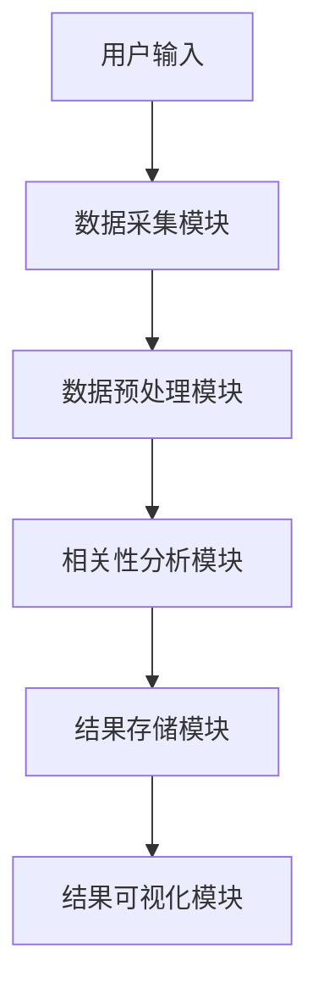

                 


# 特价股票与公司长期创新能力的相关性分析

---

## 关键词：
- 特价股票，公司创新能力，相关性分析，投资策略，数据分析

---

## 摘要：
本文通过分析特价股票与公司长期创新能力之间的相关性，探讨公司创新能力如何影响股票价格的波动性和长期表现。文章结合理论分析、算法实现和实证研究，揭示了公司创新能力在投资决策中的重要性，并为投资者提供基于数据的决策支持。

---

## 目录大纲：

### 第一章：背景介绍

#### 1.1 问题背景
- 1.1.1 特价股票的定义与特点
  - 特价股票的定义：价格低于行业平均水平的股票。
  - 特点：高波动性、低估值、高风险。
- 1.1.2 公司长期创新能力的定义与重要性
  - 创新能力：公司持续研发新产品、改进技术、优化管理的能力。
  - 重要性：创新能力是公司长期竞争力和股价增长的核心驱动因素。
- 1.1.3 研究特价股票与公司创新能力相关性的意义
  - 为投资者提供科学的决策依据。
  - 揭示市场中的潜在机会与风险。

#### 1.2 问题描述
- 1.2.1 特价股票市场的现状与挑战
  - 当前市场中特价股票的特点。
  - 投资者面临的挑战：信息不对称、短期波动大。
- 1.2.2 公司创新能力的评估指标
  - 研发投入占比。
  - 专利数量与质量。
  - 技术领先性。
- 1.2.3 当前市场中相关性研究的空白
  - 现有研究多关注短期波动，忽视长期创新能力的影响。

#### 1.3 问题解决
- 1.3.1 研究目标
  - 探讨公司创新能力与股票价格的相关性。
  - 分析创新能力如何影响股价的长期表现。
- 1.3.2 研究方法
  - 统计分析：相关性分析、回归分析。
  - 实证研究：基于真实数据的案例分析。

#### 1.4 边界与外延
- 1.4.1 研究范围
  - 限定于A股市场。
  - 研究对象为低价股票。
- 1.4.2 外延
  - 可扩展到其他市场。
  - 可应用于其他类型的股票分析。

#### 1.5 概念结构与核心要素组成
- 1.5.1 核心概念
  - 特价股票。
  - 公司创新能力。
  - 相关性分析。

---

### 第二章：核心概念与联系

#### 2.1 核心概念原理
- 2.1.1 特价股票的特性
  - 高波动性：股价波动剧烈，容易受市场情绪影响。
  - 低估值：市盈率、市净率等指标低于行业平均水平。
  - 高风险：存在退市风险或业绩下滑的可能性。
- 2.1.2 公司创新能力的构成
  - 研发投入：研发费用占比、研发投入强度。
  - 技术领先性：专利数量、技术获奖情况。
  - 创新产出：新产品推出频率、市场份额增长。

#### 2.2 特价股票与公司创新能力的属性特征对比
| 特性                | 特价股票               | 公司创新能力           |
|---------------------|-----------------------|-----------------------|
| 表现形式            | 股价波动、估值水平     | 专利数量、研发投入占比 |
| 时间跨度            | 短期波动、长期趋势     | 中期至长期影响        |
| 影响因素            | 市场情绪、宏观经济      | 技术进步、政策支持     |
| 数据特征            | 高波动性、非线性关系   | 数据稀疏性、复杂性     |

#### 2.3 实体关系分析


---

### 第三章：算法原理讲解

#### 3.1 相关性分析方法
- 3.1.1 皮尔逊相关系数
  - 公式：$$ r = \frac{\sum (x_i - \bar{x})(y_i - \bar{y})}{\sqrt{\sum (x_i - \bar{x})^2 \sum (y_i - \bar{y})^2}} $$
  - 说明：衡量两个变量之间的线性相关性。
- 3.1.2 斯皮尔曼相关系数
  - 适用于非线性关系的分析。

#### 3.2 算法流程


#### 3.3 代码实现
```python
import pandas as pd

def calculate_correlation(stock_prices, company创新能力):
    df = pd.DataFrame({
        'stock_prices': stock_prices,
        'company创新能力': company创新能力
    })
    correlation = df['stock_prices'].corr(df['company创新能力'])
    return correlation

# 示例数据
stock_prices = [10, 12, 8, 15, 13]
company_能力 = [0.8, 0.6, 0.7, 0.9, 0.5]
result = calculate_correlation(stock_prices, company_能力)
print(f"相关系数为：{result}")
```

---

### 第四章：数学模型和公式

#### 4.1 线性回归模型
- 模型公式：$$ y = \beta_0 + \beta_1 x + \epsilon $$
  - y：股票价格。
  - x：公司创新能力指数。
  - β0：截距。
  - β1：回归系数。

#### 4.2 相关系数计算
- 公式：$$ r = \frac{\sum (x_i - \bar{x})(y_i - \bar{y})}{\sqrt{\sum (x_i - \bar{x})^2 \sum (y_i - \bar{y})^2}} $$
  - 示例：计算两组数据的相关系数。

---

### 第五章：系统分析与架构设计

#### 5.1 系统功能设计


#### 5.2 系统架构设计


---

### 第六章：项目实战

#### 6.1 环境安装
- 安装Python和相关库：pandas、numpy、scipy、matplotlib。

#### 6.2 核心代码实现
```python
import numpy as np
import pandas as pd
from scipy.stats import pearsonr, spearmanr

# 示例数据
stock_prices = np.array([10, 12, 8, 15, 13])
companynovation = np.array([0.8, 0.6, 0.7, 0.9, 0.5])

# 计算皮尔逊相关系数
corr_pearson, _ = pearsonr(stock_prices, companynovation)
print(f"皮尔逊相关系数：{corr_pearson}")

# 计算斯皮尔曼相关系数
corr_spearman, _ = spearmanr(stock_prices, companynovation)
print(f"斯皮尔曼相关系数：{corr_spearman}")
```

---

### 第七章：最佳实践与小结

#### 7.1 最佳实践
- 数据来源：选择可靠的公开数据。
- 模型选择：根据数据特征选择合适的相关性分析方法。
- 结果验证：通过回测检验模型的有效性。

#### 7.2 小结
本文通过理论分析和实证研究，揭示了特价股票与公司创新能力之间的相关性，为投资者提供了科学的决策支持。

#### 7.3 注意事项
- 数据的代表性和时效性。
- 模型的局限性：相关性不等于因果关系。

#### 7.4 拓展阅读
- 其他相关性分析方法：距离相关性分析。
- 应用场景：多变量相关性分析。

---

## 作者：
作者：AI天才研究院 & 禅与计算机程序设计艺术  
作者简介：专注于人工智能与计算机科学领域，致力于通过技术与艺术的结合，推动创新与实践的完美融合。

