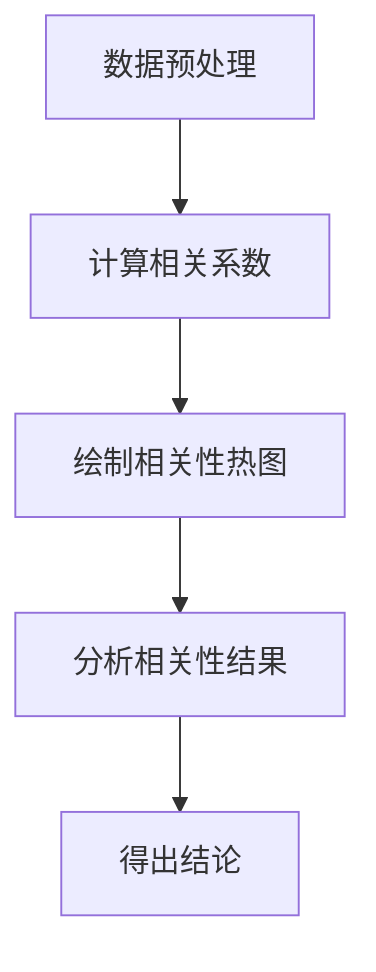

                 

# 特价股票与公司长期技术创新能力的相关性分析

## 关键词：特价股票，技术创新能力，相关性分析，统计模型，机器学习

## 摘要：  
本文通过分析特价股票与公司技术创新能力之间的相关性，探讨技术创新能力如何影响股票价格，以及如何利用相关性分析方法对技术创新能力强的公司进行投资决策。文章结合统计学方法和机器学习算法，构建相关性分析模型，并通过实证分析验证模型的有效性。本文还提出了技术创新能力对股票价格的长期驱动作用，并为投资者提供了基于技术创新能力的选股策略。

---

## 第一部分: 特价股票与技术创新能力的背景介绍

### 第1章: 特价股票的定义与特点

#### 1.1 特价股票的定义
- 特价股票是指价格低于市场平均水平的股票，通常具有较高的波动性和潜在的上涨空间。
- 特价股票通常存在于中小盘股或周期性行业中，具有较高的市场敏感性。

#### 1.2 特价股票的市场表现特征
- 特价股票的价格波动较大，容易受到市场情绪和宏观经济环境的影响。
- 特价股票的市场流动性较低，交易量通常小于大盘股。

#### 1.3 特价股票的投资价值分析
- 特价股票的低估值特性使其成为价值投资者的关注点。
- 特价股票的潜在收益较高，但同时也伴随着较高的投资风险。

### 第2章: 公司技术创新能力的定义与衡量

#### 2.1 技术创新能力的定义
- 技术创新能力是指公司在技术研发、产品创新和专利申请等方面的能力。
- 技术创新能力是衡量公司长期发展潜力的重要指标。

#### 2.2 技术创新的核心要素
| 核心要素 | 描述 |
|----------|------|
| R&D投入 | 研发投入的强度和比例 |
| 专利数量 | 公司拥有的发明专利数量 |
| 技术领先性 | 技术的行业领先程度 |
| 创新成果转化 | 技术创新对产品和市场的实际贡献 |

#### 2.3 技术创新能力的衡量指标
- 专利申请数量与授权数量
- 研发人员占比与研发投入占比
- 技术创新对主营业务收入的贡献率

### 第3章: 特价股票与技术创新能力的相关性背景

#### 3.1 问题背景与研究意义
- 特价股票的低价格与公司技术创新能力之间的关系尚未被充分研究。
- 技术创新能力是影响公司长期价值的核心因素，但其对股价的影响机制尚未明确。

#### 3.2 研究目标与研究范围
- 研究目标：分析技术创新能力对特价股票价格的影响。
- 研究范围：选取特定行业的中小盘股作为研究对象。

#### 3.3 研究方法与数据来源
- 数据来源：选取过去5年的股价数据和专利数据。
- 研究方法：使用相关性分析和回归分析。

---

## 第二部分: 相关性分析的核心概念与方法

### 第4章: 相关性分析的核心概念

#### 4.1 相关性分析的定义
- 相关性分析是研究两个变量之间关系强度的统计方法。
- 相关性分析可以通过相关系数量化变量之间的关系。

#### 4.2 相关性分析的类型
| 相关性类型 | 描述 |
|------------|------|
| 皮尔逊相关 | 线性相关关系 |
| 斯皮尔曼相关 | 非线性相关关系 |
| 偏相关 | 控制其他变量影响的相关关系 |

#### 4.3 相关性分析的数学模型
- 皮尔逊相关系数公式：
$$ r = \frac{\sum (x_i - \bar{x})(y_i - \bar{y})}{\sqrt{\sum (x_i - \bar{x})^2 \sum (y_i - \bar{y})^2}} $$

- 斯皮尔曼相关系数公式：
$$ \rho = \frac{\sum (R_i - \bar{R})(S_i - \bar{S})}{\sqrt{\sum (R_i - \bar{R})^2 \sum (S_i - \bar{S})^2}} $$

### 第5章: 特价股票与技术创新能力的关联性分析

#### 5.1 特价股票与技术创新能力的双向影响
- 技术创新能力影响股价：技术创新能力强的公司通常具有更高的股价溢价。
- 股价波动影响技术创新投入：股价波动可能影响公司的研发投入。

#### 5.2 技术创新对股票价值的驱动作用
- 技术创新是公司长期价值增长的核心驱动力。
- 技术创新能力强的公司通常具有较高的市场估值。

#### 5.3 特价股票市场的波动性与技术创新周期的关系
- 技术创新周期影响股价波动：技术创新周期的长短与股价波动密切相关。
- 特价股票市场的波动性反映了技术创新能力的不确定性。

---

## 第三部分: 相关性分析的数学模型与算法原理

### 第6章: 相关性分析的数学模型

#### 6.1 皮尔逊相关系数公式
$$ r = \frac{\sum (x_i - \bar{x})(y_i - \bar{y})}{\sqrt{\sum (x_i - \bar{x})^2 \sum (y_i - \bar{y})^2}} $$

- 说明：皮尔逊相关系数衡量的是两个变量之间的线性关系。

#### 6.2 斯皮尔曼相关系数公式
$$ \rho = \frac{\sum (R_i - \bar{R})(S_i - \bar{S})}{\sqrt{\sum (R_i - \bar{R})^2 \sum (S_i - \bar{S})^2}} $$

- 说明：斯皮尔曼相关系数衡量的是两个变量之间的秩相关关系。

### 第7章: 算法原理与流程图

#### 7.1 算法流程图

---

## 第四部分: 数据分析与实证研究

### 第8章: 数据分析与实证研究

#### 8.1 数据收集与处理
- 数据来源：选取某行业的中小盘股作为研究对象。
- 数据清洗：处理缺失值和异常值。
- 数据标准化：对股价数据和技术创新指标进行标准化处理。

#### 8.2 相关性分析结果
- 通过皮尔逊相关系数计算，得出技术创新能力与股价的相关性系数。
- 通过斯皮尔曼相关系数验证非线性关系。

#### 8.3 实证结果解读
- 技术创新能力与股价之间存在显著的正相关关系。
- 技术创新能力强的公司股价表现优于技术创新能力弱的公司。

---

## 第五部分: 投资策略与结论

### 第9章: 投资策略与结论

#### 9.1 投资策略
- 优先选择技术创新能力强的公司。
- 结合股价波动和技术创新周期进行投资决策。

#### 9.2 研究结论
- 技术创新能力是影响股价的重要因素。
- 投资者可以通过相关性分析筛选出具有长期投资价值的公司。

---

## 第六部分: 附录与参考文献

### 附录
- 数据处理代码
- 相关性分析的Python实现
- 相关性分析结果的可视化图表

### 参考文献
- 国内外相关研究文献
- 数据来源的官方报告

---

## 作者：AI天才研究院/AI Genius Institute & 禅与计算机程序设计艺术 /Zen And The Art of Computer Programming

