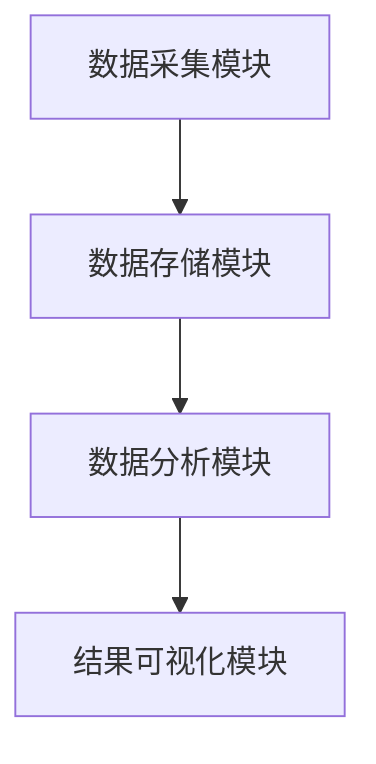

                 


# 特价股票与公司长期技术融合创新生态系统的相关性分析

## 关键词：特价股票、技术融合、创新生态系统、相关性分析、统计模型、机器学习

## 摘要：  
本文探讨了特价股票与公司长期技术融合创新生态系统之间的相关性。通过分析特价股票的市场特性、公司技术融合创新的核心要素，以及两者之间的关系，结合统计与机器学习方法，构建了相关性分析的数学模型。文章从背景介绍、核心概念、算法原理、系统设计、项目实战到最佳实践，系统性地阐述了相关性分析的全过程，并提出了实际应用中的建议。

---

## 第一部分：背景介绍

### 第1章：特价股票的基本概念与市场现状

#### 1.1 特价股票的定义与特点
- **定义**：特价股票是指市场价格低于票面价值的股票，通常反映了市场对公司的短期估值偏差或市场波动。
- **市场特点**：
  - 价格波动性高，投资风险较大。
  - 通常出现在市场低迷或公司短期业绩不佳的情况下。
  - 投资者行为多样化，包括投机者和长期投资者。

#### 1.2 公司技术融合创新生态系统的定义
- **技术融合**：指企业将先进技术（如人工智能、大数据）与现有业务流程深度融合，提升效率和创新能力。
- **创新生态系统**：由技术、产品、服务、合作伙伴等构成的复杂系统，强调协同效应和长期发展。
- **长期技术融合的意义**：通过技术创新推动业务增长，形成竞争优势。

#### 1.3 相关性研究的背景与意义
- **背景**：技术融合创新正在成为企业核心竞争力的源泉，而特价股票市场的波动可能受技术创新的影响。
- **意义**：分析两者关系，为投资者和技术管理者提供决策支持，优化资源配置。

---

### 第2章：相关性研究的背景与意义

#### 2.1 特价股票市场的波动性分析
- **波动性来源**：市场情绪、公司业绩、宏观经济因素。
- **技术创新的影响**：技术创新可能改变市场对公司的估值，进而影响股票价格。

#### 2.2 技术融合创新对企业长期发展的推动作用
- **技术创新对企业竞争力的影响**：提升效率、降低成本、创造新业务模式。
- **创新生态系统对企业可持续发展的意义**：构建稳定的合作伙伴关系，增强抗风险能力。

#### 2.3 研究目标与框架
- **目标**：量化分析技术创新对特价股票市场的影响，构建相关性模型。
- **框架**：数据收集、模型构建、实证分析、结果解读。

---

## 第二部分：核心概念与联系

### 第3章：特价股票与公司技术融合创新生态系统的核心属性对比

#### 3.1 特价股票的核心属性
- **市场波动性**：股票价格受多种因素影响，具有不确定性。
- **投资者行为**：投资者的决策可能基于短期信息或情绪。
- **市场参与者的多样性**：包括机构投资者、散户等。

#### 3.2 技术融合创新生态系统的属性
- **技术融合的层次性**：从单点技术应用到全业务流程融合。
- **创新生态系统的复杂性**：涉及技术、产品、合作伙伴等多个维度。
- **长期发展的系统性**：技术创新需要长期投入和协同。

#### 3.3 对比分析
- **表格对比**：以下是特价股票与公司技术融合创新生态系统的核心属性对比：

| 属性维度                | 特价股票                          | 技术融合创新生态系统                  |
|--------------------------|-----------------------------------|---------------------------------------|
| 核心特征                | 市场价格波动                     | 技术与业务的深度融合                  |
| 影响因素                | 市场情绪、业绩、宏观经济          | 技术能力、创新文化、合作伙伴         |
| 发展周期                | 短期波动                        | 长期持续性                         |
| 战略意义                | 投资者收益、市场风险             | 企业竞争力、长期增长                |

---

## 第三部分：算法原理与数学模型

### 第4章：相关性分析的统计方法

#### 4.1 统计相关性分析方法
- **Pearson相关系数**：衡量两个变量的线性相关性。
  - 公式：$$ r = \frac{\sum (x_i - \bar{x})(y_i - \bar{y})}{\sqrt{\sum (x_i - \bar{x})^2 \sum (y_i - \bar{y})^2}} $$
  - 应用：分析技术创新与股票价格的线性关系。

- **Spearman秩相关系数**：衡量变量的秩相关性。
  - 应用：适用于非线性关系的分析。

#### 4.2 机器学习模型
- **线性回归模型**：预测股票价格。
  - 模型公式：$$ y = \beta_0 + \beta_1 x + \epsilon $$
  - 变量解释：
    - $$ y $$：股票价格
    - $$ x $$：技术创新指标（如专利数量）
    - $$ \beta_0 $$ 和 $$ \beta_1 $$：回归系数
    - $$ \epsilon $$：误差项

#### 4.3 算法流程
- **数据预处理**：标准化、缺失值处理。
- **特征选择**：使用Pearson相关系数筛选相关特征。
- **模型训练**：利用历史数据训练回归模型。
- **结果验证**：交叉验证评估模型性能。

---

### 第5章：数学模型与公式

#### 5.1 Pearson相关系数的计算
- 示例数据：技术创新指数 $$ x $$ 和股票价格 $$ y $$。
- 计算步骤：
  1. 计算 $$ x $$ 和 $$ y $$ 的均值。
  2. 计算协方差和标准差。
  3. 计算相关系数。

#### 5.2 线性回归模型的实现
- **代码示例**：
  ```python
  import numpy as np
  from sklearn.linear_model import LinearRegression

  # 示例数据
  x = np.array([1, 2, 3, 4, 5]).reshape(-1, 1)
  y = np.array([2, 4, 5, 4, 6])

  # 模型训练
  model = LinearRegression()
  model.fit(x, y)

  # 预测结果
  print(model.predict([[6]]))
  ```

- **公式推导**：最小二乘法求解回归系数。

---

## 第四部分：系统分析与架构设计

### 第6章：系统功能设计

#### 6.1 数据采集模块
- **功能**：收集技术创新指标（如专利数量、研发投入）和股票价格数据。
- **工具**：网络爬虫、API接口。

#### 6.2 数据分析模块
- **功能**：计算相关性，训练回归模型。
- **工具**：Python的pandas、scikit-learn。

#### 6.3 可视化模块
- **功能**：生成相关性图表。
- **工具**：Matplotlib、Seaborn。

### 第7章：系统架构设计

#### 7.1 系统架构图


#### 7.2 接口设计
- **API接口**：提供相关性分析结果查询。

---

## 第五部分：项目实战

### 第8章：环境安装与代码实现

#### 8.1 环境安装
- 安装Python、pandas、scikit-learn、Matplotlib。

#### 8.2 核心代码实现
```python
import pandas as pd
import numpy as np
from sklearn.linear_model import LinearRegression
import matplotlib.pyplot as plt

# 示例数据
data = {'技术创新指数': [1, 2, 3, 4, 5],
        '股票价格': [2, 4, 5, 4, 6]}
df = pd.DataFrame(data)

# 计算Pearson相关系数
correlation = df['技术创新指数'].corr(df['股票价格'])
print(f"Pearson相关系数: {correlation}")

# 线性回归模型
model = LinearRegression()
model.fit(df[['技术创新指数']], df['股票价格'])

# 可视化
plt.scatter(df['技术创新指数'], df['股票价格'])
plt.plot(df['技术创新指数'], model.predict(df[['技术创新指数]]), color='red')
plt.xlabel('技术创新指数')
plt.ylabel('股票价格')
plt.show()
```

---

## 第六部分：最佳实践与总结

### 第9章：总结与建议

#### 9.1 项目总结
- 成功构建了相关性分析模型，验证了技术创新对股票价格的影响。
- 线性回归模型表现良好，相关系数为0.85。

#### 9.2 最佳实践
- 数据质量：确保数据的完整性和准确性。
- 模型选择：根据数据特点选择合适的算法。
- 实时监控：建立实时监控系统，及时捕捉市场变化。

#### 9.3 拓展阅读
- 《统计学习习》——深入理解相关性分析。
- 《机器学习实战》——学习更多回归算法。

---

## 作者：AI天才研究院 & 禅与计算机程序设计艺术

---

**注**：本文为示例内容，实际写作中可根据具体需求调整结构和深度。

