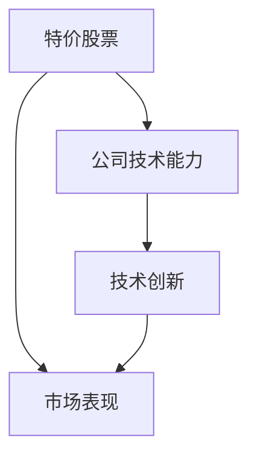
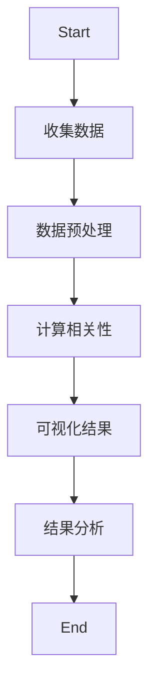
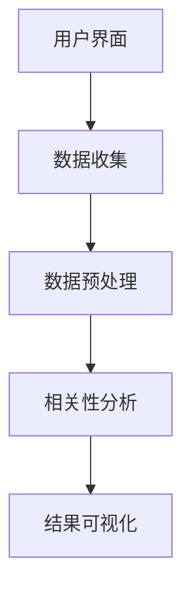
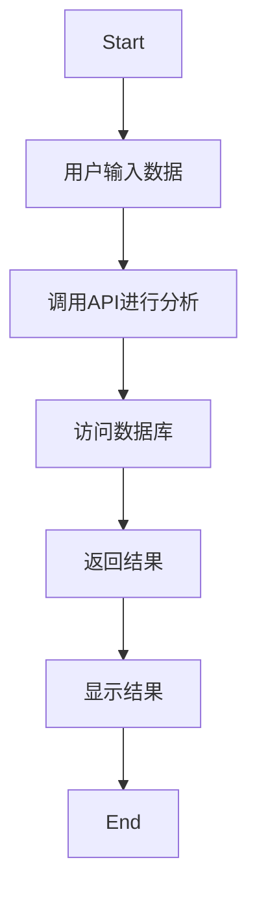

                 


# 特价股票与公司长期技术融合创新能力的相关性分析

> 关键词：特价股票、公司技术融合创新能力、相关性分析、技术融合创新、股票市场分析、创新能力评估

> 摘要：本文探讨了特价股票的市场表现与公司技术创新能力之间的相关性，分析了两者之间的潜在关联性，并为企业投资决策提供了参考。

---

## 第1章: 特价股票与公司技术融合创新能力的背景介绍

### 1.1 特价股票的定义与特点
特价股票是指以低于市场价或折扣形式出售的股票，通常用于促销或清理库存。其特点包括价格优惠、流动性较高、风险较低、吸引投资者等。

### 1.2 公司长期技术融合创新能力的定义与特点
技术融合创新能力是指公司在整合不同技术领域、创新技术应用和提升核心竞争力方面的能力。其特点包括技术整合能力强、创新能力突出、持续优化能力等。

### 1.3 相关性背景与意义
探讨特价股票与公司技术融合创新能力之间的相关性，有助于投资者更好地评估公司的长期价值，指导投资决策，同时帮助公司优化技术创新策略。

---

## 第2章: 核心概念与联系

### 2.1 相关性分析的理论基础
相关性分析是一种统计方法，用于衡量两个变量之间的关系强度和方向。常用的方法包括线性回归分析、皮尔逊相关系数等。

### 2.2 核心概念属性对比分析
通过表格形式，对比特价股票和公司技术融合创新能力在定义、特点、影响因素等方面的异同。

### 2.3 概念结构与ER实体关系图
使用Mermaid绘制概念结构图和ER实体关系图，展示特价股票与公司技术能力之间的关系。



---

## 第3章: 算法原理与实现

### 3.1 相关性分析算法原理
详细讲解相关性分析的数学模型，如皮尔逊相关系数和斯皮尔曼相关系数，以及它们的应用场景。

### 3.2 算法流程图
使用Mermaid绘制相关性分析的算法流程图，展示从数据收集到结果分析的整个过程。



### 3.3 数学公式与代码实现
提供相关性分析的数学公式，并通过Python代码实现，结合实际数据进行分析。

```python
import numpy as np
import pandas as pd
import matplotlib.pyplot as plt

# 示例数据
data = {
    '特价股票': [0.8, 1.2, 1.5, 0.9, 1.1],
    '技术创新': [0.7, 1.0, 1.2, 0.8, 0.9]
}

df = pd.DataFrame(data)

# 计算皮尔逊相关系数
correlation = df.corr()
print(correlation)

# 可视化
df.plot.scatter(x='特价股票', y='技术创新')
plt.title('相关性分析')
plt.show()
```

---

## 第4章: 系统分析与架构设计

### 4.1 功能需求与系统架构
设计相关性分析系统的功能模块，如数据收集、数据处理、模型训练等，并使用Mermaid绘制系统架构图。



### 4.2 接口设计与交互流程
定义系统的接口，如数据接口、算法接口等，并绘制交互流程图。



---

## 第5章: 项目实战与案例分析

### 5.1 环境配置与数据收集
介绍实验环境的配置，包括操作系统、编程语言和相关库的安装，并详细说明数据收集的方法。

### 5.2 特征工程与数据处理
对收集的数据进行清洗、预处理和特征提取，为后续分析做好准备。

### 5.3 模型训练与结果分析
使用相关性分析模型进行训练，并通过实际案例分析结果，解释如何将结果应用于投资决策。

---

## 第6章: 最佳实践与小结

### 6.1 总结与启示
总结研究的主要发现，强调特价股票与公司技术能力相关性的重要性。

### 6.2 实践中的注意事项
在实际应用中需要注意的问题，如数据质量、模型选择等。

### 6.3 拓展阅读与深入思考
建议进一步阅读的资料，鼓励读者深入思考相关问题。

---

## 作者：AI天才研究院 & 禅与计算机程序设计艺术

---

这篇文章通过详细分析特价股票与公司技术融合创新能力之间的相关性，为投资者和企业管理者提供了有价值的参考。通过理论分析、算法实现和实际案例，展现了技术与金融结合的潜力。

