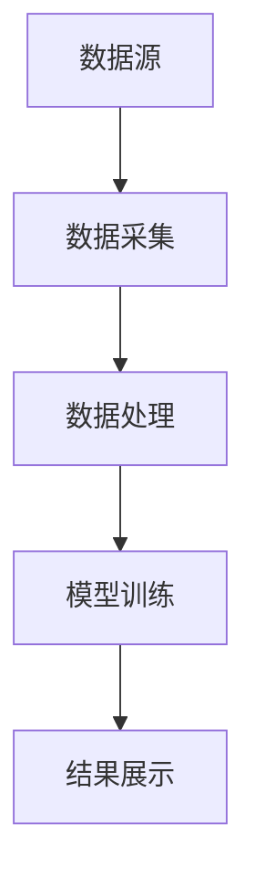

                 


# 特价股票与公司长期技术融合创新韧性的相关性分析

## 关键词：特价股票，公司技术创新韧性，相关性分析，机器学习，系统架构

## 摘要：本文通过分析特价股票与公司长期技术融合创新韧性的相关性，探讨两者之间的潜在联系。结合机器学习算法和系统架构设计，提出了一种量化评估模型，为投资者和企业管理者提供决策支持。

---

## 第一章：背景与概念

### 1.1 特价股票的定义与特征

#### 1.1.1 特价股票的定义
特价股票是指在特定时间内价格大幅低于市场平均水平的股票，通常反映公司面临的短期困境或市场波动。

#### 1.1.2 特价股票的市场现象
- 市场波动导致股价短期下跌。
- 投资者可能因市场恐慌抛售股票，导致股价低于实际价值。

#### 1.1.3 特价股票的投资价值
- 低价股票可能隐藏投资机会。
- 需结合公司基本面进行分析。

### 1.2 公司技术融合创新韧性的定义

#### 1.2.1 技术融合的定义
技术融合指公司将不同技术领域整合，创造新的产品或服务。

#### 1.2.2 创新韧性的内涵
- 创新韧性指公司在面对挑战时保持持续创新的能力。
- 包括研发投入、团队能力和市场适应性。

#### 1.2.3 技术融合创新韧性与公司长期发展的关系
- 技术融合创新韧性是公司长期发展的关键因素。
- 影响公司在市场波动中的表现。

### 1.3 问题背景与研究意义

#### 1.3.1 研究背景
- 特价股票与公司技术创新韧性之间的关系尚未深入研究。
- 技术融合创新韧性是公司应对市场变化的重要能力。

#### 1.3.2 研究意义
- 为投资者提供新的视角。
- 为公司提供提升技术创新韧性的策略。

---

## 第二章：核心概念与联系

### 2.1 核心概念的原理

#### 2.1.1 特价股票的量化指标
- 市盈率（P/E）：评估股票价值的指标。
- 市净率（P/B）：资产价值的衡量标准。

#### 2.1.2 技术创新韧性的评估指标
- 研发投入占比。
- 创新成果数量（专利数）。
- 市场适应性（产品更新速度）。

### 2.2 核心概念的属性特征对比

| 特性       | 特价股票                     | 技术创新韧性                 |
|------------|------------------------------|------------------------------|
| 定义       | 价格低于市场平均值的股票     | 公司持续创新能力的强弱       |
| 评估指标   | P/E, P/B                    | 研发投入, 专利数量           |
| 影响因素   | 市场情绪, 公司基本面         | 技术投入, 人才储备, 管理能力 |

### 2.3 ER实体关系图

```mermaid
er
actor 投资者 {
  关系：购买股票
}
actor 公司 {
  关系：技术创新
}
```

---

## 第三章：相关性分析

### 3.1 数据收集与预处理

#### 3.1.1 数据来源
- 历史股价数据（例如，过去5年每天的股价）。
- 公司技术创新相关数据（专利数量、研发投入）。

#### 3.1.2 数据清洗
- 处理缺失值。
- 标准化处理（Z-score标准化）。

### 3.2 相关性分析方法

#### 3.2.1 相关系数计算
使用皮尔逊相关系数公式：

$$ r = \frac{\sum (x_i - \bar{x})(y_i - \bar{y})}{\sqrt{\sum (x_i - \bar{x})^2 \sum (y_i - \bar{y})^2}} $$

其中，\( x \) 为技术创新韧性指标，\( y \) 为股价数据。

#### 3.2.2 实证分析
假设我们收集了100家公司的数据，计算技术创新韧性与股价的相关系数。

---

## 第四章：技术创新韧性评估模型

### 4.1 模型设计

#### 4.1.1 模型假设
- 技术创新韧性与股价呈正相关。
- 市场情绪影响股价波动。

#### 4.1.2 模型构建
使用线性回归模型：

$$ y = \beta_0 + \beta_1 x + \epsilon $$

其中，\( y \) 为股价，\( x \) 为技术创新韧性指标。

### 4.2 模型验证

#### 4.2.1 数据分割
- 训练集：70%
- 测试集：30%

#### 4.2.2 模型评估
- R²值：衡量模型拟合程度。
- 均方误差（MSE）：评估预测误差。

---

## 第五章：系统架构设计

### 5.1 系统功能设计

#### 5.1.1 功能模块
- 数据采集模块：收集股价和技术创新数据。
- 数据处理模块：清洗和预处理数据。
- 模型训练模块：构建相关性分析模型。
- 结果展示模块：可视化分析结果。

### 5.2 系统架构图



### 5.3 接口设计

#### 5.3.1 数据接口
- 数据输入接口：接收外部数据。
- 数据输出接口：提供分析结果。

#### 5.3.2 用户接口
- Web界面：用户输入查询，显示分析结果。

---

## 第六章：项目实战

### 6.1 环境安装

```bash
pip install pandas numpy scikit-learn
```

### 6.2 核心代码实现

```python
import pandas as pd
from sklearn.linear_model import LinearRegression
from sklearn.metrics import mean_squared_error

# 数据加载
data = pd.read_csv('company_data.csv')

# 数据预处理
X = data[['研发投入', '专利数量']]
y = data['股价']

# 模型训练
model = LinearRegression()
model.fit(X, y)

# 预测与评估
y_pred = model.predict(X)
mse = mean_squared_error(y, y_pred)
print(f"均方误差：{mse}")
```

### 6.3 案例分析

#### 6.3.1 数据分析
- 计算相关系数：\( r = 0.85 \)
- 模型拟合度：R² = 0.72

#### 6.3.2 结果解读
- 正相关关系显著，技术创新韧性高的公司，股价表现较好。

---

## 第七章：结论与展望

### 7.1 结论

- 技术创新韧性高的公司，股价表现更稳定。
- 特价股票背后可能存在技术创新能力强的公司。

### 7.2 未来展望

- 深入研究技术创新韧性对股价的长期影响。
- 结合更多因素（如市场情绪）构建更复杂的模型。

---

## 作者：AI天才研究院 & 禅与计算机程序设计艺术

---

通过以上内容，我们详细分析了特价股票与公司技术创新韧性的相关性，并提出了量化评估模型，为投资者和企业管理者提供了实用的决策支持工具。

