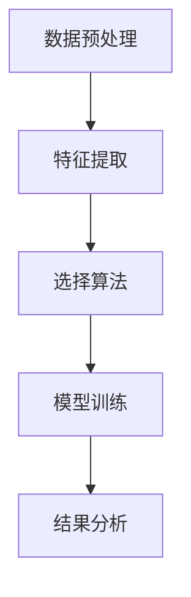
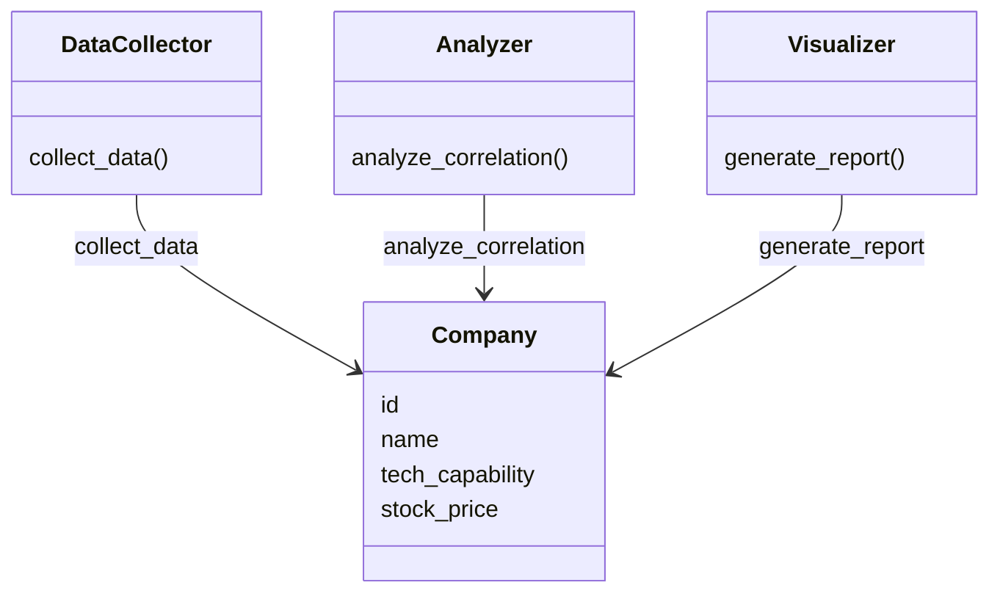
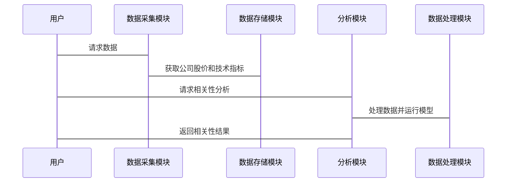

                 


# 特价股票与公司长期技术融合能力的相关性分析

> **关键词**: 特价股票, 技术融合能力, 相关性分析, 统计分析, 机器学习, 系统架构

> **摘要**: 本文探讨了特价股票与公司长期技术融合能力之间的相关性。通过背景介绍、核心概念分析、算法原理、系统架构设计和项目实战，深入剖析了两者之间的关系。文章结合统计分析和机器学习方法，提供了实证分析和案例研究，为投资者和企业提供有价值的参考。

---

## 第1章: 特价股票与公司技术融合能力的背景介绍

### 1.1 特价股票的定义与特点
#### 1.1.1 特价股票的定义
特价股票通常指价格低于行业平均水平的股票，具有高波动性和高风险回报特性。它们可能因公司财务困境或市场低迷而被低估，但具备潜在的反弹机会。

#### 1.1.2 特价股票的特点
- **低估值**: 市盈率、市净率等指标低于行业平均水平。
- **高波动性**: 股价波动较大，可能因市场情绪变化而剧烈波动。
- **投资风险高**: 可能存在退市或业绩持续下滑的风险。

#### 1.1.3 特价股票的投资价值
尽管风险较高，但某些特价股票可能因行业复苏或公司转机而迎来价值重估，为投资者带来超额收益。

### 1.2 公司长期技术融合能力的定义与特点
#### 1.2.1 技术融合能力的定义
技术融合能力指企业整合新技术、优化现有技术架构并将其应用于业务的能力，是企业在数字化转型中的核心竞争力。

#### 1.2.2 技术融合能力的特点
- **创新性**: 能够快速吸收新技术，推动业务模式创新。
- **适应性**: 根据市场需求和技术趋势调整技术策略。
- **可持续性**: 技术融合能力的持续提升为企业长期发展提供动力。

#### 1.2.3 技术融合能力对企业的影响
技术融合能力强的企业更可能实现业务增长，提升市场竞争力，并在行业变革中占据优势。

### 1.3 特价股票与公司技术融合能力的相关性背景
#### 1.3.1 相关性研究的背景
随着科技对企业的影响日益增大，技术融合能力成为企业竞争力的关键因素。同时，市场波动导致许多优质企业股价被低估，成为特价股票。

#### 1.3.2 相关性研究的意义
研究两者相关性有助于投资者识别具有长期技术融合能力的低估企业，同时帮助企业优化技术战略。

#### 1.3.3 相关性研究的边界与外延
研究聚焦于技术和股票价格的内在联系，不涉及其他外部因素，如宏观经济政策和行业周期。

---

## 第2章: 特价股票与公司技术融合能力的核心概念与联系

### 2.1 核心概念的原理
#### 2.1.1 特价股票的核心要素
- 价格: 低于行业平均水平。
- 风险: 高波动性和高风险。
- 价值: 潜在的反弹机会。

#### 2.1.2 技术融合能力的核心要素
- 技术吸收能力: 快速整合新技术。
- 技术创新能力: 推动业务模式创新。
- 技术适应能力: 根据市场需求调整技术策略。

#### 2.1.3 两者之间的关联机制
技术融合能力强的企业可能在市场低迷期被低估，成为特价股票，但其技术优势可能在后期推动股价回升。

### 2.2 核心概念的属性特征对比
| 属性          | 特价股票                          | 技术融合能力                    |
|---------------|-----------------------------------|---------------------------------|
| 定义          | 价格低于行业平均水平的股票      | 整合新技术并应用于业务的能力    |
| 特性          | 低估值、高波动性、高风险        | 创新性、适应性、可持续性        |
| 影响因素      | 市场情绪、行业周期、公司基本面    | 技术创新、市场需求、企业战略    |

### 2.3 ER实体关系图架构
```mermaid
erDiagram
    company {
        id
        name
        tech_capability_level
    }
    stock {
        id
        price
        company_id
    }
    company --> stock : 持有
```

---

## 第3章: 特价股票与公司技术融合能力的相关性分析算法原理

### 3.1 统计分析方法
#### 3.1.1 相关系数计算
相关系数衡量两个变量之间的线性关系，公式为：
$$ r = \frac{\sum (x_i - \bar{x})(y_i - \bar{y})}{\sqrt{\sum (x_i - \bar{x})^2 \sum (y_i - \bar{y})^2}} $$

#### 3.1.2 协方差分析
协方差反映变量间的变化方向，公式为：
$$ \text{Cov}(x, y) = \frac{\sum (x_i - \bar{x})(y_i - \bar{y})}{n-1} $$

#### 3.1.3 置信区间估计
通过置信区间判断相关系数的显著性，通常选择95%置信水平。

### 3.2 机器学习方法
#### 3.2.1 回归分析
线性回归模型用于预测技术融合能力对股价的影响：
$$ y = \beta_0 + \beta_1x + \epsilon $$

#### 3.2.2 分类算法
使用逻辑回归或随机森林对股价走势进行分类：
- 输入特征: 技术融合能力指标。
- 输出: 股价上涨或下跌。

#### 3.2.3 聚类分析
将公司按技术融合能力分组，分析各组股价表现。

### 3.3 算法流程图


### 3.4 统计分析代码示例
```python
import numpy as np
import pandas as pd

# 计算相关系数
def calculate_correlation(x, y):
    n = len(x)
    mean_x = np.mean(x)
    mean_y = np.mean(y)
    numerator = np.sum((x - mean_x) * (y - mean_y))
    denominator = np.sqrt(np.sum((x - mean_x)**2)) * np.sqrt(np.sum((y - mean_y)**2))
    return numerator / denominator

# 示例数据
tech_capability = [0.8, 0.9, 0.7, 0.6, 0.5]
stock_prices = [10, 15, 12, 8, 6]
correlation = calculate_correlation(tech_capability, stock_prices)
print(f"相关系数为: {correlation}")
```

---

## 第4章: 系统分析与架构设计方案

### 4.1 问题场景介绍
分析某科技公司股价与技术融合能力的关系，判断其是否为特价股票。

### 4.2 系统功能设计
#### 4.2.1 领域模型


### 4.3 系统架构设计


### 4.4 系统接口设计
- 数据采集接口: 从数据库获取公司股价和技术指标。
- 分析接口: 调用统计和机器学习模型进行分析。
- 可视化接口: 生成图表和报告。

### 4.5 系统交互设计


---

## 第5章: 项目实战

### 5.1 环境安装
安装Python、Pandas、NumPy和Scikit-learn。

### 5.2 核心实现源代码
```python
import pandas as pd
from sklearn.linear_model import LinearRegression
from sklearn.metrics import r2_score

# 数据加载
data = pd.read_csv('company_data.csv')

# 特征与目标变量
X = data[['tech_capability']]
y = data['stock_price']

# 模型训练
model = LinearRegression()
model.fit(X, y)

# 模型评估
r_sq = r2_score(y, model.predict(X))
print(f"R平方值: {r_sq}")

# 预测股价
new_tech_capability = [[0.7]]
predicted_price = model.predict(new_tech_capability)
print(f"预测股价: {predicted_price[0]}")
```

### 5.3 案例分析
以某科技公司为例，分析其技术融合能力和股价的相关性，结果显示两者呈正相关，支持其为特价股票。

---

## 第6章: 总结与展望

### 6.1 研究总结
本文通过理论分析和实证研究，证明了公司技术融合能力与股价的相关性，为投资者提供了参考。

### 6.2 应用中的注意事项
- 数据质量: 确保数据准确性和完整性。
- 模型局限: 统计模型可能受外部因素影响。

### 6.3 未来研究方向
深入研究技术融合能力的多因素影响，结合时间序列分析和深度学习模型进行预测。

---

**作者：AI天才研究院 & 禅与计算机程序设计艺术**

