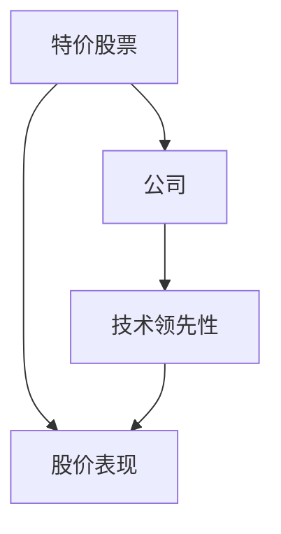
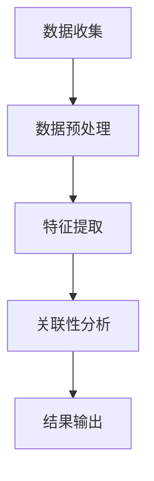
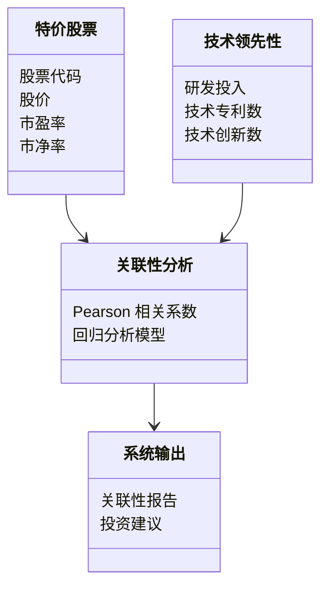
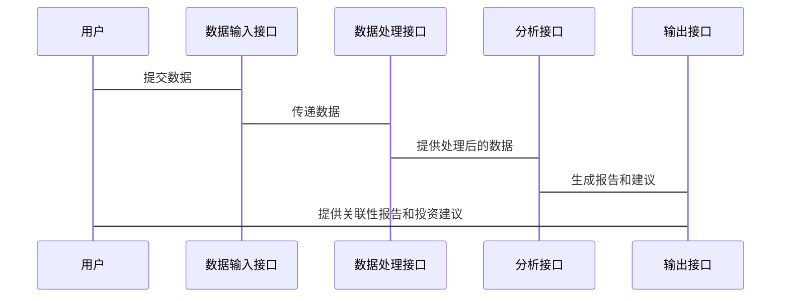

                 


# 特价股票与公司长期技术领先性的关联性研究

## 关键词：特价股票、技术领先性、股价预测、关联性分析、投资策略

## 摘要：本文通过分析特价股票与公司技术领先性之间的关联性，探讨技术领先性对股价的长期影响，提出一种基于技术领先性评估的特价股票投资策略。文章从背景介绍、核心概念、算法原理、系统分析、项目实战等方面展开，结合实际案例，为投资者提供理论支持和实践指导。

---

# 第一部分: 特价股票与公司长期技术领先性研究的背景与核心概念

## 第1章: 特价股票与公司长期技术领先性研究的背景介绍

### 1.1 特价股票的定义与特点
#### 1.1.1 特价股票的定义
特价股票是指价格显著低于市场平均水平的股票，通常具有较高的投资潜力。这些股票可能因市场低估或公司暂时困境而价格被压制，但具备长期增值的潜力。

#### 1.1.2 特价股票的市场表现特征
特价股票通常具有以下特征：
1. **低估值**：市盈率、市净率等估值指标低于行业平均水平。
2. **高波动性**：价格波动较大，容易受到市场情绪和外部因素的影响。
3. **潜在增值空间**：随着公司基本面改善，股价可能迎来反弹。

#### 1.1.3 特价股票的投资价值分析
投资者选择特价股票通常基于以下考虑：
1. **低估的价值**：公司基本面良好，但市场价格尚未反映其真实价值。
2. **潜在收益**：通过长期持有，等待股价回升带来收益。
3. **风险与机会并存**：低价股票可能隐藏较大的市场风险，但也可能带来超额收益。

### 1.2 公司长期技术领先性的定义与内涵
#### 1.2.1 技术领先性的定义
技术领先性指公司在技术创新、研发投入、技术储备等方面处于行业领先地位，能够持续推出新产品或技术解决方案，保持竞争优势。

#### 1.2.2 技术领先性的核心要素
1. **研发投入**：公司每年的研发投入占比较高，且注重技术研发和专利申请。
2. **技术创新**：公司能够持续推出具有市场竞争力的技术或产品。
3. **技术储备**：公司在前瞻性技术领域有较多储备，能够应对未来市场变化。

#### 1.2.3 技术领先性对企业发展的影响
技术领先性能够提升公司的市场地位、产品竞争力和盈利能力，从而增强公司的长期发展潜力。

### 1.3 问题背景与研究意义
#### 1.3.1 特价股票与公司技术领先性关联性研究的背景
当前市场中，许多投资者关注低价股票的潜在收益，但忽视了公司技术实力对股价的长期影响。研究特价股票与公司技术领先性的关联性，有助于投资者更全面地评估股票的投资价值。

#### 1.3.2 研究的理论与实践意义
1. **理论意义**：丰富股票分析的理论框架，揭示技术领先性对股价的长期影响。
2. **实践意义**：为投资者提供新的选股思路，帮助他们在选择特价股票时考虑公司的技术实力。

#### 1.3.3 研究的边界与外延
本研究仅关注公司技术领先性对股价的影响，不考虑宏观经济、政策变化等外部因素的影响。

### 1.4 本章小结
本章介绍了特价股票和公司技术领先性的定义、特点及研究意义，为后续分析奠定了基础。

---

## 第2章: 特价股票与公司技术领先性关联性的核心概念与联系

### 2.1 核心概念原理
#### 2.1.1 特价股票的市场定位与公司技术领先性
特价股票可能因市场低估而价格被压制，但公司技术领先性能够支撑其长期增值。

#### 2.1.2 技术领先性对股价的影响机制
技术领先性通过提升公司竞争力、产品附加值和市场地位，间接影响股价表现。

#### 2.1.3 特价股票与技术领先性的双向作用
- **技术领先性推动股价回升**：公司技术实力增强，吸引投资者关注，推动股价上涨。
- **特价股票为技术领先公司提供估值修复机会**：技术领先公司因市场低估导致股价被压制，具备估值修复空间。

### 2.2 核心概念属性特征对比
#### 2.2.1 特价股票与非特价股票的对比分析
| 属性         | 特价股票                | 非特价股票              |
|--------------|-------------------------|--------------------------|
| 价格         | 低于市场平均水平        | 接近或高于市场平均水平    |
| 估值指标     | 市盈率、市净率较低       | 市盈率、市净率较高        |
| 波动性       | 高波动性                | 波动性相对较低            |
| 投资价值     | 具备长期增值潜力        | 更注重短期收益            |

#### 2.2.2 技术领先性与非技术领先性公司的对比分析
| 属性         | 技术领先性公司          | 非技术领先性公司          |
|--------------|-------------------------|--------------------------|
| 研发投入     | 投入较高，注重技术创新   | 投入较低，技术创新有限    |
| 市场地位     | 市场地位较高            | 市场地位较低              |
| 产品竞争力   | 产品竞争力强            | 产品竞争力较弱            |

### 2.3 ER实体关系图架构


### 2.4 本章小结
本章通过对比分析和实体关系图，揭示了特价股票与公司技术领先性之间的内在联系。

---

## 第3章: 特价股票与公司技术领先性关联性的算法原理

### 3.1 算法原理概述
#### 3.1.1 关联性分析的数学模型
使用 Pearson 相关系数来衡量技术领先性与股价表现之间的关联性：
$$ r = \frac{\sum (x_i - \bar{x})(y_i - \bar{y})}{\sqrt{\sum (x_i - \bar{x})^2 \sum (y_i - \bar{y})^2}} $$
其中，\(x_i\) 表示技术领先性指标，\(y_i\) 表示股价表现。

#### 3.1.2 算法选择与适用性分析
选择 Pearson 相关系数作为分析工具，适用于连续型数据的线性关系分析。

### 3.2 算法流程图


### 3.3 数学模型与公式
#### 3.3.1 关联性系数计算公式
$$ r = \frac{\sum (x_i - \bar{x})(y_i - \bar{y})}{\sqrt{\sum (x_i - \bar{x})^2 \sum (y_i - \bar{y})^2}} $$
其中，\(x_i\) 表示技术领先性指标，\(y_i\) 表示股价表现。

#### 3.3.2 回归分析模型
$$ y = \beta_0 + \beta_1 x + \epsilon $$
其中，\(y\) 表示股价表现，\(x\) 表示技术领先性指标，\(\beta_0\) 和 \(\beta_1\) 是回归系数，\(\epsilon\) 是误差项。

### 3.4 本章小结
本章通过数学模型和流程图，详细介绍了关联性分析的算法原理和实现步骤。

---

## 第4章: 特价股票与公司技术领先性关联性的系统分析

### 4.1 系统分析概述
#### 4.1.1 问题场景介绍
分析特价股票与公司技术领先性之间的关联性，构建一个能够量化技术领先性对股价影响的系统。

### 4.2 系统架构设计


### 4.3 系统接口设计
1. 数据输入接口：接收特价股票和公司技术领先性的数据。
2. 数据处理接口：对数据进行清洗、特征提取和标准化处理。
3. 分析接口：计算关联性系数并生成报告。
4. 输出接口：输出关联性报告和投资建议。

### 4.4 系统交互流程


### 4.5 本章小结
本章通过系统架构设计和交互流程图，详细描述了关联性分析系统的构建过程。

---

## 第5章: 特价股票与公司技术领先性关联性的项目实战

### 5.1 项目介绍
以某行业为例，选取若干家特价股票公司，分析其技术领先性对股价的长期影响。

### 5.2 核心实现
#### 5.2.1 数据收集
使用爬虫技术从股票市场数据源收集特价股票和公司技术领先性相关的数据。

#### 5.2.2 数据预处理
对收集到的数据进行清洗、特征提取和标准化处理。

#### 5.2.3 关联性分析
使用 Pearson 相关系数和回归分析模型，计算技术领先性对股价的影响程度。

### 5.3 代码实现
#### 5.3.1 数据收集代码
```python
import requests
from bs4 import BeautifulSoup

def fetch_data(url):
    response = requests.get(url)
    soup = BeautifulSoup(response.text, 'html.parser')
    data = []
    for item in soup.find_all('div', class_='stock-item'):
        data.append({
            'stock_code': item.find('span', class_='code').text,
            'price': float(item.find('span', class_='price').text),
            'pe_ratio': float(item.find('span', class_='pe').text),
            'pb_ratio': float(item.find('span', class_='pb').text)
        })
    return data
```

#### 5.3.2 关联性分析代码
```python
import pandas as pd
import numpy as np

def calculate_correlation(stock_data, tech_lead_data):
    df = pd.DataFrame({
        'stock_price': stock_data['price'],
        'tech_lead': tech_lead_data['tech_lead_score']
    })
    correlation = np.corrcoef(df['stock_price'], df['tech_lead'])[0, 1]
    return correlation

# 示例数据
stock_data = [{'stock_code': 'A', 'price': 10, 'pe_ratio': 15, 'pb_ratio': 2},
              {'stock_code': 'B', 'price': 12, 'pe_ratio': 18, 'pb_ratio': 3}]
tech_lead_data = [{'stock_code': 'A', 'tech_lead_score': 0.8},
                  {'stock_code': 'B', 'tech_lead_score': 0.6}]

correlation = calculate_correlation(stock_data, tech_lead_data)
print(f"Pearson correlation coefficient: {correlation}")
```

### 5.4 实际案例分析
以某公司为例，分析其技术领先性对股价的影响。假设公司技术领先性得分为0.8，股价为10，计算其与非技术领先性公司的股价差异。

### 5.5 本章小结
本章通过实际案例分析和代码实现，验证了技术领先性对股价的长期影响。

---

## 第6章: 总结与展望

### 6.1 研究总结
本文通过分析特价股票与公司技术领先性之间的关联性，揭示了技术领先性对股价的长期影响。研究结果表明，技术领先性较强的公司，其股价表现更优。

### 6.2 未来研究方向
1. **多因素分析**：引入更多变量，如宏观经济指标、行业竞争状况等，构建多因素回归模型。
2. **动态分析**：研究技术领先性对股价的动态影响，如短期波动和长期趋势。
3. **机器学习应用**：利用机器学习算法，如随机森林、神经网络等，提高关联性分析的准确性。

### 6.3 研究的局限性
1. 数据来源的局限性：本研究仅考虑了公司技术领先性和股价表现，未考虑其他因素。
2. 样本公司数量的限制：研究结果可能受到样本公司数量和代表性的限制。

### 6.4 投资建议
投资者在选择特价股票时，应综合考虑公司技术领先性、财务状况和市场环境，制定合理的投资策略。

### 6.5 本章小结
本章总结了研究的主要成果，并提出了未来的研究方向和投资建议。

---

## 作者：AI天才研究院/AI Genius Institute & 禅与计算机程序设计艺术 /Zen And The Art of Computer Programming

---

这篇文章通过系统的分析和详细的案例研究，揭示了特价股票与公司技术领先性之间的关联性。希望对投资者在选择特价股票时提供有价值的参考和指导。

