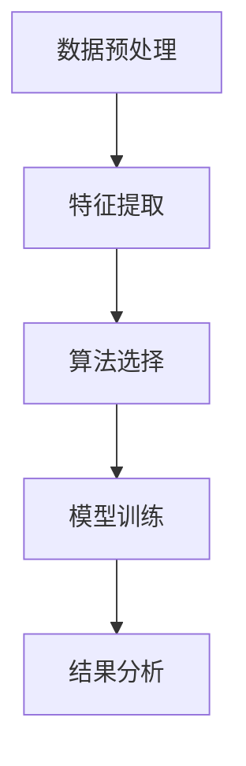
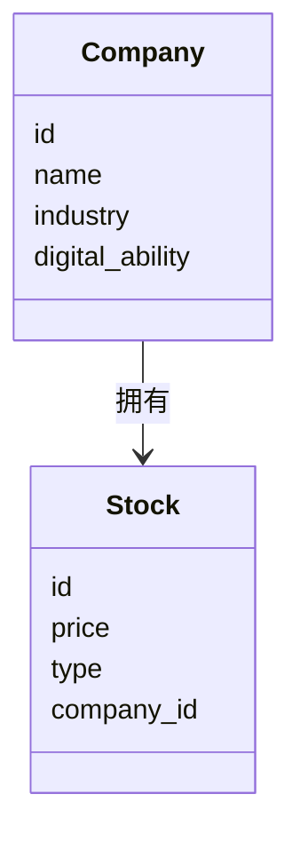
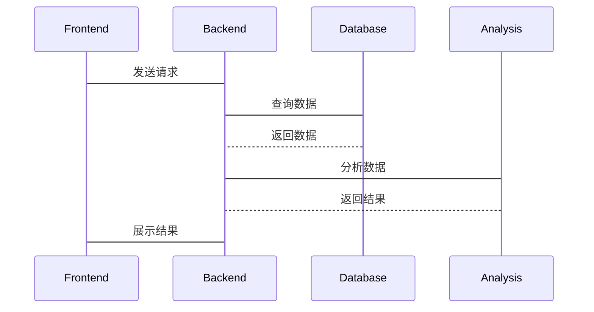

                 


# 特价股票与公司长期数字化适应性进化能力的关联性研究

## 关键词：特价股票、公司数字化适应性、进化能力、数据挖掘、机器学习

## 摘要：本文探讨了特价股票与公司长期数字化适应性进化能力之间的关联性。通过分析特价股票的市场特征和公司数字化适应性能力的核心要素，结合数据挖掘和机器学习算法，构建了量化模型，并通过实际案例展示了如何通过提升数字化能力优化公司股价表现。

---

# 第一部分: 特价股票与公司长期数字化适应性进化能力的关联性研究

## 第1章: 特价股票与公司数字化适应性概述

### 1.1 特价股票的定义与特征

#### 1.1.1 特价股票的定义
特价股票是指市场价格低于票面价值的股票。这种现象通常发生在市场低迷、公司业绩不佳或市场流动性不足的情况下。特价股票具有高波动性和高风险的特点，但同时也可能带来高回报。

#### 1.1.2 特价股票的核心特征
- **低估值**：市场价格低于票面价值。
- **高波动性**：股价波动较大，容易受市场情绪影响。
- **投资风险**：高风险意味着高回报，但也可能带来重大损失。

#### 1.1.3 特价股票的市场表现与投资价值
特价股票的投资价值取决于市场环境和公司的基本面。在市场低迷时，特价股票可能被低估，为投资者提供抄底机会；而在市场繁荣时，特价股票可能继续被低估，导致长期亏损。

### 1.2 公司长期数字化适应性进化能力的定义

#### 1.2.1 数字化适应性进化能力的内涵
公司数字化适应性进化能力是指企业在数字化转型过程中，能够快速调整自身结构、技术和业务模式，以应对市场变化和竞争压力的能力。这种能力包括技术创新、组织变革和数字化战略的制定与实施。

#### 1.2.2 公司数字化适应性的核心要素
- **技术能力**：包括大数据、人工智能、云计算等技术的应用能力。
- **组织结构**：灵活的组织结构能够快速响应市场变化。
- **数字化战略**：明确的数字化战略能够指导公司转型。
- **人才资源**：具备数字化技能的人才队伍是数字化转型的关键。

#### 1.2.3 数字化适应性与公司长期发展的关系
数字化适应性是公司长期发展的核心驱动力。能够快速适应数字化变革的公司，通常能够在市场中保持竞争优势，实现持续增长。

### 1.3 特价股票与公司数字化适应性的关联性

#### 1.3.1 特价股票市场的特点
- 特价股票市场通常波动较大，信息不对称严重。
- 投资者需要具备较高的市场敏感性和风险承受能力。

#### 1.3.2 数字化适应性对股价的影响
- 公司具备强大的数字化适应能力，能够提升市场对其未来发展的信心，从而提高股价。
- 在市场低迷时期，具备数字化能力的公司可能更快恢复，从而推动股价回升。

#### 1.3.3 两者关联性的研究意义
研究特价股票与公司数字化适应性的关联性，有助于投资者识别具有长期发展潜力的公司，降低投资风险。

---

## 第2章: 特价股票与公司数字化适应性的核心概念与联系

### 2.1 核心概念原理

#### 2.1.1 特价股票的市场机制
特价股票的市场机制包括市场供需、投资者情绪和公司基本面。市场供需决定价格，投资者情绪影响波动性，而公司基本面则是股价的长期支撑。

#### 2.1.2 公司数字化适应性的能力结构
公司数字化适应能力结构包括技术创新、组织变革和数字化战略。这三者相互作用，共同推动公司的数字化转型。

### 2.2 概念属性特征对比

#### 2.2.1 特价股票与普通股票的对比分析

| 特性       | 特价股票          | 普通股票          |
|------------|-------------------|-------------------|
| 价格       | 低于面值          | 面值或溢价        |
| 波动性      | 高               | 中等             |
| 风险       | 高               | 中等             |
| 投资价值    | 高回报潜力       | 稳定回报         |

#### 2.2.2 数字化适应性与传统适应性的区别

| 特性       | 数字化适应性       | 传统适应性       |
|------------|--------------------|--------------------|
| 核心驱动力  | 数字技术           | 传统业务模式     |
| 变革速度    | 快速               | 较慢             |
| 依赖因素    | 数据和技术         | 人力资源和经验   |

### 2.3 ER实体关系图架构

```mermaid
erDiagram
    company {
        id
        name
        industry
        digital_ability
    }
    stock {
        id
        price
        type
        company_id
    }
    company --> stock: 拥有
```

---

## 第3章: 特价股票与公司数字化适应性关联的算法原理

### 3.1 数据挖掘与机器学习方法

#### 3.1.1 数据预处理与特征提取
数据预处理包括清洗、转换和标准化。特征提取涉及选择与公司数字化能力和股价相关的关键指标，如技术研发投入、数字化人才比例等。

#### 3.1.2 机器学习算法的选择
常用算法包括线性回归、随机森林和神经网络。根据数据特征选择合适的算法。

#### 3.1.3 模型训练与优化
通过交叉验证和网格搜索优化模型参数，确保模型具有良好的泛化能力。

### 3.2 算法流程图



### 3.3 算法实现代码

```python
# 示例代码：数据预处理
import pandas as pd
data = pd.read_csv('stock_data.csv')
data.dropna(inplace=True)
data['normalized_price'] = (data['price'] - data['price'].mean()) / data['price'].std()
```

---

## 第4章: 数学模型与公式推导

### 4.1 数学模型构建

#### 4.1.1 回归分析模型
$$ y = \beta_0 + \beta_1 x_1 + \beta_2 x_2 + \epsilon $$

其中，$y$ 表示股价，$x_1$ 和 $x_2$ 分别表示公司数字化能力的两个指标，$\beta$ 表示回归系数，$\epsilon$ 表示误差项。

### 4.2 模型优化

通过逐步引入其他变量（如市场指数、行业因素）优化模型，提高预测精度。

---

## 第5章: 系统分析与架构设计方案

### 5.1 问题场景介绍

设计一个系统，用于分析公司数字化能力对股价的影响，帮助投资者做出决策。

### 5.2 系统功能设计

#### 5.2.1 领域模型



### 5.3 系统架构设计


### 5.4 系统交互设计



---

## 第6章: 项目实战

### 6.1 环境安装

安装必要的库，如Python的pandas、scikit-learn和tensorflow。

### 6.2 核心实现代码

```python
from sklearn.linear_model import LinearRegression
import pandas as pd

# 加载数据
data = pd.read_csv('stock_data.csv')

# 特征选择
X = data[['digital_ability', 'market_index']]
y = data['price']

# 训练模型
model = LinearRegression()
model.fit(X, y)

# 预测
predicted_price = model.predict(X)
```

### 6.3 应用解读与分析

通过模型预测公司数字化能力对股价的影响，帮助投资者识别具有潜力的特价股票。

### 6.4 案例分析

以某公司为例，分析其数字化能力对股价的影响，展示如何通过提升数字化能力优化股价表现。

### 6.5 项目小结

总结项目成果，强调数字化能力在投资决策中的重要性。

---

## 第7章: 总结与最佳实践

### 7.1 研究成果总结

本文研究了特价股票与公司数字化适应性之间的关联性，构建了量化模型，并通过案例验证了模型的有效性。

### 7.2 最佳实践 tips

- 投资者应关注公司数字化能力，选择具备长期适应性的公司。
- 企业应加快数字化转型，提升市场竞争力。

### 7.3 注意事项

- 投资有风险，需谨慎决策。
- 模型结果仅供参考，需结合市场实际情况。

### 7.4 拓展阅读

推荐相关书籍和论文，进一步深入研究。

---

# 作者：AI天才研究院 & 禅与计算机程序设计艺术

