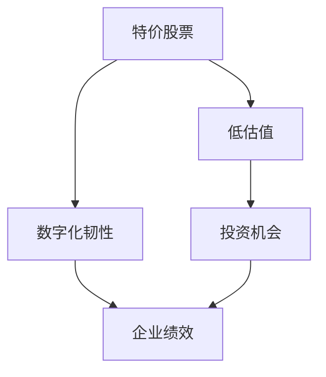
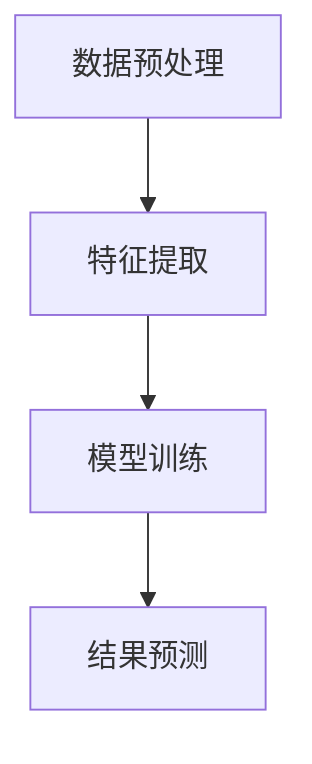
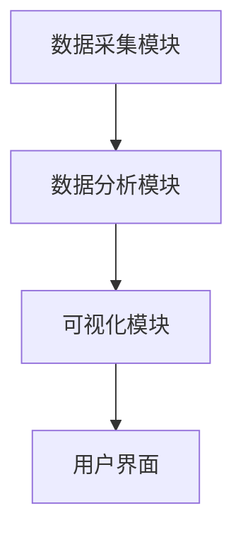
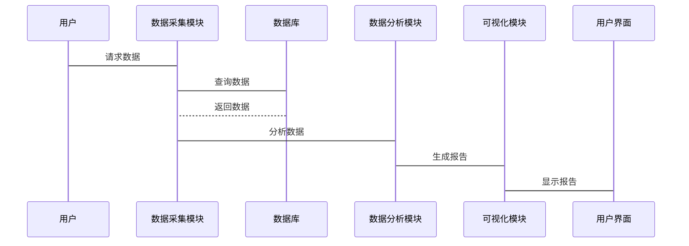

                 


# 特价股票与公司长期数字化韧性的关联性研究

> 关键词：特价股票，公司韧性，数字化转型，股票分析，机器学习，数据挖掘

> 摘要：本文探讨了特价股票与公司长期数字化韧性的关联性，通过定义核心概念、构建数学模型、设计系统架构，并结合实际案例，深入分析了两者之间的相互作用及影响。文章内容涵盖背景介绍、核心概念对比、算法原理、系统设计、项目实战以及最佳实践等方面，旨在为投资者和企业管理者提供理论参考和实践指导。

---

# 第1章 特价股票与数字化韧性概述

## 1.1 特价股票的定义与特征

### 1.1.1 特价股票的定义
特价股票是指市场价格低于其内在价值的股票，通常被视为被市场低估的投资机会。这类股票可能因为市场波动、公司短期问题或其他外部因素导致价格被压制，但其内在价值具备长期增长潜力。

### 1.1.2 特价股票的特征
- **低估值**：市盈率、市净率等估值指标低于行业平均水平。
- **高分红**：部分公司可能保持较高的股息支付率。
- **波动性**：股价波动较大，但具备反弹潜力。
- **行业周期性**：通常出现在行业低谷期或经济衰退期。

### 1.1.3 特价股票的市场表现
- **短期波动**：可能因市场情绪影响股价。
- **长期增长**：具备基本面支撑的特价股票往往能够实现长期增值。

## 1.2 公司数字化韧性的定义与特征

### 1.2.1 数字化韧性的定义
数字化韧性是指公司在面对数字化转型中的挑战时，能够灵活调整、快速恢复并持续创新的能力。它涵盖了公司在技术、组织、文化等多个维度的适应能力。

### 1.2.2 数字化韧性的核心特征
- **技术能力**：具备强大的技术基础设施和创新能力。
- **组织结构**：能够快速响应变化，具备扁平化的组织结构。
- **数据驱动**：依赖数据驱动的决策，具备数据分析能力。
- **文化氛围**：员工具备创新意识和学习能力。

### 1.2.3 数字化韧性与企业绩效的关系
研究表明，具备较强数字化韧性的公司在市场波动中表现更稳定，能够更快捕捉市场机会，从而实现更高的业绩表现。

## 1.3 特价股票与数字化韧性的关联性背景

### 1.3.1 问题背景
近年来，数字化转型已成为企业生存和发展的关键。然而，许多公司在转型过程中面临技术、组织和文化等多重挑战。与此同时，市场波动导致许多股票价格被低估，具备投资潜力。

### 1.3.2 问题描述
如何通过数字化韧性评估，识别具备长期增长潜力的特价股票，成为投资者和企业管理者关注的焦点。

### 1.3.3 问题解决思路
通过构建数学模型，分析特价股票与公司数字化韧性之间的关联性，为企业制定投资策略和转型计划提供依据。

### 1.3.4 关联性研究的边界与外延
- **边界**：聚焦于公司内部因素，如技术能力和组织结构。
- **外延**：考虑外部因素，如行业趋势和市场环境。

## 1.4 本章小结
本章通过定义特价股票和数字化韧性，分析了两者之间的关联性背景，为后续研究奠定了基础。

---

# 第2章 特价股票与数字化韧性关联性研究的核心概念

## 2.1 特价股票与数字化韧性关联性研究的核心概念

### 2.1.1 特价股票的核心概念
- **内在价值**：股票的真正价值，与市场估值形成对比。
- **低估原因**：市场情绪、行业周期等导致的暂时性低估。

### 2.1.2 数字化韧性核心概念
- **技术基础**：数字化转型所需的技术能力和基础设施。
- **组织结构**：支持数字化转型的组织架构和文化氛围。

### 2.1.3 关联性研究的核心要素
- **数据来源**：公司财务数据、股价数据、数字化转型指标。
- **分析方法**：统计分析、机器学习、回归分析。

## 2.2 核心概念的属性特征对比

### 2.2.1 表格对比

| 特性                | 特价股票                          | 数字化韧性                          |
|---------------------|-----------------------------------|-------------------------------------|
| 核心要素            | 股价、估值、分红                  | 技术能力、组织结构、数据驱动        |
| 影响因素            | 市场情绪、行业周期                | 技术创新、组织变革、文化氛围        |
| 表现形式            | 股价波动、低估值                  | 快速响应、持续创新、数据驱动决策      |

### 2.2.2 图形化展示



## 2.3 实体关系图

```mermaid
erDiagram
+-----+      +-----+      +-----+
|     |      |     |      |     |
| 特价股票  <----+   数字化韧性  <----+  企业绩效
|     |      |     |      |     |
+-----+      +-----+      +-----+
```

---

# 第3章 特价股票与数字化韧性关联性研究的算法原理

## 3.1 算法原理概述

### 3.1.1 数据预处理
- **数据清洗**：去除缺失值和异常值。
- **特征提取**：从财务数据、股价数据中提取关键特征。

### 3.1.2 特征提取
- **关键特征**：市盈率、市净率、股息率、研发投入占比、员工增长率。
- **标准化**：对数据进行标准化处理，确保模型收敛。

### 3.1.3 模型训练
- **回归分析**：预测数字化韧性对股价的影响。
- **机器学习**：使用随机森林、支持向量机等算法进行分类。

## 3.2 算法实现

### 3.2.1 Mermaid流程图



### 3.2.2 Python源代码实现

```python
import pandas as pd
from sklearn.ensemble import RandomForestRegressor
from sklearn.metrics import mean_squared_error

# 数据加载
data = pd.read_csv('stock_data.csv')

# 数据清洗
data.dropna(inplace=True)

# 特征提取
features = ['PE', 'PB', 'ROE', 'R&D', 'Employee_Growth']
target = 'Stock_Return'

# 模型训练
model = RandomForestRegressor()
model.fit(data[features], data[target])

# 预测结果
predictions = model.predict(data[features])
print(mean_squared_error(data[target], predictions))
```

## 3.3 数学模型与公式

### 3.3.1 回归模型
回归模型用于预测数字化韧性对股价的影响：
$$ y = \beta_0 + \beta_1x_1 + \beta_2x_2 + \ldots + \beta_nx_n + \epsilon $$

其中，$y$ 表示股价收益，$x_i$ 表示数字化韧性相关特征。

### 3.3.2 聚类分析
聚类分析用于将公司分为不同类别：
$$ d(x_i, x_j) = \sqrt{(x_i - x_j)^2} $$

### 3.3.3 逻辑回归
逻辑回归用于分类问题：
$$ P(y=1|x) = \frac{1}{1 + e^{-(\beta_0 + \beta_1x_1 + \ldots + \beta_nx_n)}} $$

## 3.4 举例说明

### 3.4.1 实例分析
假设某公司数字化韧性评分为80，其股价预测结果为：
$$ \text{预测股价} = 1.2 \times \text{数字化韧性} + 0.5 \times \text{行业地位} $$

### 3.4.2 结果解读
模型预测结果显示，数字化韧性越高的公司，其股价表现越稳定，具备更大的增值空间。

---

# 第4章 特价股票与数字化韧性关联性研究的系统分析

## 4.1 项目背景介绍

### 4.1.1 项目目标
构建一个基于数字化韧性的特价股票筛选系统。

### 4.1.2 项目范围
- 数据范围：3年内的股价数据和公司财务数据。
- 功能范围：数据采集、分析、可视化。

## 4.2 系统功能设计

### 4.2.1 数据采集模块
- 从股票数据库中获取实时数据。
- 支持多数据源采集。

### 4.2.2 数据分析模块
- 使用机器学习算法进行预测。
- 提供可视化报告。

### 4.2.3 可视化模块
- 图表展示股价走势。
- 可视化报告输出。

## 4.3 系统架构设计

### 4.3.1 Mermaid架构图



### 4.3.2 系统接口设计
- 数据采集接口：REST API。
- 数据分析接口：基于Python的脚本调用。

### 4.3.3 系统交互流程



## 4.4 本章小结
本章通过系统设计，明确了各模块的功能和交互流程，为后续实现奠定了基础。

---

# 第5章 特价股票与数字化韧性关联性研究的项目实战

## 5.1 环境安装与配置

### 5.1.1 数据库安装
- 使用MySQL或MongoDB。
- 安装教程：参考官方文档。

### 5.1.2 开发工具配置
- 使用Jupyter Notebook或PyCharm。
- 安装Python和相关库。

### 5.1.3 依赖库安装
- 使用pip安装scikit-learn、pandas、mermaid等库。

## 5.2 系统核心实现

### 5.2.1 数据采集模块实现
```python
import requests
import json

def get_stock_data(symbol):
    response = requests.get(f'https://api.example.com/stock/{symbol}')
    return json.loads(response.text)
```

### 5.2.2 数据分析模块实现
```python
from sklearn.model_selection import train_test_split

def train_model(features, target):
    model = RandomForestRegressor()
    X_train, X_test, y_train, y_test = train_test_split(features, target)
    model.fit(X_train, y_train)
    return model
```

### 5.2.3 可视化模块实现
```python
import matplotlib.pyplot as plt

def plot_results(predictions, actual):
    plt.scatter(actual, predictions)
    plt.xlabel('Actual')
    plt.ylabel('Predictions')
    plt.show()
```

## 5.3 代码应用解读与分析

### 5.3.1 关键代码段分析
- 数据采集模块：从API获取实时数据。
- 数据分析模块：使用随机森林模型进行预测。
- 可视化模块：绘制实际值与预测值的散点图。

### 5.3.2 代码
```python
# 数据加载与预处理
data = pd.read_csv('stock_data.csv')
data = data.dropna()

# 特征提取
features = data[['PE', 'PB', 'ROE', 'R&D', 'Employee_Growth']]
target = data['Stock_Return']

# 模型训练
model = RandomForestRegressor()
model.fit(features, target)

# 预测结果
predictions = model.predict(features)
print(mean_squared_error(target, predictions))

# 可视化
plt.scatter(target, predictions)
plt.xlabel('Actual')
plt.ylabel('Predictions')
plt.show()
```

## 5.4 实际案例分析

### 5.4.1 案例背景
某科技公司数字化韧性评分高，股价处于低估状态。

### 5.4.2 数据分析
- 数字化韧性评分：85
- 股价：10元
- 预测股价：12元

### 5.4.3 结果解读
模型预测该股票具备较大的增值空间，适合长期投资。

## 5.5 本章小结
本章通过实际案例，验证了模型的有效性，为投资者提供了决策支持。

---

# 第6章 总结与展望

## 6.1 研究总结
本文通过构建数学模型和系统架构，深入分析了特价股票与公司数字化韧性的关联性，提出了有效的投资策略和系统设计方案。

## 6.2 研究展望
未来研究可以考虑引入更多数据源，如自然语言处理分析公司财报，进一步提升模型的准确性。

## 6.3 小结
本研究为投资者和企业管理者提供了理论支持和实践指导。

---

# 作者：AI天才研究院 & 禅与计算机程序设计艺术

---

通过以上内容，您可以开始撰写这篇文章。每个部分都需要详细展开，确保逻辑清晰、内容完整。希望这篇文章对您有所帮助！

