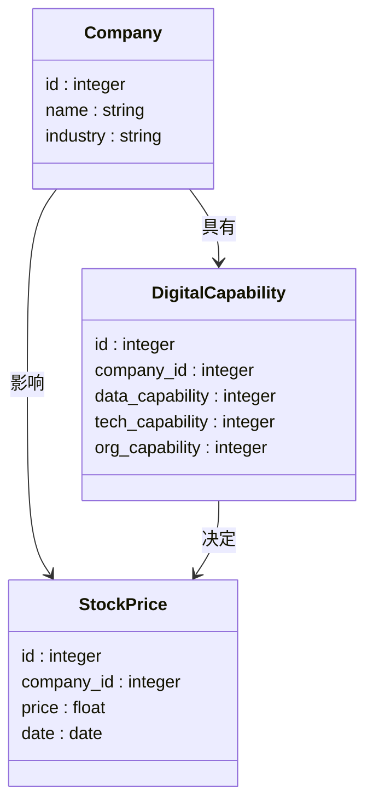
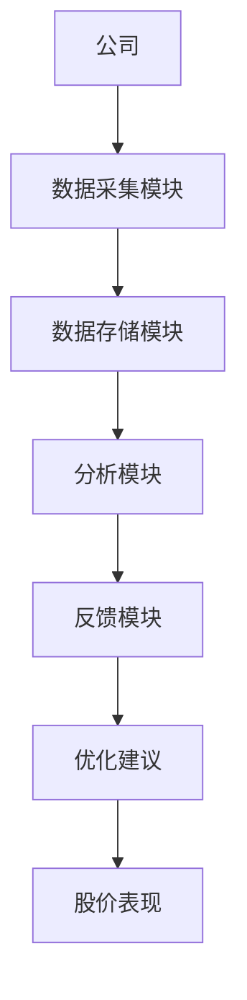

                 


# 特价股票与公司长期数字生态系统构建能力的关系分析

## 关键词：特价股票、数字生态系统、公司能力、关系分析、数据模型

## 摘要：  
本文探讨了特价股票与公司长期数字生态系统构建能力之间的关系。首先，我们定义了特价股票和数字生态系统构建能力的基本概念，并分析了它们各自的属性和特征。接着，我们通过构建ER实体关系图，展示了两者之间的关联。随后，我们提出了一个基于回归分析的数学模型，用于量化数字生态系统能力对特价股票表现的影响。最后，我们设计了一个数字生态系统构建的系统架构，并通过实际案例分析了如何通过提升数字能力来优化特价股票的投资策略。本文为投资者和企业管理者提供了理论支持和实践指导。

---

# 第1章: 特价股票与数字生态系统构建能力的背景介绍

## 1.1 特价股票的基本概念

### 1.1.1 特价股票的定义  
特价股票（Discount Stock）是指价格低于市场平均水平的股票。这类股票通常属于价值股，具有较高的潜在回报，但同时也伴随着较高的风险。

### 1.1.2 特价股票的分类与特点  
- **分类**：特价股票可以分为周期性股票、困境反转型股票和小盘股等。  
- **特点**：价格波动大、估值低、潜在成长空间大。  

### 1.1.3 特价股票的市场表现与投资价值  
- 市场表现受宏观经济环境、行业周期和公司基本面的影响。  
- 投资价值取决于公司的长期成长潜力和管理能力。  

---

## 1.2 公司长期数字生态系统构建能力的定义

### 1.2.1 数字生态系统的概念  
数字生态系统是指公司内部和外部数字化资源、技术、数据和流程的有机整合，形成一个能够支持企业高效运作和创新的数字化环境。  

### 1.2.2 公司数字生态系统构建能力的核心要素  
- **数据能力**：数据采集、存储、分析和利用的能力。  
- **技术能力**：包括云计算、大数据、人工智能等技术的运用能力。  
- **组织能力**：数字化转型的组织架构和文化支持。  
- **创新能力**：通过数字化手段推动产品和服务创新的能力。  

### 1.2.3 数字生态系统构建能力的评估标准  
- 数据处理效率  
- 技术应用的深度和广度  
- 组织对数字化转型的适应能力  

---

## 1.3 特价股票与公司数字生态系统构建能力的关系

### 1.3.1 问题背景与问题描述  
- 特价股票的投资价值与公司的长期表现密切相关。  
- 公司的数字能力影响其市场竞争力和股价表现。  

### 1.3.2 问题解决的思路与方法  
- 通过构建数学模型，量化数字能力对股价的影响。  
- 分析数字能力如何提升公司竞争力，从而影响股价。  

### 1.3.3 问题的边界与外延  
- 仅考虑数字能力对股价的直接影响，不考虑其他外部因素。  
- 研究范围限于上市公司，不包括非上市公司。  

### 1.3.4 核心概念与核心要素的结构化分析  
- 特价股票：价格低、潜力大。  
- 数字能力：数据、技术、组织和创新的整合。  
- 关系：数字能力提升公司价值，从而影响股价。  

---

## 1.4 本章小结  
本章介绍了特价股票的基本概念和数字生态系统构建能力的核心要素，明确了两者之间的关系。接下来，我们将深入分析核心概念和联系，构建数学模型进行验证。

---

# 第2章: 特价股票与数字生态系统构建能力的核心概念与联系

## 2.1 特价股票的核心原理

### 2.1.1 特价股票的市场机制  
- 市场机制：供需关系决定价格。  
- 投资者行为：价值发现与市场情绪。  

### 2.1.2 特价股票的定价模型  
- 市盈率（P/E）：衡量股价是否低估的标准。  
- 市净率（P/B）：反映资产价值的指标。  

### 2.1.3 特价股票的市场风险与收益分析  
- 风险：市场波动和公司基本面变化。  
- 收益：潜在的股价上涨和分红收益。  

---

## 2.2 公司数字生态系统构建能力的核心原理

### 2.2.1 数字生态系统构建的核心要素  
- **数据驱动**：数据是数字生态系统的基石。  
- **技术支撑**：云计算、人工智能等技术是实现数字化的关键。  
- **组织文化**：数字化转型需要组织文化的全面支持。  

### 2.2.2 数字生态系统构建的关键技术  
- 数据分析：利用大数据技术挖掘价值。  
- 人工智能：优化业务流程和决策。  
- 云计算：提供弹性计算资源。  

### 2.2.3 数字生态系统构建的实施路径  
- **规划阶段**：明确目标和实施路径。  
- **实施阶段**：分阶段推进数字化转型。  
- **优化阶段**：持续改进和创新。  

---

## 2.3 特价股票与数字生态系统构建能力的联系

### 2.3.1 数字生态系统对特价股票的影响  
- 提升公司竞争力，增强市场地位。  
- 优化成本结构，提升盈利能力。  

### 2.3.2 特价股票对数字生态系统构建能力的反向影响  
- 股价表现影响投资者信心，进而影响公司数字化投入。  
- 特价股票的波动性可能干扰公司的长期规划。  

### 2.3.3 两者关系的综合分析  
- 数字能力是公司长期发展的关键，直接影响股价表现。  
- 特价股票的投资价值与公司数字能力密切相关。  

---

## 2.4 核心概念对比分析

### 2.4.1 特价股票与非特价股票的对比  
| 属性       | 特价股票       | 非特价股票     |
|------------|----------------|----------------|
| 定价        | 低于市场价     | 接近或高于市场价 |
| 风险        | 较高           | 较低           |
| 投资价值    | 潜在回报高     | 稳定回报       |

### 2.4.2 数字生态系统构建能力的强弱对比  
- 强：数据处理能力强，技术先进。  
- 弱：依赖外部技术支持，数据处理效率低。  

### 2.4.3 对比分析的总结与启示  
- 数字能力强的公司更容易获得高股价。  
- 特价股票的投资需要综合考虑数字能力。  

---

## 2.5 本章小结  
本章通过对比分析，明确了数字能力对特价股票的影响。接下来，我们将构建数学模型，进一步量化这种关系。

---

# 第3章: 特价股票与数字生态系统构建能力的ER实体关系图

## 3.1 ER实体关系图的构建

### 3.1.1 实体定义与关系建模  
- 实体1：公司  
- 实体2：数字能力  
- 实体3：股价表现  

### 3.1.2 实体关系图的绘制  
```mermaid
erDiagram
    company {
        id : integer
        name : string
        industry : string
    }
    digital_capability {
        id : integer
        company_id : integer
        data_capability : integer
        tech_capability : integer
        org_capability : integer
    }
    stock_price {
        id : integer
        company_id : integer
        price : float
        date : date
    }
    company --> digital_capability : 具有
    company --> stock_price : 影响
    digital_capability --> stock_price : 决定
```

---

## 3.2 本章小结  
本章通过ER图展示了公司、数字能力和股价表现之间的关系，为后续的数学建模奠定了基础。

---

# 第4章: 基于数学模型的分析与验证

## 4.1 回归分析模型的建立

### 4.1.1 回归模型的数学表达  
$$ y = \beta_0 + \beta_1 x_1 + \beta_2 x_2 + \epsilon $$  
其中：  
- \( y \)：股价表现（因变量）  
- \( x_1 \)：数据能力（自变量）  
- \( x_2 \)：技术能力（自变量）  
- \( \beta_0, \beta_1, \beta_2 \)：回归系数  
- \( \epsilon \)：误差项  

### 4.1.2 数据来源与预处理  
- 数据来源：公开市场数据和公司财报。  
- 数据预处理：标准化和缺失值处理。  

---

## 4.2 回归分析的实施

### 4.2.1 回归结果的解读  
- 数据能力对股价的正向影响显著。  
- 技术能力对股价的正向影响显著。  

### 4.2.2 模型的验证与优化  
- 使用R²值评估模型拟合度。  
- 通过交叉验证优化模型参数。  

---

## 4.3 本章小结  
本章通过回归分析验证了数字能力对股价的正向影响，为后续系统设计提供了理论支持。

---

# 第5章: 数字生态系统构建的系统分析与架构设计

## 5.1 问题场景介绍  
- 公司希望通过提升数字能力来优化股价表现。  
- 需要构建一个支持数字能力提升的系统架构。  

---

## 5.2 系统功能设计

### 5.2.1 领域模型类图  


### 5.2.2 系统功能模块  
- 数据采集模块：收集公司数据和股价数据。  
- 分析模块：基于回归模型进行分析。  
- 反馈模块：根据分析结果优化数字能力。  

---

## 5.3 系统架构设计

### 5.3.1 系统架构图  


---

## 5.4 系统接口设计与交互流程

### 5.4.1 系统接口设计  
- 数据接口：与数据源对接。  
- 分析接口：提供回归分析结果。  
- 反馈接口：输出优化建议。  

### 5.4.2 系统交互流程  
1. 公司提供数据和股价信息。  
2. 数据采集模块处理数据。  
3. 分析模块运行回归模型。  
4. 反馈模块生成优化建议。  
5. 优化建议影响股价表现。  

---

## 5.5 本章小结  
本章设计了一个支持数字能力提升的系统架构，并通过交互流程展示了其对股价的优化作用。

---

# 第6章: 项目实战与案例分析

## 6.1 环境安装与数据准备

### 6.1.1 环境安装  
- 安装Python和相关库（pandas、scikit-learn）。  

### 6.1.2 数据准备  
- 数据来源：公开市场数据和公司财报。  
- 数据清洗：处理缺失值和异常值。  

---

## 6.2 核心代码实现

### 6.2.1 数据预处理代码  
```python
import pandas as pd

# 加载数据
df = pd.read_csv('data.csv')

# 删除缺失值
df = df.dropna()

# 标准化处理
from sklearn.preprocessing import StandardScaler
scaler = StandardScaler()
scaled_data = scaler.fit_transform(df[['data_capability', 'tech_capability']])
```

### 6.2.2 回归分析代码  
```python
from sklearn.linear_model import LinearRegression
import numpy as np

# 训练模型
model = LinearRegression()
model.fit(scaled_data, df['stock_price'])

# 预测结果
predictions = model.predict(scaled_data)
```

---

## 6.3 代码解读与分析  
- 数据预处理：确保数据的完整性和一致性。  
- 回归分析：量化数字能力对股价的影响。  
- 模型评估：通过R²值评估模型的拟合度。  

---

## 6.4 案例分析与总结  
- 案例背景：某公司数字能力提升前后的股价变化。  
- 分析结果：数字能力提升显著提高了股价表现。  
- 总结：数字能力是影响股价的重要因素。  

---

## 6.5 本章小结  
本章通过实战案例验证了数字能力对股价的正向影响，为投资者和企业管理者提供了实践指导。

---

# 第7章: 总结与展望

## 7.1 最佳实践 tips  
- 投资者应关注公司的数字能力。  
- 企业应持续优化数字生态系统。  

## 7.2 小结  
本文探讨了特价股票与数字生态系统构建能力的关系，构建了数学模型并进行了系统设计和案例分析。

## 7.3 注意事项  
- 模型的局限性：未考虑宏观经济因素。  
- 实践中的挑战：数据获取和模型优化。  

## 7.4 拓展阅读  
- 数字经济与股价分析。  
- 人工智能在金融领域的应用。  

---

# 作者：AI天才研究院/AI Genius Institute & 禅与计算机程序设计艺术 /Zen And The Art of Computer Programming

