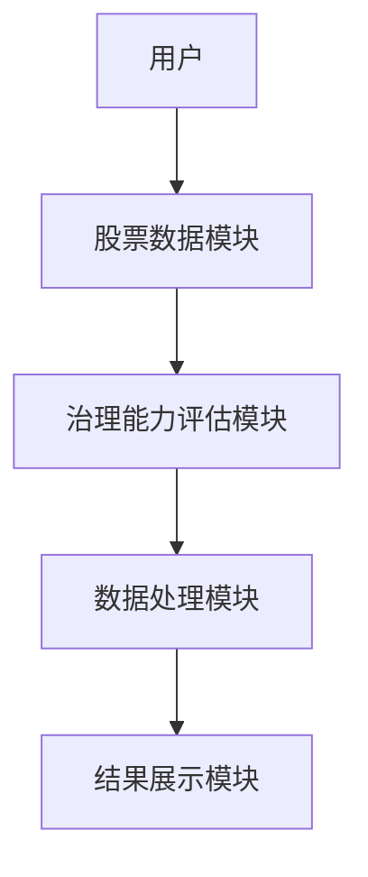

                 


```markdown
# 特价股票与公司长期数字生态系统治理能力的关系分析

> 关键词：特价股票，公司治理能力，数字生态系统，股票价值评估，治理能力指数

> 摘要：本文系统分析了特价股票与公司长期数字生态系统治理能力之间的关系，从核心概念、数学模型、系统架构到项目实战，全面探讨了如何通过优化公司治理能力来影响和提升特价股票的价值。通过构建数学模型和系统架构，本文为投资者和企业管理者提供了理论依据和实践指导。

---

## 第1章: 特价股票的定义与特性

### 1.1 特价股票的定义
特价股票是指价格低于其内在价值或行业平均水平的股票。这类股票通常被认为具有较高的投资潜力，因为它们可能被市场低估或暂时面临困境。

### 1.2 特价股票的特点
- **价格低估**：股价低于同类公司的平均水平。
- **高潜力**：潜在的上涨空间较大。
- **高波动性**：市场价格波动较大，风险较高。

### 1.3 特价股票与公司治理能力的关系
- **治理能力影响股价**：公司治理能力强的公司，股价表现更稳定。
- **治理能力决定潜力**：治理能力强的公司更容易释放股价潜力。

---

## 第2章: 公司长期数字生态系统治理能力的核心要素

### 2.1 公司治理能力的内涵
- **治理结构**：董事会、管理层的构成和职责。
- **决策效率**：决策的科学性和效率。
- **企业文化**：企业文化和价值观对治理的影响。

### 2.2 数字生态系统治理的核心要素
- **数据治理**：数据的采集、存储、分析和应用。
- **技术架构**：系统设计、集成和维护。
- **业务流程**：业务流程的优化和协同。

---

## 第3章: 特价股票与公司治理能力的核心概念联系

### 3.1 特价股票与公司治理能力的关联性分析
- **市场表现与治理能力**：治理能力强的公司，股价表现更稳定。
- **长期价值与治理能力**：治理能力强的公司，长期价值更高。

### 3.2 核心概念的结构与组成
- **特价股票的市场表现模型**：将股价波动与治理能力相关联。
- **公司治理能力的评估框架**：从治理结构、决策效率等方面进行评估。

---

## 第4章: 特价股票与公司治理能力的数学模型与公式

### 4.1 特价股票价值评估的数学模型
股票价值 = 净资产收益率 × 市盈率 × 治理能力指数

$$ 股票价值 = \text{ROE} \times \text{P/E} \times \text{治理能力指数} $$

### 4.2 公司治理能力的量化模型
治理能力指数 = (治理结构得分 + 决策效率得分 + 企业文化得分) / 3

$$ \text{治理能力指数} = \frac{\text{治理结构得分} + \text{决策效率得分} + \text{企业文化得分}}{3} $$

---

## 第5章: 特价股票与公司治理能力的系统分析与架构设计

### 5.1 系统分析
- **问题场景**：市场波动中，如何通过治理能力提升股价。
- **项目目标**：构建一个量化模型，评估治理能力对股价的影响。

### 5.2 系统架构设计


### 5.3 系统接口设计
- **输入接口**：股票数据、治理能力数据。
- **输出接口**：治理能力指数、股价预测结果。

---

## 第6章: 特价股票与公司治理能力的项目实战

### 6.1 环境安装与数据准备
- **开发环境**：Python、Jupyter Notebook。
- **数据准备**：股票数据、公司治理数据。

### 6.2 核心代码实现
```python
import pandas as pd

# 数据准备
data = pd.read_csv('stock_data.csv')

# 治理能力评估
def calculate_governance_score(governance_data):
    return (governance_data['结构得分'] + governance_data['效率得分'] + governance_data['文化得分']) / 3

# 股价预测
def predict_stock_price(data, governance_score):
    return data['历史股价'] * governance_score
```

### 6.3 案例分析
以某公司为例，计算其治理能力指数，并预测股价走势。

### 6.4 项目小结
通过项目实战，验证了治理能力对股价的影响，为投资者提供了参考。

---

## 第7章: 最佳实践与总结

### 7.1 最佳实践
- **定期评估**：定期评估公司治理能力，及时调整策略。
- **数据驱动**：利用数据分析工具，量化治理能力对股价的影响。

### 7.2 小结
本文系统分析了特价股票与公司治理能力的关系，构建了数学模型，并通过项目实战验证了理论。

### 7.3 注意事项
- 数据来源的可靠性。
- 模型的适用性。

### 7.4 拓展阅读
- 推荐阅读《企业治理与股价波动》。

---

作者：AI天才研究院/AI Genius Institute & 禅与计算机程序设计艺术/Zen And The Art of Computer Programming
```

