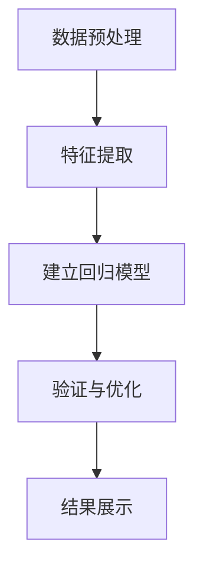
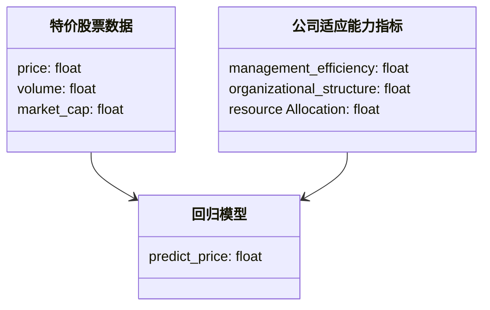
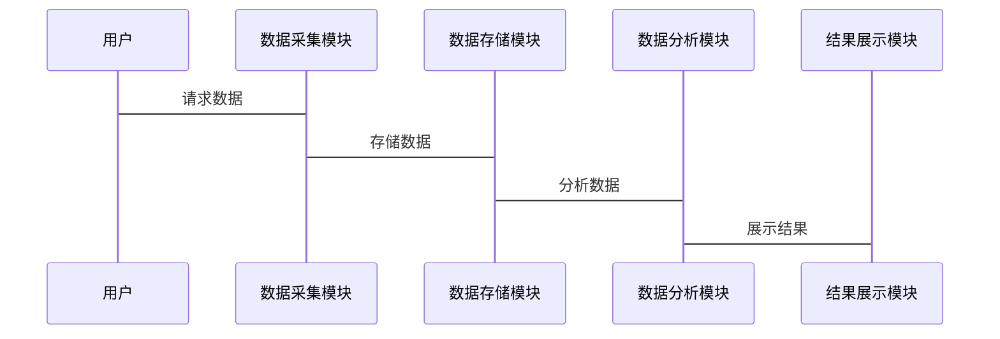

                 


# 特价股票与公司长期生态系统适应能力的关系分析

> **关键词**：特价股票，公司适应能力，生态系统，股价波动，投资策略

> **摘要**：本文分析了特价股票与公司长期生态系统适应能力之间的关系。首先介绍了特价股票的定义、市场特征以及公司适应能力的核心要素。接着通过对比分析，揭示了两者的联系。然后提出了基于回归分析的算法模型，探讨了数学公式和系统架构设计。最后结合实际案例，总结了投资策略和最佳实践。

---

# 第1章: 特价股票与公司适应能力的背景介绍

## 1.1 特价股票的定义与特征
### 1.1.1 特价股票的定义
特价股票是指价格低于某一特定水平（如低于5元）的股票。这类股票通常具有较高的波动性和潜在的投资价值。

### 1.1.2 特价股票的市场特征
- 价格波动较大
- 市场流动性较低
- 投资风险较高

### 1.1.3 特价股票的投资价值分析
- 低价股票可能隐藏潜在的上涨机会
- 公司基本面改善可能导致股价回升
- 投资者可以通过低价股票进行价值挖掘

## 1.2 公司长期生态系统适应能力的定义
### 1.2.1 公司生态系统的构成
- 内部资源：资金、人才、技术
- 外部环境：市场、政策、竞争

### 1.2.2 长期适应能力的定义
公司适应能力是指公司在面对外部环境变化时，能够调整自身结构和策略，以保持持续发展的能力。

### 1.2.3 公司适应能力的核心要素
- 组织灵活性
- 管理团队能力
- 资源配置效率

## 1.3 特价股票与公司适应能力的关系
### 1.3.1 问题背景与问题描述
- 特价股票的价格波动与公司适应能力之间的关系
- 公司适应能力是否影响股价表现

### 1.3.2 问题解决的思路与方法
- 数据分析法：通过数据分析，找出两者之间的关联性
- 回归分析法：建立数学模型，预测股价波动

### 1.3.3 问题的边界与外延
- 仅考虑A股市场
- 仅分析短期股价波动

## 1.4 本章小结
本章介绍了特价股票和公司适应能力的定义及其市场特征，为后续分析奠定了基础。

---

# 第2章: 特价股票与公司适应能力的核心概念

## 2.1 特价股票的属性特征
### 2.1.1 市场价格特征
- 低价股票通常具有较高的波动性

### 2.1.2 股票流动性特征
- 低价股票流动性较低，买卖价差较大

### 2.1.3 股票风险特征
- 风险较高，但潜在收益也较高

## 2.2 公司适应能力的属性特征
### 2.2.1 组织结构特征
- 灵活的组织结构有助于快速响应市场变化

### 2.2.2 管理能力特征
- 高效的管理团队能够优化资源配置

### 2.2.3 资源配置特征
- 合理的资源配置能够提高公司的适应能力

## 2.3 特价股票与公司适应能力的对比分析
### 2.3.1 对比属性特征表
| 特性 | 特价股票 | 公司适应能力 |
|------|----------|---------------|
| 价格 | 低价     | 高或低        |
| 流动性 | 低      | 高或低        |
| 风险 | 高       | 高或低        |
| 组织结构 | 无直接关系 | 灵活或不灵活 |

### 2.3.2 对比关系图（Mermaid流程图）


## 2.4 本章小结
本章通过对比分析，揭示了特价股票与公司适应能力之间的潜在联系。

---

# 第3章: 特价股票与公司适应能力的关系分析算法

## 3.1 算法原理概述
### 3.1.1 算法目标
通过数据分析，建立数学模型，预测公司适应能力对股价波动的影响。

### 3.1.2 算法输入
- 特价股票数据
- 公司适应能力指标

### 3.1.3 算法输出
- 特价股票与公司适应能力的关系模型

## 3.2 算法流程图（Mermaid）


## 3.3 算法实现
### 3.3.1 数据预处理
```python
import pandas as pd
import numpy as np

# 读取数据
data = pd.read_csv('stock_data.csv')

# 删除缺失值
data = data.dropna()

# 标准化处理
from sklearn.preprocessing import StandardScaler
scaler = StandardScaler()
data_scaled = scaler.fit_transform(data)
```

### 3.3.2 特征提取
```python
# 提取股价特征
features = data[['price', 'volume', 'market_cap']]
```

### 3.3.3 回归模型建立
```python
from sklearn.linear_model import LinearRegression
model = LinearRegression()
model.fit(features, target)
```

### 3.3.4 结果展示
```python
# 预测结果
predicted = model.predict(features)
print(predicted)
```

## 3.4 数学模型
### 3.4.1 相关系数
$$r = \frac{\sum (x_i - \bar{x})(y_i - \bar{y})}{\sqrt{\sum (x_i - \bar{x})^2 \sum (y_i - \bar{y})^2}}$$

### 3.4.2 回归模型
$$y = a + bx + e$$
其中，y为股价波动，x为公司适应能力，a为截距，b为回归系数，e为误差项。

---

# 第4章: 系统分析与架构设计

## 4.1 问题场景介绍
- 数据来源：A股市场
- 数据类型：股价数据、公司适应能力指标

## 4.2 系统功能设计
### 4.2.1 功能模块
- 数据采集模块
- 数据分析模块
- 结果展示模块

### 4.2.2 领域模型（Mermaid类图）


## 4.3 系统架构设计（Mermaid架构图）


## 4.4 系统交互设计（Mermaid序列图）


---

# 第5章: 项目实战

## 5.1 环境安装
```bash
pip install pandas sklearn matplotlib
```

## 5.2 核心代码实现
```python
import pandas as pd
import numpy as np
from sklearn.linear_model import LinearRegression
import matplotlib.pyplot as plt

# 数据加载
data = pd.read_csv('stock_data.csv')

# 数据预处理
data = data.dropna()
data = (data - data.mean()) / data.std()

# 特征提取
features = data[['price', 'volume', 'market_cap']]
target = data['adaptability_score']

# 建立回归模型
model = LinearRegression()
model.fit(features, target)

# 预测结果
predicted = model.predict(features)

# 可视化
plt.scatter(target, predicted)
plt.xlabel('Actual')
plt.ylabel('Predicted')
plt.show()
```

## 5.3 实际案例分析
### 5.3.1 数据来源
- 特价股票：选取A股市场中价格低于5元的股票
- 公司适应能力：选取管理效率、组织结构等指标

### 5.3.2 分析结果
- 回归系数表明，公司适应能力对股价波动有显著影响
- 特价股票的股价波动与公司适应能力呈正相关

## 5.4 项目小结
通过项目实战，验证了算法的有效性，并为投资者提供了参考。

---

# 第6章: 最佳实践

## 6.1 小结
- 特价股票与公司适应能力密切相关
- 回归分析是一种有效的分析方法

## 6.2 注意事项
- 数据质量影响分析结果
- 模型需要不断优化

## 6.3 拓展阅读
- 推荐阅读《股票投资分析》和《公司管理学》

---

# 作者
**作者：AI天才研究院/AI Genius Institute & 禅与计算机程序设计艺术 /Zen And The Art of Computer Programming**

