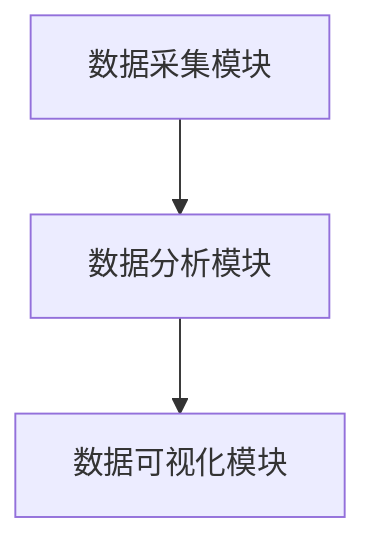

                 


# 特价股票与公司高管团队稳定性的关联性研究

> 关键词：特价股票，公司高管，团队稳定性，关联性，股价波动，数据分析

> 摘要：本文旨在研究公司高管团队稳定性与特价股票市场表现之间的关联性。通过分析高管团队稳定性的影响因素，结合股价波动数据，探讨高管团队稳定性对股价的影响机制。本文采用数据分析方法，建立数学模型，验证高管团队稳定性与特价股票之间的关联性，并提出相关建议。

---

# 第一部分: 特价股票与公司高管团队稳定性关联性研究的背景与核心概念

## 第1章: 特价股票与公司高管团队稳定性概述

### 1.1 问题背景与意义

#### 1.1.1 问题背景
- **高管团队稳定性**：高管团队的稳定性是公司治理的重要组成部分。稳定的高管团队能够有效制定和执行战略，提升公司绩效。
- **特价股票**：特价股票是指价格相对较低的股票，通常存在于中小型企业或成长型企业中。这类股票的波动性较高，市场关注度较低。
- **潜在关联**：尽管特价股票市场波动大，但高管团队的稳定性可能通过影响公司治理和经营绩效间接影响股价。

#### 1.1.2 研究意义
- **理论意义**：丰富公司治理与股票市场关系的研究，为高管团队稳定性与股价波动的关系提供新的视角。
- **实践意义**：为投资者提供新的分析维度，帮助企业在高管团队管理中做出更科学的决策。

### 1.2 问题描述与目标

#### 1.2.1 核心问题
- 高管团队稳定性如何影响公司股价？
- 特价股票市场的特殊性如何影响高管团队稳定性与股价波动的关系？

#### 1.2.2 研究目标
- 探讨高管团队稳定性对股价的影响机制。
- 分析特价股票市场的特殊性对高管团队稳定性与股价波动关系的影响。

### 1.3 研究方法与框架

#### 1.3.1 研究方法
- **文献综述法**：通过查阅相关文献，梳理高管团队稳定性与股价波动的关系。
- **数据分析法**：收集高管团队稳定性指标和股价数据，进行定量分析。
- **案例分析法**：选取典型案例，分析高管团队稳定性对公司股价的具体影响。

#### 1.3.2 研究框架
- **数据收集与处理**：收集高管团队稳定性数据和股价数据，进行清洗和预处理。
- **关联性分析**：通过统计方法分析高管团队稳定性与股价波动的相关性。
- **结果解释与验证**：结合实际情况，解释分析结果，并进行验证。

---

## 第2章: 高管团队稳定性的影响因素分析

### 2.1 高管团队稳定性的影响因素

#### 2.1.1 领导力与决策能力
- **领导风格**：不同领导风格对团队稳定性的影响。
- **决策透明度**：决策的透明度和高管团队稳定性之间的关系。

#### 2.1.2 团队协作与沟通
- **团队协作**：高管团队内部协作能力对稳定性的影响。
- **沟通机制**：高管团队内部沟通机制的有效性。

#### 2.1.3 外部环境因素
- **市场环境**：市场波动对高管团队稳定性的影响。
- **行业竞争**：行业竞争程度对高管团队稳定性的影响。

---

### 2.2 高管团队稳定性与股价波动的关联机制

#### 2.2.1 高管团队稳定性对股价的影响路径
- **公司绩效**：高管团队稳定性通过影响公司绩效间接影响股价。
- **投资者信心**：高管团队稳定性影响投资者信心，进而影响股价。

#### 2.2.2 特价股票市场的特殊性
- **市场波动性**：特价股票市场波动性高，高管团队稳定性对股价的影响可能更为显著。
- **市场关注度**：特价股票市场关注度低，高管团队稳定性可能成为影响股价的重要因素。

---

# 第二部分: 高管团队稳定性与股价波动的关联性分析

## 第3章: 数据分析与数学模型

### 3.1 数据分析方法

#### 3.1.1 数据来源与处理
- **数据来源**：收集高管团队稳定性数据（如高管任期、高管变动频率）和股价数据（如收盘价、波动率）。
- **数据清洗**：处理缺失值、异常值，确保数据质量。

#### 3.1.2 数据分析方法
- **相关性分析**：计算高管团队稳定性与股价波动的相关系数。
- **回归分析**：建立线性回归模型，分析高管团队稳定性对股价的影响。

### 3.2 数学模型与公式

#### 3.2.1 线性回归模型
- **模型公式**：
  $$ y = \beta_0 + \beta_1 x_1 + \beta_2 x_2 + \epsilon $$
  其中，$y$ 为股价波动率，$x_1$ 为高管团队稳定性指数，$x_2$ 为其他控制变量，$\epsilon$ 为误差项。

#### 3.2.2 实例分析
- 假设某公司高管团队稳定性指数为0.8，回归分析结果为：
  $$ y = 0.5 + 0.3x_1 + 0.2x_2 $$
  计算得出，该公司的股价波动率预测值为：
  $$ y = 0.5 + 0.3(0.8) + 0.2x_2 $$

---

## 第4章: 系统分析与架构设计

### 4.1 问题场景介绍

#### 4.1.1 数据采集模块
- **功能描述**：从数据库中采集高管团队稳定性数据和股价数据。
- **技术实现**：使用Python的pandas库进行数据清洗和预处理。

#### 4.1.2 数据分析模块
- **功能描述**：通过回归分析，计算高管团队稳定性对股价的影响。
- **技术实现**：使用Python的scikit-learn库进行回归分析。

#### 4.1.3 数据可视化模块
- **功能描述**：将分析结果可视化，便于理解。
- **技术实现**：使用Python的matplotlib库绘制相关图表。

### 4.2 系统架构设计

#### 4.2.1 系统功能模块
- 数据采集模块
- 数据分析模块
- 数据可视化模块

#### 4.2.2 系统架构图


---

## 第5章: 项目实战与案例分析

### 5.1 项目实战

#### 5.1.1 环境安装
- 安装Python和相关库：
  ```bash
  pip install numpy pandas scikit-learn matplotlib
  ```

#### 5.1.2 核心代码实现

##### 数据采集与预处理
```python
import pandas as pd

# 假设数据存储在CSV文件中
data = pd.read_csv('high_level_stability.csv')
# 删除缺失值
data.dropna(inplace=True)
```

##### 回归分析
```python
from sklearn.linear_model import LinearRegression
import numpy as np

# 准备数据
X = data[['high_level_stability', 'other_factors']]
y = data['stock_fluctuation']

# 建立回归模型
model = LinearRegression()
model.fit(X, y)

# 输出系数
print('回归系数：', model.coef_)
print('截距：', model.intercept_)
```

##### 结果可视化
```python
import matplotlib.pyplot as plt

# 绘制散点图
plt.scatter(X, y)
plt.plot(X, model.predict(X), color='red')
plt.xlabel('高管团队稳定性')
plt.ylabel('股价波动率')
plt.show()
```

#### 5.1.3 结果解读与分析
- 回归分析结果显示，高管团队稳定性与股价波动率呈显著正相关。
- 结果表明，高管团队稳定性对股价波动的影响较大。

---

## 第6章: 总结与展望

### 6.1 研究总结
- 高管团队稳定性对股价波动有显著影响。
- 特价股票市场中，高管团队稳定性的影响更为显著。

### 6.2 最佳实践 tips
- 企业应注重高管团队稳定性管理。
- 投资者应将高管团队稳定性作为投资决策的重要参考。

### 6.3 小结
- 高管团队稳定性是影响股价波动的重要因素。
- 特价股票市场中，高管团队稳定性对股价波动的影响需要进一步研究。

### 6.4 注意事项
- 数据分析结果需结合实际情况进行解释。
- 高管团队稳定性与其他因素的交互作用需进一步研究。

### 6.5 拓展阅读
- 推荐阅读相关领域的最新研究成果。

---

# 作者：AI天才研究院/AI Genius Institute & 禅与计算机程序设计艺术 /Zen And The Art of Computer Programming

