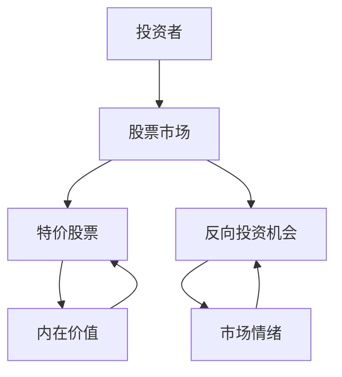
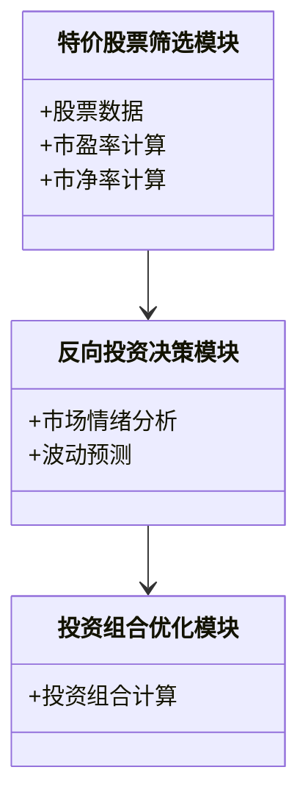

                 


# 特价股票与反向投资策略的异同

## 关键词：特价股票，反向投资，投资策略，股票分析，价值投资

## 摘要：  
本文详细分析了特价股票与反向投资策略的异同点，从背景、核心概念、数学模型、系统架构到实战案例，深入探讨了两者在投资策略中的应用与区别。通过对两者核心原理的对比，结合实际案例分析，为投资者提供了清晰的理论指导和实践参考。

---

# 第1章: 特价股票与反向投资策略的概述

## 1.1 特价股票的基本概念

### 1.1.1 特价股票的定义  
特价股票通常指那些市场价格低于其内在价值的股票，这类股票往往被市场低估，具有较大的增值潜力。投资者通过挖掘这些股票，能够在市场复苏时获得超额收益。

### 1.1.2 特价股票的特点  
- **低估值**：市盈率、市净率等估值指标远低于行业平均水平。  
- **高分红潜力**：通常来自盈利能力强但市场不认可的公司。  
- **逆周期特性**：在市场低迷时更容易出现特价股票。  

### 1.1.3 特价股票的分类  
- **周期性股票**：如钢铁、能源行业的股票，在市场低谷时价格被低估。  
- **成长型股票**：暂时被市场忽视但具有高增长潜力的股票。  
- **价值型股票**：市场价格远低于其真实价值的股票。  

## 1.2 反向投资策略的基本概念

### 1.2.1 反向投资的定义  
反向投资是一种逆市场趋势的投资策略，即在市场恐慌时买入，在市场狂热时卖出。其核心思想是“别人恐惧时我贪婪，别人贪婪时我恐惧”。  

### 1.2.2 反向投资的核心思想  
- **市场非理性**：市场短期波动往往偏离其内在价值。  
- **逆向操作**：在市场低点布局，在市场高点离场。  
- **长期视角**：关注企业长期价值而非短期波动。  

### 1.2.3 反向投资的应用场景  
- **市场恐慌时**：如2020年新冠疫情爆发时。  
- **市场泡沫时**：如2015年A股杠杆资金推动的牛市泡沫。  
- **行业低谷时**：如2022年全球能源价格暴跌时。  

## 1.3 特价股票与反向投资的联系与区别

### 1.3.1 联系  
- 两者都注重市场估值与内在价值的差异。  
- 两者都强调逆周期操作，追求超额收益。  
- 两者都适用于市场低迷或非理性阶段。  

### 1.3.2 区别  
| 对比维度       | 特价股票                          | 反向投资                          |
|----------------|-----------------------------------|-----------------------------------|
| 核心目标       | 挖掘被低估的股票                  | 把握市场非理性波动                |
| 策略触发条件   | 股票估值低于内在价值              | 市场恐慌或狂热阶段                |
| 持股期限       | 中长期                          | 短期至中长期                      |
| 适用场景       | 单一股票分析                     | 市场整体或行业性机会               |

### 1.3.3 适用场景对比  
- 特价股票：适合长期投资者，注重个股筛选。  
- 反向投资：适合市场机会捕捉者，注重整体市场或行业趋势。  

---

# 第2章: 特价股票与反向投资的核心概念对比

## 2.1 核心概念对比表格

| 概念维度       | 特价股票                          | 反向投资                          |
|----------------|-----------------------------------|-----------------------------------|
| 投资理念       | 价值发现                         | 逆市场情绪                        |
| 分析方法       | 市盈率、市净率分析                | 市场情绪分析、趋势分析            |
| 投资策略       | 买入低估股票                     | 逆向买卖股票                     |
| 风险控制       | 估值修复风险                     | 市场反转风险                     |

## 2.2 实体关系图



---

# 第3章: 特价股票与反向投资的数学模型与算法原理

## 3.1 特价股票的价值评估模型

### 3.1.1 市盈率模型  
$$ PE = \frac{Stock Price}{Earnings Per Share} $$  
- 当PE < 行业平均值时，股票可能被低估。  

### 3.1.2 市净率模型  
$$ PB = \frac{Stock Price}{Book Value Per Share} $$  
- PB < 1时，股票可能具有投资价值。  

### 3.1.3 股息率模型  
$$ Dividend Yield = \frac{Annual Dividends Per Share}{Stock Price} $$  
- 高股息率股票可能被市场忽视，具有投资机会。  

## 3.2 反向投资的数学模型

### 3.2.1 市场情绪分析模型  
$$ Market Sentiment = \alpha \times Sentiment Score + \beta \times Volatility $$  
- 当市场情绪低迷时，反向投资机会出现。  

### 3.2.2 市场波动预测模型  
$$ Volatility = \sigma \times \sqrt{T} $$  
- 高波动市场中，反向投资策略更具优势。  

### 3.2.3 投资组合优化模型  
$$ Maximize Return = \sum_{i=1}^{n} w_i r_i $$  
$$ s.t. \sum_{i=1}^{n} w_i = 1 $$  
$$ w_i \geq 0 $$  

---

# 第4章: 特价股票与反向投资的系统分析与架构设计

## 4.1 系统功能设计

### 4.1.1 特价股票筛选模块  
- 输入：股票数据（市盈率、市净率等）。  
- 输出：潜在特价股票列表。  

### 4.1.2 反向投资决策模块  
- 输入：市场情绪数据、波动数据。  
- 输出：反向投资信号。  

### 4.1.3 投资组合优化模块  
- 输入：多个股票的估值数据。  
- 输出：最优投资组合。  

## 4.2 系统架构设计



## 4.3 系统接口设计

### 4.3.1 数据接口  
- 数据输入接口：从数据库获取股票数据。  
- 数据输出接口：输出筛选结果或投资组合。  

### 4.3.2 用户接口  
- 输入：用户选择策略类型（特价股票或反向投资）。  
- 输出：推荐股票列表或投资信号。  

---

# 第5章: 特价股票与反向投资的项目实战

## 5.1 环境安装与配置

### 5.1.1 数据源获取  
- 数据来源：Yahoo Finance API、本地数据库。  

### 5.1.2 开发工具安装  
- Python 3.8+  
- Pandas、NumPy、Scikit-learn、Plotly。  

## 5.2 核心代码实现

### 5.2.1 特价股票筛选代码

```python
import pandas as pd

# 加载数据
df = pd.read_csv('stock_data.csv')

# 计算市盈率和市净率
df['PE'] = df['Price'] / df['EPS']
df['PB'] = df['Price'] / df['BPS']

# 筛选条件：PE < 行业平均，PB < 行业平均
industry_avg_pe = df['PE'].mean()
industry_avg_pb = df['PB'].mean()

cheap_stocks = df[(df['PE'] < industry_avg_pe) & (df['PB'] < industry_avg_pb)]
print("特价股票列表：", cheap_stocks['Stock'])
```

### 5.2.2 反向投资信号代码

```python
from sklearn.linear_model import LinearRegression
import numpy as np

# 计算市场情绪指标
market_data = pd.read_csv('market_data.csv')
market_sentiment = market_data['Sentiment'].values
volatility = market_data['Volatility'].values

# 构建市场情绪模型
model = LinearRegression()
model.fit(np.column_stack([market_sentiment, volatility]), market_data['Price'])

# 预测市场情绪
predicted_price = model.predict([[np.mean(market_sentiment), np.mean(volatility)]])
print("预测价格：", predicted_price[0])
```

## 5.3 实际案例分析

### 5.3.1 特价股票案例  
假设某股票的市盈率为10，行业平均市盈率为15，市净率为1.5，行业平均市净率为2。  
该股票符合特价股票筛选条件，具有投资价值。  

### 5.3.2 反向投资案例  
在市场恐慌时（如2020年3月），市场情绪指数为-0.5，波动率为0.4，模型预测市场将反弹，触发反向投资信号。  

---

# 第6章: 总结与展望

## 6.1 总结  
特价股票与反向投资策略各有侧重，前者注重个股估值，后者注重市场情绪。投资者可以根据市场环境灵活运用两者，实现超额收益。  

## 6.2 展望  
未来，随着AI技术的进步，特价股票与反向投资策略的结合将更加紧密，投资者可以通过大数据分析和机器学习算法，进一步优化投资决策。  

---

# 作者：AI天才研究院 & 禅与计算机程序设计艺术

