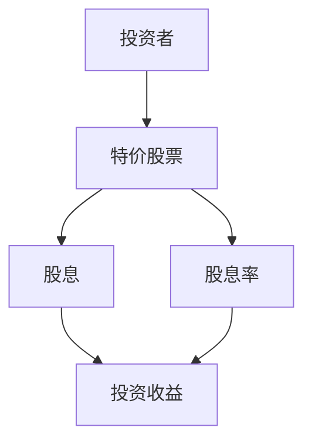
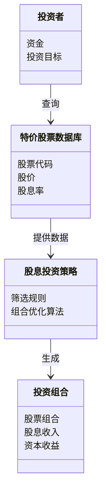
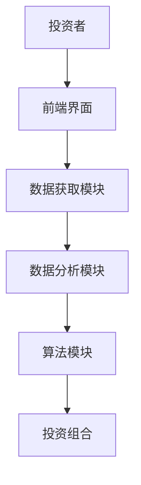
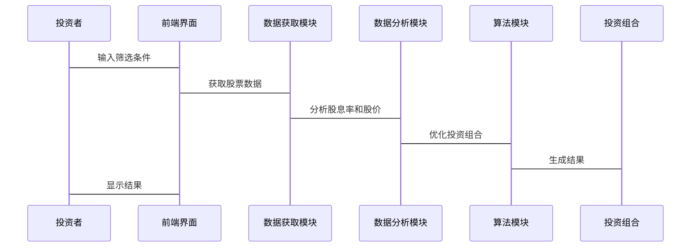

                 


# 特价股票与股息投资策略的结合

## 关键词：特价股票，股息投资，投资策略，股票分析，股息率

## 摘要：本文详细探讨了如何将特价股票与股息投资策略相结合，通过数学建模和系统设计，提出了一种优化的投资组合策略。文章从背景介绍、核心概念、算法原理、系统架构到项目实战，全面分析了这一策略的实现路径和实际应用，为投资者提供了科学的决策支持。

---

## 第1章: 特价股票与股息投资的背景介绍

### 1.1 特价股票的定义与特点
#### 1.1.1 什么是特价股票
特价股票是指在特定市场条件下，价格被低估的股票。这些股票通常具有较高的潜在回报率，但由于市场波动或其他因素，其价格未能反映其真实价值。

#### 1.1.2 特价股票的市场定位
特价股票通常出现在市场低迷时期，或公司遇到短期困难但具有长期增长潜力的情况下。投资者可以通过分析市盈率（P/E）和市净率（P/B）等指标来识别特价股票。

#### 1.1.3 特价股票的投资价值
特价股票的核心价值在于其价格被低估，投资者可以通过长期持有或在市场反弹时卖出获得超额收益。

### 1.2 股息投资的基本概念
#### 1.2.1 股息的定义与分类
股息是公司分配给股东的利润部分，按支付方式可分为现金股息、股票股息、财产股息等。现金股息是最常见的形式。

#### 1.2.2 股息投资的核心要素
股息投资关注的是股息收益率（Dividend Yield）和股息增长能力。高股息收益率的股票通常来自稳定的蓝筹公司。

#### 1.2.3 股息投资的市场环境
股息投资在低利率环境下更具吸引力，因为债券等固定收益产品收益率较低，而股票的股息收益相对较高。

### 1.3 特价股票与股息投资的结合意义
#### 1.3.1 结合投资的优势
通过结合特价股票和股息投资，投资者可以在市场低估时买入高股息率股票，既享受股息收入，又在股价回升时获得资本收益。

#### 1.3.2 市场需求与供给分析
当前市场中，许多投资者寻求稳定收益，而特价股票中的高股息股票正好满足这一需求。同时，公司通过高股息率吸引长期投资者，稳定股价。

#### 1.3.3 投资者行为分析
投资者在选择特价股票时，通常会关注股息率、市盈率、股息增长历史等因素，以评估股票的长期投资价值。

### 1.4 本章小结
本章介绍了特价股票和股息投资的基本概念，分析了两者结合的市场背景和投资优势，为后续策略分析奠定了基础。

---

## 第2章: 特价股票与股息投资的核心概念与联系

### 2.1 特价股票与股息投资的核心概念
#### 2.1.1 特价股票的属性特征
- 低市盈率（P/E < 市场平均值）
- 低市净率（P/B < 市场平均值）
- 高股息率（Dividend Yield > 市场平均值）

#### 2.1.2 股息投资的属性特征
- 稳定的股息收益
- 长期增长潜力
- 风险分散能力

#### 2.1.3 两者的核心要素对比
| 特性 | 特价股票 | 股息投资 |
|------|----------|----------|
| 目标 | 资本增值 | 现金收益 |
| 风险 | 较高     | 较低     |
| 收益 | 长期      | 短期和长期 |

### 2.2 特价股票与股息投资的联系
#### 2.2.1 股息率与股票价格的关系
股息率是衡量股票吸引力的重要指标，公式为：
$$ \text{股息率} = \frac{\text{股息/股}}{\text{股价}} \times 100\% $$

#### 2.2.2 特价股票的股息优势
特价股票通常具有较高的股息率，因为市场低估导致股价下降，而公司有能力维持或增加股息支付。

#### 2.2.3 股息投资在特价股票中的应用
投资者可以通过筛选高股息率的特价股票，构建一个既能产生股息收入又能获得资本增值的组合。

### 2.3 实体关系图


### 2.4 本章小结
本章通过对比分析，明确了特价股票和股息投资的核心概念及其联系，为后续策略制定提供了理论基础。

---

## 第3章: 特价股票与股息投资的数学模型与算法原理

### 3.1 特价股票的评估模型
#### 3.1.1 股票价值评估公式
$$ V = \frac{D}{r} $$
其中，\( V \) 为股票价值，\( D \) 为股息，\( r \) 为折现率。

#### 3.1.2 股票价格与股息率的关系
$$ P = \frac{D}{r} $$

### 3.2 股息投资的评估模型
#### 3.2.1 股息率计算公式
$$ \text{股息率} = \frac{\text{股息/股}}{\text{股价}} \times 100\% $$

#### 3.2.2 股息增长模型
$$ P = \frac{D_1}{r - g} $$
其中，\( D_1 \) 为第一年的股息，\( r \) 为折现率，\( g \) 为股息增长率。

### 3.3 特价股票与股息投资的组合模型
#### 3.3.1 组合投资的数学公式
$$ \text{组合收益} = w_1 \times R_1 + w_2 \times R_2 $$
其中，\( w \) 为权重，\( R \) 为收益。

#### 3.3.2 风险与收益的平衡
$$ \text{风险} = \sqrt{\text{Var}(R)} $$

---

## 第4章: 投资组合优化的系统分析

### 4.1 问题场景介绍
投资者希望通过量化方法筛选出高股息率的特价股票，构建一个最优投资组合。

### 4.2 系统功能设计


### 4.3 系统架构设计


### 4.4 系统交互设计


---

## 第5章: 项目实战——构建投资组合

### 5.1 环境安装
- Python 3.8+
- 数据分析库：pandas, numpy
- 可视化库：Matplotlib, Seaborn

### 5.2 核心实现代码
```python
import pandas as pd
import numpy as np

# 数据获取模块
def get_stock_data(tickers):
    return pd.DataFrame({
        'Ticker': tickers,
        'Price': np.random.uniform(10, 100, len(tickers)),
        'Dividend': np.random.uniform(1, 10, len(tickers))
    })

# 数据分析模块
def calculate_dividend_yield(stock_data):
    stock_data['Dividend Yield'] = stock_data['Dividend'] / stock_data['Price']
    return stock_data

# 算法模块
def optimize_portfolio(stock_data, weight=0.5):
    stock_data['Weight'] = np.random.dirichlet([weight] * len(stock_data), size=1)
    return stock_data

# 示例运行
tickers = ['AAPL', 'MSFT', 'GOOGL']
data = get_stock_data(tickers)
data = calculate_dividend_yield(data)
portfolio = optimize_portfolio(data)
print(portfolio)
```

### 5.3 代码解读与分析
- `get_stock_data`：生成随机股票数据，包括股票代码、价格和股息。
- `calculate_dividend_yield`：计算股息率，并添加到数据框中。
- `optimize_portfolio`：使用Dirichlet分布生成投资组合权重，权重反映了投资者对高股息股票的偏好。

### 5.4 实际案例分析
以苹果（AAPL）和微软（MSFT）为例，假设其股息率分别为2%和3%，股价分别为150和100。计算股息收益率：
$$ \text{AAPL股息收益率} = \frac{3}{150} = 2\% $$
$$ \text{MSFT股息收益率} = \frac{3}{100} = 3\% $$

---

## 第6章: 总结与展望

### 6.1 投资策略总结
- 优先选择高股息率的特价股票。
- 结合股息增长模型，评估股票的长期增长潜力。
- 定期调整投资组合，保持最优配置。

### 6.2 注意事项
- 风险提示：市场波动可能影响股价和股息收益。
- 数据质量：确保数据来源可靠，避免错误决策。
- 税务因素：考虑不同地区的税务政策，优化税后收益。

### 6.3 拓展阅读
- 建议阅读《股息率投资法》和《价值投资实战》等书籍，深入了解投资策略的理论基础。

---

## 作者：AI天才研究院/AI Genius Institute & 禅与计算机程序设计艺术 /Zen And The Art of Computer Programming

---

这篇文章系统地介绍了特价股票与股息投资策略的结合，从理论分析到实际操作，为投资者提供了全面的指导。通过数学建模和系统设计，投资者可以更好地理解和应用这一策略，实现稳健的投资收益。

