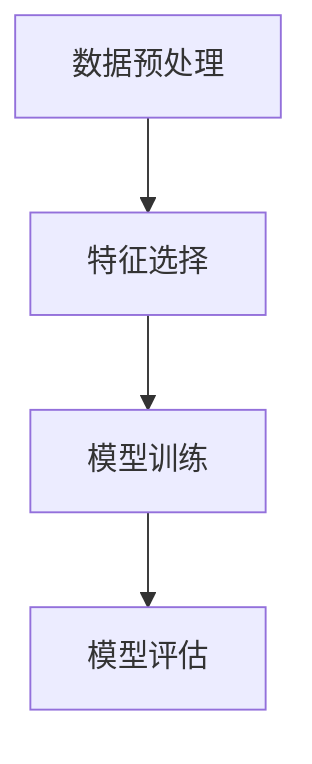
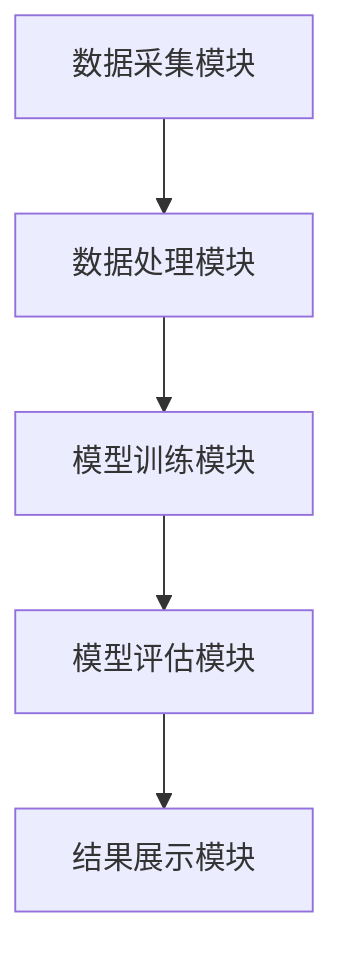
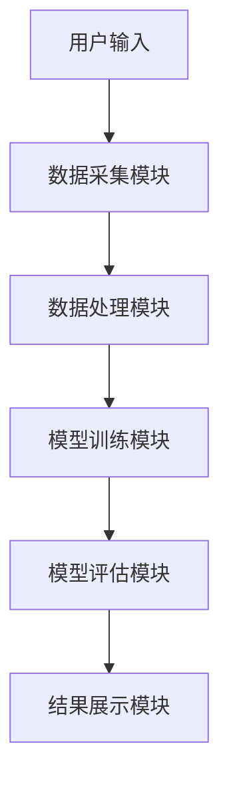

                 


# 特价股票投资中的Alpha世代消费行为分析与风险管理

> 关键词：Alpha世代，特价股票，消费行为分析，风险管理，数据挖掘，机器学习

> 摘要：Alpha世代作为新兴的投资者群体，其消费行为和风险管理策略在特价股票投资中具有重要影响。本文从Alpha世代的消费行为分析入手，结合数据挖掘和机器学习技术，探讨如何通过消费行为分析优化风险管理，从而提升特价股票投资的收益与稳定性。

---

## 第一部分: 特价股票投资与Alpha世代概述

### 1.1 特价股票投资的定义与特点

#### 1.1.1 特价股票的定义
特价股票是指那些市场价格低于其内在价值的股票。这些股票通常被市场低估，具有较大的上涨潜力。特价股票的核心特征包括：

1. 价格被市场低估。
2. 具有较高的安全边际。
3. 适合长期投资。

#### 1.1.2 特价股票的核心特点
特价股票的主要特点包括：
- **低估值**：市场价格低于内在价值。
- **高分红**：许多特价股票来自现金流充裕的公司。
- **行业龙头**：通常是行业内的龙头企业。

#### 1.1.3 特价股票与传统股票投资的区别
- **投资策略**：传统股票投资注重短期波动，而特价股票投资注重长期价值。
- **风险偏好**：特价股票投资风险较低，适合风险厌恶型投资者。
- **选股标准**：传统投资关注市场趋势，而特价股票投资关注公司基本面。

### 1.2 Alpha世代的定义与特征

#### 1.2.1 Alpha世代的定义
Alpha世代是指那些通过技术手段和数据分析，能够在金融市场中获得超额收益（Alpha）的投资者。他们通常具备以下特征：
- 依赖数据分析和算法进行投资决策。
- 善于利用技术工具优化投资策略。
- 对市场趋势有较强的敏感性。

#### 1.2.2 Alpha世代的消费行为特征
Alpha世代的消费行为具有以下特点：
- **理性化**：决策基于数据分析，而非情感驱动。
- **个性化**：根据个人风险偏好定制投资策略。
- **技术驱动**：依赖技术工具进行投资决策。

#### 1.2.3 Alpha世代与传统投资者的对比
- **决策方式**：Alpha世代依赖技术工具，而传统投资者更多依赖市场经验。
- **风险偏好**：Alpha世代倾向于通过技术手段降低风险，而传统投资者更多依赖市场直觉。
- **学习能力**：Alpha世代能够快速适应市场变化，而传统投资者则相对滞后。

### 1.3 特价股票投资的背景与意义

#### 1.3.1 特价股票投资的背景
随着金融市场的不断发展，越来越多的投资者开始关注特价股票。尤其是在市场波动加剧的情况下，特价股票因其低估值特性吸引了大量投资者。

#### 1.3.2 特价股票投资的意义
- **分散风险**：特价股票通常具有较高的安全边际，能够有效分散投资风险。
- **长期收益**：通过投资特价股票，投资者可以获得长期稳定的收益。
- **价值发现**：特价股票投资的核心在于发现市场低估的公司。

#### 1.3.3 Alpha世代在特价股票投资中的作用
Alpha世代作为新兴的投资者群体，凭借其技术优势和数据分析能力，在特价股票投资中扮演着重要角色。他们能够通过技术手段快速发现市场低估的股票，并制定相应的投资策略。

---

## 第二部分: Alpha世代消费行为分析的核心概念

### 2.1 消费行为分析的定义与方法

#### 2.1.1 消费行为分析的定义
消费行为分析是指通过数据分析技术，研究消费者在购买商品或服务时的行为模式和决策过程。其目的是为了帮助企业更好地理解消费者需求，优化产品和服务。

#### 2.1.2 消费行为分析的主要方法
消费行为分析的主要方法包括：
- **定量分析**：通过统计分析技术，研究消费者的行为数据。
- **定性分析**：通过访谈、问卷调查等方式，了解消费者的决策过程。
- **机器学习**：利用机器学习算法，预测消费者的购买行为。

#### 2.1.3 消费行为分析在金融领域的应用
在金融领域，消费行为分析主要用于以下几个方面：
- **投资者行为分析**：通过分析投资者的交易记录，预测其投资行为。
- **风险管理**：通过消费行为分析，识别潜在的市场风险。
- **产品推荐**：通过分析投资者的消费行为，推荐适合的投资产品。

### 2.2 Alpha世代消费行为的核心要素

#### 2.2.1 消费心理与行为特征
Alpha世代的消费心理和行为特征包括：
- **理性化**：决策基于数据分析。
- **个性化**：投资策略因人而异。
- **技术依赖**：依赖技术工具进行决策。

#### 2.2.2 消费决策的关键因素
Alpha世代在投资决策时，通常考虑以下关键因素：
- **公司基本面**：包括盈利能力、财务状况等。
- **市场趋势**：包括行业趋势、市场周期等。
- **技术指标**：包括股价走势、成交量等。

#### 2.2.3 Alpha世代的消费趋势与偏好
Alpha世代的消费趋势和偏好包括：
- **技术创新**：倾向于选择具有技术创新能力的公司。
- **可持续发展**：关注公司社会责任和可持续发展。
- **风险管理**：注重投资组合的风险管理。

### 2.3 特价股票投资中的消费行为分析

#### 2.3.1 特价股票与消费行为的关系
特价股票的投资行为与消费者的消费行为密切相关。通过分析消费者的消费行为，可以预测其在特价股票投资中的行为模式。

#### 2.3.2 Alpha世代在特价股票投资中的行为模式
Alpha世代在特价股票投资中的行为模式包括：
- **技术驱动**：依赖技术工具进行投资决策。
- **数据驱动**：通过数据分析发现市场低估的股票。
- **长期投资**：注重长期价值，而非短期收益。

#### 2.3.3 特价股票投资中的消费行为分析框架
消费行为分析框架包括以下几个步骤：
1. **数据采集**：收集投资者的交易记录和市场数据。
2. **数据清洗**：对数据进行预处理，去除噪声。
3. **数据分析**：利用统计分析和机器学习技术，分析投资者的行为模式。
4. **行为建模**：构建消费行为模型，预测投资者的未来行为。

---

## 第三部分: 特价股票投资中的风险管理

### 3.1 风险管理的定义与重要性

#### 3.1.1 风险管理的定义
风险管理是指通过识别、评估和控制风险，以减少其对投资目标的负面影响。其目的是为了确保投资收益的稳定性。

#### 3.1.2 风险管理的重要性
- **保护投资本金**：通过风险管理，可以有效避免本金损失。
- **提高投资收益**：通过合理管理风险，可以提高投资收益。
- **降低投资风险**：通过识别和控制风险，可以降低投资风险。

### 3.2 特价股票投资中的主要风险

#### 3.2.1 市场风险
市场风险是指由于市场价格波动导致的投资损失。其主要影响因素包括市场周期、政策变化等。

#### 3.2.2 信用风险
信用风险是指由于债券发行人违约导致的投资损失。其主要影响因素包括发行人的信用状况、经济环境等。

#### 3.2.3 流动性风险
流动性风险是指由于市场流动性不足，导致无法以合理价格买卖资产的风险。其主要影响因素包括市场深度、资产类型等。

#### 3.2.4 操作风险
操作风险是指由于操作失误或内部控制系统不足导致的投资损失。其主要影响因素包括操作流程、内部管理等。

### 3.3 Alpha世代消费行为对风险管理的影响

#### 3.3.1 Alpha世代的消费行为对投资风险的影响
Alpha世代的消费行为对投资风险的影响主要体现在以下几个方面：
- **技术驱动**：通过技术手段降低投资风险。
- **数据驱动**：通过数据分析优化风险管理。
- **长期投资**：通过长期投资降低短期波动风险。

#### 3.3.2 Alpha世代在风险管理中的角色
Alpha世代在风险管理中的角色包括：
- **风险识别**：通过数据分析识别潜在风险。
- **风险评估**：通过模型评估风险的严重程度。
- **风险控制**：通过技术手段控制风险。

#### 3.3.3 如何通过消费行为分析优化风险管理
通过消费行为分析优化风险管理的具体方法包括：
1. **数据驱动的风险识别**：通过数据分析识别潜在风险。
2. **行为驱动的风险评估**：通过分析投资者行为评估风险。
3. **技术驱动的风险控制**：通过技术手段控制风险。

---

## 第四部分: 特价股票投资中的Alpha世代消费行为分析模型

### 4.1 数据挖掘与机器学习在消费行为分析中的应用

#### 4.1.1 数据挖掘的定义与特点
数据挖掘是指从大量数据中提取有用信息的过程。其特点是通过自动化技术发现数据中的模式和趋势。

#### 4.1.2 机器学习在消费行为分析中的应用
机器学习是一种人工智能技术，通过训练模型从数据中学习规律。其在消费行为分析中的应用包括：
- **分类**：预测消费者的投资行为。
- **回归**：预测股票价格走势。
- **聚类**：识别投资者的消费行为模式。

#### 4.1.3 数据挖掘与机器学习的结合
数据挖掘与机器学习的结合可以有效提高消费行为分析的准确性。其具体应用包括：
- **特征选择**：通过数据挖掘技术选择关键特征。
- **模型训练**：通过机器学习技术训练消费行为模型。
- **结果分析**：通过数据挖掘技术分析模型结果。

### 4.2 Alpha世代消费行为分析的算法原理

#### 4.2.1 算法原理概述
消费行为分析的算法原理包括以下几个步骤：
1. **数据预处理**：对数据进行清洗和转换。
2. **特征选择**：选择对消费行为影响较大的特征。
3. **模型训练**：通过机器学习算法训练消费行为模型。
4. **模型评估**：评估模型的准确性和稳定性。

#### 4.2.2 算法流程图


#### 4.2.3 算法实现步骤
1. **数据预处理**：包括数据清洗、数据转换等。
2. **特征选择**：通过相关性分析选择关键特征。
3. **模型训练**：使用机器学习算法（如随机森林、支持向量机等）训练消费行为模型。
4. **模型评估**：通过交叉验证评估模型的准确性和稳定性。

### 4.3 特价股票投资中的消费行为分析模型

#### 4.3.1 模型构建
消费行为分析模型的构建包括以下几个步骤：
1. **数据采集**：收集投资者的交易记录和市场数据。
2. **数据清洗**：对数据进行预处理，去除噪声。
3. **特征选择**：选择对消费行为影响较大的特征。
4. **模型训练**：通过机器学习算法训练消费行为模型。
5. **模型评估**：评估模型的准确性和稳定性。

#### 4.3.2 模型实现
消费行为分析模型的实现步骤包括：
1. **数据预处理**：对数据进行清洗和转换。
2. **特征选择**：通过相关性分析选择关键特征。
3. **模型训练**：使用随机森林算法训练消费行为模型。
4. **模型评估**：通过交叉验证评估模型的准确性和稳定性。

#### 4.3.3 模型应用
消费行为分析模型的应用包括：
- **风险预测**：通过模型预测投资者的风险偏好。
- **投资决策**：通过模型优化投资组合。
- **市场分析**：通过模型分析市场趋势。

---

## 第五部分: 特价股票投资中的Alpha世代消费行为分析模型实现

### 5.1 系统架构设计

#### 5.1.1 系统功能设计
消费行为分析系统的功能设计包括以下几个模块：
1. **数据采集模块**：负责采集投资者的交易记录和市场数据。
2. **数据处理模块**：负责对数据进行清洗和转换。
3. **模型训练模块**：负责训练消费行为分析模型。
4. **模型评估模块**：负责评估模型的准确性和稳定性。
5. **结果展示模块**：负责展示模型的分析结果。

#### 5.1.2 系统架构图


#### 5.1.3 系统接口设计
系统接口设计包括以下几个部分：
1. **数据接口**：负责与数据源对接。
2. **模型接口**：负责与机器学习算法对接。
3. **结果接口**：负责与结果展示模块对接。

#### 5.1.4 系统交互流程图


### 5.2 系统核心实现源代码

#### 5.2.1 数据预处理代码
```python
import pandas as pd
from sklearn.preprocessing import StandardScaler

# 数据加载
data = pd.read_csv('data.csv')

# 数据清洗
data = data.dropna()
data = data.drop_duplicates()

# 数据转换
scaler = StandardScaler()
scaled_data = scaler.fit_transform(data)
```

#### 5.2.2 特征选择代码
```python
from sklearn.feature_selection import SelectKBest
from sklearn.feature_selection import chi2

# 特征选择
selector = SelectKBest(score_func=chi2, k=5)
selected_features = selector.fit_transform(data)
```

#### 5.2.3 模型训练代码
```python
from sklearn.ensemble import RandomForestClassifier
from sklearn.model_selection import train_test_split

# 模型训练
X_train, X_test, y_train, y_test = train_test_split(selected_features, labels, test_size=0.2)
model = RandomForestClassifier(n_estimators=100)
model.fit(X_train, y_train)
```

#### 5.2.4 模型评估代码
```python
from sklearn.metrics import accuracy_score

# 模型评估
y_pred = model.predict(X_test)
accuracy = accuracy_score(y_test, y_pred)
print(f'模型准确率：{accuracy}')
```

---

## 第六部分: 项目实战

### 6.1 环境安装

#### 6.1.1 安装Python
安装Python 3.8或更高版本。

#### 6.1.2 安装依赖库
安装以下依赖库：
```bash
pip install numpy pandas scikit-learn
```

### 6.2 核心实现

#### 6.2.1 数据预处理
```python
import pandas as pd
import numpy as np

# 数据加载
data = pd.read_csv('data.csv')

# 数据清洗
data = data.dropna()
data = data.drop_duplicates()

# 数据转换
scaled_data = data.apply(lambda x: (x - x.mean()) / x.std())
```

#### 6.2.2 特征选择
```python
from sklearn.feature_selection import SelectKBest
from sklearn.feature_selection import chi2

# 特征选择
selector = SelectKBest(score_func=chi2, k=5)
selected_features = selector.fit_transform(data)
```

#### 6.2.3 模型训练
```python
from sklearn.ensemble import RandomForestClassifier
from sklearn.model_selection import train_test_split

# 模型训练
X_train, X_test, y_train, y_test = train_test_split(selected_features, labels, test_size=0.2)
model = RandomForestClassifier(n_estimators=100)
model.fit(X_train, y_train)
```

#### 6.2.4 模型评估
```python
from sklearn.metrics import accuracy_score

# 模型评估
y_pred = model.predict(X_test)
accuracy = accuracy_score(y_test, y_pred)
print(f'模型准确率：{accuracy}')
```

### 6.3 实际案例分析

#### 6.3.1 数据准备
```python
import pandas as pd

# 数据加载
data = pd.read_csv('data.csv')

# 数据清洗
data = data.dropna()
data = data.drop_duplicates()
```

#### 6.3.2 特征工程
```python
from sklearn.feature_selection import SelectKBest
from sklearn.feature_selection import chi2

# 特征选择
selector = SelectKBest(score_func=chi2, k=5)
selected_features = selector.fit_transform(data)
```

#### 6.3.3 模型训练
```python
from sklearn.ensemble import RandomForestClassifier
from sklearn.model_selection import train_test_split

# 模型训练
X_train, X_test, y_train, y_test = train_test_split(selected_features, labels, test_size=0.2)
model = RandomForestClassifier(n_estimators=100)
model.fit(X_train, y_train)
```

#### 6.3.4 模型评估
```python
from sklearn.metrics import accuracy_score

# 模型评估
y_pred = model.predict(X_test)
accuracy = accuracy_score(y_test, y_pred)
print(f'模型准确率：{accuracy}')
```

---

## 第七部分: 总结与展望

### 7.1 总结
本文从Alpha世代的消费行为分析入手，结合数据挖掘和机器学习技术，探讨了如何通过消费行为分析优化风险管理，从而提升特价股票投资的收益与稳定性。通过构建消费行为分析模型，能够有效识别投资者的行为模式，优化投资决策，降低投资风险。

### 7.2 展望
未来的研究可以进一步探讨以下方向：
- **多模态数据分析**：结合文本、图像等多种数据源进行消费行为分析。
- **实时分析**：开发实时消费行为分析系统，提高风险管理的及时性。
- **个性化投资策略**：根据投资者的消费行为定制个性化投资策略。

---

## 附录

### A. 参考文献
1. 书籍：《算法导论》
2. 书籍：《机器学习实战》
3. 网站：Kaggle数据分析平台

### B. 工具推荐
1. Python编程语言
2. 数据处理工具：Pandas、NumPy
3. 机器学习库：Scikit-learn
4. 可视化工具：Matplotlib、Seaborn

---

## 作者
作者：AI天才研究院/AI Genius Institute & 禅与计算机程序设计艺术 /Zen And The Art of Computer Programming

---

以上是《特价股票投资中的Alpha世代消费行为分析与风险管理》的技术博客文章的完整内容。文章通过数据分析和机器学习技术，深入探讨了Alpha世代的消费行为及其对风险管理的影响，为投资者提供了理论依据和实践指导。

