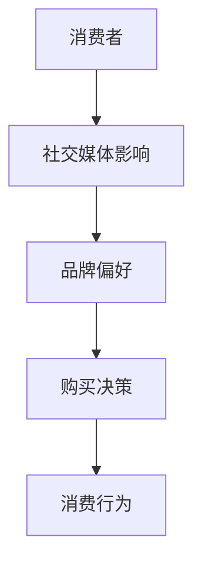
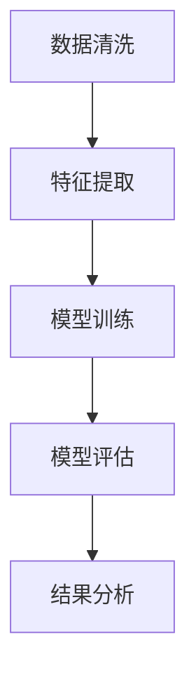
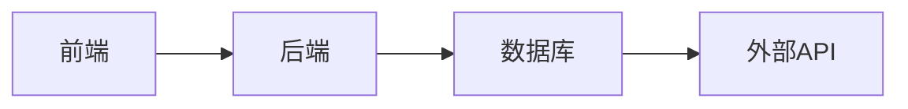

                 


# 特价股票投资中的Z世代消费行为分析与风险管理

---

## 关键词：Z世代、股票投资、消费行为、风险管理、数据分析、人工智能

---

## 摘要

本文探讨Z世代在特价股票投资中的消费行为及其风险管理策略。通过分析Z世代的消费特征、行为模式及投资偏好，结合数据分析与建模，提出风险管理框架和系统设计，旨在为投资者提供科学的决策支持。

---

## 第一章：特价股票投资与Z世代消费行为概述

### 1.1 特价股票投资的背景

#### 1.1.1 特价股票投资的定义与特点
- 特价股票：指市场估值低于其内在价值的股票，具有较高的投资潜力。
- 投资特点：追求价值，注重长期收益，适合风险承受能力较高的投资者。

#### 1.1.2 Z世代的消费行为特征
- **定义**：Z世代指出生于1990年代至2000年代初的年轻人，消费行为呈现数字化、个性化、社交化特征。
- **消费特征**：偏好线上购物、注重品牌与体验、受社交媒体影响大。

#### 1.1.3 特价股票投资与Z世代消费行为的结合
- 投资行为延伸：Z世代将消费领域的数字化、个性化经验应用于投资领域。
- 投资偏好：偏好高增长、高潜力的新兴行业，如科技、互联网、消费升级等。

---

### 1.2 Z世代消费行为对投资的影响

#### 1.2.1 消费习惯与投资偏好
- Z世代在消费中注重品牌和体验，投资中也倾向于选择熟悉的行业和品牌。
- 社交媒体影响：通过社交媒体获取投资信息，依赖KOL和社区推荐。

#### 1.2.2 投资行为中的风险因素
- 缺乏投资经验：容易受情绪驱动，忽视风险。
- 过度依赖社交媒体：信息可靠性不足，可能导致决策偏差。

---

## 第二章：Z世代消费行为分析

### 2.1 消费行为的核心特征

#### 2.1.1 数据来源与分析方法
- 数据来源：社交媒体数据、电商平台数据、问卷调查。
- 分析方法：聚类分析、关联规则挖掘、情感分析。

#### 2.1.2 消费行为模型



---

### 2.2 投资行为中的消费倾向

#### 2.2.1 行为模式分析
- 高频交易：Z世代倾向于短期操作，追求快速收益。
- 社交化投资：通过社交平台分享投资经验，形成社区化投资氛围。

#### 2.2.2 风险偏好
- 高风险偏好：愿意承担较高风险以获取高收益。
- 心理因素：受情绪影响较大，容易产生非理性决策。

---

## 第三章：风险管理在特价股票投资中的重要性

### 3.1 风险管理的基本概念

#### 3.1.1 风险的定义与分类
- **市场风险**：整体市场波动导致的损失。
- **流动性风险**：资产难以快速变现的风险。
- **信用风险**：发行人违约的风险。

#### 3.1.2 风险管理的目标与方法
- 目标：将风险控制在可承受范围内，实现投资收益最大化。
- 方法：分散投资、风险对冲、止损策略。

---

### 3.2 风险管理的具体策略

#### 3.2.1 风险识别
- 通过数据分析识别潜在风险点，如行业风险、公司基本面变化等。

#### 3.2.2 风险评估
- 使用VaR（Value at Risk）模型评估潜在损失。

#### 3.2.3 风险控制
- 制定止损策略，如设定最大损失比例。
- 使用对冲工具，如股指期货。

---

## 第四章：数据分析与建模

### 4.1 数据分析流程



---

### 4.2 模型选择与实现

#### 4.2.1 数据预处理
- 清洗数据：去除缺失值、异常值。
- 标准化：归一化处理，便于模型训练。

#### 4.2.2 特征选择
- 使用Lasso回归进行特征筛选，去除无关特征。

#### 4.2.3 模型训练
- 算法选择：随机森林、XGBoost。
- 超参数调优：网格搜索或贝叶斯优化。

#### 4.2.4 模型评估
- 使用ROC-AUC曲线评估分类模型性能。

---

## 第五章：系统设计与实现

### 5.1 系统功能设计

#### 5.1.1 功能模块
- 数据采集模块：收集市场数据、用户行为数据。
- 风险评估模块：评估投资风险。
- 投资建议模块：提供个性化投资建议。

#### 5.1.2 系统架构



---

### 5.2 系统实现

#### 5.2.1 环境安装
- Python版本：3.8+
- 库依赖：pandas、numpy、scikit-learn、xgboost。

#### 5.2.2 核心代码实现
```python
import pandas as pd
from sklearn.ensemble import RandomForestClassifier
from sklearn.metrics import accuracy_score

# 数据加载
data = pd.read_csv('data.csv')

# 特征与标签分离
X = data.drop('target', axis=1)
y = data['target']

# 模型训练
model = RandomForestClassifier()
model.fit(X, y)

# 预测与评估
y_pred = model.predict(X)
print(f"Accuracy: {accuracy_score(y, y_pred)}")
```

---

## 第六章：项目实战与案例分析

### 6.1 项目背景

#### 6.1.1 项目目标
- 构建一个基于Z世代消费行为分析的投资决策系统。

#### 6.1.2 数据收集与处理
- 收集Z世代投资者的消费数据和投资行为数据。

### 6.2 核心代码实现

#### 6.2.1 数据预处理
```python
# 数据清洗
data = data.dropna()
data = pd.get_dummies(data)
```

#### 6.2.2 模型训练与优化
```python
# 超参数调优
from sklearn.model_selection import GridSearchCV

param_grid = {'n_estimators': [100, 200], 'max_depth': [None, 5]}
grid_search = GridSearchCV(RandomForestClassifier(), param_grid, cv=5)
grid_search.fit(X, y)
best_model = grid_search.best_estimator_
```

---

## 第七章：结论与展望

### 7.1 研究总结

- 本文通过分析Z世代的消费行为，构建了风险管理模型，并设计了投资决策系统。

### 7.2 未来展望

- 进一步结合人工智能技术，优化投资策略。
- 探讨更多Z世代行为特征对投资的影响。

---

## 作者信息

作者：AI天才研究院/AI Genius Institute & 禅与计算机程序设计艺术 /Zen And The Art of Computer Programming

---

通过以上结构，文章系统地分析了Z世代在特价股票投资中的消费行为，并结合风险管理策略和数据分析模型，为投资者提供了科学的决策支持。

