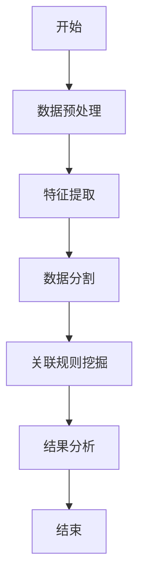
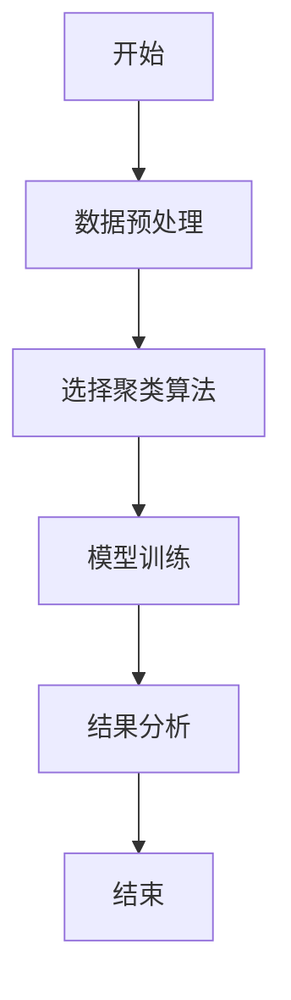
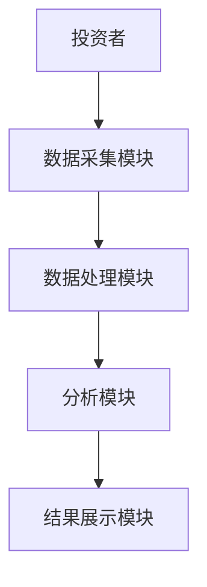
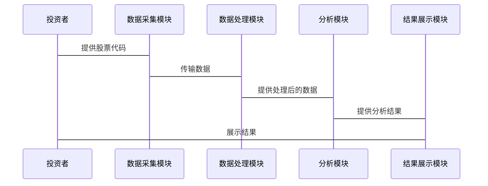

                 


# 特价股票投资中的产业互联网分析方法

> 关键词：特价股票，产业互联网，数据分析，投资策略，算法原理，系统架构

> 摘要：本文深入探讨了特价股票投资中产业互联网的分析方法，从背景、核心概念、算法原理到系统架构设计，结合实际案例，详细阐述了如何利用产业互联网技术进行股票投资分析，为投资者提供科学的决策支持。

---

# 第一部分: 特价股票投资中的产业互联网分析方法概述

## 第1章: 特价股票投资与产业互联网概述

### 1.1 特价股票投资的基本概念

#### 1.1.1 什么是特价股票
特价股票是指那些市场价格显著低于其内在价值，或是相对于市场平均水平大幅折价的股票。这类股票通常具有较高的潜在回报，但也伴随着较高的风险。

#### 1.1.2 特价股票的投资特点
- **低估值**：市场价格低于合理估值。
- **高波动性**：价格波动较大，容易出现短期套利机会。
- **周期性**：通常出现在市场低迷或特定行业危机时。

#### 1.1.3 特价股票与普通股票的区别
| 特性 | 特价股票 | 普通股票 |
|------|----------|----------|
| 估值 | 通常低估值 | 估值合理或高估 |
| 风险 | 风险较高 | 风险适中 |
| 投资策略 | 偏好长期持有，等待价值回归 | 更注重长期增长 |

### 1.2 产业互联网的基本概念

#### 1.2.1 什么是产业互联网
产业互联网是指将互联网技术与传统产业深度融合，通过数据化、网络化和智能化的方式，优化传统产业的生产、管理、服务等环节，形成新的产业生态。

#### 1.2.2 产业互联网的核心特征
- **数据驱动**：依赖大数据分析和处理。
- **智能化**：利用人工智能技术实现自动化决策。
- **平台化**：构建开放的产业平台，连接产业链上下游。

#### 1.2.3 产业互联网与传统互联网的区别
| 特性 | 产业互联网 | 传统互联网 |
|------|------------|------------|
| 应用场景 | 传统产业的全链条改造 | 信息传播、社交、娱乐 |
| 技术深度 | 高度依赖行业数据和专业知识 | 更注重通用性技术 |
| 目标 | 优化产业效率，创造新商业模式 | 提供信息服务 |

### 1.3 特价股票投资中的产业互联网分析方法

#### 1.3.1 产业互联网对股票投资的影响
- **数据丰富性**：通过产业互联网获取更全面的行业数据。
- **分析深度**：利用大数据和人工智能技术进行深度分析。
- **决策效率**：提高投资决策的效率和准确性。

#### 1.3.2 产业互联网在特价股票分析中的应用
- **行业数据分析**：分析行业景气度、企业盈利状况等。
- **企业关联性分析**：通过产业链数据，识别潜在的投资机会。
- **风险预警**：利用大数据进行风险评估和预警。

#### 1.3.3 产业互联网分析方法的核心优势
- **精准性**：基于海量数据的分析，提高投资决策的精准性。
- **实时性**：能够实时跟踪市场动态，快速做出反应。
- **全面性**：覆盖产业链的各个环节，提供全面的分析视角。

### 1.4 本章小结
本章介绍了特价股票和产业互联网的基本概念，并重点阐述了产业互联网在特价股票分析中的应用和优势，为后续的分析奠定了基础。

---

## 第2章: 特价股票投资的背景与现状分析

### 2.1 特价股票投资的背景

#### 2.1.1 经济周期与特价股票投资
经济周期波动是影响股票价格的重要因素。在经济下行周期，许多优质企业可能会出现低估值，成为特价股票的投资机会。

#### 2.1.2 市场波动与特价股票机会
市场波动越大，特价股票的投资机会越多。通过产业互联网技术，投资者可以更好地捕捉市场波动带来的投资机会。

#### 2.1.3 投资者行为与特价股票选择
投资者的行为往往受到市场情绪的影响，但通过产业互联网分析，可以减少情绪化决策，提高投资的理性化。

### 2.2 产业互联网的发展现状

#### 2.2.1 产业互联网的技术发展
随着大数据、人工智能和区块链等技术的快速发展，产业互联网正在向智能化、平台化方向发展。

#### 2.2.2 产业互联网在各行业的应用
- **制造业**：智能化生产、供应链优化。
- **金融行业**：大数据风控、智能投顾。
- **零售业**：个性化推荐、全渠道营销。

#### 2.2.3 产业互联网对股票市场的推动作用
- 提供了更丰富的数据支持。
- 优化了企业的运营效率。
- 创新了金融产品的商业模式。

### 2.3 特价股票投资中的产业互联网挑战

#### 2.3.1 数据获取与处理的难点
- 数据分散：产业链数据分布在不同平台，整合难度大。
- 数据质量：数据可能存在缺失或不准确的情况。
- 数据处理：需要处理海量数据，计算资源消耗大。

#### 2.3.2 产业互联网分析的局限性
- 技术门槛高：需要专业的技术团队支持。
- 分析模型的局限性：模型可能无法完全捕捉市场复杂性。
- 市场的不确定性：市场波动可能导致分析结果失效。

#### 2.3.3 技术与市场的匹配问题
- 技术与产业的匹配度：技术是否能够真正解决产业问题。
- 市场接受度：市场对新技术的接受程度。

### 2.4 本章小结
本章分析了特价股票投资的背景和产业互联网的发展现状，指出了在实际应用中可能面临的挑战，为后续的分析方法提供了背景支持。

---

## 第3章: 产业互联网分析的核心概念与联系

### 3.1 产业互联网的实体关系分析

#### 3.1.1 产业实体的ER图设计
以下是产业互联网中的核心实体关系图（使用Mermaid绘制）：

```mermaid
erDiagram
    actor 投资者 {
        <字段> 股票代码 : 字符串
        <字段> 投资金额 : 数值
        <字段> 投资时间 : 日期
    }
    actor 企业 {
        <字段> 企业代码 : 字符串
        <字段> 营收 : 数值
        <字段> 利润 : 数值
    }
    actor 行业 {
        <字段> 行业代码 : 字符串
        <字段> 行业指数 : 数值
    }
   投资者 --> 企业 : 持股关系
   企业 --> 行业 : 所属行业关系
```

#### 3.1.2 产业互联网的核心实体关系
- **投资者**：包括个人和机构投资者。
- **企业**：上市公司或非上市公司。
- **行业**：行业指数和行业动态。

#### 3.1.3 实体关系图的分析与应用
通过实体关系图，可以清晰地看到投资者、企业和行业之间的关系，为后续的数据分析提供基础。

### 3.2 产业互联网分析方法的数学模型

#### 3.2.1 产业互联网分析的基本公式
以下是关联规则挖掘的基本公式（使用LaTeX表示）：

$$ \text{支持度} = \frac{\text{事务集中同时包含A和B的次数}}{\text{总事务数}} $$

#### 3.2.2 数据关联性分析的数学表达
- **关联规则挖掘**：用于发现数据中的关联性。
- **聚类分析**：用于将相似的企业或行业进行分组。

#### 3.2.3 产业互联网分析的指标体系
| 指标 | 定义 | 作用 |
|------|------|------|
| 支持度 | 关联规则中的重要指标 | 用于评估规则的重要性 |
| 置信度 | 关联规则的另一个重要指标 | 用于评估规则的可靠性 |
| 聚类系数 | 衡量网络中节点的聚类程度 | 用于分析行业间的关联性 |

### 3.3 产业互联网分析方法的算法原理

#### 3.3.1 数据预处理与特征提取
- 数据清洗：去除无效数据。
- 特征提取：从数据中提取有意义的特征。

#### 3.3.2 关联规则挖掘算法
以下是关联规则挖掘的流程图（使用Mermaid绘制）：



#### 3.3.3 聚类分析与分类算法
以下是聚类分析的流程图：



### 3.4 本章小结
本章通过ER图和数学模型，详细阐述了产业互联网分析的核心概念和算法原理，为后续的分析方法提供了理论基础。

---

## 第4章: 产业互联网分析的算法原理与实现

### 4.1 算法原理概述

#### 4.1.1 关联规则挖掘算法
关联规则挖掘用于发现数据中的关联性，常用于分析企业的市场行为和行业动态。

#### 4.1.2 聚类分析算法
聚类分析用于将相似的企业或行业分组，便于后续的分析和决策。

#### 4.1.3 分类算法
分类算法用于预测企业的未来表现，如是否盈利、是否值得投资等。

### 4.2 算法实现

#### 4.2.1 数据预处理与特征提取
以下是数据预处理的代码示例：

```python
import pandas as pd
data = pd.read_csv('stock_data.csv')
data = data.dropna()
data = data.drop_duplicates()
```

#### 4.2.2 算法实现代码
以下是关联规则挖掘的代码示例：

```python
from mlxtend.frequent_patterns import apriori
from mlxtend.frequent_patterns import association_rules

# 使用apriori算法提取频繁项集
frequent_items = apriori(data, min_support=0.5, use_colnames=True)

# 生成关联规则
rules = association_rules(frequent_items, metric='confidence')

# 打印结果
print(rules)
```

#### 4.2.3 算法结果分析
通过关联规则挖掘，可以发现企业之间的关联性，如某行业的产品需求增加可能带动相关行业的增长。

### 4.3 算法的数学模型与公式

#### 4.3.1 关联规则挖掘的公式
支持度公式：
$$ \text{支持度} = \frac{\text{事务集中同时包含A和B的次数}}{\text{总事务数}} $$

置信度公式：
$$ \text{置信度} = \frac{\text{事务集中同时包含A和B的次数}}{\text{事务集中包含A的次数}} $$

#### 4.3.2 聚类分析的数学模型
聚类分析通常使用距离度量，如欧氏距离：
$$ \text{距离} = \sqrt{(x_2 - x_1)^2 + (y_2 - y_1)^2} $$

#### 4.3.3 分类算法的数学表达
决策树分类算法：
$$ \text{预测类别} = \argmax_{c} P(c | x_1, x_2, ..., x_n) $$

### 4.4 本章小结
本章详细介绍了产业互联网分析的算法原理，并通过代码示例展示了如何实现这些算法，为后续的系统设计提供了技术支持。

---

## 第5章: 产业互联网分析系统的架构设计

### 5.1 系统功能设计

#### 5.1.1 数据采集模块
负责采集股票数据、行业数据等。

#### 5.1.2 数据处理模块
对数据进行清洗、转换和特征提取。

#### 5.1.3 分析模块
包括关联规则挖掘、聚类分析等功能。

#### 5.1.4 结果展示模块
将分析结果以可视化的方式展示给用户。

### 5.2 系统架构设计

#### 5.2.1 微服务架构
以下是系统架构图（使用Mermaid绘制）：



#### 5.2.2 系统交互流程图
以下是系统交互流程图（使用Mermaid绘制）：



### 5.3 本章小结
本章设计了产业互联网分析系统的架构，明确了各模块的功能和交互流程，为后续的系统实现提供了指导。

---

## 第6章: 项目实战——基于产业互联网的特价股票分析

### 6.1 环境安装

#### 6.1.1 安装Python环境
使用Anaconda安装Python 3.8及以上版本。

#### 6.1.2 安装依赖库
安装Pandas、NumPy、Scikit-learn、MLxtend等库。

### 6.2 系统核心实现源代码

#### 6.2.1 数据采集模块
```python
import requests
import pandas as pd

def get_stock_data(symbol):
    url = f"https://api.example.com/stock/{symbol}"
    response = requests.get(url)
    data = response.json()
    return pd.DataFrame(data)
```

#### 6.2.2 数据处理模块
```python
def preprocess_data(data):
    data = data.dropna()
    data = data.drop_duplicates()
    return data
```

#### 6.2.3 分析模块
```python
from mlxtend.frequent_patterns import apriori, association_rules

def analyze_data(data):
    frequent_items = apriori(data, min_support=0.5, use_colnames=True)
    rules = association_rules(frequent_items, metric='confidence')
    return rules
```

#### 6.2.4 结果展示模块
```python
import matplotlib.pyplot as plt

def visualize_results(rules):
    plt.figure(figsize=(10, 6))
    rules['confidence'].hist(bins=10)
    plt.title('关联规则置信度分布')
    plt.xlabel('置信度')
    plt.ylabel('频数')
    plt.show()
```

### 6.3 代码应用解读与分析

#### 6.3.1 数据采集
从API获取股票数据，包括股票代码、营收、利润等信息。

#### 6.3.2 数据处理
对数据进行清洗，去除无效数据和重复数据。

#### 6.3.3 数据分析
使用关联规则挖掘算法，发现企业之间的关联性。

#### 6.3.4 结果展示
将分析结果以可视化的方式展示，帮助投资者更好地理解数据。

### 6.4 实际案例分析与详细讲解剖析

#### 6.4.1 案例背景
假设当前市场中某行业出现低估值企业，投资者希望通过产业互联网分析方法寻找投资机会。

#### 6.4.2 数据采集与处理
从API获取相关行业数据，并进行清洗和转换。

#### 6.4.3 分析过程
使用关联规则挖掘算法，发现某行业的产品需求增加可能带动相关企业的增长。

#### 6.4.4 投资建议
基于分析结果，建议投资者关注相关企业的投资机会。

### 6.5 本章小结
本章通过实际案例，详细展示了如何利用产业互联网分析方法进行特价股票投资分析，并给出了具体的投资建议。

---

## 第7章: 总结与展望

### 7.1 本章小结
总结全文，回顾了产业互联网分析方法在特价股票投资中的应用，包括背景、核心概念、算法原理和系统架构设计。

### 7.2 最佳实践 tips
- 数据获取要准确。
- 算法选择要合理。
- 结果分析要深入。

### 7.3 注意事项
- 数据分析需要结合市场实际情况。
- 投资决策要综合考虑多种因素。
- 系统设计要注重可扩展性和可维护性。

### 7.4 拓展阅读
推荐阅读《大数据投资策略》、《人工智能在金融中的应用》等相关书籍。

---

## 作者信息

作者：AI天才研究院/AI Genius Institute & 禅与计算机程序设计艺术 /Zen And The Art of Computer Programming

---

# 本文结束

