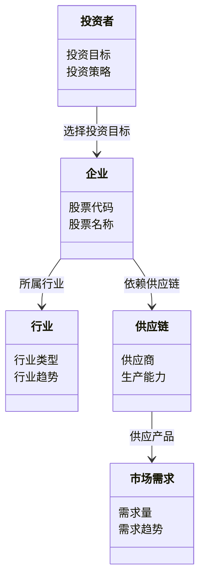
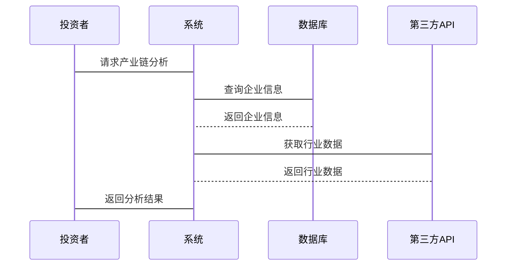

                 


# 特价股票投资中的产业链分析方法

## 关键词：特价股票、产业链分析、投资策略、数学模型、系统设计

## 摘要：  
特价股票投资是一种通过分析低价股票的潜在价值来实现收益的投资策略。本文详细探讨了产业链分析在特价股票投资中的应用，从产业链的基本概念到具体的分析方法，再到系统的构建与实战案例，全面解析如何通过产业链视角优化投资决策。文章结合数学模型、ER图和系统架构图，提供了一套完整的产业链分析框架，帮助投资者更好地识别投资机会，降低风险。

---

## 第1章: 特价股票投资的背景与概念

### 1.1 特价股票的基本概念

#### 1.1.1 特价股票的定义与特点
特价股票是指价格低于市场平均水平的股票，通常被认为具有较高的投资潜力。其特点包括：
- **低估值**：股票价格相对其内在价值被低估。
- **高波动性**：价格波动较大，可能带来短期收益。
- **分散性**：分布在多个行业和公司中，投资者可以根据产业链选择标的。

#### 1.1.2 特价股票的投资价值分析
投资价值分析通常基于以下几个方面：
1. **市盈率（P/E）**：股价与每股收益的比率，衡量股票价格是否合理。
2. **市净率（P/B）**：股价与每股净资产的比率，反映资产的实际价值。
3. **股息率**：股息与股价的比率，衡量投资回报。

#### 1.1.3 特价股票与普通股票的对比
| 属性         | 特价股票           | 普通股票           |
|--------------|--------------------|--------------------|
| 价格         | 低于市场平均       | 接近或高于市场平均  |
| 风险         | 较高（波动性大）    | 较低               |
| 投资策略     | 价值挖掘为主       | 长期成长为主       |

### 1.2 特价股票投资者的类型

#### 1.2.1 机构投资者与个人投资者的差异
- **机构投资者**：资金规模大，注重长期价值，倾向于基本面分析。
- **个人投资者**：资金规模小，注重短期收益，倾向于技术分析。

#### 1.2.2 不同类型投资者的策略选择
- 机构投资者：通过产业链分析寻找低估的大盘股。
- 个人投资者：通过产业链分析寻找中小盘股的机会。

#### 1.2.3 特价股票投资的风险与收益分析
- **风险**：市场波动、公司基本面变化、行业政策调整。
- **收益**：通过产业链分析挖掘潜在成长股，获得超额收益。

### 1.3 产业链分析在投资中的重要性

#### 1.3.1 产业链分析的基本概念
产业链分析是指对股票所在行业及其上下游产业的关系进行系统性分析，以评估公司的竞争优势和市场地位。

#### 1.3.2 产业链分析在股票投资中的作用
- **识别行业龙头**：通过分析产业链，找到行业中具有竞争优势的公司。
- **评估风险**：了解公司上下游的关系，评估潜在风险。
- **发现投资机会**：通过产业链分析，发现被低估的股票。

#### 1.3.3 产业链分析与企业竞争力的关系
- 企业竞争力强，通常在产业链中占据重要位置。
- 通过分析产业链，可以评估企业的议价能力和成本控制能力。

---

## 第2章: 产业链分析的核心概念与联系

### 2.1 产业链分析的基本原理

#### 2.1.1 产业链的结构与组成
产业链由供应商、生产者、分销商和消费者构成，每个环节都相互关联。

#### 2.1.2 产业链中的核心环节与非核心环节
- **核心环节**：直接影响企业竞争力的环节，如生产环节。
- **非核心环节**：辅助环节，如物流。

#### 2.1.3 产业链分析的逻辑框架
1. 确定股票所在的产业链。
2. 分析上下游产业的关系。
3. 评估公司在产业链中的位置和竞争优势。

### 2.2 产业链分析的数学模型与公式

#### 2.2.1 产业链价值传递模型
$$ \text{企业价值} = \text{上游成本} + \text{自身价值} + \text{下游价值} $$

#### 2.2.2 产业链竞争力评估公式
$$ \text{竞争力} = \frac{\text{企业收入} - \text{上游成本}}{\text{行业平均收入}} $$

#### 2.2.3 产业链风险评估模型
$$ \text{风险} = \sum (\text{供应链风险} \times \text{权重}) $$

### 2.3 产业链分析的ER实体关系图

```mermaid
erDiagram
    企业(Enterprise) {
        <属性> 股票代码
        <属性> 股票名称
        <属性> 行业
        <属性> 市场地位
    }
    供应商(Supplier) {
        <属性> 供应商名称
        <属性> 供应产品
    }
    生产商(Manufacturer) {
        <属性> 生产能力
        <属性> 生产成本
    }
    分销商(Distributor) {
        <属性> 分销渠道
        <属性> 分销成本
    }
    消费者(Consumer) {
        <属性> 消费需求
        <属性> 消费行为
    }
    企业 --> 供应商: 依赖
    企业 --> 生产商: 采购
    企业 --> 分销商: 分销
    企业 --> 消费者: 提供产品
```

---

## 第3章: 产业链分析方法

### 3.1 产业链图谱构建

#### 3.1.1 产业链图谱的作用
- **可视化产业链**：帮助投资者清晰了解产业链结构。
- **识别关键节点**：找到影响企业价值的关键环节。

#### 3.1.2 产业链图谱的构建步骤
1. 确定行业范围。
2. 收集上下游信息。
3. 绘制产业链图谱。

### 3.2 核心环节分析

#### 3.2.1 核心环节的识别方法
- **成本分析**：找出成本最高的环节。
- **收入分析**：找出收入增长最快的环节。

#### 3.2.2 核心环节的竞争力评估
- 比较公司在核心环节的市场份额和成本优势。

### 3.3 上下游关系分析

#### 3.3.1 供应商分析
- 评估供应商的议价能力。
- 评估供应商的稳定性。

#### 3.3.2 分销商分析
- 评估分销渠道的效率。
- 评估分销成本的影响。

---

## 第4章: 系统分析与架构设计方案

### 4.1 系统功能设计

#### 4.1.1 领域模型


#### 4.1.2 系统架构设计


### 4.2 接口设计与交互

#### 4.2.1 接口设计
- RESTful API：用于数据获取和分析。

#### 4.2.2 交互设计


---

## 第5章: 项目实战

### 5.1 环境安装

#### 5.1.1 开发环境
- Python 3.8+
- Jupyter Notebook
- Pandas、Matplotlib、Scikit-learn

### 5.2 核心代码实现

#### 5.2.1 数据获取与处理
```python
import pandas as pd
import requests

url = "https://api.example.com/stock_data"
response = requests.get(url)
data = response.json()
df = pd.DataFrame(data)
```

#### 5.2.2 产业链分析
```python
def analyze_industry_chain(df):
    # 数据清洗
    df = df.dropna()
    # 计算市盈率
    df['PE'] = df['股价'] / df['每股收益']
    return df
```

### 5.3 案例分析

#### 5.3.1 案例选择
选择一个具体行业（如科技行业），分析其产业链。

#### 5.3.2 分析结果
- 识别行业龙头。
- 评估行业风险。

### 5.4 项目总结

#### 5.4.1 实战经验
- 数据清洗的重要性。
- 产业链分析的实际应用。

#### 5.4.2 改进建议
- 引入更多数据源。
- 优化分析算法。

---

## 第6章: 总结与展望

### 6.1 总结
- 产业链分析是特价股票投资的重要工具。
- 通过系统设计和实战案例，验证了方法的有效性。

### 6.2 未来展望
- 探索更多分析方法。
- 提升系统的智能化水平。

### 6.3 最佳实践 tips

#### 6.3.1 投资者注意事项
- 风险控制是投资的核心。
- 长期投资优于短期投机。

#### 6.3.2 技术实现建议
- 结合大数据分析。
- 引入人工智能技术。

---

## 作者：AI天才研究院/AI Genius Institute & 禅与计算机程序设计艺术 /Zen And The Art of Computer Programming

---

以上是《特价股票投资中的产业链分析方法》的技术博客文章内容，涵盖了从基础概念到系统设计再到实战应用的完整流程，旨在为投资者提供一套科学的产业链分析方法。

