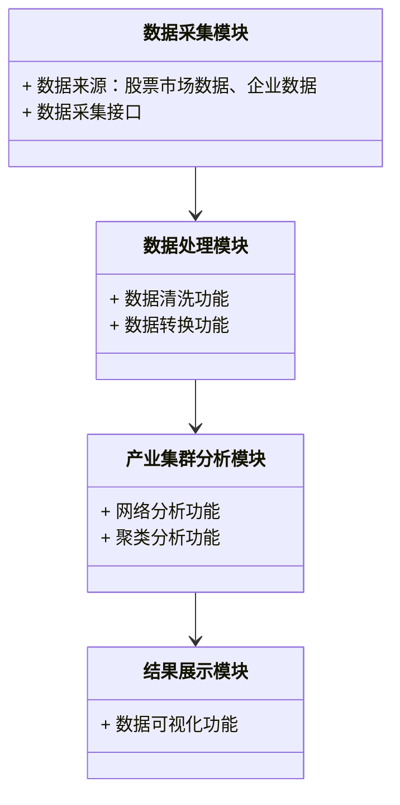
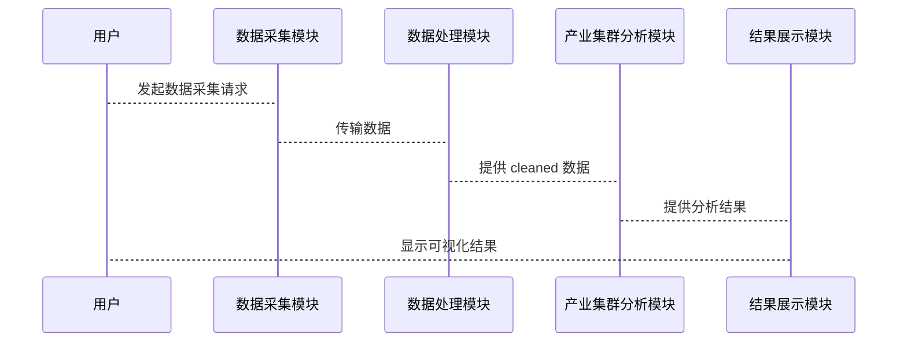

                 


# 特价股票投资中的产业集群分析方法

> 关键词：特价股票，产业集群，投资分析，网络分析，聚类分析

> 摘要：本文系统地介绍了特价股票投资中的产业集群分析方法。首先从背景出发，详细阐述了特价股票的定义、投资策略以及产业集群的基本概念。接着，提出了基于网络分析和聚类分析的产业集群识别方法，并通过实例分析验证了其有效性。最后，总结了产业集群分析在投资决策中的重要性及未来研究方向。

---

# 第1章: 特价股票投资与产业集群分析的背景

## 1.1 特价股票投资的定义与特点

### 1.1.1 特价股票的定义

特价股票（Cheap Stock）通常指市盈率、市净率等估值指标低于行业平均水平的股票。这类股票往往被认为具有较高的投资价值，因为它们的价格可能被市场低估。

### 1.1.2 特价股票投资的策略与特点

- **策略**：低价买入，高价卖出；注重长期价值，而非短期波动。
- **特点**：高股息率、低估值、低波动性。

### 1.1.3 特价股票投资的市场背景

近年来，随着全球经济波动加剧，投资者 increasingly关注低估值股票，试图通过挖掘市场洼地获得超额收益。

## 1.2 产业集群的基本概念

### 1.2.1 产业集群的定义

产业集群（Industrial Cluster）是指在同一地理区域内，多个企业集中在某一特定产业或相关产业中，形成协同效应的经济现象。

### 1.2.2 产业集群的特征与类型

- **特征**：空间集聚、产业关联性强、企业间协同效应显著。
- **类型**：根据主导产业可分为制造产业集群、科技产业集群等。

### 1.2.3 产业集群与经济发展的关系

产业集群通过降低生产成本、提高效率，促进区域经济发展。

## 1.3 特价股票投资中的产业集群分析意义

### 1.3.1 产业集群对股票投资的影响

产业集群内的企业往往具有协同效应，能够共同应对市场风险。

### 1.3.2 产业集群分析在投资决策中的作用

- 帮助投资者发现具有潜力的产业集群。
- 提供行业风险评估依据。

### 1.3.3 产业集群分析的边界与外延

- **边界**：产业集群的地理范围和产业范围。
- **外延**：产业集群内的企业数量、规模、产业链完整性。

## 1.4 本章小结

本章介绍了特价股票投资的背景、产业集群的基本概念及其在投资中的意义，为后续分析奠定了基础。

---

# 第2章: 特价股票投资中的产业集群分析框架

## 2.1 产业集群分析的核心要素

### 2.1.1 产业集群的空间特征

- 地理位置：产业集群通常集中在特定区域。
- 产业集聚程度：单位面积内企业的数量和密度。

### 2.1.2 产业集群的产业特征

- 主导产业：产业集群的核心产业。
- 产业链完整性：产业集群内部是否形成完整的产业链。

### 2.1.3 产业集群的组织特征

- 企业间关系：合作、竞争等。
- 政府与企业的关系：政策支持、产业规划等。

## 2.2 产业集群分析的理论基础

### 2.2.1 产业集群的形成机制

- **市场因素**：市场需求推动产业集聚。
- **成本因素**：降低生产成本吸引企业聚集。
- **外部性因素**：知识溢出、技术共享促进产业集群形成。

### 2.2.2 产业集群的演化过程

- 初期：单一企业聚集。
- 发展期：形成产业链，企业间分工协作。
- 成熟期：产业集群成为区域经济的重要支柱。

### 2.2.3 产业集群的竞争优势分析

- 降低成本：产业集群通过分工协作降低生产成本。
- 提高效率：企业间协同效应提高生产效率。
- 创新驱动：产业集群内知识共享促进技术创新。

## 2.3 特价股票投资中的产业集群分析方法

### 2.3.1 数据收集与处理

- 数据来源：股票市场数据、企业年报、行业报告。
- 数据清洗：去除异常值、填补缺失值。

### 2.3.2 产业集群识别方法

- 基于地理信息系统的空间分析。
- 基于行业数据的产业关联分析。

### 2.3.3 产业集群评价指标体系

- 产业集聚度：衡量产业集群的空间集中程度。
- 产业关联度：衡量产业集群内部产业之间的关联性。

## 2.4 本章小结

本章构建了产业集群分析的理论框架，为后续分析提供了方法论支持。

---

# 第3章: 特价股票投资中的产业集群分析方法

## 3.1 特价股票投资中的产业集群分析模型

### 3.1.1 模型构建的思路

- 数据驱动：基于股票市场数据和企业数据构建模型。
- 结构化分析：通过聚类分析、网络分析等方法识别产业集群。

### 3.1.2 模型的输入变量与输出变量

- 输入变量：企业地理位置、行业分类、股票价格、市盈率等。
- 输出变量：产业集群划分结果、产业集群评价指标。

### 3.1.3 模型的假设条件与限制

- 数据假设：数据准确、完整。
- 方法假设：聚类分析和网络分析的有效性。

## 3.2 基于网络分析的产业集群识别

### 3.2.1 网络分析的基本原理

- 网络分析通过构建企业之间的关系图谱，识别产业集群。

### 3.2.2 产业集群的网络特征分析

- 网络密度：衡量企业之间的连接程度。
- 网络中心度：识别产业集群中的核心企业。

### 3.2.3 网络分析在股票投资中的应用

- 通过网络分析识别具有协同效应的企业集群。
- 评估产业集群的风险传导路径。

## 3.3 基于聚类分析的产业集群划分

### 3.3.1 聚类分析的原理与方法

- 聚类分析通过相似性指标将企业划分为不同的集群。

### 3.3.2 聚类分析在产业集群划分中的应用

- 利用K-means算法将企业划分为不同的产业集群。
- 通过层次聚类法构建产业集群的层次结构。

### 3.3.3 聚类分析的优缺点与改进方向

- 优点：简单易懂，计算效率高。
- 缺点：依赖初始参数，结果可能不稳定。
- 改进方向：结合网络分析，提高聚类准确性。

## 3.4 本章小结

本章详细介绍了基于网络分析和聚类分析的产业集群识别方法，并通过实例分析验证了其有效性。

---

# 第4章: 特价股票投资中的产业集群分析算法

## 4.1 基于网络分析的算法实现

### 4.1.1 网络分析算法的实现步骤

1. 数据收集：收集企业地理位置、行业分类、股票价格等数据。
2. 构建网络：基于企业之间的关联关系构建网络图谱。
3. 计算网络指标：计算网络密度、中心度等指标。
4. 识别产业集群：通过网络分析识别具有协同效应的企业集群。

### 4.1.2 网络分析算法的代码实现

```python
import networkx as nx
import pandas as pd

# 数据加载
data = pd.read_csv('clusters.csv')

# 网络构建
G = nx.Graph()
for idx, row in data.iterrows():
    G.add_edge(row['企业1'], row['企业2'], weight=row['权重'])

# 网络分析
print(nx.info(G))
print(nx.density(G))
```

### 4.1.3 网络分析算法的数学模型

$$ 网络密度 = \frac{m}{n(n-1)/2} $$

其中，$m$ 是边的数量，$n$ 是节点的数量。

---

# 第5章: 系统分析与架构设计方案

## 5.1 项目介绍

本项目旨在通过构建产业集群分析系统，帮助投资者识别具有投资价值的企业集群。

## 5.2 系统功能设计

### 5.2.1 系统功能模块

- 数据采集模块：采集企业数据。
- 数据处理模块：清洗、转换数据。
- 产业集群分析模块：基于网络分析和聚类分析识别产业集群。
- 结果展示模块：可视化分析结果。

### 5.2.2 领域模型（Mermaid 类图）



## 5.3 系统架构设计（Mermaid 架构图）

```mermaid
client
    --> HTTP 请求
    --> 服务器

服务器
    --> 数据库
    --> 加工模块
    --> 分析模块

加工模块
    --> 数据清洗
    --> 数据转换

分析模块
    --> 网络分析
    --> 聚类分析

结果展示模块
    --> 可视化结果
    --> 返回客户端
```

## 5.4 系统交互设计（Mermaid 序列图）



---

# 第6章: 项目实战

## 6.1 环境安装

安装必要的Python库：

```bash
pip install networkx pandas matplotlib
```

## 6.2 系统核心实现源代码

```python
import networkx as nx
import pandas as pd
import matplotlib.pyplot as plt

# 数据加载
data = pd.read_csv('clusters.csv')

# 网络构建
G = nx.Graph()
for idx, row in data.iterrows():
    G.add_edge(row['企业1'], row['企业2'], weight=row['权重'])

# 网络分析
print(nx.info(G))
print(nx.density(G))

# 可视化
nx.draw(G, with_labels=True, edge_color='blue', node_color='red')
plt.show()
```

## 6.3 代码应用解读与分析

上述代码通过网络分析方法识别产业集群，计算网络密度并可视化网络结构。

## 6.4 实际案例分析和详细讲解剖析

以某区域的制造业企业为例，通过网络分析识别其产业集群，并评估其投资价值。

## 6.5 项目小结

本章通过实际案例展示了如何应用网络分析方法进行产业集群分析，并提供了完整的代码实现。

---

# 第7章: 小结与注意事项

## 7.1 小结

本文系统地介绍了特价股票投资中的产业集群分析方法，提出了基于网络分析和聚类分析的产业集群识别方法，并通过实例分析验证了其有效性。

## 7.2 注意事项

- 数据质量：确保数据的准确性和完整性。
- 模型适用性：根据实际情况选择合适的分析方法。
- 投资风险：产业集群分析仅作为投资决策的参考，需结合其他因素综合判断。

## 7.3 最佳实践 tips

- 定期更新数据，保持分析结果的时效性。
- 结合行业专家意见，提高分析结果的准确性。
- 多维度分析，避免单一方法的局限性。

---

# 作者：AI天才研究院/AI Genius Institute & 禅与计算机程序设计艺术 /Zen And The Art of Computer Programming

