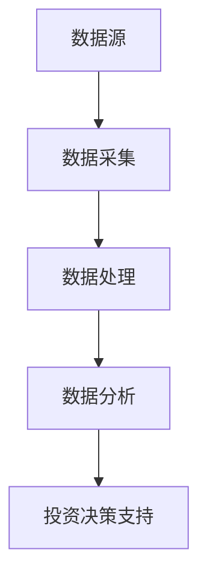

                 


# 特价股票投资中的人口结构数字代际价值观转移趋势考量

> **关键词**：特价股票投资、人口结构、数字代际、价值观转移、股票价格预测、投资策略

> **摘要**：本文探讨了在特价股票投资中，人口结构变化、数字代际差异以及价值观转移对投资趋势的影响。通过分析不同代际在数字技术使用和投资行为上的差异，结合数学模型和系统架构设计，提出了一种基于人口结构和代际价值观转移的股票价格预测方法。文章还展示了如何利用大数据和机器学习技术，结合实际案例，为投资者提供科学的投资策略。

---

## 第一部分: 特价股票投资的背景与人口结构分析

### 第1章: 特价股票投资的背景介绍

#### 1.1 什么是特价股票投资

特价股票投资是指以低于市场价或内在价值购买股票的投资策略，通常关注被低估的股票。这种策略的核心在于发现市场中的价格偏差，通过分析公司基本面和市场情绪，寻找投资机会。

#### 1.2 人口结构变化对投资的影响

人口结构的变化直接影响经济的供需关系。例如，年轻人口比例高的国家可能更倾向于消费驱动型经济，而老龄化社会则可能推动储蓄和稳健投资需求。以下是人口结构对投资影响的关键点：

- **年轻人口**：消费倾向高，可能减少储蓄和投资，但具有高增长潜力。
- **中年人口**：通常是主要的储蓄者和投资者，倾向于稳健投资。
- **老年人口**：更倾向于保值型投资，如债券和低风险股票。

#### 1.3 代际价值观差异对投资行为的影响

不同代际在价值观和投资偏好上有显著差异。例如， Generation Z 更倾向于支持可持续发展和创新公司，而 Baby Boomers 则更关注稳定和低风险投资。这种差异直接影响投资行为和市场趋势。

---

### 第2章: 数字代际与价值观转移的关联

#### 2.1 数字代际的定义与特征

数字代际是指基于技术使用和数字化生活方式的代际划分。例如：

- **Baby Boomers**：对数字技术的接受度较低，投资行为更依赖传统渠道。
- **Generation X**：部分接受数字技术，但更倾向于传统投资方式。
- **Millennials**：熟悉数字技术，倾向于通过在线平台进行投资。
- **Generation Z**：数字原住民，高度依赖数字技术进行投资决策。

#### 2.2 价值观转移的定义与趋势

价值观转移是指代际间价值观的变化对投资行为的影响。例如，年轻一代更关注企业的社会责任和可持续性，而上一代则更关注财务回报。

---

## 第二部分: 人口结构与数字代际对股票投资的综合影响

### 第3章: 人口结构与数字代际的交互作用

#### 3.1 人口结构对数字技术使用的推动作用

人口结构变化直接影响数字技术的普及和应用。例如，年轻人口比例高的国家推动了数字金融和在线投资的增长。

#### 3.2 数字技术对人口结构变化的反向影响

数字技术通过改变工作方式和生活方式，影响人口结构。例如，远程办公减少了城市化进程，影响了人口分布。

---

### 第4章: 数字技术在股票投资中的应用

#### 4.1 大数据在股票分析中的应用

大数据技术通过分析海量数据，帮助投资者发现市场趋势。例如，通过社交媒体情绪分析预测股票价格波动。

#### 4.2 机器学习在股票预测中的应用

机器学习算法（如ARIMA和LSTM）可以预测股票价格，帮助投资者做出决策。

---

## 第三部分: 数学模型与系统架构设计

### 第5章: 数学模型与算法原理

#### 5.1 ARIMA模型的原理与应用

ARIMA模型是一种常用的时间序列分析方法，适用于股票价格预测。以下是ARIMA模型的步骤：

1. **数据预处理**：对历史股价数据进行标准化和差分处理。
2. **模型参数选择**：确定AR和MA的阶数。
3. **模型训练**：基于历史数据训练模型。
4. **预测与验证**：使用测试数据验证模型的准确性。

#### 5.2 代际价值观与人口结构的数学模型

通过回归分析，建立代际价值观、人口结构与股票价格之间的关系模型。例如：

$$
y = \beta_0 + \beta_1x_1 + \beta_2x_2 + \epsilon
$$

其中，\( y \) 是股票价格，\( x_1 \) 是人口结构变量，\( x_2 \) 是代际价值观变量。

---

### 第6章: 系统架构设计

#### 6.1 系统功能设计

- **数据采集**：从股票市场获取实时数据。
- **数据分析**：利用大数据和机器学习技术进行分析。
- **投资决策支持**：基于分析结果提供投资建议。

#### 6.2 系统架构图



---

## 第四部分: 项目实战与总结

### 第7章: 项目实战

#### 7.1 环境配置与数据收集

- **环境**：Python 3.8 + Pandas + Scikit-learn
- **数据**：从Yahoo Finance获取历史股价数据

#### 7.2 模型训练与结果分析

- **代码示例**：

```python
import pandas as pd
from sklearn.model import ARIMA

# 数据加载
data = pd.read_csv('stock_data.csv')

# 模型训练
model = ARIMA(data['price'], order=(5, 1, 0))
model_fit = model.fit()

# 预测结果
forecast = model_fit.forecast(10)
print(forecast)
```

---

### 第8章: 总结与展望

#### 8.1 总结

本文探讨了人口结构、数字代际和价值观转移对特价股票投资的影响，提出了基于大数据和机器学习的股票价格预测方法。

#### 8.2 展望

未来，随着技术的进步，更多创新的股票投资策略将被开发出来，投资者需要密切关注市场变化和代际价值观的转移。

---

## 作者：AI天才研究院（AI Genius Institute） & 禅与计算机程序设计艺术（Zen And The Art of Computer Programming）

