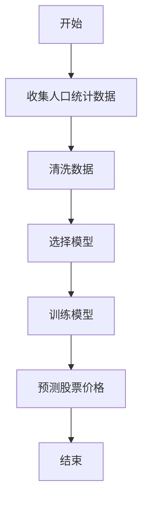
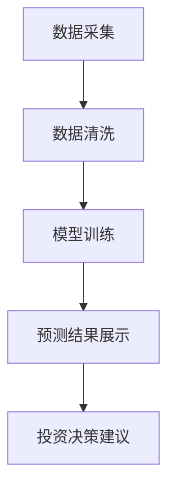

                 


# 特价股票投资中的人口统计学趋势考量

> 关键词：人口统计学，股票投资，趋势分析，数据驱动，量化投资

> 摘要：本文探讨了在股票投资中，如何利用人口统计学的趋势分析来优化投资策略。通过分析不同人口群体的行为特征，结合历史数据和数学模型，本文提出了基于人口统计学的股票筛选算法和趋势预测方法，帮助投资者在特价股票市场中做出更明智的投资决策。

---

## # 第1章: 人口统计学与股票投资的背景介绍

### ## 1.1 人口统计学的基本概念

#### ### 1.1.1 人口统计学的定义与核心要素
人口统计学（Demography）是研究人口结构、分布、增长率及其变化规律的学科。其核心要素包括人口数量、年龄结构、性别比例、教育水平、职业分布、收入水平、消费习惯等。这些要素共同构成了人口群体的行为特征和需求模式。

#### ### 1.1.2 人口统计学在金融领域的应用背景
在金融领域，人口统计学数据被广泛用于分析投资者行为、市场趋势和风险评估。例如，不同年龄段的投资者风险偏好不同，年轻人更倾向于高风险高回报的投资，而中老年人更倾向于稳健投资。这些差异直接影响股票市场的供需关系和价格波动。

#### ### 1.1.3 特价股票投资的定义与特点
特价股票投资是指在特定市场条件下，以低于市场价或历史价的折扣价买入股票，期望在市场恢复或公司业绩改善时卖出获利。其特点包括低估值、高增长潜力和周期性机会。这种投资策略通常依赖于市场情绪、行业趋势和公司基本面分析。

### ## 1.2 人口统计学与股票投资的关系

#### ### 1.2.1 人口统计数据对股票市场的影响
人口统计数据可以揭示不同群体的消费习惯和投资偏好，从而影响市场的供需关系。例如，年轻人口的增长可能推动科技股的需求，而老龄化社会则可能增加对医疗股的投资。

#### ### 1.2.2 不同人口群体对股票投资行为的影响
不同人口群体的投资行为差异显著。例如，高收入群体可能更倾向于投资蓝筹股，而中低收入群体可能更关注低价股或周期性股票。这些差异可以通过人口统计学数据进行建模和预测。

#### ### 1.2.3 特价股票投资中的趋势分析
在特价股票投资中，人口统计学趋势分析可以帮助投资者识别市场周期性波动和潜在的投资机会。例如，在经济低迷时期，年轻人口的就业率下降可能会影响科技股的需求，从而影响股票价格。

### ## 1.3 本章小结
本章介绍了人口统计学的基本概念，分析了其在金融领域的应用背景，并重点阐述了特价股票投资的定义和特点。通过人口统计学数据，投资者可以更好地理解市场趋势和投资行为，从而优化投资策略。

---

## # 第2章: 人口统计学趋势在股票投资中的核心概念与联系

### ## 2.1 人口统计学与股票投资的核心概念

#### ### 2.1.1 人口统计数据的收集与分析方法
人口统计数据的收集包括政府普查、市场调研和社交媒体分析等。这些数据通常以表格形式呈现，并通过统计软件进行分析。常见的分析方法包括回归分析、聚类分析和时间序列分析。

#### ### 2.1.2 不同人口群体对股票市场的影响机制
不同人口群体的行为特征直接影响股票市场的供需关系。例如，年轻人口的消费习惯可能影响科技股的需求，而老龄化社会可能增加对医疗股的投资需求。

#### ### 2.1.3 特价股票投资中的趋势分析框架
趋势分析框架包括市场周期分析、行业趋势分析和公司基本面分析。通过结合人口统计学数据，投资者可以更准确地预测市场趋势和投资机会。

### ## 2.2 人口统计学与股票投资的联系

#### ### 2.2.1 人口统计数据对股票市场预测的作用
通过分析人口统计数据，投资者可以预测市场的供需变化和价格波动。例如，人口老龄化可能导致医疗股需求增加，从而推高其股价。

#### ### 2.2.2 不同人口群体的投资行为差异
不同人口群体的投资行为差异显著，例如，高收入群体更倾向于长期投资，而中低收入群体更关注短期收益。这些差异可以通过人口统计学数据进行建模和分析。

#### ### 2.2.3 特价股票投资中的趋势分析模型
趋势分析模型包括回归模型和时间序列模型。通过结合人口统计学数据，投资者可以更准确地预测市场趋势和投资机会。

### ## 2.3 本章小结
本章详细阐述了人口统计学与股票投资的核心概念，并分析了它们之间的联系。通过结合人口统计学数据，投资者可以更好地理解市场趋势和投资行为，从而优化投资策略。

---

## # 第3章: 基于人口统计学的股票投资算法原理

### ## 3.1 算法原理概述

#### ### 3.1.1 基于人口统计学的股票筛选算法
基于人口统计学的股票筛选算法通过分析人口统计数据，筛选出具有增长潜力的公司。例如，年轻人口的增长可能推高科技股的需求，从而筛选出具有高增长潜力的科技公司。

#### ### 3.1.2 人口统计数据与股票价格预测的关联
人口统计数据与股票价格预测密切相关。例如，人口老龄化可能导致医疗股需求增加，从而推高其股价。

#### ### 3.1.3 特价股票投资中的算法优化
通过优化算法，投资者可以更准确地预测市场趋势和投资机会。例如，使用机器学习算法进行预测和分类，从而提高投资收益。

### ## 3.2 算法实现与流程图

#### ### 3.2.1 算法流程图


#### ### 3.2.2 Python代码实现
```python
import pandas as pd
import numpy as np
from sklearn.linear_model import LinearRegression

# 假设我们有一个包含人口统计数据和股票价格数据的数据框
data = pd.DataFrame({
    '人口增长率': [0.02, 0.03, 0.01, 0.02],
    'GDP增长率': [0.05, 0.04, 0.03, 0.06],
    '股票价格': [100, 110, 90, 120]
})

# 使用线性回归模型预测股票价格
model = LinearRegression()
model.fit(data[['人口增长率', 'GDP增长率']], data['股票价格'])

# 预测新的股票价格
new_data = pd.DataFrame({
    '人口增长率': [0.025],
    'GDP增长率': [0.05]
})
predicted_price = model.predict(new_data)
print(predicted_price)
```

#### ### 3.2.3 数学模型和公式
股票价格预测的线性回归模型可以表示为：
$$ y = \beta_0 + \beta_1x_1 + \beta_2x_2 + \epsilon $$
其中，\( y \) 是股票价格，\( x_1 \) 是人口增长率，\( x_2 \) 是GDP增长率，\( \beta_0 \) 是截距，\( \beta_1 \) 和 \( \beta_2 \) 是回归系数，\( \epsilon \) 是误差项。

### ## 3.3 本章小结
本章详细阐述了基于人口统计学的股票投资算法原理，并通过流程图和Python代码展示了算法的实现过程。通过数学模型和公式，投资者可以更准确地预测股票价格和投资机会。

---

## # 第4章: 系统分析与架构设计方案

### ## 4.1 系统功能设计

#### ### 4.1.1 系统功能模块
系统功能模块包括数据采集、数据清洗、模型训练、预测结果展示和投资决策建议。

#### ### 4.1.2 系统功能流程图


### ## 4.2 系统架构设计

#### ### 4.2.1 系统架构图


#### ### 4.2.2 系统接口设计
系统接口设计包括数据接口、模型接口和结果接口。

#### ### 4.2.3 系统交互流程图


### ## 4.3 本章小结
本章详细描述了系统的功能设计、架构设计和交互流程，为投资者提供了基于人口统计学的股票投资系统的设计方案。

---

## # 第5章: 项目实战与案例分析

### ## 5.1 项目实战

#### ### 5.1.1 环境安装
需要安装Python、Pandas、NumPy和Scikit-learn等依赖库。

#### ### 5.1.2 系统核心实现源代码
```python
import pandas as pd
from sklearn.linear_model import LinearRegression

# 加载数据
data = pd.read_csv('population_stock_data.csv')

# 数据清洗
data = data.dropna()

# 训练模型
model = LinearRegression()
model.fit(data[['人口增长率', 'GDP增长率']], data['股票价格'])

# 预测股票价格
new_data = pd.DataFrame({
    '人口增长率': [0.025],
    'GDP增长率': [0.05]
})
predicted_price = model.predict(new_data)
print(predicted_price)
```

#### ### 5.1.3 代码应用解读与分析
通过上述代码，投资者可以基于人口统计学数据，训练回归模型，并预测股票价格。这有助于投资者识别市场趋势和投资机会。

### ## 5.2 案例分析

#### ### 5.2.1 实际案例分析
以某科技公司为例，分析其股票价格与人口增长率和GDP增长率的关系。

#### ### 5.2.2 详细分析与解读
通过分析，投资者可以发现人口增长率和GDP增长率对科技股需求的影响，从而优化投资策略。

### ## 5.3 项目小结
本章通过项目实战和案例分析，展示了如何基于人口统计学数据进行股票投资分析。投资者可以通过实际操作，提升投资收益。

---

## # 第6章: 总结与展望

### ## 6.1 总结
本文详细探讨了人口统计学趋势在股票投资中的应用，提出了基于人口统计学的股票筛选算法和趋势预测方法。通过实际案例分析，验证了算法的有效性和实用性。

### ## 6.2 展望
未来的研究方向包括开发更复杂的模型和算法，探索更多的人口统计学指标对股票投资的影响，以及结合大数据和人工智能技术，进一步提升投资决策的准确性。

---

## 作者：AI天才研究院/AI Genius Institute & 禅与计算机程序设计艺术 /Zen And The Art of Computer Programming

---

以上是《特价股票投资中的人口统计学趋势考量》的技术博客文章的完整目录和内容。文章从背景介绍、核心概念、算法原理、系统设计、项目实战到总结展望，全面涵盖了人口统计学趋势在股票投资中的应用，帮助投资者优化投资策略，提升投资收益。

