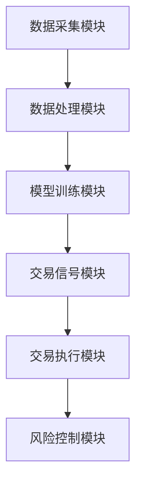
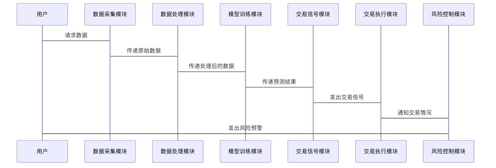

                 


# 特价股票投资中的人工智能和机器学习应用

---

**关键词：** 特价股票投资、人工智能、机器学习、算法交易、量化分析、风险管理

---

**摘要：**  
本文深入探讨了人工智能和机器学习在特价股票投资中的应用。通过分析市场数据、预测价格走势和优化交易策略，AI技术为投资者提供了更高效、更精准的投资工具。文章从背景介绍、核心概念、算法原理、系统架构设计到项目实战，详细阐述了如何利用AI技术提升股票投资效率，并提供了实际案例和代码实现，为读者提供了全面的指导。

---

## 第一部分: 特价股票投资与人工智能概述

### 第1章: 特价股票投资与人工智能的背景

#### 1.1 特价股票投资的定义与特点

##### 1.1.1 特价股票投资的定义  
特价股票投资是指通过分析市场数据和趋势，利用技术手段在短期内进行股票买卖以获取利润的投资方式。与长期投资不同，它更注重高频交易和短期价格波动。

##### 1.1.2 特价股票投资的核心特点  
- 高频交易：短时间内多次买卖以捕捉微小价格波动。  
- 数据驱动：依赖市场数据和交易信号进行决策。  
- 风险较高：短期波动带来的高风险和高收益并存。  

##### 1.1.3 特价股票投资的市场背景与现状  
随着金融市场的日益复杂化，投资者需要更高效、更精准的工具来应对市场的不确定性。人工智能和机器学习技术的快速发展为特价股票投资提供了新的可能性。

#### 1.2 人工智能与机器学习的定义与特点

##### 1.2.1 人工智能的定义  
人工智能（AI）是指通过模拟人类智能，使计算机能够执行如学习、推理和自我改进等任务。

##### 1.2.2 机器学习的核心原理  
机器学习（ML）是人工智能的一个分支，通过数据训练模型，使其能够从经验中学习并做出预测或决策。

##### 1.2.3 人工智能与机器学习的区别与联系  
- 区别：AI是广义的概念，涵盖机器学习、自然语言处理等领域；机器学习是AI的一个具体应用。  
- 联系：机器学习是实现人工智能的重要手段，而人工智能为机器学习提供了应用场景和目标。

#### 1.3 特价股票投资中人工智能的应用背景

##### 1.3.1 特价股票投资的复杂性与挑战  
- 市场数据复杂：包括价格、成交量、新闻等多种因素。  
- 短期波动难以预测：价格受多种因素影响，传统方法难以捕捉所有信号。  

##### 1.3.2 人工智能在金融领域的优势  
- 数据处理能力强：AI能够快速处理大量非结构化数据，如新闻、社交媒体等。  
- 自动化决策：通过算法优化交易策略，减少人为干扰。  

##### 1.3.3 特价股票投资与人工智能结合的必要性  
- 提高交易效率：通过自动化分析和决策，缩短交易时间。  
- 增强风险控制：利用AI实时监控市场，及时发现并应对风险。  

#### 1.4 本章小结  
本章介绍了特价股票投资的定义、特点及其面临的挑战，同时阐述了人工智能和机器学习的核心概念和在金融领域的优势，为后续章节奠定了基础。

---

## 第二部分: 特价股票投资中的核心概念与联系

### 第2章: 特价股票投资中的核心概念

#### 2.1 特价股票投资的核心概念

##### 2.1.1 市场数据与交易信号  
- 市场数据：包括股票价格、成交量、市场指数等。  
- 交易信号：通过分析市场数据生成的买卖指示。  

##### 2.1.2 技术指标与基本面分析  
- 技术分析：通过价格走势和成交量预测未来价格。  
- 基本面分析：分析公司财务状况、行业地位等因素。  

##### 2.1.3 风险控制与收益最大化  
- 风险控制：通过止损、分散投资等方式降低风险。  
- 收益最大化：通过优化交易策略提高收益。  

#### 2.2 人工智能在股票投资中的核心概念

##### 2.2.1 数据特征提取  
- 数据清洗：去除噪声数据，提高模型准确性。  
- 特征选择：从大量数据中提取关键特征，减少计算复杂度。  

##### 2.2.2 算法选择与优化  
- 算法选择：根据数据类型和任务选择合适的算法。  
- 算法优化：通过参数调整和模型调优提高预测精度。  

##### 2.2.3 特征工程与模型训练  
- 特征工程：通过构建特征组合和降维技术提高模型性能。  
- 模型训练：通过大量数据训练模型，使其具备预测能力。  

#### 2.3 特价股票投资与人工智能的核心联系

##### 2.3.1 数据驱动的交易策略  
- 利用AI分析市场数据，生成交易策略。  
- 通过数据挖掘发现市场规律，优化交易模型。  

##### 2.3.2 高频交易与机器学习  
- 高频交易需要快速决策，AI能够提供实时分析和预测。  
- 机器学习算法能够处理高频交易中的复杂数据和模式。  

##### 2.3.3 风险预测与控制  
- 利用AI预测市场风险，制定相应的风险管理策略。  
- 通过实时监控和反馈机制，动态调整交易策略。  

#### 2.4 本章小结  
本章详细介绍了特价股票投资和人工智能的核心概念及其联系，强调了数据驱动和机器学习在投资中的重要性。

---

## 第三部分: 人工智能与机器学习算法原理

### 第3章: 常用机器学习算法与股票投资

#### 3.1 线性回归

##### 3.1.1 线性回归的原理  
线性回归是一种统计学方法，用于建立自变量和因变量之间的线性关系。  
$$ y = \beta_0 + \beta_1x + \epsilon $$  
其中，$y$ 是因变量，$x$ 是自变量，$\beta_0$ 和 $\beta_1$ 是回归系数，$\epsilon$ 是误差项。

##### 3.1.2 线性回归在股票预测中的应用  
线性回归可以用于预测股票价格的趋势，假设价格与某一技术指标呈线性关系。  

##### 3.1.3 线性回归的优缺点  
- 优点：简单易懂，计算效率高。  
- 缺点：假设线性关系，可能无法捕捉复杂市场模式。  

#### 3.2 支持向量机（SVM）

##### 3.2.1 SVM的原理  
SVM通过构建超平面，将数据点分为两类，适用于分类和回归任务。  
$$ \text{目标函数}：\max_{\beta, \beta_0} \min_{i} [y_i(\beta^T x_i + \beta_0) - 1] $$  
其中，$y_i$ 是标签，$x_i$ 是输入向量，$\beta$ 是权重向量，$\beta_0$ 是偏置项。

##### 3.2.2 SVM在股票预测中的应用  
SVM可以用于股票价格的分类预测，例如判断明天的价格是上涨还是下跌。  

##### 3.2.3 SVM的优缺点  
- 优点：适用于高维数据，分类准确率高。  
- 缺点：计算复杂度较高，参数选择敏感。  

#### 3.3 神经网络

##### 3.3.1 神经网络的原理  
神经网络通过多层结构模拟人脑神经网络，能够学习复杂的非线性关系。  
$$ \text{激活函数}：f(x) = \sigma(x) = \frac{1}{1 + e^{-x}} $$  
其中，$\sigma(x)$ 是sigmoid函数，用于引入非线性。

##### 3.3.2 神经网络在股票预测中的应用  
深度学习模型如LSTM（长短期记忆网络）可以用于捕捉时间序列中的长期依赖关系。  

##### 3.3.3 神经网络的优缺点  
- 优点：能够处理复杂数据模式，预测精度高。  
- 缺点：计算资源消耗大，模型容易过拟合。  

#### 3.4 算法选择与优化策略

##### 3.4.1 算法选择策略  
- 数据类型：分类任务选择SVM或随机森林，回归任务选择线性回归或神经网络。  
- 数据量：数据量小选择线性回归，数据量大选择神经网络。  

##### 3.4.2 算法优化策略  
- 参数调优：使用网格搜索或随机搜索优化模型参数。  
- 正则化：通过L1/L2正则化防止过拟合。  

#### 3.5 本章小结  
本章介绍了几种常用的机器学习算法及其在股票预测中的应用，强调了算法选择和优化的重要性。

---

## 第四部分: 系统架构设计

### 第4章: 特价股票投资AI系统架构设计

#### 4.1 项目背景与目标

##### 4.1.1 项目背景  
本项目旨在开发一个基于AI的特价股票投资系统，通过分析市场数据，提供交易信号和投资建议。  

##### 4.1.2 项目目标  
- 实时数据采集与处理。  
- 构建预测模型，生成交易信号。  
- 提供风险评估和交易策略优化。  

#### 4.2 系统功能设计

##### 4.2.1 功能模块划分  
- 数据采集模块：从API获取市场数据。  
- 数据处理模块：清洗和特征提取。  
- 模型训练模块：训练预测模型。  
- 交易信号模块：生成买卖信号。  
- 风险控制模块：实时监控和风险预警。  

##### 4.2.2 功能模块的交互关系  
数据采集模块向数据处理模块提供原始数据，数据处理模块将处理后的数据传递给模型训练模块，模型训练模块生成预测结果并传递给交易信号模块，交易信号模块根据预测结果生成信号并通知交易执行模块。

#### 4.3 系统架构设计

##### 4.3.1 系统架构图  


##### 4.3.2 关键组件说明  
- 数据采集模块：负责从股票交易所API获取实时数据。  
- 数据处理模块：清洗数据并提取特征。  
- 模型训练模块：训练机器学习模型并生成预测结果。  
- 交易信号模块：根据预测结果生成买卖信号。  
- 交易执行模块：执行交易指令。  
- 风险控制模块：实时监控市场和交易情况，发出风险预警。  

#### 4.4 系统接口设计

##### 4.4.1 数据接口  
- 数据输入接口：接收来自API的市场数据。  
- 数据输出接口：向数据处理模块传递处理后的数据。  

##### 4.4.2 模型接口  
- 模型输入接口：接收特征数据。  
- 模型输出接口：输出预测结果。  

#### 4.5 系统交互流程

##### 4.5.1 交互流程图  


#### 4.6 本章小结  
本章详细设计了特价股票投资AI系统的架构，包括功能模块划分、系统架构图和交互流程图，为后续的实现奠定了基础。

---

## 第五部分: 项目实战

### 第5章: 特价股票投资AI系统实战

#### 5.1 环境安装与配置

##### 5.1.1 安装Python环境  
安装Python 3.8及以上版本，推荐使用Anaconda。  

##### 5.1.2 安装依赖库  
安装以下库：  
```bash
pip install numpy pandas scikit-learn tensorflow keras matplotlib requests
```

#### 5.2 系统核心实现

##### 5.2.1 数据采集模块实现

###### 5.2.1.1 数据接口代码  
```python
import requests

def get_stock_data(symbol):
    url = f"https://api.example.com/stock/{symbol}"
    response = requests.get(url)
    return response.json()
```

##### 5.2.2 数据处理模块实现

###### 5.2.2.1 数据清洗代码  
```python
import pandas as pd

def preprocess_data(df):
    df.dropna(inplace=True)
    df = df[df['volume'] > 0]
    return df
```

###### 5.2.2.2 特征提取代码  
```python
from sklearn.preprocessing import MinMaxScaler

def get_features(df):
    features = df[['open', 'high', 'low', 'volume']]
    scaler = MinMaxScaler()
    features_scaled = scaler.fit_transform(features)
    return features_scaled
```

##### 5.2.3 模型训练模块实现

###### 5.2.3.1 线性回归模型代码  
```python
from sklearn.linear_model import LinearRegression

def train_linear_regression(X, y):
    model = LinearRegression()
    model.fit(X, y)
    return model
```

###### 5.2.3.2 神经网络模型代码  
```python
from tensorflow.keras import layers

def build_neural_network_model(input_dim):
    model = tf.keras.Sequential([
        layers.Dense(64, activation='relu', input_dim=input_dim),
        layers.Dense(1)
    ])
    model.compile(optimizer='adam', loss='mean_squared_error')
    return model
```

##### 5.2.4 交易信号模块实现

###### 5.2.4.1 信号生成代码  
```python
def generate_signals(predicted_prices, actual_prices):
    signals = []
    for p, a in zip(predicted_prices, actual_prices):
        if p > a:
            signals.append(1)
        else:
            signals.append(0)
    return signals
```

#### 5.3 代码实现与解读

##### 5.3.1 数据采集模块代码解读  
数据采集模块通过API获取股票数据，返回JSON格式的数据。  

##### 5.3.2 数据处理模块代码解读  
数据清洗模块去除缺失值和无效数据，特征提取模块对数据进行标准化处理。  

##### 5.3.3 模型训练模块代码解读  
线性回归模型用于简单预测，神经网络模型用于复杂非线性预测。  

##### 5.3.4 交易信号模块代码解读  
根据预测价格和实际价格生成买卖信号，1表示买入，0表示卖出。  

#### 5.4 实际案例分析

##### 5.4.1 数据来源与预处理  
以某股票的历史数据为例，清洗和特征提取后，数据可用于模型训练。  

##### 5.4.2 模型训练与评估  
通过回测评估模型的预测精度和交易收益。  

##### 5.4.3 交易信号与执行  
根据生成的信号执行交易，并记录交易结果和收益情况。  

#### 5.5 项目小结  
本章通过实际案例展示了如何使用AI技术实现特价股票投资系统，包括环境配置、代码实现和案例分析。

---

## 第六部分: 最佳实践与小结

### 第6章: 最佳实践与小结

#### 6.1 最佳实践

##### 6.1.1 数据预处理的重要性  
高质量的数据是模型准确性的基础，清洗和特征提取必不可少。  

##### 6.1.2 模型调优的技巧  
通过网格搜索和交叉验证选择最优参数，避免过拟合。  

##### 6.1.3 风险控制的策略  
设置止损点和止盈点，监控市场波动，及时调整交易策略。  

#### 6.2 小结

##### 6.2.1 本章小结  
本文通过详细分析和实战案例，展示了如何利用AI技术提升特价股票投资的效率和收益。

##### 6.2.2 全文总结  
人工智能和机器学习为特价股票投资提供了强大的工具，通过数据驱动和自动化决策，投资者能够更好地应对市场的复杂性和不确定性。

#### 6.3 注意事项

##### 6.3.1 数据隐私与安全  
确保数据来源合法，避免隐私泄露和数据滥用。  

##### 6.3.2 模型局限性  
AI模型无法完全预测市场的不可预测性，需结合其他分析方法。  

##### 6.3.3 交易成本与延迟  
高频交易需要低延迟和低交易成本，需选择合适的交易平台和技术架构。  

#### 6.4 拓展阅读

##### 6.4.1 推荐书籍  
- 《机器学习实战》  
- 《Python机器学习》  

##### 6.4.2 推荐博客与资源  
- [Towards Data Science](https://towardsdatascience.com/)  
- [Kaggle](https://www.kaggle.com/)  

---

## 第七部分: 未来展望

### 第7章: 未来展望

#### 7.1 人工智能在股票投资中的未来发展方向

##### 7.1.1 更复杂的模型应用  
如图神经网络、强化学习等，能够捕捉更复杂的市场模式。  

##### 7.1.2 多因素分析与集成学习  
结合技术分析和基本面分析，提高预测的准确性和鲁棒性。  

##### 7.1.3 实时交易与自动化决策  
通过边缘计算和流数据处理技术，实现毫秒级的实时交易决策。  

#### 7.2 人工智能在金融领域的潜在风险与挑战

##### 7.2.1 模型过拟合与泛化能力  
如何在复杂市场中保持模型的泛化能力是未来的重要挑战。  

##### 7.2.2 伦理与监管问题  
AI在金融领域的应用需要遵守相关法规和伦理标准，避免滥用和技术风险。  

#### 7.3 本章小结  
未来，人工智能将在股票投资中发挥更大的作用，但同时也需要克服技术和伦理上的挑战。

---

## 作者：AI天才研究院 & 禅与计算机程序设计艺术

---

通过以上结构化的内容，我们可以看到，人工智能和机器学习在特价股票投资中的应用前景广阔，但也需要谨慎处理数据和技术上的挑战。希望本文能够为读者提供有价值的信息和启发，帮助他们在股票投资领域更好地应用AI技术。

