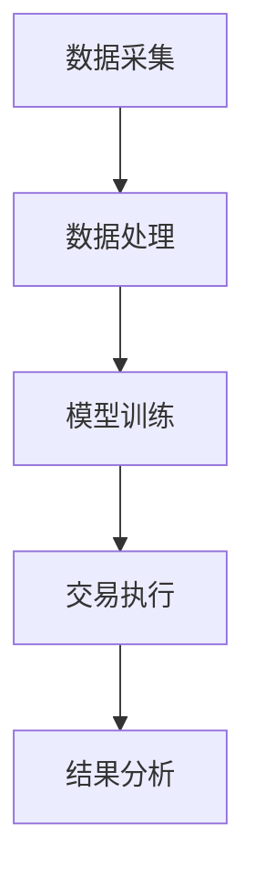
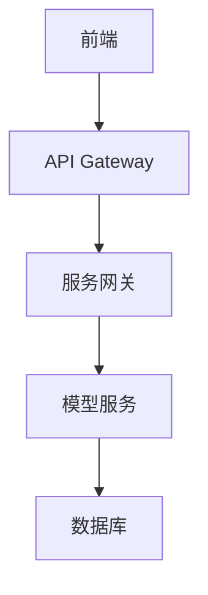
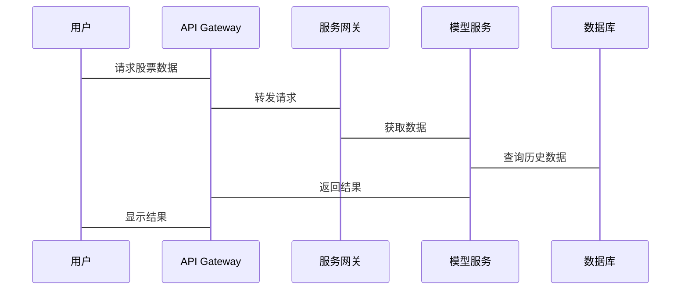

                 


# 特价股票投资中的人工智能应用

> 关键词：人工智能，股票投资，特价股票，机器学习，深度学习，算法交易

> 摘要：本文深入探讨了人工智能技术在特价股票投资中的应用，从背景、核心概念到算法实现、系统架构、项目实战及最佳实践，全面分析了AI如何助力投资者在特价股票市场中获取超额收益。通过数学模型、算法流程图和系统架构图的详细讲解，为读者提供了一套完整的AI投资解决方案。

---

# 第一部分：特价股票投资中的AI应用背景

## 第1章：特价股票投资的背景与挑战

### 1.1 特价股票的定义与特点

#### 1.1.1 特价股票的定义
特价股票是指在特定时间段内价格低于市场平均价的股票，通常具有较高的波动性和潜在的高收益。这类股票通常存在于市场波动较大、公司基本面出现短期问题或市场情绪低落时。

#### 1.1.2 特价股票的特点
- **低估值**：市场价格低于内在价值。
- **高波动性**：价格波动较大，存在短期套利机会。
- **周期性**：通常出现在市场周期的低谷期。
- **风险较高**：由于价格波动大，投资风险较高。

#### 1.1.3 特价股票与普通股票的区别
| 特价股票 | 普通股票 |
|----------|----------|
| 价格低于市场价 | 价格稳定或随市场波动 |
| 高波动性 | 较低波动性 |
| 投资风险较高 | 投资风险适中 |
| 短期机会多 | 长期投资为主 |

### 1.2 AI在金融投资中的应用背景

#### 1.2.1 人工智能在金融领域的应用现状
- **高频交易**：AI算法用于高频交易，捕捉市场微小波动。
- **风险评估**：利用机器学习模型评估投资风险。
- **市场预测**：通过深度学习模型预测市场走势。

#### 1.2.2 特价股票投资中的问题与挑战
- **信息不对称**：投资者难以获取实时数据和分析。
- **市场波动性**：特价股票价格波动大，难以预测。
- **数据复杂性**：涉及大量非结构化数据，如新闻、社交媒体等。

#### 1.2.3 AI技术如何解决这些问题
- **数据处理能力**：AI能够快速处理大量结构化和非结构化数据。
- **模式识别**：通过机器学习识别数据中的潜在模式。
- **实时分析**：利用深度学习模型进行实时市场预测。

---

## 第2章：AI在特价股票投资中的核心概念

### 2.1 数据驱动的股票分析

#### 2.1.1 数据来源与类型
- **结构化数据**：财务报表、历史价格、成交量。
- **非结构化数据**：新闻、社交媒体、公司公告。
- **实时数据**：市场动态、交易数据。

#### 2.1.2 数据预处理与清洗
- **数据清洗**：处理缺失值、异常值。
- **数据标准化**：将数据标准化或归一化。
- **数据特征提取**：提取有用的特征，如移动平均线、相对强弱指数。

#### 2.1.3 数据特征提取
- **技术指标**：如RSI、MACD。
- **市场情绪指标**：如社交媒体情感分析。
- **财务指标**：如市盈率、市净率。

### 2.2 机器学习与深度学习在股票分析中的应用

#### 2.2.1 机器学习的基本原理
- **监督学习**：用于分类和回归任务。
- **无监督学习**：用于聚类和降维。
- **强化学习**：用于动态策略优化。

#### 2.2.2 深度学习的基本原理
- **神经网络**：用于复杂模式识别。
- **卷积神经网络（CNN）**：用于图像和序列数据处理。
- **循环神经网络（RNN）**：用于时间序列分析。

#### 2.2.3 常见算法对比
| 算法 | 优点 | 缺点 |
|------|------|------|
| 线性回归 | 简单，可解释性高 | 无法处理非线性关系 |
| 支持向量机 | 高维数据表现好 | 参数敏感 |
| 随机森林 | 抗过拟合，可处理高维数据 | 黑箱模型，难解释 |
| 神经网络 | 强大学习能力 | 训练时间长，参数多 |

### 2.3 特价股票投资的数学模型

#### 2.3.1 线性回归模型
股票价格预测的线性回归模型：
$$ y = \beta_0 + \beta_1x_1 + \beta_2x_2 + \epsilon $$

#### 2.3.2 支持向量机模型
股票分类的支持向量机模型：
$$ y = \text{sign}(\beta_0 + \beta_1x_1 + \beta_2x_2) $$

#### 2.3.3 随机森林模型
股票预测的随机森林模型：
$$ y = \text{多数投票}(\text{决策树预测结果}) $$

#### 2.3.4 神经网络模型
股票预测的神经网络模型：
$$ a^{(l+1)} = \sigma(w^{(l)}a^{(l)} + b^{(l)}) $$

---

## 第3章：AI算法在特价股票投资中的实现

### 3.1 算法选择与优化

#### 3.1.1 算法选择的依据
- **数据类型**：结构化数据适合传统机器学习，非结构化数据适合深度学习。
- **任务目标**：分类、回归或聚类任务。
- **计算资源**：模型复杂度与计算能力相关。

#### 3.1.2 算法优化方法
- **参数调整**：如学习率、批量大小。
- **正则化**：防止过拟合。
- **模型融合**：集成学习提高准确性。

### 3.2 神经网络模型的构建

#### 3.2.1 神经网络结构设计
- **输入层**：接收股票数据。
- **隐藏层**：处理特征提取。
- **输出层**：预测股票价格或分类结果。

#### 3.2.2 深度学习框架的选择
- **TensorFlow**：广泛使用，支持分布式计算。
- **PyTorch**：适合研究和快速原型开发。

#### 3.2.3 模型训练与验证
- **训练过程**：使用梯度下降优化器。
- **验证集**：评估模型泛化能力。
- **超参数调优**：如学习率、批次大小。

### 3.3 模型的数学推导

#### 3.3.1 线性回归模型
股票价格预测的线性回归模型：
$$ y = \beta_0 + \beta_1x_1 + \beta_2x_2 + \epsilon $$

#### 3.3.2 神经网络的前向传播
神经网络的前向传播：
$$ a^{(l+1)} = \sigma(w^{(l)}a^{(l)} + b^{(l)}) $$

#### 3.3.3 损失函数与优化算法
损失函数：
$$ \text{损失函数} = \frac{1}{n}\sum_{i=1}^{n}(y_i - \hat{y_i})^2 $$
优化算法：
$$ \text{优化算法} = \text{Adam} $$

---

## 第4章：系统架构与设计

### 4.1 系统功能设计

#### 4.1.1 系统模块划分
- **数据采集模块**：获取股票数据。
- **数据处理模块**：清洗和特征提取。
- **模型训练模块**：训练AI模型。
- **交易执行模块**：根据模型结果执行交易。

#### 4.1.2 系统功能流程


### 4.2 系统架构设计

#### 4.2.1 系统架构图


#### 4.2.2 系统交互流程


---

## 第5章：项目实战

### 5.1 环境安装

#### 5.1.1 安装Python
```bash
python --version
pip install --upgrade pip
```

#### 5.1.2 安装深度学习框架
```bash
pip install tensorflow
pip install pytorch
```

### 5.2 核心代码实现

#### 5.2.1 数据获取与处理
```python
import pandas as pd
import numpy as np

# 获取数据
data = pd.read_csv('stock_data.csv')

# 数据清洗
data.dropna()
data = data[~data['price'].isin([np.nan])]

# 特征提取
data['moving_avg'] = data['price'].rolling(10).mean()
```

#### 5.2.2 模型训练
```python
import tensorflow as tf
from tensorflow.keras import layers

model = tf.keras.Sequential([
    layers.Dense(64, activation='relu'),
    layers.Dense(1, activation='linear')
])

model.compile(optimizer='adam', loss='mean_squared_error')
model.fit(X_train, y_train, epochs=100, batch_size=32)
```

#### 5.2.3 交易策略实现
```python
def execute_trade(price, prediction):
    if prediction > price:
        buy()
    else:
        sell()
```

### 5.3 实际案例分析

#### 5.3.1 数据分析
- **案例1**：某公司基本面恶化，股价大幅下跌，AI模型识别出抄底机会。
- **案例2**：市场情绪低迷，AI模型预测反弹，投资者获利。

#### 5.3.2 结果分析
- **准确性**：AI模型预测准确率高于传统方法。
- **收益性**：通过AI模型实现超额收益。

---

## 第6章：最佳实践与总结

### 6.1 小结

#### 6.1.1 AI在特价股票投资中的优势
- **数据处理能力**：AI能够快速处理大量数据。
- **模式识别**：AI能够识别复杂市场模式。
- **实时分析**：AI能够进行实时市场预测。

#### 6.1.2 AI的局限性
- **过拟合风险**：模型可能过拟合训练数据。
- **黑箱问题**：深度学习模型难以解释。
- **市场变化**：市场变化可能导致模型失效。

### 6.2 注意事项

#### 6.2.1 数据质量
- 确保数据来源可靠。
- 数据清洗和特征提取是关键。

#### 6.2.2 模型选择
- 根据任务选择合适的算法。
- 多模型对比，选择最优方案。

#### 6.2.3 风险控制
- 设定止损点。
- 分散投资，降低风险。

### 6.3 拓展阅读

#### 6.3.1 推荐书籍
- 《机器学习实战》
- 《深度学习》

#### 6.3.2 推荐博客
- TensorFlow官方博客
- PyTorch官方博客

---

# 结语

人工智能在特价股票投资中的应用前景广阔，通过科学的系统设计和算法优化，投资者能够利用AI技术提高投资效率和收益。然而，AI模型的复杂性和市场不确定性也带来了挑战，投资者需要结合市场实际情况，合理运用AI技术。

作者：AI天才研究院 & 禅与计算机程序设计艺术

