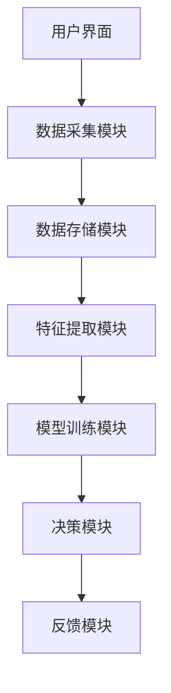
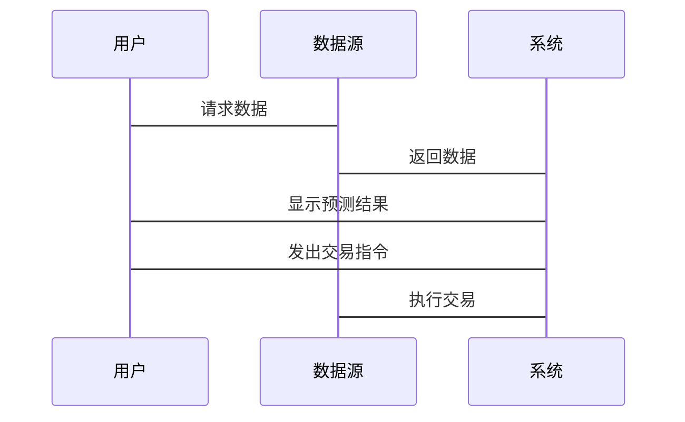

                 


# 特价股票投资中的人工智能辅助决策系统

## 关键词：人工智能，股票投资，特价股票，决策系统，算法原理

## 摘要

本文探讨了人工智能在特价股票投资中的应用，介绍了决策系统的核心概念、算法原理、系统架构，并通过项目实战和最佳实践提供深度分析。文章结合理论与实践，详细讲解了AI如何辅助投资者在特价股票市场中做出更明智的决策。

---

## 第1章：特价股票投资与人工智能辅助决策的背景

### 1.1 特价股票的概念与特点

#### 1.1.1 特价股票的定义
特价股票指价格低于市场平均水平的股票，通常具有高波动性和高增长潜力。投资者利用特价股票寻找低价投资机会，追求超额收益。

#### 1.1.2 特价股票的市场特征
- **低估值**：市盈率、市净率等指标低于行业平均水平。
- **高波动**：价格波动较大，提供短期交易机会。
- **高风险**：公司基本面可能存在不确定性。

#### 1.1.3 特价股票的投资机会与风险
机会：潜在的高回报，尤其是市场复苏时。风险：公司基本面不佳可能导致价值进一步下跌。

### 1.2 人工智能在金融投资中的应用现状

#### 1.2.1 人工智能在金融领域的应用概述
AI广泛应用于风险评估、市场预测、量化交易等领域，提升投资效率和准确性。

#### 1.2.2 人工智能在股票投资中的优势
- **数据处理能力强**：AI能处理大量非结构化数据，发现市场规律。
- **预测准确性高**：通过历史数据分析，AI能提供更精准的预测。
- **实时监控**：AI实时监控市场变化，及时识别交易机会。

#### 1.2.3 人工智能辅助决策系统的必要性
- 提高决策效率：AI能快速处理数据，辅助决策。
- 减少人为错误：AI避免情绪化决策，提供理性建议。
- 个性化投资：AI根据投资者风险偏好定制策略。

---

## 第2章：人工智能辅助决策系统的核心概念

### 2.1 数据特征与分析

#### 2.1.1 市场数据的特征提取
- **技术指标**：如K线图、MACD、RSI等，帮助分析价格走势。
- **基本面指标**：如PE、PB、ROE等，评估公司财务状况。
- **市场情绪**：通过新闻、社交媒体分析市场情绪。

#### 2.1.2 技术指标与基本面分析
技术指标反映市场情绪，基本面指标反映公司价值，结合两者能更全面地评估股票价值。

#### 2.1.3 数据预处理与特征选择
- **数据清洗**：处理缺失值、异常值。
- **特征提取**：提取关键特征，如移动平均线、波动率等。
- **特征选择**：使用统计或机器学习方法选择重要特征。

### 2.2 算法模型与决策机制

#### 2.2.1 机器学习模型的分类
- **监督学习**：用于分类问题，如预测股票涨跌。
- **无监督学习**：用于聚类分析，发现市场结构。
- **半监督学习**：结合少量标注数据和大量未标注数据。

#### 2.2.2 深度学习模型的原理
- **卷积神经网络（CNN）**：处理图像数据，用于识别K线图模式。
- **循环神经网络（RNN）**：处理时间序列数据，预测价格走势。
- **Transformer模型**：用于捕捉长距离依赖关系，提升预测准确性。

#### 2.2.3 群决策模型的优势
- **多样性**：多个模型结果相互补充，降低单点故障风险。
- **鲁棒性**：群决策模型在部分模型失效时仍能保持稳定。
- **适应性**：能快速适应市场变化，及时调整投资策略。

---

## 第3章：人工智能辅助决策系统的算法原理

### 3.1 强化学习算法

#### 3.1.1 强化学习的基本原理
强化学习通过试错机制，学习最优策略。在股票投资中，智能体通过买卖决策获得最大收益。

#### 3.1.2 策略网络的构建与训练
- **策略网络**：输出动作，如买入、卖出或持有。
- **价值网络**：评估当前状态的价值，指导策略网络决策。
- **经验回放**：通过存储历史经验，减少样本偏差。

#### 3.1.3 探索与利用的平衡
- **探索**：尝试新策略，避免陷入局部最优。
- **利用**：利用已知最优策略，最大化收益。
- **平衡机制**：通过概率或温度参数调节探索与利用的比例。

### 3.2 深度学习算法

#### 3.2.1 卷积神经网络（CNN）的应用
- **图像识别**：将K线图转换为图像，识别价格形态。
- **特征提取**：自动提取有用的图像特征，提升预测精度。

#### 3.2.2 循环神经网络（RNN）的原理
- **时间序列处理**：适用于股票价格预测。
- **长期记忆**：通过LSTM单元捕捉长期依赖关系。

#### 3.2.3 Transformer模型的优势
- **并行计算**：提升计算效率。
- **全局依赖**：捕捉长距离市场关系。

---

## 第4章：人工智能辅助决策系统的数学模型

### 4.1 收益计算模型

#### 4.1.1 收益率的计算公式
$$ \text{收益率} = \frac{\text{最终价值} - \text{初始价值}}{\text{初始价值}} \times 100\% $$

#### 4.1.2 风险调整后的收益模型
$$ \text{夏普比率} = \frac{\text{收益} - \text{无风险利率}}{\text{收益波动率}} $$

#### 4.1.3 马科维茨有效组合模型
$$ \text{Minimize} \sum_{i,j} w_i w_j \sigma_{i,j} $$
$$ \text{Subject to} \sum_{i} w_i = 1 \text{ 和 } w_i \geq 0 $$

### 4.2 风险评估模型

#### 4.2.1 风险价值（VaR）的计算
$$ \text{VaR} = \text{损失的第 } \alpha \text{ 分位数} $$

#### 4.2.2 压力测试模型的应用
模拟极端市场条件下的资产表现，评估投资组合的稳定性。

#### 4.2.3 风险调整后的收益模型
$$ \text{RAROC} = \frac{\text{净利润}}{\text{风险资本}} $$

---

## 第5章：人工智能辅助决策系统的系统架构设计

### 5.1 系统功能模块设计

#### 5.1.1 数据采集模块
- **数据源**：实时采集股票数据、新闻、社交媒体信息。
- **数据预处理**：清洗、转换数据格式，提取特征。

#### 5.1.2 特征提取模块
- **技术指标**：计算K线图、MACD、RSI等指标。
- **基本面分析**：提取公司财务数据，计算估值指标。
- **市场情绪分析**：分析新闻和社交媒体，评估市场情绪。

#### 5.1.3 模型训练与预测模块
- **训练数据**：使用历史数据训练模型。
- **实时预测**：根据最新数据生成预测结果。

#### 5.1.4 决策与反馈模块
- **决策逻辑**：基于模型预测生成买卖信号。
- **反馈机制**：根据实际收益调整模型参数，优化决策策略。

### 5.2 系统架构设计

#### 5.2.1 系统架构图


#### 5.2.2 系统接口设计
- **数据接口**：与数据源API对接，获取实时数据。
- **用户接口**：提供可视化界面，展示预测结果和交易信号。

#### 5.2.3 系统交互流程


---

## 第6章：人工智能辅助决策系统的项目实战

### 6.1 环境安装

#### 6.1.1 安装Python
```bash
python --version
pip install --upgrade pip
```

#### 6.1.2 安装依赖库
```bash
pip install numpy pandas scikit-learn tensorflow
```

### 6.2 核心代码实现

#### 6.2.1 数据采集与预处理
```python
import pandas as pd
import numpy as np

# 采集数据
data = pd.read_csv('stock_data.csv')

# 数据清洗
data = data.dropna()
data = (data - data.mean()) / data.std()
```

#### 6.2.2 模型训练
```python
from tensorflow.keras import layers

model = tf.keras.Sequential([
    layers.Conv1D(32, 3, activation='relu', input_shape=(None, 1)),
    layers.MaxPooling1D(2),
    layers.Flatten(),
    layers.Dense(10, activation='softmax')
])

model.compile(optimizer='adam', loss='sparse_categorical_crossentropy', metrics=['accuracy'])
model.fit(data, labels, epochs=10, batch_size=32)
```

#### 6.2.3 交易策略实现
```python
def decision_rule(predicted_price, current_price):
    if predicted_price > current_price:
        return '买入'
    elif predicted_price < current_price:
        return '卖出'
    else:
        return '持有'
```

### 6.3 案例分析

#### 6.3.1 数据分析
分析历史数据，识别特价股票的投资机会。

#### 6.3.2 模型预测
使用训练好的模型预测未来价格走势。

#### 6.3.3 交易策略
根据模型预测生成交易信号，执行买卖操作，记录收益。

---

## 第7章：最佳实践与总结

### 7.1 小结

人工智能在特价股票投资中的应用显著提升了决策效率和准确性。通过数据特征分析、算法模型优化和系统架构设计，投资者能够更有效地捕捉市场机会，降低投资风险。

### 7.2 注意事项

- **数据质量**：确保数据准确、完整，避免错误决策。
- **模型选择**：根据市场环境选择合适模型，避免过度拟合。
- **风险管理**：设置止损点，控制仓位，分散投资。

### 7.3 拓展阅读

- 《机器学习实战》：深入理解机器学习算法。
- 《深度学习》：掌握深度学习原理与应用。
- 《算法导论》：提升算法设计能力。

---

## 作者：AI天才研究院 & 禅与计算机程序设计艺术

这篇文章全面探讨了人工智能在特价股票投资中的应用，从理论到实践，为投资者提供了有力的工具和方法，帮助他们在复杂多变的市场中做出明智决策。

