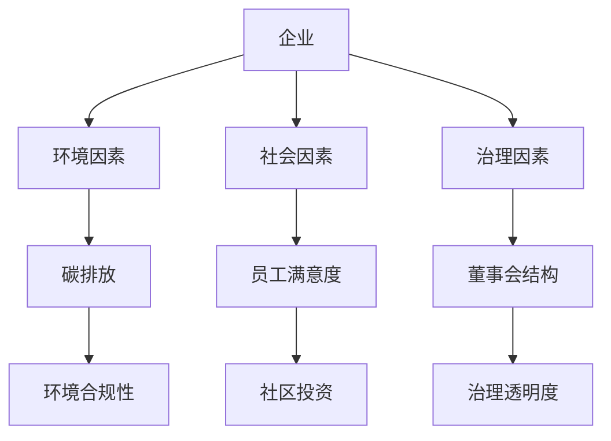
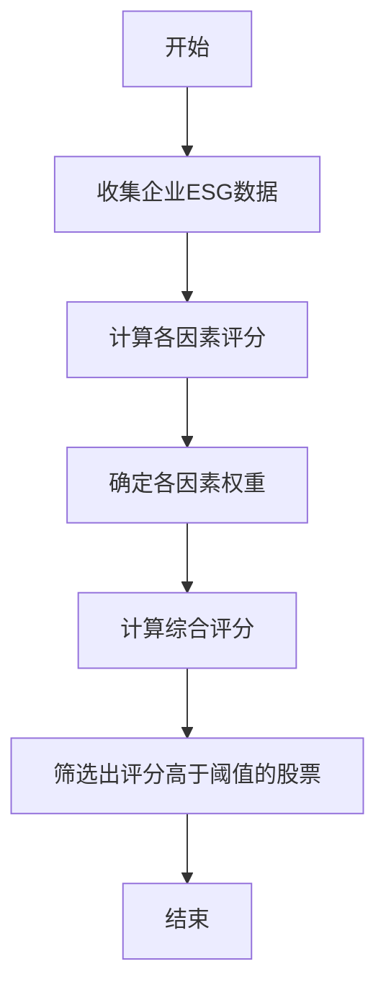
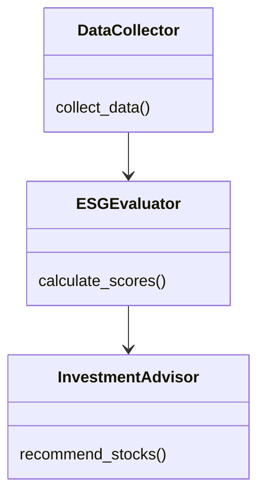
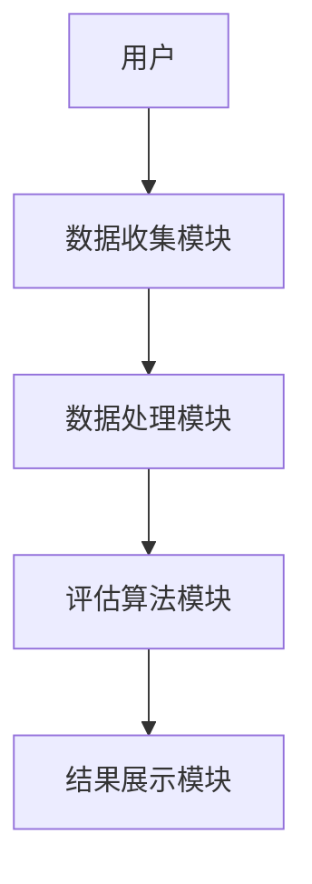
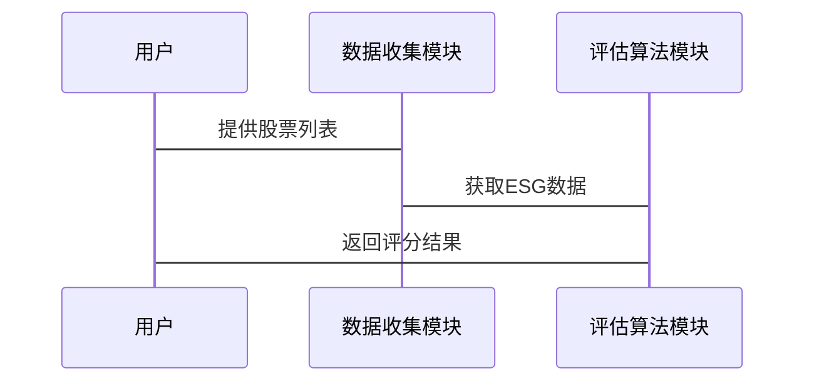

                 


# 特价股票投资中的企业社会价值评估因素考量

> **关键词**：特价股票投资、企业社会价值评估、ESG因素、投资决策、可持续投资  
> **摘要**：本文探讨了在特价股票投资中如何评估企业社会价值，分析了环境、社会和治理（ESG）因素对企业投资价值的影响，提出了基于ESG评分的股票评估模型，并通过案例展示了实际应用。

---

## 第一部分：引言

### 第1章：特价股票投资与企业社会价值评估的背景

#### 1.1 特价股票投资的概述

- **1.1.1 特价股票的定义与特点**
  - 特价股票是指市场价格低于其内在价值的股票，通常被视为被市场低估的投资机会。
  - 特点包括低市盈率、低市净率、高股息率等。

- **1.1.2 特价股票投资的基本原则**
  - 坚持长期投资，关注企业基本面。
  - 选择具有竞争优势和良好管理的企业。

- **1.1.3 特价股票投资的市场环境**
  - 市场波动提供低价买入机会。
  - 经济周期变化影响股票价格。

#### 1.2 企业社会价值评估的背景

- **1.2.1 企业社会价值的定义**
  - 企业社会价值是指企业在创造经济价值的同时，对社会、环境和利益相关者的影响。
  - 包括环境、社会和治理（ESG）三个维度。

- **1.2.2 企业社会价值评估的重要性**
  - 帮助投资者识别长期风险和机会。
  - 促进企业可持续发展，增强社会责任。

- **1.2.3 企业社会价值与投资决策的关系**
  - ESG因素已成为影响股票价值的重要因素。
  - 越来越多的投资者将ESG作为投资决策的考量之一。

#### 1.3 特价股票投资中企业社会价值评估的意义

- **1.3.1 提升投资决策的科学性**
  - 将ESG因素纳入评估体系，减少投资风险。
  - 通过全面评估企业价值，避免仅关注价格。

- **1.3.2 优化投资组合的风险管理**
  - 降低因企业治理不善或环境问题带来的风险。
  - 提高投资组合的抗风险能力。

- **1.3.3 促进可持续投资理念的实践**
  - 通过投资具有社会责任感的企业，推动社会进步。
  - 实现经济收益与社会价值的双重目标。

---

## 第二部分：企业社会价值评估的核心概念

### 第2章：企业社会价值评估的核心要素

#### 2.1 环境因素（Environmental）

- **2.1.1 环境政策与合规性**
  - 企业遵守环境法规的情况。
  - 是否有环境政策和环保措施。

- **2.1.2 碳排放与能源使用效率**
  - 单位产品碳排放量。
  - 能源使用效率和可再生能源使用比例。

- **2.1.3 环境影响评估**
  - 环境影响报告的透明度。
  - 环境事件的处理和责任承担。

#### 2.2 社会因素（Social）

- **2.2.1 劳工权益与员工关系**
  - 是否遵守劳工标准，包括工资、工时、福利等。
  - 员工满意度和员工发展机会。

- **2.2.2 社区关系与社会责任**
  - 社区投资和公益活动。
  - 是否关注社会问题，如教育、医疗等。

- **2.2.3 产品安全与消费者权益**
  - 产品是否安全，是否符合消费者权益保护法。
  - 消费者投诉处理情况。

#### 2.3 治理因素（Governance）

- **2.3.1 公司治理结构**
  - 股东结构、董事会构成和独立董事比例。
  - 公司治理是否透明和高效。

- **2.3.2 透明度与信息披露**
  - 财务报表和重大事件的披露情况。
  - 是否存在信息披露不透明的问题。

- **2.3.3 风险管理与内部控制**
  - 风险管理策略和内部审计机制。
  - 内部控制的有效性。

### 第3章：企业社会价值评估的核心概念与联系

#### 3.1 核心概念原理

- **ESG框架的整合**
  - 环境、社会和治理因素的综合评估。
  - 通过权重分配，确定各因素的重要性。

- **各个因素的相互作用**
  - 例如，良好的公司治理可以提升环境和社会责任的执行效果。

#### 3.2 ESG因素对比表格

| **因素**   | **环境（E）**                | **社会（S）**                 | **治理（G）**                |
|------------|------------------------------|-----------------------------|----------------------------|
| **定义**   | 企业在环境保护方面的表现    | 企业在社会责任方面的表现    | 企业在公司治理方面的表现    |
| **指标**   | 碳排放、能源效率             | 劳工权益、社区关系          | 董事会结构、透明度          |
| **权重**   | 30%                          | 40%                          | 30%                          |

#### 3.3 ESG实体关系图（Mermaid流程图）



---

## 第三部分：评估模型与算法

### 第4章：评估模型与算法

#### 4.1 评估模型的原理

- **基于ESG评分的股票评分模型**
  - 根据企业ESG表现，计算综合评分。
  - 根据评分筛选出高评分且价格低估的股票。

- **数学模型**
  - 计算公式：
    $$ \text{综合评分} = w_E \times E + w_S \times S + w_G \times G $$
    其中，\( w_E, w_S, w_G \)分别为环境、社会和治理因素的权重，\( E, S, G \)分别为各因素的评分。

#### 4.2 算法流程图



#### 4.3 算法实现代码

```python
import pandas as pd

# 假设数据为pandas DataFrame，包含企业ESG数据
def calculate_esg_score(data, weights):
    # 计算各因素评分
    e_scores = data['E'].values
    s_scores = data['S'].values
    g_scores = data['G'].values
    
    # 计算综合评分
    esg_scores = []
    for i in range(len(data)):
        score = weights['E'] * e_scores[i] + weights['S'] * s_scores[i] + weights['G'] * g_scores[i]
        esg_scores.append(score)
    
    return esg_scores

# 示例权重
weights = {'E': 0.3, 'S': 0.4, 'G': 0.3}
data = pd.DataFrame({
    'E': [0.8, 0.6, 0.7],
    'S': [0.9, 0.5, 0.8],
    'G': [0.6, 0.7, 0.5]
})

scores = calculate_esg_score(data, weights)
print(scores)
```

---

## 第四部分：系统分析与架构设计

### 第5章：系统分析与架构设计方案

#### 5.1 问题场景介绍

- **投资者需要一个系统化的方法**  
  - 来评估企业的ESG表现。
  - 并根据评分进行投资决策。

#### 5.2 项目介绍

- **项目目标**  
  - 开发一个基于ESG评分的股票评估系统。

#### 5.3 系统功能设计（领域模型类图）



#### 5.4 系统架构设计（Mermaid架构图）



#### 5.5 系统交互设计（Mermaid序列图）



---

## 第五部分：项目实战

### 第6章：项目实战

#### 6.1 环境安装

- **Python环境**  
  - 安装pandas、numpy等库。

#### 6.2 核心实现代码

```python
import pandas as pd

# 示例数据
data = pd.DataFrame({
    '股票代码': ['A', 'B', 'C'],
    'E': [0.8, 0.6, 0.7],
    'S': [0.9, 0.5, 0.8],
    'G': [0.6, 0.7, 0.5]
})

# 权重
weights = {'E': 0.3, 'S': 0.4, 'G': 0.3}

# 计算ESG评分
data['ESG评分'] = data[['E', 'S', 'G']].apply(lambda x: weights['E']*x['E'] + weights['S']*x['S'] + weights['G']*x['G'], axis=1)

# 筛选出评分高于0.7的股票
selected_stocks = data[data['ESG评分'] > 0.7]
print(selected_stocks)
```

#### 6.3 案例分析

- **案例：假设某股票的ESG评分为0.8，市盈率为10，属于低估股票。**
  - 根据模型，该股票符合投资条件，值得考虑。

---

## 第六部分：结论与展望

### 第7章：结论与展望

#### 7.1 核心观点总结

- 企业社会价值评估是特价股票投资的重要组成部分。
- ESG因素能够帮助投资者识别风险和机会，优化投资决策。

#### 7.2 最佳实践 tips

- **动态评估**  
  - 定期更新ESG数据，及时调整投资组合。
- **结合其他因素**  
  - 将ESG评估与财务指标结合，全面评估股票价值。

#### 7.3 未来研究方向

- 开发更复杂的评估模型，考虑更多因素。
- 探索人工智能在ESG评估中的应用。

#### 7.4 注意事项

- 数据的准确性和及时性至关重要。
- 模型结果仅供参考，需结合市场实际情况。

#### 7.5 拓展阅读

- 推荐阅读《可持续投资：从理念到实践》。

---

**作者：AI天才研究院/AI Genius Institute & 禅与计算机程序设计艺术/Zen And The Art of Computer Programming**

