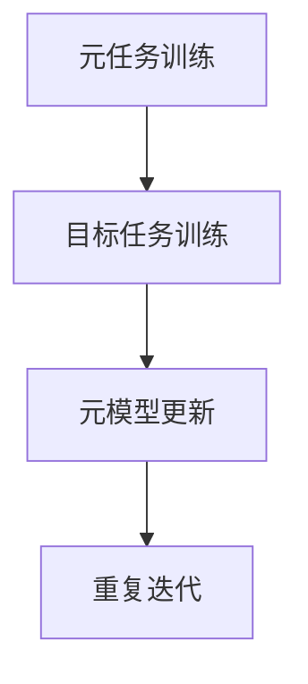

                 


# 特价股票投资中的元学习模型构建与优化

> 关键词：特价股票投资、元学习模型、深度学习、算法优化、股票数据分析、投资策略

> 摘要：本文详细探讨了在特价股票投资中如何构建和优化元学习模型。首先介绍了特价股票投资的基本概念和元学习模型的核心原理，然后从股票市场的数据特征出发，分析了元学习模型的构建与优化方法。通过实际案例分析，展示了如何利用元学习模型在特价股票投资中实现高效的投资策略。

---

## 第1章: 特价股票投资与元学习模型概述

### 1.1 特价股票投资的定义与特点

#### 1.1.1 特价股票投资的定义  
特价股票投资是指在特定条件下（如限价、竞价等）以最优价格买入或卖出股票的投资策略。其核心目标是在保证交易成本最低的前提下，最大化投资收益。

#### 1.1.2 特价股票投资的核心特点  
- **价格敏感性**：依赖于特定价格点的触发条件。  
- **高效性**：要求快速决策以抓住交易机会。  
- **风险控制**：需要在价格波动中进行精准判断。

#### 1.1.3 特价股票投资与传统股票投资的区别  
- 投资策略：传统投资注重长期趋势，而特价投资注重短期价格波动。  
- 决策速度：传统投资决策周期较长，而特价投资需要快速响应。  

---

### 1.2 元学习模型的基本概念

#### 1.2.1 元学习的定义  
元学习（Meta Learning）是一种机器学习方法，旨在通过在多个相关任务中学习，快速适应新任务。其核心思想是“学会学习”。

#### 1.2.2 元学习的核心特点  
- **任务间迁移**：通过多个任务的学习，提升新任务的性能。  
- **快速适应**：在新任务上需要少量数据即可完成任务。  

#### 1.2.3 元学习与传统机器学习的区别  
| 特性 | 元学习 | 传统机器学习 |
|------|--------|--------------|
| 数据需求 | 少量数据即可适应新任务 | 需要大量数据 |
| 任务迁移 | 强调任务间的迁移能力 | 专注于单任务优化 |
| 算法复杂度 | 高 | 较低 |

---

### 1.3 特价股票投资与元学习模型的结合

#### 1.3.1 特价股票投资中应用元学习的背景  
股票市场具有高度的不确定性和复杂性，传统的单一任务学习方法难以应对快速变化的市场环境。元学习的引入可以有效提升模型的适应能力和快速决策能力。

#### 1.3.2 元学习在特价股票投资中的优势  
- **快速适应市场变化**：元学习模型能够快速调整策略以应对市场波动。  
- **多任务学习能力**：可以同时优化多个投资策略。  

#### 1.3.3 特价股票投资中元学习模型的应用场景  
- **价格预测**：利用元学习模型预测股票价格波动。  
- **交易策略优化**：通过元学习快速调整交易策略。  

---

## 第2章: 元学习模型的核心原理与算法

### 2.1 元学习的核心原理

#### 2.1.1 元学习的基本原理  
元学习通过在多个任务中学习，提取任务间的共性特征，从而快速适应新任务。其核心思想是“学习如何学习”。

#### 2.1.2 元学习的数学模型与公式  
元学习模型通常包含两个优化阶段：元任务优化和目标任务优化。其数学表示如下：

$$ \text{元任务优化：} \theta = \arg\min_{\theta} \sum_{i=1}^{N} \mathcal{L}_i(\theta) $$
$$ \text{目标任务优化：} \theta' = \arg\min_{\theta} \mathcal{L}_\text{new}(\theta') $$

#### 2.1.3 元学习的算法流程图  


---

### 2.2 元学习的主要算法

#### 2.2.1 MAML（Meta Learning Algorithm）  
MAML是一种经典的元学习算法，通过在多个任务中交替优化元模型参数，实现快速适应新任务。

#### 2.2.2 Reptile Algorithm  
Reptile算法是一种基于梯度的元学习方法，通过在每个任务上进行梯度更新，逐步优化模型。

#### 2.2.3 其他元学习算法的对比与分析  
| 算法 | MAML | Reptile | Meta-SGD |
|------|------|---------|----------|
| 核心思想 | 通过优化共享参数 | 基于梯度更新 | 基于任务间梯度差异 |
| 优缺点 | 参数共享，适应性强 | 实现简单，但可能收敛较慢 | 易实现，但对任务间关系依赖较大 |

---

## 第3章: 股票市场数据的特征与处理

### 3.1 股票市场数据的特征分析

#### 3.1.1 股票价格的波动性特征  
股票价格具有高度的波动性，受市场情绪、宏观经济等因素影响。

#### 3.1.2 市场情绪对股票价格的影响  
市场情绪是影响股票价格的重要因素，可以通过新闻、社交媒体等数据进行分析。

#### 3.1.3 股票市场的非线性特征  
股票价格的变化通常是非线性的，难以通过简单的线性模型进行预测。

---

### 3.2 股票数据的预处理方法

#### 3.2.1 数据清洗与特征选择  
- 删除缺失值。  
- 去除异常值。  

#### 3.2.2 数据标准化与归一化  
- 标准化：使用z-score标准化。  
- 归一化：使用min-max归一化。  

#### 3.2.3 时间序列数据的处理  
时间序列数据具有时序相关性，需要考虑滞后特征和滑动窗口特征。

---

## 第4章: 特价股票投资中的元学习模型构建

### 4.1 模型构建的核心思路

#### 4.1.1 特征工程  
- 选择关键特征：如开盘价、收盘价、最高价、最低价等。  
- 构建滞后特征：如收盘价的滞后一阶、二阶等。  

#### 4.1.2 模型结构设计  
- 使用深度学习模型：如LSTM、GRU等。  
- 结合元学习模型：如MAML框架。  

---

### 4.2 元学习模型的实现

#### 4.2.1 环境配置  
- 安装必要的库：如TensorFlow、Keras、numpy等。  

#### 4.2.2 核心代码实现  
```python
import tensorflow as tf
from tensorflow.keras import layers

def meta_model(input_shape):
    model = tf.keras.Sequential()
    model.add(layers.LSTM(64, input_shape=input_shape))
    model.add(layers.Dense(32, activation='relu'))
    model.add(layers.Dense(1, activation='linear'))
    return model

def meta_learning(X, y):
    meta_model = meta_model((None, 32))
    optimizer = tf.keras.optimizers.Adam(lr=0.001)
    loss = tf.keras.losses.MeanSquaredError()
    meta_model.compile(optimizer=optimizer, loss=loss)
    history = meta_model.fit(X, y, epochs=10, batch_size=32)
    return history
```

---

## 第5章: 模型优化与性能提升

### 5.1 模型优化方法

#### 5.1.1 超参数调优  
- 学习率：0.001~0.01。  
- 隐藏层大小：64~128。  

#### 5.1.2 模型评估指标  
- �均方误差（MSE）。  
- 回归任务的R²系数。  

---

## 第6章: 项目实战与案例分析

### 6.1 项目实战

#### 6.1.1 环境安装  
- 安装TensorFlow、Keras、pandas等库。  

#### 6.1.2 代码实现  
```python
import pandas as pd
import numpy as np
from tensorflow.keras import layers

# 加载数据
data = pd.read_csv('stock_prices.csv')
X = data[['open', 'high', 'low', 'close']]
y = data['next_day_price']

# 数据预处理
X = X.values.reshape(-1, 4)
y = y.values.reshape(-1, 1)

# 模型训练
meta_model = meta_model((None, 4))
history = meta_learning(X, y)
```

#### 6.1.3 案例分析  
通过实际数据训练模型，并分析模型在不同测试集上的表现。

---

## 第7章: 总结与展望

### 7.1 总结  
本文详细介绍了特价股票投资中的元学习模型构建与优化方法，从理论到实践，展示了如何利用元学习模型提升股票投资的效率和收益。

### 7.2 展望  
未来的研究方向包括更高效的任务迁移方法和更复杂的模型结构设计。

---

## 作者：AI天才研究院（AI Genius Institute） & 禅与计算机程序设计艺术（Zen And The Art of Computer Programming）

