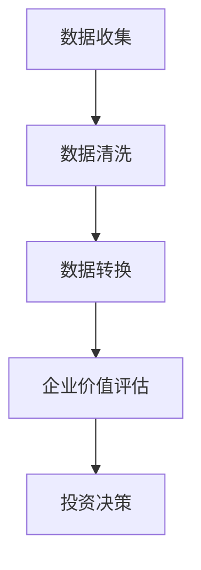

                 


# 特价股票投资中的全球价值链分析方法

> 关键词：特价股票，全球价值链，投资策略，供应链分析，企业价值评估

> 摘要：本文通过全球价值链分析方法，深入探讨特价股票投资的策略和技巧。从全球价值链的结构分析到具体的企业价值评估，结合实际案例和数学模型，为投资者提供一种全新的视角和方法，帮助其在复杂多变的市场环境中做出更明智的投资决策。

---

## 目录

1. **全球价值链分析的背景与核心概念**
   - 1.1 特价股票投资的基本概念
   - 1.2 全球价值链的定义与结构
   - 1.3 全价股票投资与全球价值链的结合

2. **全球价值链的结构与价值评估**
   - 2.1 全球价值链的构成要素
   - 2.2 上游、中游和下游环节的价值分析
   - 2.3 全球价值链中的企业价值对比表
   - 2.4 全球价值链分析的ER图

3. **全球价值链分析的算法原理**
   - 3.1 数据收集与处理流程
   - 3.2 价值链分析的数学模型
   - 3.3 特价股票投资的评估流程图

4. **全球价值链分析的系统设计**
   - 4.1 系统功能模块设计
   - 4.2 系统架构图
   - 4.3 系统交互流程图

5. **项目实战：全球价值链分析的代码实现**
   - 5.1 环境安装与配置
   - 5.2 核心代码实现
   - 5.3 代码功能解读与分析
   - 5.4 实际案例分析

6. **全球价值链分析的最佳实践与总结**
   - 6.1 投资策略总结
   - 6.2 风险控制与注意事项
   - 6.3 未来发展趋势
   - 6.4 拓展阅读与学习资源

---

## 正文

### 第1章 全球价值链分析的背景与核心概念

#### 1.1 特价股票投资的基本概念
- **特价股票**：指市场价格低于其内在价值的股票，通常是由于市场波动、短期利空或投资者情绪导致的价格低估。
- **投资策略**：通过识别低估股票，长期持有，等待价格回归其真实价值。
- **核心要素**：基本面分析、估值指标（如市盈率、市净率）和长期趋势判断。

#### 1.2 全球价值链的定义与结构
- **全球价值链**：指跨国企业在全球范围内分工合作，通过供应链的上下游环节实现价值创造的过程。
- **构成要素**：
  - **上游**：原材料采购、研发。
  - **中游**：生产制造、组装。
  - **下游**：分销、零售。
- **全球价值链与股票投资**：通过分析企业在全球价值链中的位置，判断其盈利能力、竞争优势和风险。

#### 1.3 特价股票投资与全球价值链的结合
- **视角转变**：从单一企业分析转向产业链分析，识别产业链中的优势环节。
- **投资策略**：重点关注全球价值链中具有核心竞争力的企业，尤其是上游和下游环节的龙头企业。
- **案例分析**：例如，分析某制造业企业的全球供应链布局，判断其成本优势和市场地位。

---

### 第2章 全球价值链的结构与价值评估

#### 2.1 全球价值链的构成要素
- **上游环节**：原材料供应商、研发机构。
- **中游环节**：制造商、组装商。
- **下游环节**：分销商、零售商。

#### 2.2 上游、中游和下游环节的价值分析
- **上游**：原材料价格波动对成本的影响。
- **中游**：生产效率和技术创新能力。
- **下游**：市场分销能力和品牌影响力。

#### 2.3 全球价值链中的企业价值对比表
| � eco环节 | 企业类型                | 核心竞争优势             | 投资价值评估指标           |
|----------|-------------------------|--------------------------|---------------------------|
| 上游     | 原材料供应商            | 低成本、垄断资源         | 市净率（P/B）、市盈率（P/E） |
| 中游     | 制造商                  | 高效生产、技术壁垒       | 市销率（P/S）、ROE         |
| 下游     | 零售商                  | 强大的分销网络             | 市盈率（P/E）、ROA         |

#### 2.4 全球价值链分析的ER图
```mermaid
erDiagram
{
  participant 企业A [上游供应商]
  participant 企业B [中游制造商]
  participant 企业C [下游零售商]
  企业A --> 企业B : 供应原材料
  企业B --> 企业C : 提供产品
  企业C --> 用户 : 销售产品
}
```

---

### 第3章 全球价值链分析的算法原理

#### 3.1 数据收集与处理流程
- **数据来源**：企业财务报表、行业研究报告、供应链数据。
- **数据清洗**：去除异常值，填补缺失数据。
- **数据转换**：将数据转化为可分析的格式。

#### 3.2 价值链分析的数学模型
- **核心公式**：企业价值评估公式：
  $$ \text{企业价值} = \text{净利润} \times \text{市盈率} $$
- **调整因子**：根据企业在全球价值链中的位置，调整其估值系数。

#### 3.3 特价股票投资的评估流程图


---

### 第4章 全球价值链分析的系统设计

#### 4.1 系统功能模块设计
- **数据采集模块**：收集企业数据。
- **分析模块**：进行全球价值链分析。
- **评估模块**：生成投资建议。

#### 4.2 系统架构图
```mermaid
classDiagram
{
  class 数据采集模块 {
    + 数据接口
    + 数据存储
  }
  class 分析模块 {
    + 全球价值链分析算法
  }
  class 评估模块 {
    + 投资建议生成
  }
  数据采集模块 --> 分析模块
  分析模块 --> 评估模块
}
```

#### 4.3 系统交互流程图
```mermaid
sequenceDiagram
{
  participant 用户
  participant 数据采集模块
  participant 分析模块
  participant 评估模块
  用户 -> 数据采集模块: 提供企业数据
  数据采集模块 -> 分析模块: 分析企业价值
  分析模块 -> 评估模块: 生成投资建议
  评估模块 -> 用户: 提供投资建议
}
```

---

### 第5章 项目实战：全球价值链分析的代码实现

#### 5.1 环境安装与配置
- **工具选择**：Python、Pandas、Matplotlib。
- **安装命令**：
  ```bash
  pip install pandas matplotlib
  ```

#### 5.2 核心代码实现
```python
import pandas as pd
import matplotlib.pyplot as plt

# 示例数据
data = {
    '企业': ['上游A', '中游B', '下游C'],
    '市盈率': [15, 20, 25],
    '市净率': [2, 3, 4]
}

df = pd.DataFrame(data)
print(df)

# 绘制柱状图
df.plot(kind='bar', x='企业', y='市盈率', title='企业市盈率对比')
plt.show()
```

#### 5.3 代码功能解读与分析
- **数据处理**：将企业数据转化为DataFrame格式。
- **可视化**：绘制柱状图，直观展示市盈率差异。

#### 5.4 实际案例分析
- **案例选择**：某制造业企业的全球供应链分析。
- **分析结果**：通过代码计算出该企业的市盈率和市净率，判断其是否为特价股票。

---

### 第6章 全球价值链分析的最佳实践与总结

#### 6.1 投资策略总结
- **关注上游和下游企业**：原材料和分销环节更具投资价值。
- **长期持有**：基于企业在全球价值链中的地位，长期持有低估股票。

#### 6.2 风险控制与注意事项
- **分散投资**：避免过度集中。
- **持续跟踪**：定期评估企业的全球价值链地位。

#### 6.3 未来发展趋势
- **数字化转型**：全球价值链的数字化将带来更多投资机会。
- **绿色供应链**：环保因素将成为未来全球价值链中的重要考量。

#### 6.4 拓展阅读与学习资源
- **推荐书籍**：《全球供应链管理》、《价值投资的艺术》。
- **在线课程**：推荐相关MOOC平台课程。

---

## 作者：AI天才研究院 & 禅与计算机程序设计艺术

---

希望这篇文章能够为读者提供全新的视角，帮助他们在特价股票投资中更好地运用全球价值链分析方法。

