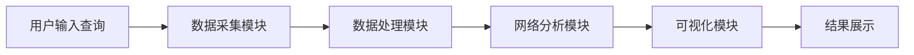

                 


# 第三部分：全球创新网络分析的系统设计

# 第3章：系统架构与功能设计

## 3.1 系统架构设计

### 3.1.1 系统总体架构


### 3.1.2 系统分层架构


## 3.2 功能模块设计

### 3.2.1 数据采集模块

#### 3.2.1.1 数据源选择

#### 3.2.1.2 数据采集方法

### 3.2.2 数据处理模块

#### 3.2.2.1 数据清洗

#### 3.2.2.2 数据转换

### 3.2.3 网络分析模块

#### 3.2.3.1 图模型构建

#### 3.2.3.2 网络指标计算

### 3.2.4 可视化模块

#### 3.2.4.1 可视化工具选择

#### 3.2.4.2 结果展示

## 3.3 系统交互流程



---

# 第4章：系统实现与接口设计

## 4.1 系统核心功能实现

### 4.1.1 数据采集接口

### 4.1.2 数据处理接口

### 4.1.3 网络分析接口

### 4.1.4 可视化接口

## 4.2 系统接口设计

### 4.2.1 接口定义

### 4.2.2 接口调用流程

### 4.2.3 接口文档示例

## 4.3 系统交互设计

### 4.3.1 用户操作流程

### 4.3.2 系统响应流程

### 4.3.3 交互异常处理

---

# 第五部分：全球创新网络分析的项目实战

# 第5章：项目实战与代码实现

## 5.1 项目环境安装

### 5.1.1 安装Python环境

### 5.1.2 安装所需库

## 5.2 数据采集与处理

### 5.2.1 数据清洗代码

```python
import pandas as pd

def clean_data(data):
    # 删除缺失值
    data.dropna(inplace=True)
    # 处理异常值
    data = data[(data['price'] > 0) & (data['volume'] > 0)]
    return data
```

### 5.2.2 数据转换代码

```python
from sklearn.preprocessing import StandardScaler

def preprocess_data(data):
    scaler = StandardScaler()
    scaled_data = scaler.fit_transform(data[['price', 'volume']])
    return scaled_data
```

## 5.3 网络分析与建模

### 5.3.1 图模型构建代码

```python
import networkx as nx

def build_graph(data):
    G = nx.Graph()
    for node in data['nodes']:
        G.add_node(node)
    for edge in data['edges']:
        G.add_edge(edge[0], edge[1])
    return G
```

### 5.3.2 网络分析代码

```python
def calculate_centralities(G):
    degree = nx.degree_centrality(G)
    betweenness = nx.betweenness_centrality(G)
    return degree, betweenness
```

## 5.4 可视化与结果解读

### 5.4.1 结果可视化代码

```python
import matplotlib.pyplot as plt

def visualize_graph(G):
    nx.draw(G, with_labels=True, node_color='blue', edge_color='red')
    plt.show()
```

---

# 第六部分：全球创新网络分析的案例分析

# 第6章：案例分析与策略制定

## 6.1 特价股票投资的创新网络分析案例

### 6.1.1 数据来源与处理

### 6.1.2 网络分析过程

### 6.1.3 投资策略制定

## 6.2 案例分析结果与解读

### 6.2.1 网络分析结果

### 6.2.2 投资策略优化

### 6.2.3 结果验证与评估

## 6.3 实践中的注意事项

### 6.3.1 数据质量

### 6.3.2 模型选择

### 6.3.3 风险管理

---

# 第七部分：总结与展望

# 第7章：总结与未来展望

## 7.1 全球创新网络分析方法总结

### 7.1.1 方法的核心优势

### 7.1.2 方法的局限性

### 7.1.3 方法的创新点

## 7.2 未来研究方向

### 7.2.1 网络分析的深度优化

### 7.2.2 多模态数据融合

### 7.2.3 智能化投资决策

## 7.3 项目总结

### 7.3.1 项目成果

### 7.3.2 项目经验

### 7.3.3 项目启示

## 7.4 本章小结

---

# 作者：AI天才研究院/AI Genius Institute & 禅与计算机程序设计艺术 /Zen And The Art of Computer Programming

