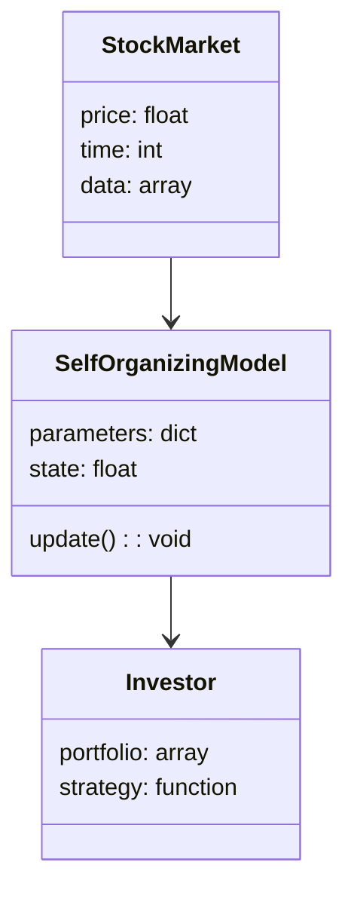
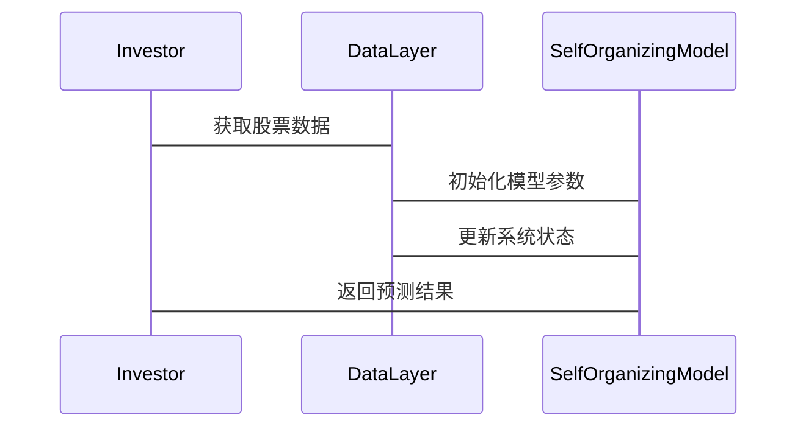

                 


# 特价股票投资中的动态数字产业生态系统自组织模型应用

> 关键词：特价股票、动态数字产业、生态系统、自组织模型、股票投资、算法原理

> 摘要：本文探讨了特价股票投资中的动态数字产业生态系统自组织模型的应用。通过分析动态数字产业生态系统的特征和自组织模型的原理，结合数学建模和算法实现，提出了一种基于自组织模型的股票投资策略。本文详细介绍了模型的实现过程，并通过实际案例分析验证了模型的有效性。

---

# 第1章: 特价股票投资与动态数字产业生态系统概述

## 1.1 特价股票投资的背景与特点

### 1.1.1 特价股票的定义与特点
特价股票通常指价格较低的股票，具有高波动性和高增长潜力。其特点包括低估值、高风险和高收益的不确定性。

### 1.1.2 特价股票投资的市场现状
当前市场中，特价股票因其高增长潜力吸引了大量投资者，但也面临较高的市场波动和信息不对称问题。

### 1.1.3 特价股票投资的核心问题与挑战
主要问题包括如何准确预测股票价格波动、如何选择优质特价股票以及如何制定有效的投资策略。

## 1.2 动态数字产业生态系统的定义与特征

### 1.2.1 数字产业生态系统的概念
数字产业生态系统指由数字技术驱动的产业体系，包括企业、消费者、技术平台等多个参与者。

### 1.2.2 动态数字产业生态系统的特征
- 动态性：系统状态随时间和环境变化而变化。
- 复杂性：涉及多个参与者和利益相关者。
- 自适应性：系统能够根据外部变化进行调整。

## 1.3 自组织模型在股票投资中的应用背景

### 1.3.1 自组织模型的定义与原理
自组织模型是一种基于复杂系统理论的数学模型，能够描述系统在无外部干预下的自适应行为。

### 1.3.2 自组织模型在股票市场中的应用价值
通过自组织模型，可以模拟股票市场的动态行为，帮助投资者预测价格波动和市场趋势。

### 1.3.3 本章小结
本章介绍了特价股票投资的基本概念、动态数字产业生态系统的特征以及自组织模型的应用背景。

---

# 第2章: 动态数字产业生态系统的核心概念与联系

## 2.1 动态数字产业生态系统的概念结构

### 2.1.1 核心要素组成
- 企业：包括上市公司和金融机构。
- 技术平台：如大数据分析平台和人工智能算法。
- 市场参与者：包括投资者和监管机构。

### 2.1.2 系统的层次结构
- 系统整体：包括市场、企业和技术平台。
- 子系统：如股票价格、交易量和市场情绪。

### 2.1.3 系统的动态特征
- 时间依赖性：系统状态随时间变化。
- 网络效应：参与者之间的相互作用影响系统行为。

## 2.2 自组织模型的核心原理

### 2.2.1 自组织理论的起源与发展
自组织理论起源于复杂系统研究，广泛应用于物理、生物和社会系统。

### 2.2.2 自组织模型的基本假设
- 系统由多个独立但相互作用的单元组成。
- 单元之间通过局部规则进行交互，形成全局有序行为。

### 2.2.3 自组织模型的数学表达式
$$ S_{t+1} = f(S_t, N_t) $$
其中，$S_t$ 表示系统在时间 $t$ 的状态，$N_t$ 表示外部因素。

## 2.3 动态数字产业生态系统与自组织模型的联系

### 2.3.1 系统的动态性与自组织性的结合
动态数字产业生态系统具有动态性，而自组织模型能够模拟这种动态行为。

### 2.3.2 自组织模型在动态数字产业生态系统中的应用
通过自组织模型，可以模拟股票市场的价格波动和企业行为的变化。

### 2.3.3 本章小结
本章分析了动态数字产业生态系统的概念结构，并探讨了自组织模型在其中的应用。

---

# 第3章: 自组织模型的算法原理与实现

## 3.1 自组织模型的算法原理

### 3.1.1 算法的基本流程
1. 初始化系统参数。
2. 计算系统状态。
3. 更新系统参数。
4. 输出结果。

### 3.1.2 算法的核心步骤
- 状态更新：基于当前状态和规则计算下一步状态。
- 参数调整：根据市场反馈调整模型参数。

## 3.2 自组织模型的数学模型与公式

### 3.2.1 系统状态的数学表达
$$ S_{t} = \alpha S_{t-1} + \beta N_{t} $$
其中，$\alpha$ 和 $\beta$ 是模型参数。

### 3.2.2 系统演化的数学方程
$$ S_{t+1} = \gamma S_t + \delta X_t $$
其中，$\gamma$ 和 $\delta$ 是系数，$X_t$ 是外部影响因素。

### 3.2.3 系统稳定性的数学分析
通过分析特征方程，判断系统的稳定性。

## 3.3 自组织模型的实现代码

### 3.3.1 Python代码实现
```python
def self_organization_model(initial_state, parameters):
    state = initial_state
    for t in range(parameters['steps']):
        state = parameters['alpha'] * state + parameters['beta'] * get_external_factor(t)
    return state
```

### 3.3.2 代码解读与分析
- `initial_state`：初始状态。
- `parameters`：模型参数，包括 `alpha`、`beta` 和 `steps`。
- `get_external_factor`：获取外部影响因素的函数。

## 3.4 算法实现的案例分析

### 3.4.1 案例背景
分析某段时间内某只股票的价格波动。

### 3.4.2 模型应用
使用自组织模型预测股票价格，验证模型的有效性。

### 3.4.3 结果分析
比较模型预测结果与实际价格，评估模型的准确性。

---

# 第4章: 动态数字产业生态系统中的系统分析与架构设计

## 4.1 系统分析

### 4.1.1 问题场景介绍
分析特价股票投资中的市场波动和企业行为。

### 4.1.2 系统功能设计
- 数据采集：获取股票价格和市场数据。
- 模型构建：建立自组织模型。
- 预测与分析：输出预测结果并进行分析。

### 4.1.3 领域模型设计（Mermaid 类图）


## 4.2 系统架构设计

### 4.2.1 系统架构（Mermaid 架构图）


### 4.2.2 系统接口设计
- 数据接口：获取股票数据。
- 模型接口：调用自组织模型进行预测。
- 用户接口：展示预测结果。

## 4.3 交互流程设计（Mermaid 序列图）



---

# 第5章: 项目实战——基于自组织模型的特价股票投资系统

## 5.1 环境安装

### 5.1.1 安装Python
安装Python 3.x版本，并配置环境变量。

### 5.1.2 安装依赖库
使用pip安装numpy、pandas和matplotlib。

## 5.2 系统核心实现

### 5.2.1 数据采集
从Yahoo Finance获取历史股票数据。

### 5.2.2 模型实现
基于自组织模型实现股票价格预测。

### 5.2.3 可视化展示
绘制实际价格和预测价格的对比图。

## 5.3 案例分析

### 5.3.1 数据预处理
清洗和标准化数据。

### 5.3.2 模型训练
使用历史数据训练自组织模型。

### 5.3.3 结果分析
比较预测结果与实际价格，评估模型性能。

## 5.4 项目小结
总结项目实现过程中的经验教训，提出改进建议。

---

# 第6章: 最佳实践与投资策略

## 6.1 投资策略建议

### 6.1.1 风险控制
设置止损点，避免过度亏损。

### 6.1.2 时间选择
选择市场波动较大的时段进行投资。

## 6.2 小结
总结全文内容，强调自组织模型在特价股票投资中的重要性。

## 6.3 注意事项
提醒读者注意市场风险，谨慎投资。

## 6.4 拓展阅读
推荐相关书籍和文献，供读者进一步学习。

---

# 作者：AI天才研究院 & 禅与计算机程序设计艺术

---

**相关推荐：**
- 《复杂系统的自组织理论与应用》
- 《股票投资策略与数学建模》
- 《动态系统分析与算法实现》

