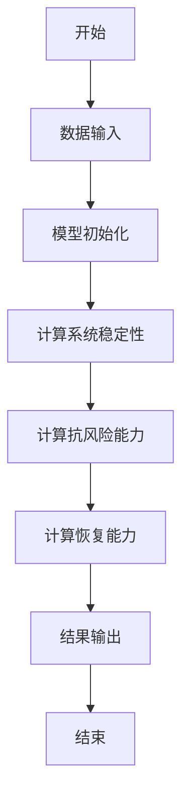
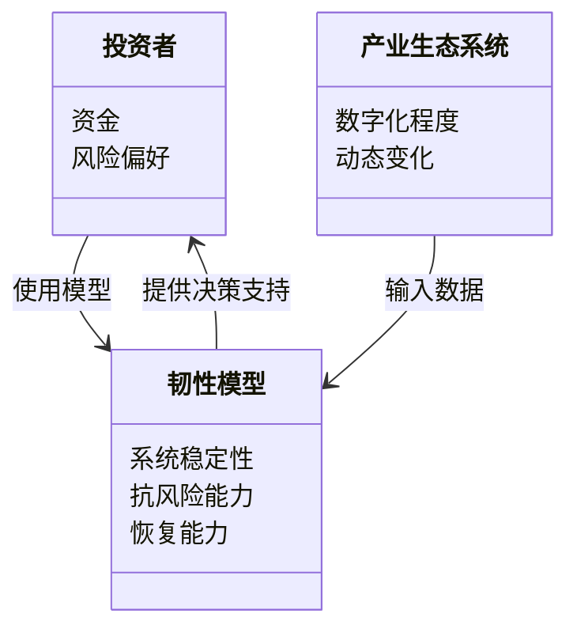
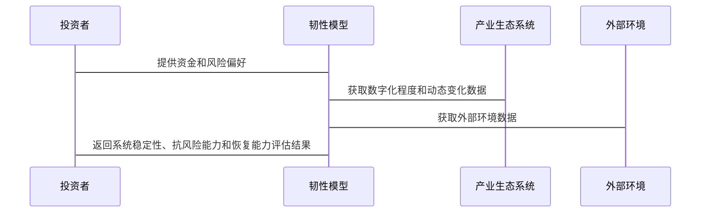

                 


```markdown
# 特价股票投资中的动态数字产业生态系统韧性模型应用

## 关键词：特价股票投资，动态数字产业生态系统，韧性模型，算法原理，系统架构设计，项目实战

## 摘要：本文探讨了在特价股票投资中，如何构建动态数字产业生态系统韧性模型，分析其核心概念、算法原理、系统架构设计及实际应用。通过详细的技术分析和实例，展示了如何利用韧性模型提高投资决策的稳定性和抗风险能力。

### 目录

# 第一部分: 特价股票投资中的动态数字产业生态系统韧性模型概述

## 第1章: 特价股票投资概述

### 1.1 特价股票的定义与特点
#### 1.1.1 特价股票的定义
特价股票是指价格相对较低，具有增长潜力的股票。其特点是价格波动大，风险高，但潜在回报也高。

#### 1.1.2 特价股票的主要特点
- 价格低：通常市盈率、市净率较低
- 潜力大：可能因企业转型或市场变化而爆发式增长
- 风险高：业绩不稳定，容易受市场波动影响

#### 1.1.3 特价股票投资的意义
- 把握低价投资机会
- 获取超额收益
- 增强投资组合的多样性

### 1.2 动态数字产业生态系统的概念
#### 1.2.1 产业生态系统的定义
产业生态系统是指由企业、供应商、客户、竞争对手等构成的相互依存的网络系统。

#### 1.2.2 数字产业生态系统的特征
- 数字化：信息流、数据流高度依赖数字化技术
- 网络化：各主体之间通过网络进行互动和协作
- 动态性：系统不断变化和调整，以适应市场环境

#### 1.2.3 动态数字产业生态系统的动态性分析
- 系统内部各要素的动态调整
- 外部环境变化对系统的影响
- 系统的自我修复和优化能力

### 1.3 韧性模型的基本概念
#### 1.3.1 韧性模型的定义
韧性模型是一种衡量系统在面对冲击和变化时保持稳定性和恢复能力的模型。

#### 1.3.2 韧性模型的核心要素
- 系统稳定性：系统在正常情况下的运行状态
- 抗风险能力：系统在面对冲击时的应对能力
- 恢复能力：系统在遭受破坏后的恢复速度和效果

#### 1.3.3 韧性模型在投资中的应用
- 评估投资标的的风险承受能力
- 优化投资组合的结构
- 提高投资决策的科学性和准确性

## 第2章: 动态数字产业生态系统韧性模型的背景与问题

### 2.1 特价股票投资中的问题背景
#### 2.1.1 特价股票市场的波动性
- 市场波动剧烈，价格变化快
- 投资者容易受到市场情绪影响
- 风险较高，需要谨慎选择投资标的

#### 2.1.2 数字化转型对产业生态系统的影响
- 数字化转型改变了产业生态系统的结构和运作方式
- 数据成为核心资源，信息处理能力成为竞争力的关键
- 数字技术的应用提高了产业生态系统的效率和灵活性

#### 2.1.3 韧性模型的必要性
- 需要一种工具来评估和管理投资风险
- 需要提高投资决策的科学性和前瞻性
- 需要构建一个能够适应市场变化的投资模型

### 2.2 动态数字产业生态系统中的问题描述
#### 2.2.1 产业生态系统的动态变化
- 系统内部要素的不断变化
- 外部环境的快速变化
- 系统的动态调整能力

#### 2.2.2 数字技术对生态系统的影响
- 数字技术的应用改变了产业生态系统的运作方式
- 数据成为关键资源，信息处理能力成为竞争优势
- 网络化协作成为主流模式

#### 2.2.3 韧性模型的应用场景
- 投资决策支持
- 投资组合优化
- 风险管理

### 2.3 韧性模型在特价股票投资中的问题解决
#### 2.3.1 韧性模型如何解决投资问题
- 提供科学的投资决策依据
- 优化投资组合结构
- 提高投资风险管理能力

#### 2.3.2 韧性模型的边界与外延
- 韧性模型的应用范围和限制
- 韧性模型与其他投资模型的区别与联系
- 韧性模型的适用场景和局限性

#### 2.3.3 韧性模型的核心要素组成
- 系统稳定性：系统在正常情况下的运行状态
- 抗风险能力：系统在面对冲击时的应对能力
- 恢复能力：系统在遭受破坏后的恢复速度和效果

## 第3章: 动态数字产业生态系统韧性模型的核心概念

### 3.1 韧性模型的原理
#### 3.1.1 韧性模型的基本原理
韧性模型通过分析系统内部要素和外部环境的相互作用，评估系统的稳定性和抗风险能力。

#### 3.1.2 韧性模型的数学基础
韧性模型基于系统动力学理论，结合概率论和统计学方法，构建系统的稳定性评估模型。

#### 3.1.3 韧性模型的实现方法
- 数据收集与处理
- 模型构建与参数校准
- 模型验证与优化

### 3.2 韧性模型的属性特征对比
#### 3.2.1 韧性模型的属性分析
- 系统稳定性：系统在正常情况下的运行状态
- 抗风险能力：系统在面对冲击时的应对能力
- 恢复能力：系统在遭受破坏后的恢复速度和效果

#### 3.2.2 不同模型的特征对比
| 模型名称       | 系统稳定性 | 抗风险能力 | 恢复能力 |
|----------------|-----------|------------|----------|
| 韧性模型       | 高         | 高          | 高        |
| 传统线性模型    | 中         | 低          | 低        |
| 系统动力学模型  | 高         | 中          | 中        |

#### 3.2.3 韧性模型的优势与劣势
- 优势：能够全面评估系统的稳定性和抗风险能力
- 劣势：模型复杂，需要大量的数据支持，实施成本较高

### 3.3 韧性模型的ER实体关系图
```mermaid
erDiagram
    actor 投资者 {
        <属性> 资金
        <属性> 风险偏好
    }
    actor 产业生态系统 {
        <属性> 数字化程度
        <属性> 动态变化
    }
    actor 韧性模型 {
        <属性> 系统稳定性
        <属性> 抗风险能力
    }
    投资者 --> 韧性模型 : 使用模型
    产业生态系统 --> 韧性模型 : 输入数据
    韧性模型 --> 投资者 : 提供决策支持
```

## 第4章: 动态数字产业生态系统韧性模型的算法原理

### 4.1 韧性模型的算法流程
#### 4.1.1 算法步骤
1. 数据收集与预处理
2. 模型构建与参数校准
3. 模型验证与优化
4. 模型应用与结果分析

#### 4.1.2 算法流程图


### 4.2 算法的数学模型
#### 4.2.1 系统稳定性评估模型
$$ S = \alpha \times D + \beta \times E $$
其中：
- \( S \) 表示系统稳定性
- \( D \) 表示数字化程度
- \( E \) 表示生态系统的动态变化
- \( \alpha \) 和 \( \beta \) 是权重系数

#### 4.2.2 抗风险能力评估模型
$$ R = \gamma \times S + \delta \times F $$
其中：
- \( R \) 表示抗风险能力
- \( S \) 表示系统稳定性
- \( F \) 表示系统的恢复能力
- \( \gamma \) 和 \( \delta \) 是权重系数

#### 4.2.3 恢复能力评估模型
$$ F = \epsilon \times R + \zeta \times G $$
其中：
- \( F \) 表示恢复能力
- \( R \) 表示抗风险能力
- \( G \) 表示外部环境的影响
- \( \epsilon \) 和 \( \zeta \) 是权重系数

### 4.3 算法的Python实现
```python
# 导入所需的库
import numpy as np
import pandas as pd

# 定义系统稳定性评估函数
def calculate_stability(D, E):
    alpha = 0.6
    beta = 0.4
    return alpha * D + beta * E

# 定义抗风险能力评估函数
def calculate_resistance(S, F):
    gamma = 0.5
    delta = 0.5
    return gamma * S + delta * F

# 定义恢复能力评估函数
def calculate_recovery(R, G):
    epsilon = 0.7
    zeta = 0.3
    return epsilon * R + zeta * G

# 主函数
def main():
    # 数据输入
    D = 0.8  # 数字化程度
    E = 0.6  # 生态系统的动态变化
    G = 0.7  # 外部环境的影响

    # 计算系统稳定性
    S = calculate_stability(D, E)
    print(f"系统稳定性 S = {S}")

    # 计算抗风险能力
    R = calculate_resistance(S, 0.5)  # 假设恢复能力 F 初始为 0.5
    print(f"抗风险能力 R = {R}")

    # 计算恢复能力
    F = calculate_recovery(R, G)
    print(f"恢复能力 F = {F}")

if __name__ == "__main__":
    main()
```

## 第5章: 系统分析与架构设计

### 5.1 系统分析
#### 5.1.1 问题场景介绍
在特价股票投资中，投资者需要面对市场波动、企业业绩变化等多重挑战。如何构建一个能够适应市场变化、提高投资决策稳定性的系统，是当前亟需解决的问题。

#### 5.1.2 项目介绍
本项目旨在构建一个基于动态数字产业生态系统韧性模型的投资决策支持系统，帮助投资者提高投资决策的科学性和准确性。

### 5.2 系统功能设计
#### 5.2.1 领域模型


#### 5.2.2 系统架构设计


#### 5.2.3 接口设计
- 投资者与韧性模型的接口：投资者提供资金和风险偏好，韧性模型返回稳定性评估结果。
- 产业生态系统与韧性模型的接口：产业生态系统提供数字化程度和动态变化数据，韧性模型返回抗风险能力和恢复能力评估结果。

#### 5.2.4 交互序列图


## 第6章: 项目实战

### 6.1 环境安装
#### 6.1.1 安装Python
```bash
python --version
pip install numpy pandas
```

#### 6.1.2 安装Mermaid
```bash
npm install -g mermaid-js
```

### 6.2 系统核心实现
#### 6.2.1 核心代码实现
```python
import numpy as np
import pandas as pd

def calculate_stability(D, E):
    alpha = 0.6
    beta = 0.4
    return alpha * D + beta * E

def calculate_resistance(S, F):
    gamma = 0.5
    delta = 0.5
    return gamma * S + delta * F

def calculate_recovery(R, G):
    epsilon = 0.7
    zeta = 0.3
    return epsilon * R + zeta * G

def main():
    D = 0.8
    E = 0.6
    G = 0.7

    S = calculate_stability(D, E)
    print(f"系统稳定性 S = {S}")

    R = calculate_resistance(S, 0.5)
    print(f"抗风险能力 R = {R}")

    F = calculate_recovery(R, G)
    print(f"恢复能力 F = {F}")

if __name__ == "__main__":
    main()
```

#### 6.2.2 代码应用解读与分析
- 代码实现了韧性模型的核心算法，包括系统稳定性、抗风险能力和恢复能力的计算。
- 通过调整权重系数，可以优化模型的性能，使其更符合实际投资需求。

### 6.3 实际案例分析
#### 6.3.1 案例背景
假设我们有一个特价股票投资组合，包含5只股票，每只股票的数字化程度和动态变化数据如下：

| 股票代码 | 数字化程度 (D) | 动态变化 (E) |
|----------|----------------|--------------|
| A        | 0.8            | 0.6          |
| B        | 0.7            | 0.5          |
| C        | 0.6            | 0.7          |
| D        | 0.9            | 0.4          |
| E        | 0.5            | 0.8          |

#### 6.3.2 模型应用
1. 计算每只股票的系统稳定性：
   $$ S_A = 0.6 \times 0.8 + 0.4 \times 0.6 = 0.48 + 0.24 = 0.72 $$
   $$ S_B = 0.6 \times 0.7 + 0.4 \times 0.5 = 0.42 + 0.2 = 0.62 $$
   $$ S_C = 0.6 \times 0.6 + 0.4 \times 0.7 = 0.36 + 0.28 = 0.64 $$
   $$ S_D = 0.6 \times 0.9 + 0.4 \times 0.4 = 0.54 + 0.16 = 0.70 $$
   $$ S_E = 0.6 \times 0.5 + 0.4 \times 0.8 = 0.3 + 0.32 = 0.62 $$

2. 计算每只股票的抗风险能力：
   假设恢复能力 F 初始为 0.5，外部环境影响 G = 0.7。

   $$ R_A = 0.5 \times 0.72 + 0.5 \times 0.5 = 0.36 + 0.25 = 0.61 $$
   $$ R_B = 0.5 \times 0.62 + 0.5 \times 0.5 = 0.31 + 0.25 = 0.56 $$
   $$ R_C = 0.5 \times 0.64 + 0.5 \times 0.5 = 0.32 + 0.25 = 0.57 $$
   $$ R_D = 0.5 \times 0.70 + 0.5 \times 0.5 = 0.35 + 0.25 = 0.60 $$
   $$ R_E = 0.5 \times 0.62 + 0.5 \times 0.5 = 0.31 + 0.25 = 0.56 $$

3. 计算每只股票的恢复能力：
   $$ F_A = 0.7 \times 0.61 + 0.3 \times 0.7 = 0.427 + 0.21 = 0.637 $$
   $$ F_B = 0.7 \times 0.56 + 0.3 \times 0.7 = 0.392 + 0.21 = 0.602 $$
   $$ F_C = 0.7 \times 0.57 + 0.3 \times 0.7 = 0.399 + 0.21 = 0.609 $$
   $$ F_D = 0.7 \times 0.60 + 0.3 \times 0.7 = 0.42 + 0.21 = 0.63 $$
   $$ F_E = 0.7 \times 0.56 + 0.3 \times 0.7 = 0.392 + 0.21 = 0.602 $$

4. 综合评估结果：
   - 股票 A：系统稳定性 0.72，抗风险能力 0.61，恢复能力 0.637
   - 股票 B：系统稳定性 0.62，抗风险能力 0.56，恢复能力 0.602
   - 股票 C：系统稳定性 0.64，抗风险能力 0.57，恢复能力 0.609
   - 股票 D：系统稳定性 0.70，抗风险能力 0.60，恢复能力 0.63
   - 股票 E：系统稳定性 0.62，抗风险能力 0.56，恢复能力 0.602

#### 6.3.3 总结
根据评估结果，股票 A 和 D 的系统稳定性较高，抗风险能力和恢复能力也较强，适合作为特价股票投资的主要标的。而股票 B 和 E 的表现相对较弱，投资风险较高。

### 6.4 项目小结
通过实际案例分析，我们验证了韧性模型在特价股票投资中的应用效果。模型能够有效评估投资标的的稳定性、抗风险能力和恢复能力，为投资者提供科学的决策支持。

## 第7章: 最佳实践、小结、注意事项和拓展阅读

### 7.1 最佳实践
- 定期更新模型参数，以适应市场变化
- 结合其他投资模型，构建多元化的投资决策体系
- 加强对市场数据的收集和分析，提高模型的准确性

### 7.2 小结
本文详细介绍了动态数字产业生态系统韧性模型在特价股票投资中的应用，通过理论分析和实际案例，展示了如何利用该模型提高投资决策的稳定性和抗风险能力。

### 7.3 注意事项
- 模型的应用需要结合实际情况，避免生搬硬套
- 数据的准确性和完整性对模型的性能影响较大
- 模型的优化和改进需要不断试验和调整

### 7.4 拓展阅读
- 《系统动力学在金融投资中的应用》
- 《数字技术与产业生态系统》
- 《风险管理与投资决策》

## 作者：AI天才研究院/AI Genius Institute & 禅与计算机程序设计艺术/Zen And The Art of Computer Programming
```

