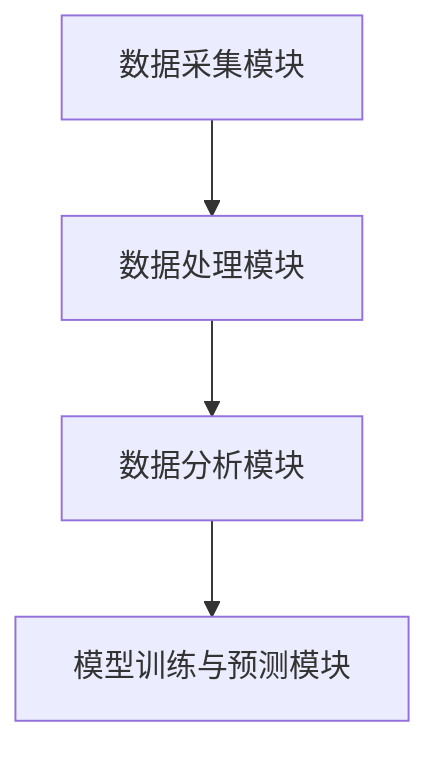

                 


# 特价股票投资中的卫星数据应用与分析

> 关键词：卫星数据，特价股票，金融分析，数据融合，图像处理

> 摘要：本文探讨了卫星数据在特价股票投资中的应用，从数据获取、处理、分析到策略构建，结合实际案例，详细分析了卫星数据如何助力投资者发现市场机会，优化投资决策。

---

## 第1章: 特价股票投资与卫星数据概述

### 1.1 特价股票投资的定义与特点

#### 1.1.1 特价股票的定义
特价股票指的是市场价格低于其内在价值的股票，通常被视为被市场低估的投资机会。这种股票往往具有较高的潜在回报，吸引投资者关注。

#### 1.1.2 特价股票投资的核心特点
- **低估性**：市场价格低于内在价值。
- **高潜力**：潜在回报较高。
- **风险性**：投资风险较高，需谨慎选择。

#### 1.1.3 特价股票投资的市场背景
近年来，全球资本市场波动加剧，投资者寻求通过多种数据源和分析方法来捕捉市场机会，卫星数据作为一种新兴的数据源，为特价股票投资提供了新的视角。

### 1.2 卫星数据在金融领域的应用背景

#### 1.2.1 卫星数据的定义与类型
卫星数据包括卫星图像、地理数据、气象数据等，广泛应用于环境监测、资源勘探等领域。在金融领域，卫星数据被用于分析经济活动、市场趋势等。

#### 1.2.2 卫星数据在金融分析中的潜在价值
- **实时监控**：提供实时的地理和经济数据。
- **预测能力**：通过历史数据分析预测市场趋势。
- **数据丰富性**：覆盖全球，提供多层次数据。

#### 1.2.3 特价股票投资中卫星数据的应用场景
- **行业分析**：分析特定行业的地理分布和经济活动。
- **市场情绪分析**：通过卫星图像分析市场参与者的活动。
- **风险评估**：评估投资标的潜在风险。

### 1.3 特价股票投资与卫星数据的结合

#### 1.3.1 特价股票投资中的数据需求
投资者需要多维度数据支持决策，包括市场数据、公司基本面数据、宏观经济数据等。

#### 1.3.2 卫星数据如何满足这些需求
卫星数据提供了地理、经济等多维度信息，能够补充传统数据的不足。

#### 1.3.3 特价股票投资中卫星数据应用的边界与外延
卫星数据的应用边界在于数据的可用性和分析能力，而外延则包括更多数据源和技术的结合。

---

## 第2章: 卫星数据的获取与处理

### 2.1 卫星数据的获取方法

#### 2.1.1 公共卫星数据源介绍
- **公开数据源**：如NASA、ESA的卫星数据，通常免费但数据量有限。
- **数据获取方式**：通过官方网站或数据平台下载。

#### 2.1.2 商业卫星数据服务
- **商业公司**：如Planet Labs、DigitalGlobe，提供高分辨率卫星图像。
- **订阅模式**：按需付费，数据质量高但成本较高。

#### 2.1.3 数据获取的挑战与解决方案
- **数据量大**：需优化存储和处理方法。
- **数据格式多样**：需进行格式转换和标准化处理。

### 2.2 卫星数据的预处理与清洗

#### 2.2.1 数据格式转换
- **常用格式**：如GeoTIFF、NetCDF，需转换为适合分析的格式。

#### 2.2.2 数据校正与标准化
- **辐射校正**：校正遥感数据中的辐射误差。
- **几何校正**：纠正图像几何畸变。

#### 2.2.3 数据质量评估
- **质量指标**：如云层覆盖、图像清晰度等，需评估数据的可用性。

---

## 第3章: 卫星数据分析方法

### 3.1 卫星图像处理技术

#### 3.1.1 图像增强与特征提取
- **图像增强**：如对比度增强、锐化，提高图像可读性。
- **特征提取**：如边缘检测、纹理分析，提取图像特征。

#### 3.1.2 图像分割与目标识别
- **图像分割**：将图像分割为不同区域，识别特定目标。
- **目标识别**：如识别特定建筑物、车辆等，用于经济活动分析。

#### 3.1.3 时间序列分析
- **时间序列数据**：分析图像随时间的变化趋势，发现潜在规律。

### 3.2 卫星数据与传统金融数据的融合

#### 3.2.1 数据融合的方法
- **数据融合**：将卫星数据与市场数据、财务数据等进行融合，提取更多信息。

#### 3.2.2 融合后的数据特征分析
- **特征分析**：分析融合后的数据特征，找出影响股票价格的关键因素。

#### 3.2.3 数据融合对模型性能的提升
- **模型优化**：通过融合数据提升模型预测精度和稳定性。

---

## 第4章: 卫星数据在股票投资策略中的应用

### 4.1 卫星数据驱动的套利策略

#### 4.1.1 套利策略的基本原理
- **套利**：利用市场价差获利，需满足无风险套利条件。

#### 4.1.2 卫星数据在套利中的应用
- **跨市场套利**：分析不同市场的卫星数据，寻找价差机会。
- **事件驱动套利**：利用卫星数据预测市场事件，提前布局。

#### 4.1.3 实例分析：基于卫星数据的跨市场套利
- **案例**：分析某跨国公司的卫星图像，预测其业绩变化，进行套利交易。

### 4.2 卫星数据驱动的趋势分析

#### 4.2.1 股票价格趋势预测的基本方法
- **时间序列分析**：如ARIMA模型，用于预测股票价格走势。

#### 4.2.2 卫星数据在趋势分析中的应用
- **行业趋势预测**：分析卫星数据，预测行业景气度变化。
- **区域经济分析**：通过卫星图像分析区域经济活动，预测市场趋势。

#### 4.2.3 实例分析：基于卫星数据的行业趋势预测
- **案例**：分析某区域的工业活动变化，预测行业趋势，指导投资决策。

---

## 第5章: 卫星数据驱动的系统架构设计

### 5.1 系统架构概述

#### 5.1.1 系统目标与范围
- **目标**：构建基于卫星数据的股票投资分析系统。
- **范围**：涵盖数据采集、处理、分析和策略生成。

#### 5.1.2 系统功能模块划分
- **数据采集模块**：获取卫星数据和市场数据。
- **数据处理模块**：清洗和预处理数据。
- **数据分析模块**：进行图像处理和数据融合。
- **模型训练与预测模块**：构建和训练预测模型。

#### 5.1.3 系统架构的可扩展性设计
- **模块化设计**：各模块独立，便于扩展和维护。

### 5.2 系统功能设计

#### 5.2.1 数据采集模块
- **功能**：定时采集卫星数据和市场数据。
- **技术选型**：使用Python的requests库或第三方API。

#### 5.2.2 数据处理模块
- **功能**：清洗、转换和标准化数据。
- **技术选型**：使用Pandas库进行数据处理。

#### 5.2.3 数据分析模块
- **功能**：进行图像处理和数据融合。
- **技术选型**：使用OpenCV和机器学习算法。

#### 5.2.4 模型训练与预测模块
- **功能**：训练模型并生成预测结果。
- **技术选型**：使用TensorFlow或Scikit-learn进行模型训练。

### 5.3 系统架构图



---

## 第6章: 项目实战与案例分析

### 6.1 项目介绍

#### 6.1.1 项目背景
- **目标**：构建基于卫星数据的股票投资分析系统。
- **数据来源**：公开卫星数据和市场数据。

#### 6.1.2 项目目标
- **目标1**：获取并处理卫星数据。
- **目标2**：构建预测模型并验证其有效性。

### 6.2 系统实现

#### 6.2.1 环境安装
- **Python版本**：3.8及以上。
- **依赖库安装**：numpy, pandas, matplotlib, scikit-learn, tensorflow。

#### 6.2.2 核心实现代码

##### 数据处理代码
```python
import pandas as pd
import numpy as np

# 数据加载
data = pd.read_csv('stock.csv')

# 数据清洗
data.dropna()
data = data[~data['volume'].isin([0])]
```

##### 模型训练代码
```python
from sklearn.model import LinearRegression

# 数据准备
X = data[['open', 'high', 'low', 'volume']]
y = data['close']

# 模型训练
model = LinearRegression()
model.fit(X, y)
```

#### 6.2.3 代码解读与分析
- **数据处理**：清洗数据，去除缺失值和异常值。
- **模型训练**：使用线性回归模型进行预测，验证模型效果。

### 6.3 案例分析

#### 6.3.1 案例背景
- **案例公司**：某跨国公司，分析其卫星图像数据。

#### 6.3.2 数据分析与模型预测
- **图像分析**：分析卫星图像，预测公司业绩变化。
- **模型预测**：基于模型预测股票价格走势。

#### 6.3.3 结果分析
- **预测结果**：模型预测公司股票价格将上涨，建议买入。

### 6.4 项目小结
- **项目总结**：卫星数据在股票投资中的应用具有潜力，但需结合其他数据源和分析方法。
- **经验总结**：数据处理和模型选择是关键，需结合实际情况进行调整。

---

## 第7章: 结论与展望

### 7.1 研究总结
卫星数据为特价股票投资提供了新的视角，通过数据融合和模型训练，能够提高投资决策的科学性和准确性。

### 7.2 未来展望
- **技术进步**：卫星技术的不断发展将提供更多数据源。
- **算法优化**：深度学习等技术将进一步提升模型预测能力。
- **应用拓展**：卫星数据在更多金融领域的应用将被探索。

---

## 参考文献

1. 《卫星数据处理与分析》
2. 《金融时间序列分析》
3. 《深度学习在金融中的应用》

---

## 版权声明

本文为AI天才研究院原创，未经授权不得转载。转载请注明出处并保留链接。

--- 

作者：AI天才研究院 & 禅与计算机程序设计艺术

